# 0829_0831 TIL

## 잡다한 것

- 팩토리얼 n이 일정 수준 이상으로 커지면 매우 큰 수가 되므로 파스칼의 삼각형을 이용

- Ctrl + Alt + L : 띄워쓰기나 그런 것들을 해줘서 이쁘게 만들어 줌

- Shift로 위치 선정하고 Shift + Alt + 방향키로 위치 옮기는 방법

- 함수의 끝이 명확한 경우 리턴을 쓰지 않아도 된다. 

---

## Computational Thinking(기초 논리 & 수학)

### 서론 (참고)

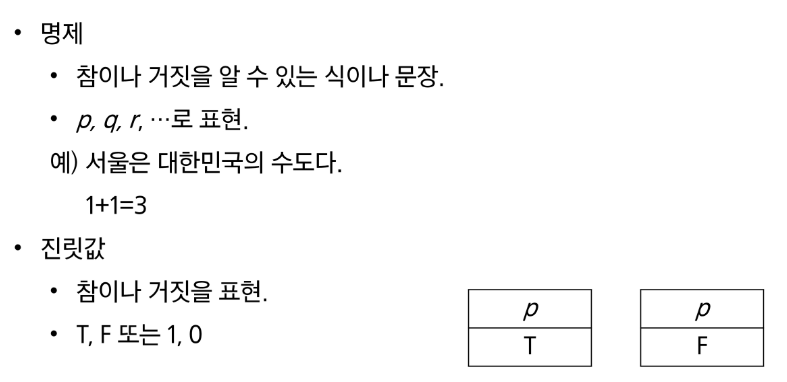

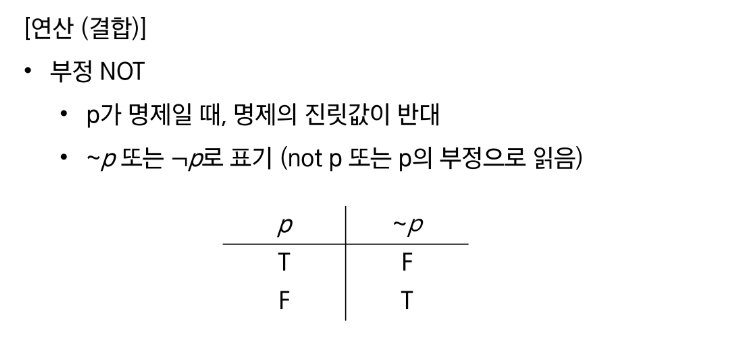

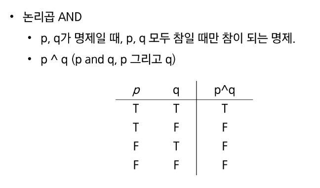

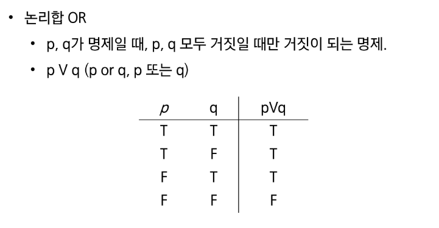

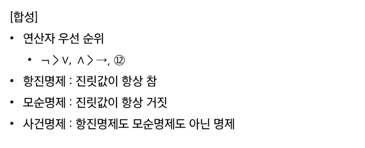

조건 명제는 기억!!!

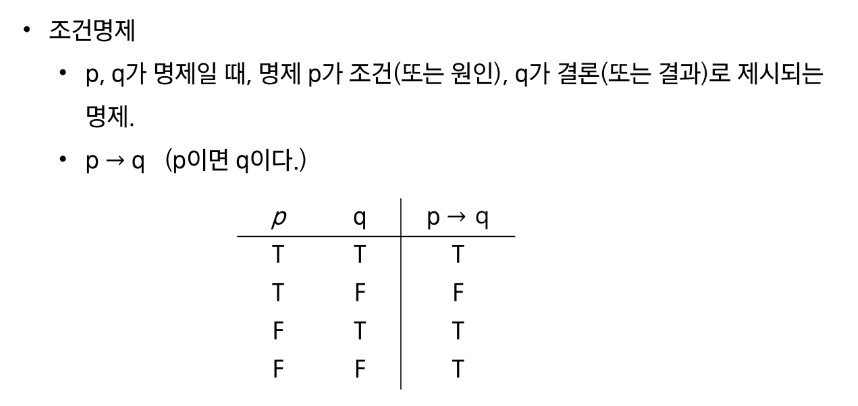

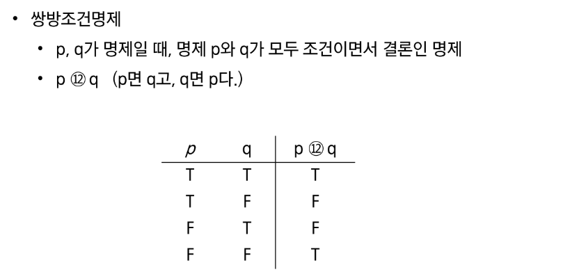

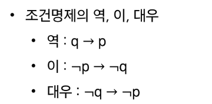

### 수와 표현

- log를 사용하는 이유 중 하나: 매우 큰 값을 작게 표현 가능하기 때문

- 로그
  
  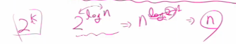

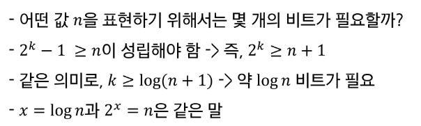

### 집합과 조합론

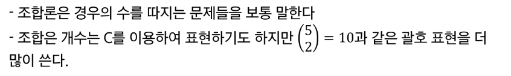

### 기초수식(연습문제 앞 라인에서 Test)

위의 문제에서 빅오는 점근적 상한 임을 이용

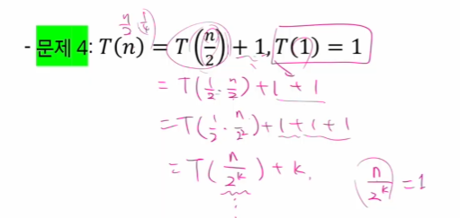

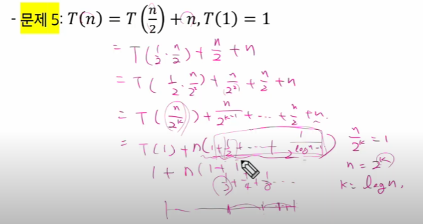

여기서 T는 호출 횟수를 의미

### 재귀

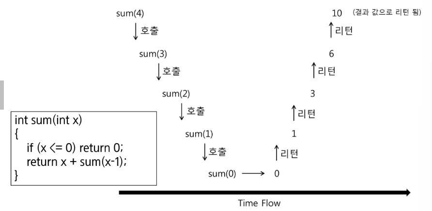

---

## 완전검색 & 그리디

### 반복(Iteration)과 재귀(Recursion)

- 반복과 재귀는 유사한 작업을 수행할 수 있다.

- 반복은 수행하는 작업이 완료될 때까지 계속 반복
  
  - 루프(for, while 구조)

- 재귀는 주어진 문제의 해를 구하기 위해 동일하면서 **더 작은 문제의 해를** 이용하는 방법
  
  - 하나의 큰 문제를 해결할 수 있는(해결하기 쉬운) 더 작은문제로 쪼개고 결과들을 결합한다.
  
  - 재귀 함수로 구현  

- 재귀적 알고리즘
  
  - 재귀적 정의는 두 부분으로 나뉜다.
  
  - 하나 또는 그 이상의 기본 경우(basis case or rule)
    
    - 집합에 포함되어 있는원소로 induction을 생성하기 위한 시드(seed) 역할
  
  - 하나 또는 그 이상의 유도된 경우(inductive case or rule)
    
    - 새로운 집합의 원소를 생성하기 위해 결합되어지는 방법

- 재귀 함수(recursive function)
  
  - 함수 내부에서 직접 혹은 간접적으로 자기 자신을 호출하는 함수.
  
  - 일반적으로 재귀적 정의를 이용해서 재귀 함수를 구현한다.
  
  - 따라서, 기본 부분(basis part)와 유도 부분(inductive part)로 구성된다.
  
  - 재귀적 프로그램을 작성하는 것은 반복 구조에 비해 간결하고 이해하기 쉽다. 
  
  - 함수 호출은 프로그램 메모리 구조에서 스택을 사용
    
    - 따라서 재귀 호출은 반복적인 스택의 사용을 의미하며 메모리 및 속도에서 성능저하가 발생한다.

- 팩토리얼 재귀 함수(예)
  
  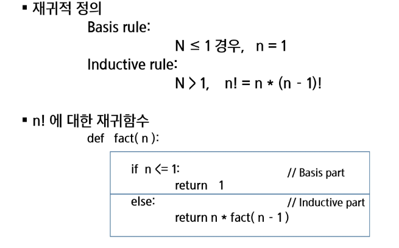

- 반복 또는 재귀?
  
  - 해결할 문제를 고려해서 반복이나 재귀의 방법을 선택
  
  - 재귀는 문제해결을 위한 알고리즘 설계가 간단?하고 자연스럽다.
    
    - 추상 자료형(List, tree 등)의 알고리즘은 재귀적 구현이 간단하고 자연스러운 경우가 많다.
  
  - 일반적으로, 재귀적 알고리즘은 반복(Iterative) 알고리즘보다 더 많은 메모리와 연산을 필요로 한다.
  
  - 입력 값 n이 커질 수록 재귀 알고리즘은 반복에 비해 비효율적일 수 있다. 

- 반복과 재귀의 비교
  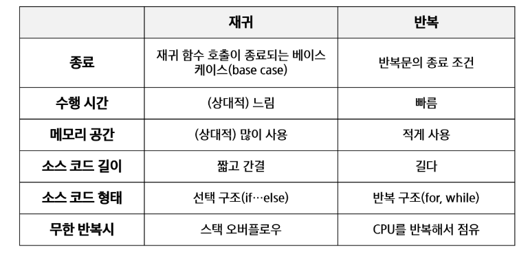

- 재귀 연습 코드
  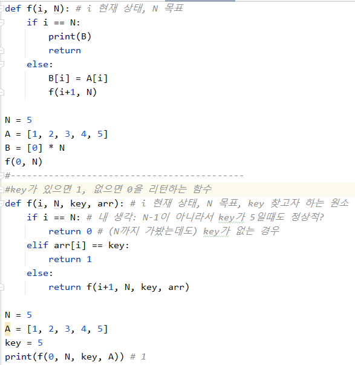

- 선택 정렬 함수를 재귀적 알고리즘으로(연습)
  
  

### 완전검색기법

- 고지식한 방법(brute - force)
  
  - brute - force 방법은 대부분의 문제에 적용 가능
  
  - 상대적으로 빠른 시간에 문제 해결(알고리즘 설계)을 할 수 있다.
  
  - 문제에 포함된 자료(요소, 인스턴스)의 크기가 작다면 유용하다.

- 완전 검색으로 시작하라
  
  - 모든 경우의 수를 생성하고 테스트하기 때문에 수행 속도는 느리지만, 해답을 찾아내지 못할 확률이 작다.
  
  - 이를 기반으로 그리디 기법이나 동적 계획법을 이용해서 효율적인 알고리즘을 찾을 수 있다.
  
  - 우선 완전 검색으로 접근하여 해답을 도출한 후, 성능 개선을 위해 다른 알고리즘을 사용하고 해답을 확인하는 것이 바람직하다. 

- 완전 검색
  
  - 많은 종류의 문제들이 특정 조건을 만족하는 경우나 요소를 찾는 것이다.
  
  - 또한, 이들은 전형적으로 **순열, 조합 ,그리고 부분 집합과 같은 조합적 문제들**과 연관된다.
  
  - 완전 검색은 조합적 문제에 대한 brute- force 방법이다.

- 예 (참고)
  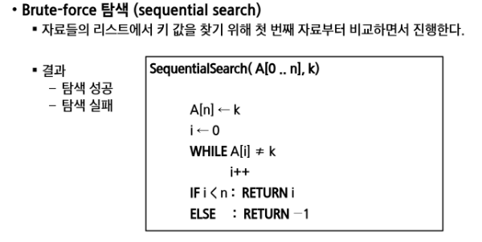
  어떤 입력을 받을 때 한 칸 더 큰 배열을 준비해 받고 내가 찾는 key값을 맨 끝에 붙여 놓으면 좋은점: while문 조건에 i < N 조건을 추가하지 않아도 됨(연산량 감소) (무조건 key는 만나도록 만들었기 때문에)

참고) 요즘에는 순열에서의 부분집합이나, 부분집합에서의 순열 이런 식으로 섷어서 문제 출시하기도 한단다..

### 순열

- n > 12인 경우, 시간 복잡도 폭발적으로 증가...

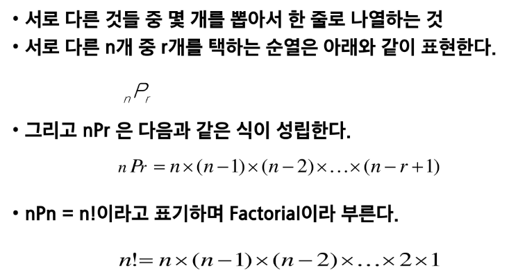

- 순열 생성 방법
  
  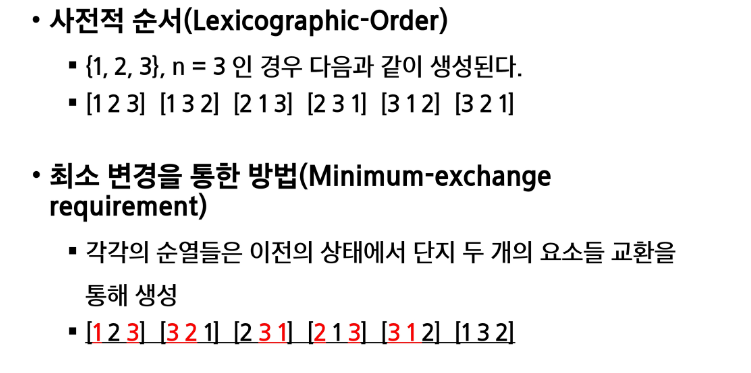

- 재귀 호출을 통한 순열 생성
  
  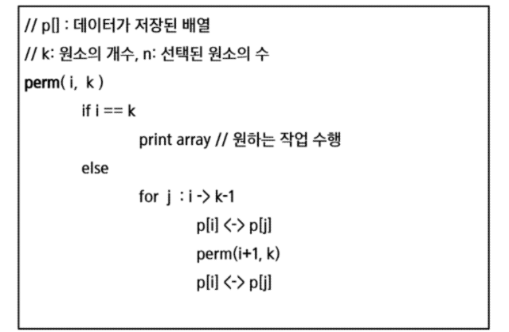
  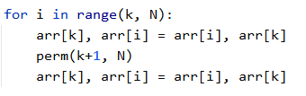

- 1,2,3 으로 구성된 순열(순서대로) 
  
  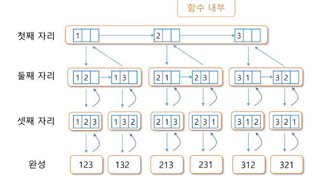
  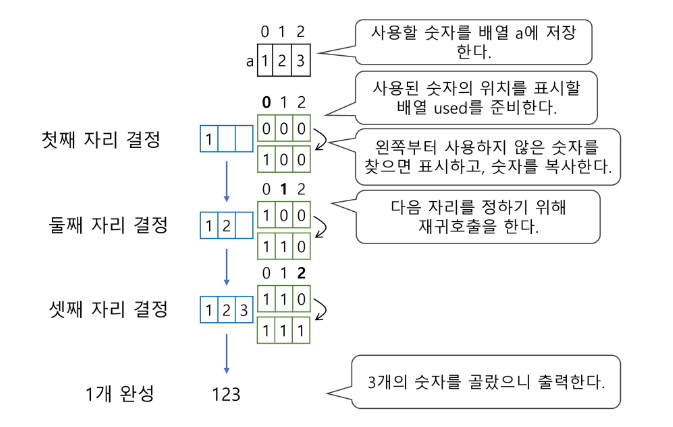
  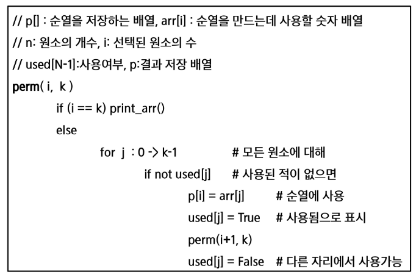
  
  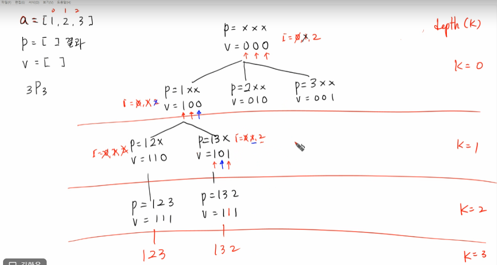

- 순열 관련 코드
  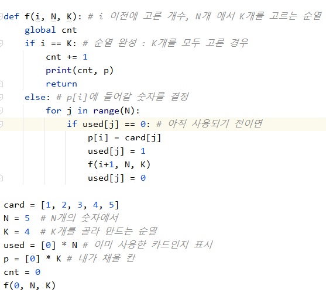
  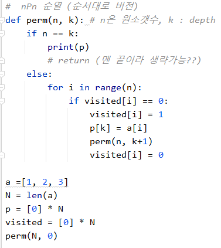
  
  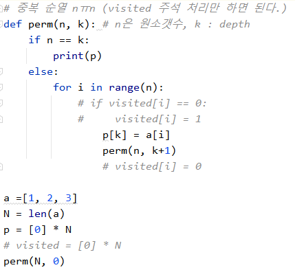
  
  

### 부분집합

- 집합에 포함된 원소들을 선택하는 것이다.

- 다수의 중요 알고리즘들이 원소들의 그룹에서 최적의 부분 집합을 찾는 것이다.

- N 개의 원소를 포함한 집합
  
  - 자기 자신과 공집합 포함한 모든 부분집합(power set)의 개수는 2^n개
  
  - 원소의 수가 증가하면 부분집합의 개수는 지수적으로 증가  

- 바이너리 카운팅을 통한 사전적 순서
  
  - 부분집합을 생성하기 위한 가장 자연스러운 방법
  
  - 원소 수에 해당하는 N개의 비트열을 이용한다.
  
  - n번째 비트값이 1이면 n번째 원소가 포함되었음을 의미한다. 
    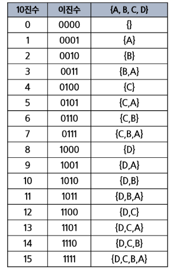
  
  - 바이너리 카운팅을 통한 부분집합 생성 코드 예
    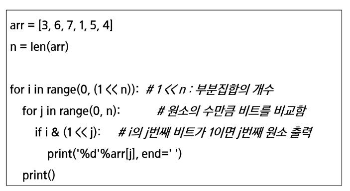

- 부분집합 관련 코드
  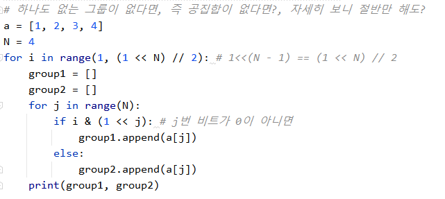

- 부분집합 합 문제 구현 코드

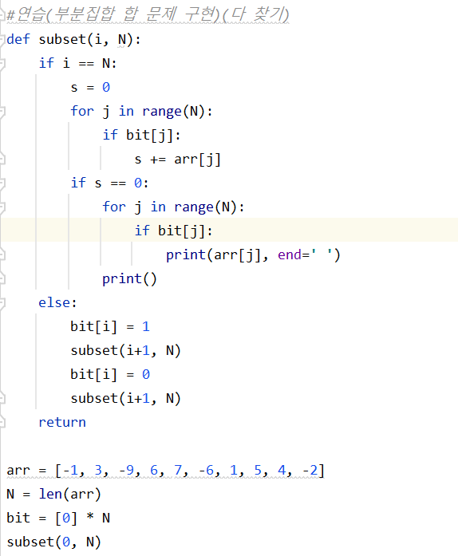

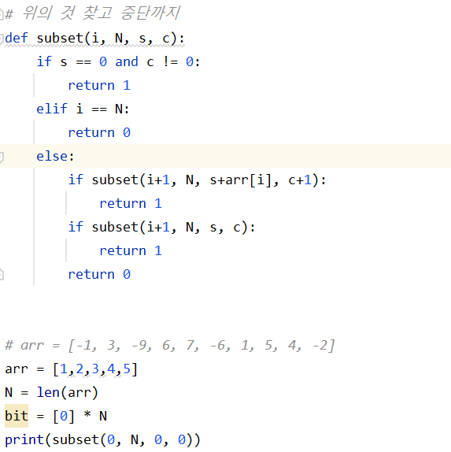

  위의 것을 보면 다 양수가 아니여서 일정 값 이상이 되면 가지치기를 한다가 성립하지 않음을 알 수가 있다. -> 그래서 0이 되는 순간에 중단을 하면 되지 않을까?? -> 포함여부를 정할 때마다 확인하면 된다.(이전 단계까지을 고려한 합을 받아오면 된다.) (c가 있는 경우는 공집합 방지)

### 조합

- nC0: 하나도 안 붙이는 것도 하나의 방법이다.

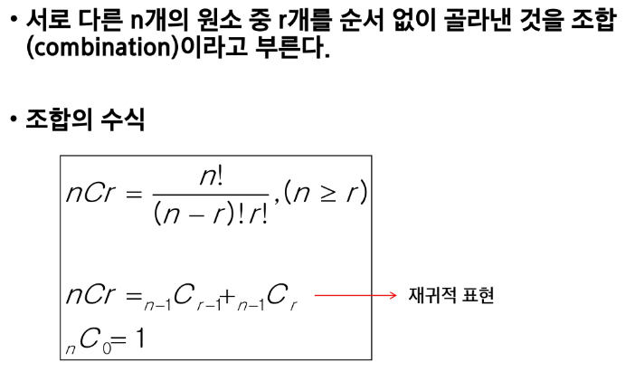

예를 들어 4C2 = 3C2 + 3C1을 설명하자면, 4번째 원소가 포함 될 때는 나머지 선택지 3C1, 포함 안 될 때는 나머지 선택지3C2를 택해야 하므로

- 재귀 호출을이용한 조합 생성 알고리즘
  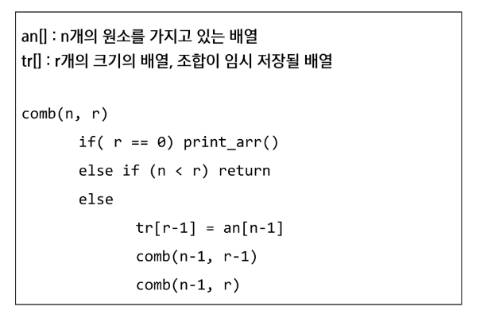  
  
  여기서 n은 남아있는 원소의 수, r은 채워야하는 원소의 수로 생각하면 편함
  
  r이 0이면 다 고른 상태가 된다.
  
  n 보다 r이 크면 리턴
  거꾸로 하면 유리한 이유?? 인덱스 계산이 편하므로, (똑바로 하면 다른 연산이 더 필요)
  
  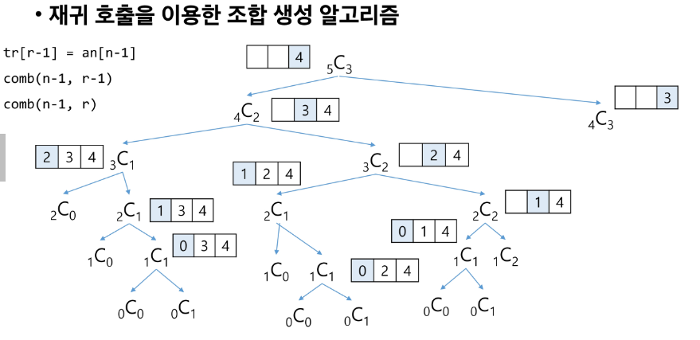
  그림 위치가 살짝 이상한 것 같기도?? 왼쪽으로 가면 선택을 하고 간 것, 오른쪽으로 가면 선택을 안 하고 간 것!!
  
  

- 10개의 원소 중 3개를 고르는 조합(참고)
  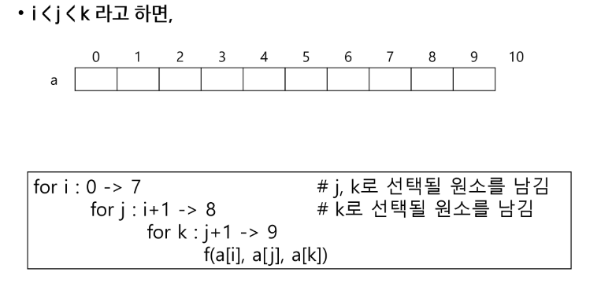

- for문을 이용한 조합(그림)
  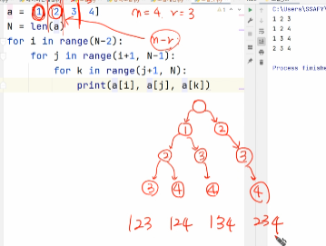
  
  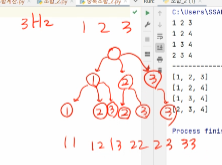
  위의 그림은 중복까지 포함된 것
  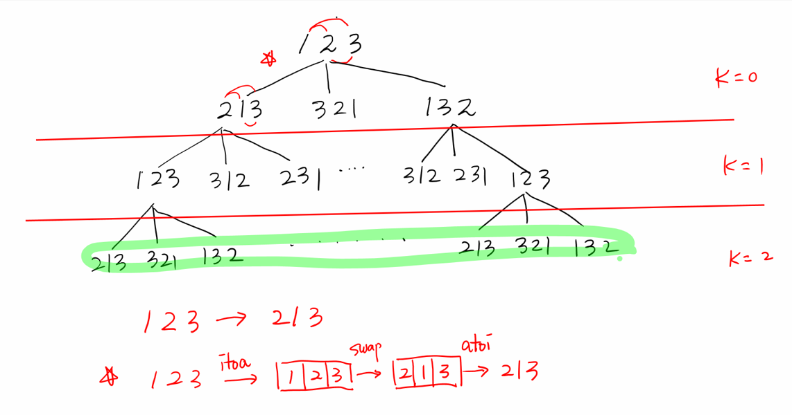

- n개에서 r개를 고르는 조합(재귀)
  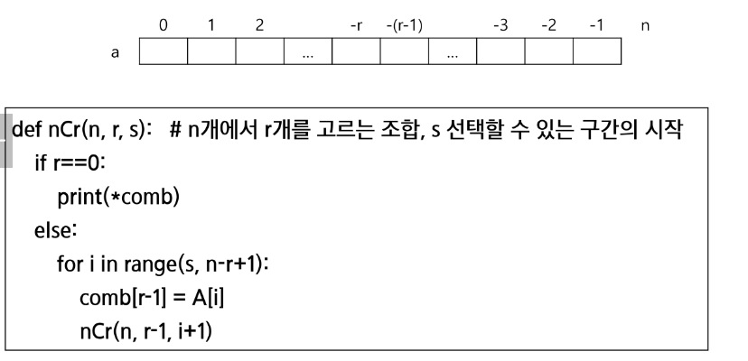

- 조합 관련 코드
  
  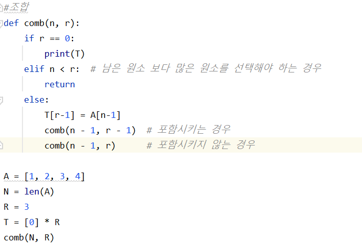
  
  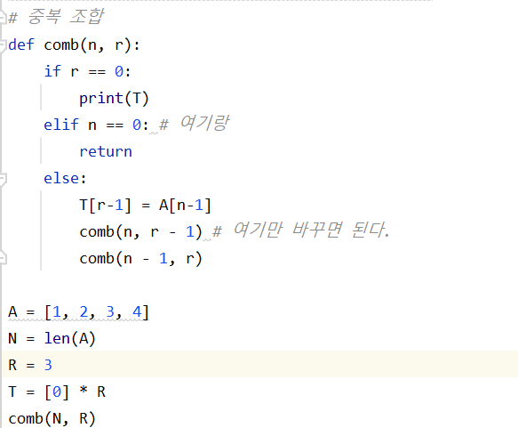
  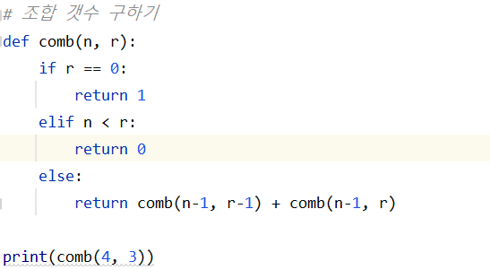
  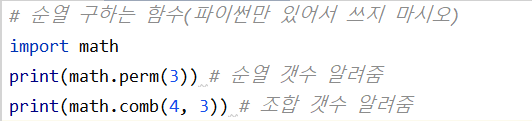
  
  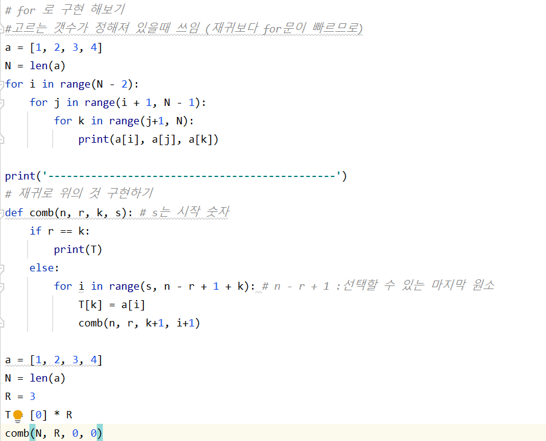
  
  고르는 갯수가 제한되어 있지 않으면 재귀로 해서 구해야 한다.
  
  교수님 방식이 더 복잡해보이는 이유는 순서가 똑바로 나오도록 하기 위해서이다.
  
  바로 위의 것의 강사 방식
  
  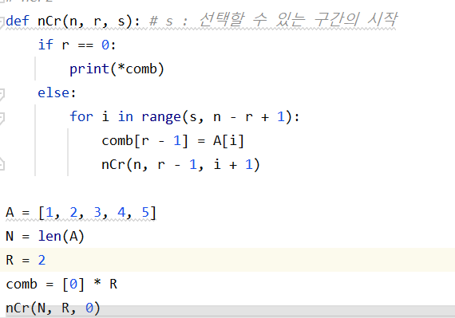

### 탐욕 알고리즘

- 탐욕 알고리즘은 최적해를 구하는 데 사용되는 근시안적인 방법

- 일반적으로, 머리속에 떠오르는 생각을 검증 없이 바로 구현하면 Greedy 접근이 된다.

- 여러 경우 중 하나를 선택 할 때마다 그 순간에 최적이라고 생각되는 것을 선택해 나가는 방식으로 진행하여 최종적인 해답에 도달한다.

- 각 선택 시점에서 이루어지는 결정은 지역적으로는 최적이지만, 그 선택들을 계속 수집하여 최종적인 해답을 만들었다고 하여, 그것이 최적이라는 보장은 없다.      

- 일단, 한번 선택된 것은 번복하지 않는다. 이런 특성 때문에 대부분의 탐욕 알고리즘들은 단순하며, 또한 제한적인문제들에 적용된다.

- 최적화(optimization)란 가능한 해들 중에서 가장 좋은(최대 또는 최소)해를 찾는 문제이다. 

- 탐욕 알고리즘의 동작 과정
  
  1. 해 선택: 현재 상태에서 부분 문제의 최적 해를 구한 뒤, 이를 부분해 집합(Solution Set)에 추가한다.
  
  2. 실행 가능성 검사 : 새로운 부분해 집합이 실행가능한지를 확인한다. 곧, 문제의 제약 조건을 위반하지 않는 지를 검사한다.
  
  3. 해 검사: 새로운 부분 해 집합이 문제의 해가 되는지를 확인한다. 아직 전체 문제의 해가 완성되지 않았다면 1의 해 선택부터 다시 시작한다. 

### 활동 선택 문제

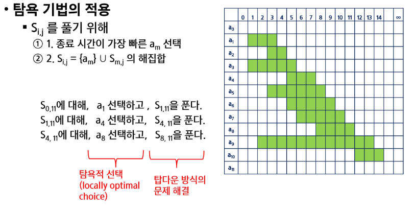
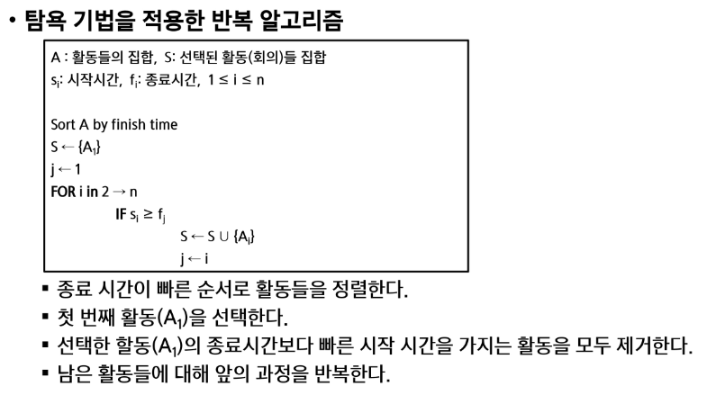

- 탐욕 알고리즘의 필수 요소
  
  - 탐욕적 선택 속성
    
    - 탐욕적 선택은 최적해로 갈수 있음을 보여라
      -> 즉, 탐욕적 선택은 항상 안전하다.
  
  - 최적 부분 구조
    
    - 최적화 문제를 정형화하라
      -> 하나의 선택을 하면풀어야 할 하나의 하위 문제가 남는다.
  
  - [원문제의 최적해 = 탐욕적 선택 + 하위 문제의 최적해 ]임을 증명하라.

- 탐욕 기법과 동적 계획법의 비교
  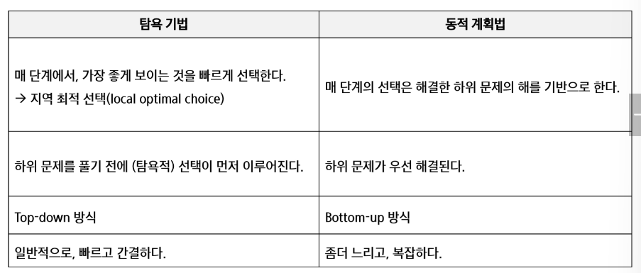

### 연습문제(설명 그림)

- 전자카트 가지치기 part
  

- 최소합 part
  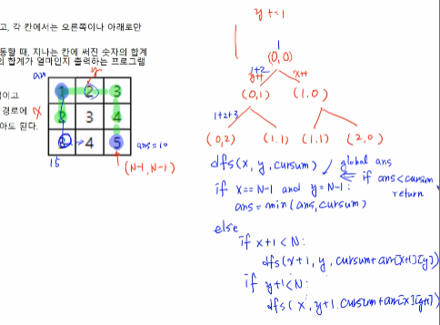

- 최대 상금
  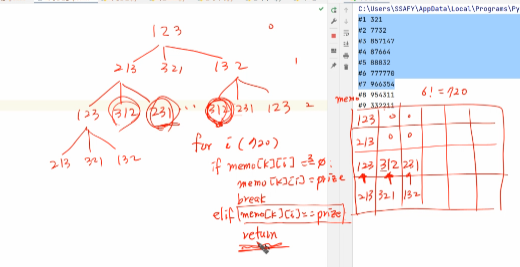
