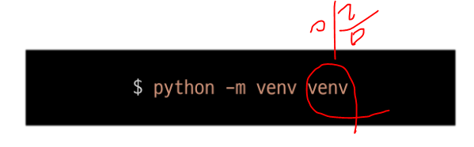
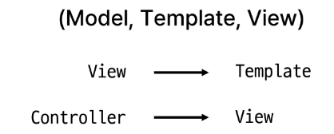
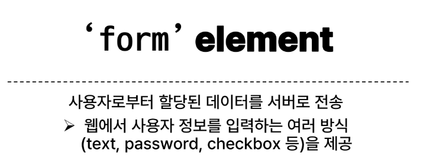
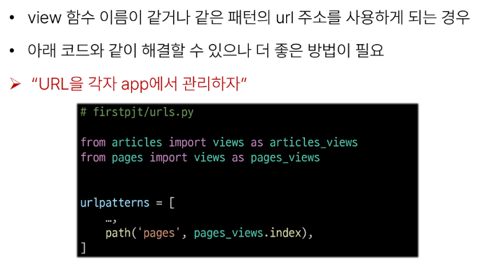
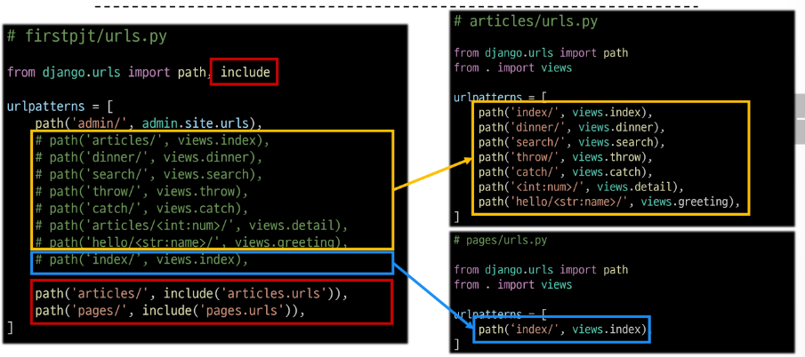
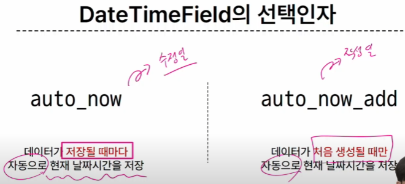
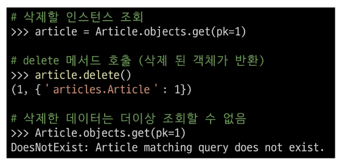

# 0912_0915 TIL

## 잡다한 것

- 여기 내용 일부 요약된 곳
  공용문서 - python - python 가상환경 설정

- gitignore (첫 add 전에 해주기!)

- 코드 작성 정리
  
  - 가상 환경 만들기
    
    - `python -m venv venv`
  
  - 활성화 하기
    
    - `source venv/Scripts/activate`
    
    - 비활성화는 `deactivate`, bash를 끄면 자동으로 꺼져서 쓸 일 x
  
  - Django 설치
    
    - `pip install Django`
  
  - 패키지 목록 공유(패키지 추가 될 때마다 진행!)
    
    - 공유파일 생성
      
      - `pip freeze > requirements.txt`
    
    - 파일을 통해 패키지를 받는 법은?
      
      - `pip install -r requirements.txt`
  
  - Django 프로젝트 생성
    
    - `django-admin startproject firstpjt .`
      (뒤에 `.` 필수!!!)
  
  - 앱 생성
    
    - `python managy.py startapp articles`
    
    - 참고: 플젝 만들때는 manage.py가 없어서 이름이 좀 다른데, 앱 생성 후부터는 manage.py가 있어서 대부분은 어떤 동작을 위한 코드를 작성할 때 앞에 `python managy.py` 가 붙어있음
  
  - 앱 등록
    
    - settings.py의 INSTALLED_APPS 에 추가시켜주기
  
  - Django 서버 실행
    
    - `python manage.py runserver`
  
  - 데이터 흐름에 따른 코드 작성
    
    

- vscode에서 터미널을 나가기 위해서는 x를 누르는 것이 아닌 휴지통을!

- 깨끗하게 만들기: `Ctrl + L`

- 끌 때 서버 확실히 끄고 vscode 나가기!!(`Ctrl+C`): 안 그러면 남아있어서 혼동 발생
  (해결법은 작업관리자로 찾아서 꺼줘야 됨)

- template 안에 html 파일이 들어간다. (template - 사용자에게 보여지는 문서 )

- MTV 중에서 템플릿만 왜 우리가 직접 만들어줘야할까? : 장고는 백엔드에 특화

- 안전한 패스워드 저장
  [NAVER D2](https://d2.naver.com/helloworld/318732)

- DB가 gitignore에 속해있는 이유? - 중요한 정보를 공개된 원격장소에 올린다구??

- 장고는 지워진 데이터에 대한 pk를 재사용 하지 않는다.

## Django Intro & Design Pattern

### Django and Framework

#### Framework

- Framework란?
  
  - 웹 애플리케이션을 빠르게 개발할 수 있도록 도와주는 도구
    (개발에 필요한 기본 구조, 규칙, 라이브러리 등을 제공)

#### Django framework

- django란?
  python 기반의 대표적인 웹 프레임워크

#### 클라이언트와 서버

- 웹의 동작 방식
  
  - 우리가 컴퓨터 혹은 모바일 기기로 웹 페이지를 보게 될 때까지 무슨 일이 일어날까?
    
    

- Client(클라이언트)
  
  - 서비스를 요청하는 주체
    (웹 사용자의 인터넷이 연결된 장치, 웹 브라우저)

- Server(서버)
  
  - 클라이언트의 요청에 응답하는 주체
    (웹 페이지, 앱을 저장하는 컴퓨터)

- 우리가 웹 페이지를 보게 되는 과정
  

- 우리가 앞으로 할 것:
  Django를 사용하여 서버를 구현할 것

#### Django 프로젝트 및 가상환경

- 가상환경이란?
  
  - python 애플리케이션과 그에 따른 패키지들을 격리하여 관리할 수 있는 **독립적인** 실행 환경
    
    이동보단 on/off 개념, (그래서 하나의 터미널에선 하나의 환경만 켤 수 있다.)

- 가상환경 venv 생성
  
  다만 특이하게 안 하고 venv로 해야 됨

- 가상환경 활성화
  
  끌 때는 `deactivate`

- 환경에 설치된 패키지 목록 확인
  

- 의존성 패키지
  
  난 분명 하나만 설치해달라고 했는데 다른 것도 여러개 설치가 되네??

- 의존성 패키지 관리의 중요성
  
  - 개발 환경에서는 각각의 프로젝트가 사용하는 패키지와 그 버전을 정확히 관리하는 것이 중요
  
  - 가상환경 & 의존성 패키지 관리

- 의존성 패키지 목록 생성
  
  
  - 패키지 목록만 공유하는 이유: 파일크기가 커서..

- Django 프로젝트 생성 전 루틴
  

- Django 프로젝트 생성(TEST)
  
  
  뒤에 . 붙일 것!!!!!(현재 디렉토리에 만들기!) 실수로 안 찍었으면, 삭제 후 다시!

- Django 서버 실행
  

#### 참고

- 가상환경을 사용하는 이유
  
  1. 의존성 관리
     
     - 라이브러리 및 패키지를 각 프로젝트마다 독립적으로 사용 가능
  
  2. 팀 프로젝트 협업
     
     - 모든 팀원이 동일한 환경과 의존성 위에서 작업하여 버전간 충돌을 방지

- LTS(Long-Term Support)
  
  
  보면, 장고는 .2버전을 메인으로 함을 알 수 있다.

### Django Design Pattern

#### Django 프로젝트와 앱

- Django project란?
  
  - 애플리케이션의 집합
    (DB 설정, URL 연결, 전체 앱 설정 등을 처리)

- Django application이란?
  
  - 독립적으로 작동하는 기능 단위 모듈
    (각자 특정한 기능을 담당하며 다른 앱들과 함께 하나의 프로젝트를 구성)

- 프로젝트와 앱
  

- 앱 사용 과정
  
  1. 앱 생성
  
  2. 앱 등록(이거 까먹기 쉬움!, 출생신고!!!)

- 앱 생성
  

- 앱 등록
  
  
  - 앱 생성 후 앱 등록을 해야하는 이유
    
    
    
    물리적으로 포함되어 있지 않음을 알 수 있다.(물리적으로 동일한 위치) -> 그래서 프로젝트는 articles라는 앱이 생성된 것을 몰라서 등록해주는 과정이 필요.

#### Django 디자인 패턴

- 디자인 패턴이란?
  
  - 소프트웨어 설계에서 발생하는 문제를 해결하기 위한 일반적인 해결책
    (공통적인 문제를 해결하는데 쓰이는 형식화 된 관행)

- MVC 디자인 패턴
  
  
  
  모델: DB, View: 화면, Controller: 내부로직

- MTV 디자인 패턴(파이썬이 파이썬 했다.)
  
  
  

- 프로젝트 구조
  
  urls.py -> url(사용)의 요청을 받아들이는 것이 서버에 필요한 데 그 기능을 해줌
  
  

- 앱 구조
  
  views.py-> 가장 중요(컨트롤러 역할) (하는 일 많음)
  

#### 요청과 응답

- Django와 요청 & 응답
  
  

- URLs
  

- View
  

- Template
  

- Django에서 template을 인식하는 경로 규칙
  
  

- 페이지 확인
  

- 데이터 흐름에 따른 코드 작성
  
  

#### 참고

- MTV 디자인 패턴 정리(여기 part 공부할 것!!)
  
  
  

- render 함수
  

---

## Django Template & URLs

### Django Template

#### Template System

- Django Template System이란?
  
  - 데이터 **표현**을 제어하면서, **표현**과 관련된 부분을 담당

- HTML의 콘텐츠를 변수 값에 따라 바꾸고 싶다면?
  

- Django Template Language(DTL)이란?
  
  - Template에서 조건, 반복, 변수 등의 프로그래밍적 기능을 제공하는 시스템

- DTL Syntax
  
  1. Variable
  
  2. Filters
  
  3. Tags
  
  4. Comments

- Variable
  
  render 함수의 세번째 인자는 반드시 딕셔너리여야 한다.

- Filters
  

- Tags
  

- Comments
  

#### 템플릿 상속

- 기본 템플릿 구조의 한계
  
  - 만약 모든 템플릿에 bootstrap을 적용하려면 모든 템플릿에 bootstrap CDN을 작성??

- 템플릿 상속이란?
  
  - **페이지의 공통요소를 포함**하고, **하위 템플릿이 재정의 할 수 있는 공간**을 정의하는 기본 'skeleton' 템플릿을 작성하여 상속 구조를 구축

- 상속 구조 구축
  
  1. skeleton 역할의 상위 템플릿 작성
     
  
  2. 기존 하위 템플릿의 변화
     

#### HTML form(요청과 응답)

- 데이터를 보내고 가져오기
  
  - HTML form elelment를 통해 사용자와 애플리케이션 간의 상호작용 이해하기
    
    
    

- 예(fake Naver)
  

- action과 method
  

name: 서버로 보내는 키의 이름 역할을 함
키가 필요한 이유: 서버는 딕셔너리 형태로 받기 때문에 사용자가 입력한 것을 직접적으로 접근 불가해서 키가 필요

#### form 활용

- 사용자 입력을 받아 그대로 출력하는 서버 만들기
  
  - throw 페이지에서 요청한 입력 데이터는 우예 가져옴??
    
    

- request 객체 살펴보기
  

- form 데이터를 가져오는 방법
  

#### 참고

- 추가 템플릿 경로 지정(시험 기출!!)
  
  

- BASE_DIR
  

- 설명(해진)
  

- DTL 주의사항
  

### Django URLs

#### Django URLs

- 요청과 응답에서 Django URLs의 역할
  

- URL dispatcher
  

#### 변수와 URL

- 현재 URL 관리의 문제점
  
  - 템플릿의 많은 부분이 중복되고, URL의 일부만 변경되는 상황이라면 계속해서 비슷한 URL과 템플릿을 작성해 나가야 할까?
    

- Variable Routhing(시험 기출)
  
  - URL 일부에 변수를 포함시키는 것
    (변수는 view 함수의 인자로 전달 할 수 있음)

- Variable routing 작성법
  

- Path converters
  
  - URL 변수의 타입을 지정
    (str, int 등 5가지 타입 지원)

#### App과 URL

- App URL mapping
  
  - 각 앱에 URL을 정의하는 것
    (프로젝트와 각 앱이 URL을 나누어 관리를 편하게 하기 위함)

- 2번째 앱 pages 생성 후 발생할 수 있는 문제
  

- 변경된 url 구조
  

- url 구조 변화
  

- include()
  
  - 프로젝트 내부 앱들의 URL을 참조할 수 있도록 매핑하는 함수
    URL의 일치하는 부분까지 잘라내고, 남은 문자열 부분은 후속 처리를 위해 include된 URL로 전달

- include 적용
  

#### URL 이름 지정

- url 구조 변경에 따른 문제점
  

- Naming URL patterns
  
  - URL에 이름을 지정하는 것
    (path 함수의 name 인자를 정의해서 사용)

- Naming URL patterns 적용
  

- URL 표기 변화
  

#### URL 이름 공간

- URL 이름 지정 후 남은 문제
  

- 'app_name' 속성 지정
  

- URL tag의 최종 변화
  

#### 참고

---

## Django Model

### Model

- Model을 통한 DB(데이터베이스)관리
  
  모델이 데이터 베이스를 의미하지는 않음, 모델이 데이터 베이스를 관리하는 느낌

- Django Model
  
  - DB의 테이블을 정의하고 데이터를 조작할 수 있는 기능들을 제공
    
    - 테이블 구조를 설계하는 '청사진(blueprint)'

- model 클래스 작성
  
  

- model 클래스 살펴보기
  
  
  대문자로 시작하는 것은 대부분 클래스라고 보면 된다.
  id는 model 클래스가 알아서 만들어 준다.
  
  
  레코드(행), 필드(열)이라고 부른다. 데이터 베이스는 반드시 column에 어떤 데이터가 들어가는 지 명시해야 한다.
  
  데이터 타입은 고정되어야 한다.
  

- 제약 조건
  
  - 데이터가 올바르게 저장되고 관리되도록 하기 위한 규칙
    
    - 예) 숫자만 저장되도록, 문자가 100자 까지만 저장되도록 하는 등

### Migrations

- Migrations란?
  
  - model 클래스의 변경사항(필드 생성, 수정 삭제 등)을 DB에 최종 반영하는 방법

- Migrations 과정
  
  설계도 초안을 DB로 바로 못 보낸다.(DB는 파이썬을 몰라..), 그래서 makemigration을 해서 DB가 알아볼 수 있도록 설계도 변환해주고 migrate를 해서 DB로 최종적으로 보내준다.

- Migrations 핵심 명령어 2가지
  

앱이름_클래스이름

#### 추가 Migrations

- 이미 생성된 테이블에 필드를 추가해야 한다면?
  

- 추가 모델 필드 작성
  
  필드가 무슨 역할? 각 필드의 데이터 타입을 결정
  
  
  
  2번째 이거는 1번째 설계도가 없으면 안됨(의존 중)(쌓아가는 느낌)
  
  

#### 모델 필드

- Model Field란?
  
  - DB 테이블의 필드(열)을 정의하며, 해당 필드에 저장되는 데이터 타입과 제약조건을 정의

선택인자(Test)

### Admin site

- Automatic admin interface
  
  - Django는 추가 설치 및 설정 없 이 자동으로 관리자 인터페이스를 제공
    
    - 데이터 확인 및 테스트 등을 진행하는데 매우 유용

- admin 계정 생성
  

- admin에 모델 클래스 등록
  
  관리자 사이트에선 기본적으로 장고의 내장 앱들에 한해서만 admin에 출력됨-> 그래서 추가를 따로 해줘야 한다.

#### 참고

- 데이터베이스 초기화
  
  설계도를 지워야 한다. 단순히 파일, 폴더 명을 변경하는 것만으로는 내장된 복잡한 함수들이 적용되지 않으므로 주의!

- Migrations 기타 명령어
  

---

## Django ORM

### ORM

- ORM(Object-Relational-Mapping)이란?
  
  - 객체 지향 프로그래밍 언어를 사용하여 호환되지 않는 유형의 시스템 간에 데이터를 변환하는 기술

- ORM의 역할
  
  

### QuerySet API

- QuerySet API란?
  
  - ORM에서 데이터를 검색, 필터링, 정렬 및 그룹화 하는데 사용하는 도구
    
    - API를 사용하여 SQL이 아닌 Python 코드로 데이터를 처리
      
      

- QuerySet API 구문
  
  
  이 메서드를 사용할려면 manager가 필요, manager가 메서드를 가지고 있다.

- Query
  
  쿼리를 보낸다 => "명령어를 보낸다" 라고 생각해주면 된다.

- QuerySet
  
  순회 가능 - > for문 가능!!
  Set은 '여러 개, 다중'을 의미-> 다중 데이터
  instance -> 단일 데이터
  

- 오늘의 목적
  
  - Python의 모델 클래스와 인스턴스를 활용해 DB에 데이터를 저장, 조회, 수정, 삭제하는 것

### Queryset API 실습

#### Create

- QuerySet API 실습 사전 준비
  
  -_
  django-extensions는 setting에 출생신고 필요

- 참고
  

- Django shell
  
  - Django 환경 안에서 실행되는  python shell
    (입력하는 QuerySet API 구문이 Django 프로젝트에 영향을 미침)
  
  - 나올때는 `exit` 작성

- Django shell 실행
  

- 데이터 객체를 만드는(생성하는) 3가지 방법
  
  
  여기서 왜 단일인데 인스턴스로 안 오고 쿼리셋으로 옴?? all()은 전체를 달라는 의미를 가져서...
  데이터가 없으면 빈 쿼리셋이 온다!!(중요)
  articles[0]처럼 인덱스 접근 가능 
  article.pk를 id보다 많이 이용
  
  
  데이터 베이스에 저장이 되지 않으면 article.pk해도 나오지 않음
  
  3번째 방식은 잘 안씀(유효성 검사해야 하는데 유효성 검사 안 하고 바로 넘어가기 때문에), save()기능까지 탑제

- save()
  
  - 객체를 데이터베이스에 저장하는 메서드
  
  - save() 사용 안하면 instance만 수정되고 DB에는 반영되지 않음

#### Read(조회가 가장 내용이 많고 가장 중요함)

- all()
  
  - 전체 데이터 조회
    

- get()
  
  - 단일 데이터 조회
    

- get() 특징
  

- filter()
  
  - 특정 조건 데이터 조회
    
    만약에 조건을 만족하지 않으면 빈 쿼리셋이 나온다. 그리고 하나만 만족을 하더라도 쿼리셋으로 나온다.

- 추가
  
  - QuerySet으로 반환받는 메서드 - all(), filter(),....
  
  - Instance로 반환받는 메서드 - get(),... 

#### Update

- 수정을 할려면 조회가 먼저 이루어져야 한다.(삭제도 마찬가지)-> 그래서 항상 get이랑 같이 많이 쓰일 것

- 데이터 수정
  
  - 인스턴스 변수를 변경 후 save 메서드 호출
    

#### Delete

- 데이터 삭제
  
  - 삭제하려는 데이터 조회 후 delete 메서드 호출
    

#### 참고

조건 더 세부적으로 조회 가능

크기(값 비교)

~로 시작하는 데이터, ~로 끝나는 데이터

