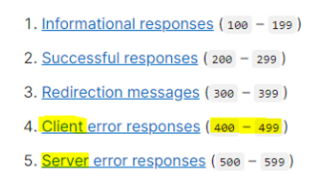

# 0925_0927 TIL

## 잡다한 것

- form 태그의 action: 목적지 기입

- 에러 잡기
  

- 응답
  

- 흐름
  

- 바뀌는 흐름
  

- 참고(공식 문서)
  [How to manage static files (e.g. images, JavaScript, CSS) | Django documentation | Django](https://docs.djangoproject.com/en/4.2/howto/static-files/#serving-files-uploaded-by-a-user-during-development)

- 데이터 베이스에 왜 이미지 파일 덩어리로 저장되지 않고 경로가 저장 될까??
  
  1. 성능 및 DB 최적화
     
     - 직접 파일을 저장하면 DB 크기가 급격하게 증가
       
       - 성능이 저하
       
       - 파일 자체는 파일 시스템에 별도로 저장
       
       - DB에는 그 파일에 대한 문자열 경로만
         (DB가 기하급수적으로 커지는 것 방지해줌)
  
  2. 유지 보수 관점
     
     - 만약 DB에 직접 파일을 저장해버리면 파일을 변경하거나 업데이트 할 때 직접 조작해야 함
       
       - 그런데 DB에 경로만 저장되어 있다면 파일시스템에서만 파일을 수정하면 됨
  
  3. 등등등...

- CSS 파일 역시 정적 파일이다
  
  - 원래는 style.css를 받아올 때 동일한 폴더에 있다면 파일명만 작성하는 식으로 했었다.(아래)
    
  
  - 하지만, Django는 static 파일을 무조건 static 폴더로 옮겨주고 static 태그를 사용해줘야 정상동작 함
    

- 참고
  

---

## Django ORM with view

- Django shell에서 연습했던 QuerySet API를 직접 view 함수에서 사용하기

### Read

- 2가지 조회 진행
  
  1. 전체 게시글 조회
  
  2. 단일 게시글 조회

- 전체 게시글 조회
  
  

- 단일 게시글 조회
  
  

- 단일 게시글 페이지 링크 작성
  
  

### Create

- new 기능구현
   
  
  

- create 기능 구현
  
  
  

### HTTP request methods

- method: 행동

- HTTP?
  
  - 네트워크 상에서 데이터를 주고 받기위한 약속

- HTTP request methods
  
  - 데이터(리소스)에 어떤 **요청(행동)** 을 원하는지를 나타내는 것 
    
    
  
  - GET -> R, POST -> CUD
  
  - 'GET' Method
    
     
  
  - 'POST' Method
    
  
  - POST method 적용
    

- 게시글 작성 후 403 응답 확인
   

- HTTP response status code
  

- 403 Forbidden
  
  - 서버에 요청이 전달되었지만, **권한**때문에 거절되었다는 것을 의미

- 거절 된 이유
  

- CSRF
  

- CSRF Token 적용
  

- 요청 시 CSRF Token을 함께 보내야 하는 이유
  
  
  - 똑같이 생긴 사이트에 속지 않도록 함
  
  - 인증된 사이트에서 요청이 왔는지 확인 하도록 함(토큰)

- 그런데 왜 POST일 때만 Token을 확인할까?
  

- 게시글 작성 결과
  

#### redirect

- 데이터 저장 후 페이지를 주는 것이 아닌 다른 페이지로 사용자를 보내야 한다.
  

- redirect()
  
  - 클라이언트가 인자에 작성된 주소로 다시 요청을 보내도록 하는 함수 

- redirect()함수 적용
  
  
  - 이제 위에것 처럼 쓸데없이 '게시글이 작성되었습니다.'라는 페이지 없어도 된다.

- redirect 특징
  

- 게시글 작성 결과
  

### Delete

- Delete 기능 구현
  
  

### Update

- C와 U는 유사(단, U는 수정하는 느낌이라 값이 저장되어 있어야 하는 부분이 다름)

- edit 기능 구현
  
  
  
  

- update 기능 구현
  
  

### 참고

---

## Django Form

### 개요

- 유효성 검사
  
  - 수집한 데이터가 정확하고 유효한지 확인하는 과정

- 유효성 검사 구현
  

### Django Form

#### Form Class

- Django Form
  
  - 사용자 입력 데이터를 수집하고, 처리 및 유효성 검사를 수행하기 위한 도구
    
    - 유효성 검사를 단순화하고 자동화 할 수 있는 기능을 제공
  
  - 즉, 개발자는 자잘한 유효성 검사에 대한 신경을 쓸 필요없이 그냥 요청만 잘 받고 잘 처리하면 된다.
  
  - Form class에 몇 천줄짜리 기능이 들어가 있음 

- Form class 정의
  
  

- Form class를 적용한 new 로직
  
  
  
  
  왼쪽에 표기된 것들이name 속성에 들어가 있다. 
  

- Form rendering opthons
  
  

#### Widgets

- Widgets란?
  
  - HTML 'input' element의 표현을 담당

- Widget 사용
  

### Django ModelForm

- ModelForm이 등장한 이유
  
  - 반복되는 것(중복) 줄일려고
    
    - model과 form은 유사한 부분이 many
  
  - modelform은 form과 기본적인 역할은 동일
  
  - 다만, model 기반으로 한 form이기 때문에 어떤 필드 들을 사용자로부터 입력 받는지를 이미 알고 있어서 재정의를 안해줘도 되도록 해줌

- 그렇다고 Form을 사용하지 않는 것은 아님(아래) 

- ModelForm?
  
  - Model과 연결된 Form을 자동으로 생성해주는 기능을 제공
    
    - Form + Model

- ModelForm class 정의
  

- ModelForm class 적용
  

- Meta class
  
  - 어떠한 데이터에 대한 데이터를 의미
  
  - 등록된 모델 클래스를 알아서 렌더링 해석하고 field 생성해줌
  
  - ModelForm의 정보를 작성하는 곳
  
  - 'fields' 및 'exclude' 속성
    

- ModelForm을 적용한 create 로직
  
  

- is_valid()
  
  - 여러 유효성 검사를 실행하고, 데이터가 유효한지 여부를 Boolean으로 반환
  - 빈 값 허용은 기본적으로 하지 않고, Max_length 같은 것들 검사해줌

- 공백 데이터가 유효하지 않은 이유와 에러메시지가 출력되는 과정
  

- ModelForm을 적용한 edit 로직
  

- ModelForm을 적용한 update 로직
  

- save()
  
  - 데이터베이스 객체를 만들고 저장

- save() 메서드가 생성과 수정을 구분하는 법
  

- Django Form 정리
  

#### 참고

맨 앞에는 키워드 인자를 쓰지 않아도 됨(위치인자)

- Widget 응용
  
  

### Handling HTTP requests

#### view 함수 구조 변화

- HTTP request method 차이점을 활용해 view 함수 구조 변경

- new & create 함수 결합
  

- 새로운 create view 함수
  
  
  
  
  
  

- 기존new 관련 코드 수정
  
   
  

- request method에 따른 요청의 변화
  

- 새로운 update view 함수
  

- 기존 edit 관련 코드 수정
  
  
  

---

## Django Static files

### Static files

- Static Files(정적 파일)?
  
  - 서버 측에서 **변경되지 않고 고정적**으로 제공되는 파일
    (이미지, JS, CSS 파일 등)
    
    이렇게 articles/로 요청을 보냈을 뿐인데 아래의 3개도 고정적으로 요청이 보내진다. 

- 웹 서버와 정적 파일
  
  

#### Static files 제공하기

1. 기본 경로에서 제공하기

2. 추가 경로에서 제공하기
- Static files 기본 경로
  
  - app폴더/static/

- 기본 경로 static file 제공하기
  
  
  
  - static은built - in이 아니라서 load를 해줘야 한다. 
  
  
  
  - 온라인 상에 URL(static 파일을 제공하기 위한 URL)가 존재해야 된다.(static이 그 역할을 해줌)

- STATIC_URL
  
  - 기본 경로 및 추가 경로에 위치한 정적 파일을 참조하기 위한 URL
  
  - 실제 파일이나 디렉토리가 아니며, URL로만 존재
    
    

- Static files 추가 경로
  

- STATICFILES_DIRS
  
  - 정적 파일의 기본 경로 외에 추가적인 경로 목록을 정의하는 리스트

- 추가 경로 static file 제공하기
  
  - 약속된 경로 더 만들기
    
    
    
    

- **정적 파일을 제공하려면 요청에 응답하기 위한 URL이 필요**

### Media files

- Media Files
  
  - 사용자가 웹에서 업로드하는 정적 파일
    (user-uploaded)
  
  - 아까는 같은 이미지 파일인데 static 파일이라고 하고 이번에는 왜 media 파일??
    
    - Media 파일은 큰 범주 내에서는 정적 파일이라는 범주 내에 포함되지만, 거기에 특정한 조건이 붙는다.
      
      - 조건: 서버가 미리 준비한 파일이 아니라 사용자가 업로드하는 정적 파일
  
  - Static 파일이 Media 파일보다 큰 범주

#### 이미지 업로드

- ImageField()
  
  - 기존 필드에는 이미지 업로드를 할 수 있는 필드가 없다.(model filed)
    
    - 다른 필드 필요(ImageField)
  
  - 이미지 업로드에 사용하는 모델 필드
  
  - 이미지 객체가 직접 저장되는 것이 아닌 **이미지 파일의 경로**가 문자열로 DB에 저장

- 미디어 파일을 제공하기 전 준비
  

- MEDIA_ROOT
  
  - 미디어 파일들이 위치하는 디렉토리의 절대 경로
    

- MEDIA_URL
  
  - MEDIA_ROOT에서 제공하는 미디어 파일에 대한 주소를 생성(STATIC_URL)과 동일한 역할
    

- MEDIA_ROOT 와 MEDIA_URL에 대한 url 지정
  
  

- 이미지 업로드
  
  
  - blank의 기본값은 False
    
    - DB는 기본적으로 공백을 허용하지 않으므로 
  
  - blank의 값을 True로 둔 이유
    
    - 꼭 바꿀 필요는 x
    
    - 다만, True가 아니라면 게시글을 쓸 때마다 무조건 이미지를 넣어줘야 한다.
  
  
  
  
  여기서 데이터를 하나로 다 모아서 전달해주는 것은 form태그가 해준다. 그런데 이 form 태그는 기본적으로 텍스트 데이터만 전달이 가능하다. 그래서 위의 속성값을 추가해줘야 함.
  
  mdn form이라고 검색해보면 아래를 찾을 수 있다.
  
  
  
  request.POST는 파일 데이터가 빠져 있다. 그래서 위를 추가해줘야 됨
  
  
  

#### 업로드 이미지 제공

- 업로드 이미지 제공하기
  
  
  

- 업로드 이미지 수정
  
  

### 참고

- 만약에 동일한 이름으로 파일이 저장?
  - 알아서 파일 뒤에 난수를 붙여줘서 중복을 방지해 줌

