# 1010 TIL

## 잡다한 것

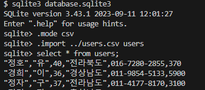

- 데이터의 무결성: 기본키 중복 x하고 not null이어야 한다.

- NOT NULL: 있는지 없는지 조차도 안 알려줌

- WHERE은 항상 ORDER BY 보다 앞에 나와야 한다.

- VARCHAR(50): 50개까지 생성될 수 있는데, 필요한 만크만 생성(메모리 효율 GOOD)

- SQL문에서는 마지막 문장에 `,` 작성하면 안된다!!

---

## SQL 1

### Database

- 데이터베이스
  
  - 체계적인 데이터 모음

- 데이터
  
  - 저장이나 처리에 효율적인 형태로 변환된 정보

- **데이터를 저장하고 잘 관리하여 활용할 수 있는 기술이 중요해짐**
  
  - 우리가 알고 있는 데이터 저장 방식은 어떤 것이 있을까?

- 기존의 데이터 저장 방식
  
  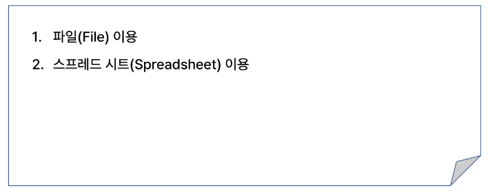

- 파일을 이용한 데이터 관리
  
  - 어디에서나 쉽게 사용 가능
  
  - 데이터를 구조적으로 관리하기 어려움
    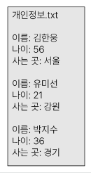

- 스프레드 시트를 이용한 데이터 관리
  
  - 테이블의 열과 행을 사용해 데이터를 구조적으로 관리 가능
    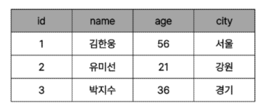

- 스프레드 시트의 한계
  
  - 크기
    
    - 일반적으로 약 100만 행까지만 저장가능
  
  - 보안
    
    - 단순히 파일이나 링크 소유 여부에 따른 단순한 접근 권한 기능 제공
  
  - 정확성
    
    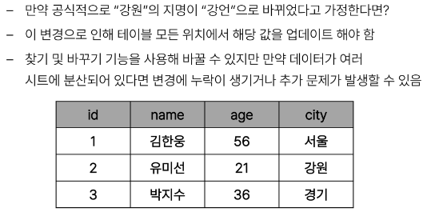

- 데이터베이스 역할
  
  - 데이터를 저장하고 조작(CRUD)

### Relational Database(관계형 데이터베이스)

- 데이터베이스 역할
  
  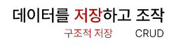

- 관계형 데이터베이스
  
  - 데이터 간에 **관계**가 있는 데이터 항목들의 모음
    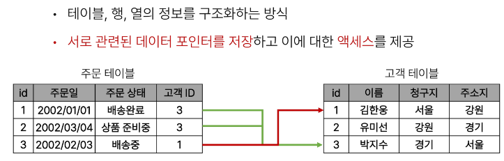

- 관계
  
  - 여러 테이블 간의 (논리적) 연결
    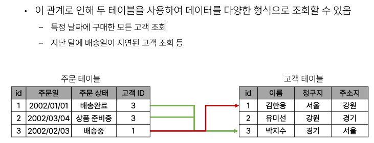

- 관계형 데이터베이스 예시
  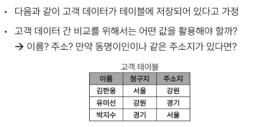
  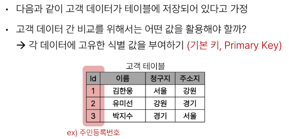
  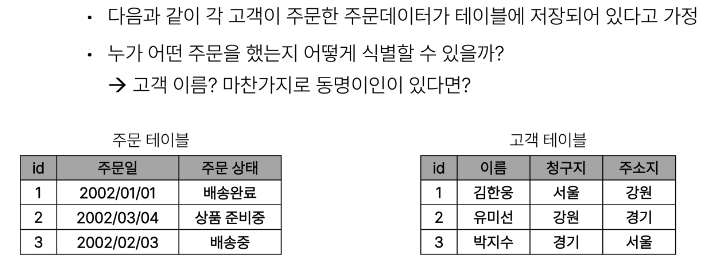
  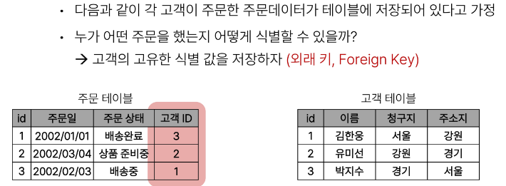

- 관계형 데이터베이스 관련 키워드
  
  field : 열, record: 행
  
  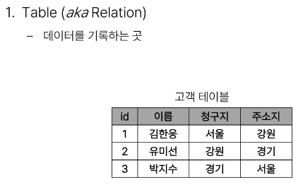
  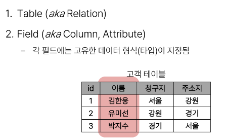
  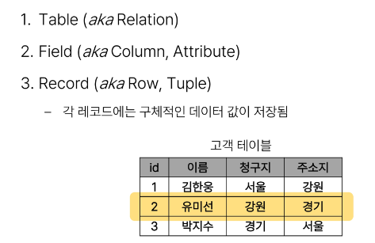
  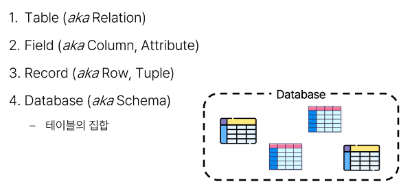
  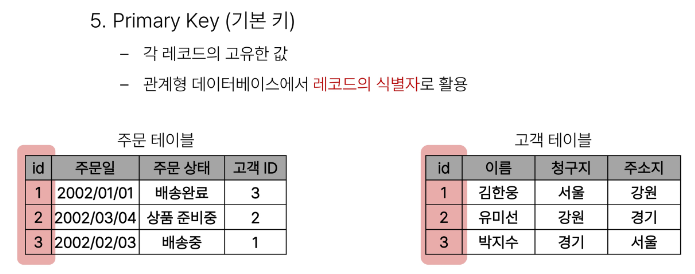
  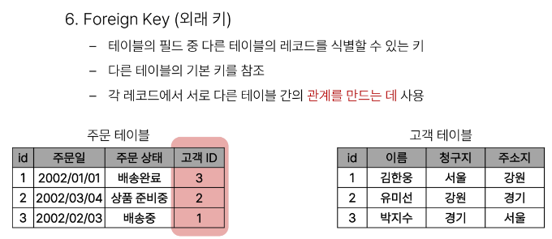

#### RDBMS

- DBMS
  
  - 데이터베이스를 관리하는 소프트웨어 프로그램

- RDBMS
  
  - 관계형 데이터베이스를 관리하는 소프트웨어 프로그램

- DBMS
  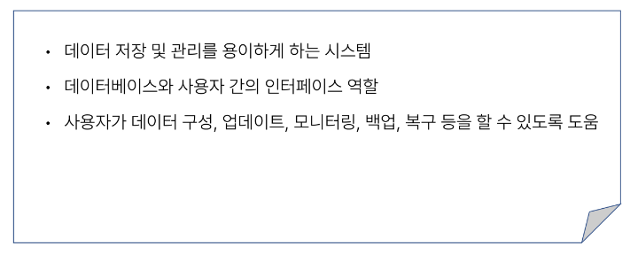

- RDMDS  서비스 종류
  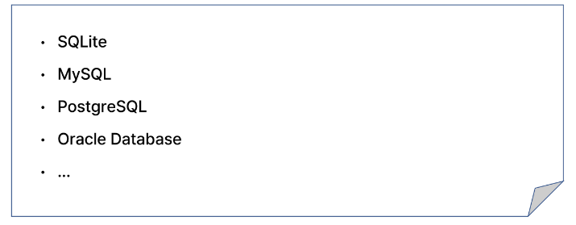

- SQLite
  
  - 경량의 오픈 소스 데이터베이스 관리 시스템
    
    - 컴퓨터나 모바일 기기에 내장되어 간단하고 효율적인 데이터 저장 및 관리를 제공

- 데이터베이스 정리
  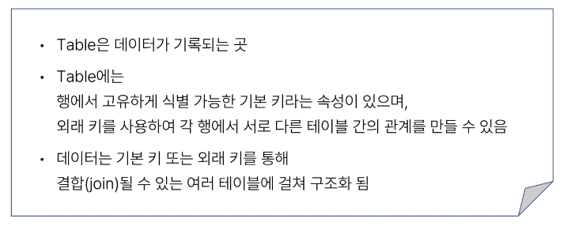

### SQL

#### 개요

- SQL
  
  - 데이터베이스에 정보를 저장하고 처리하기 위한 프로그래밍 언어
    

- SQL이란?
  
  - 관계형 데이터베이스와의 대화를 위해 사용하는 프로그래밍 언어

- SQL Syntax(문법)
  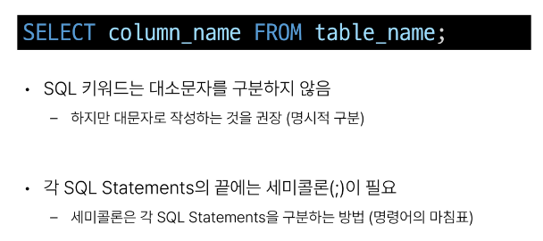

#### SQL Statements

- SQL Statements
  
  - SQL을 구성하는 가장 기본적인 코드 블록

- SQL Statementes 예시
  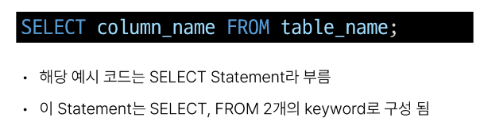

- 수행 목적에 따른 SQL Statements 4가지 유형
  
  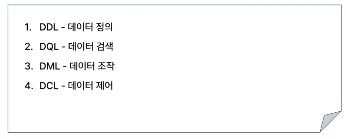
  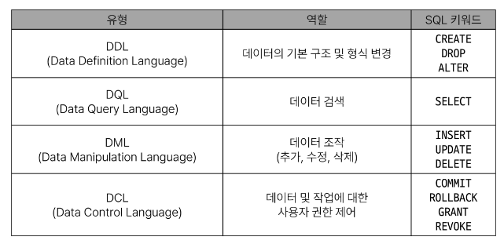

- SQL 학습
  
  - 단순히 SQL 문법을 암기하고 상황에 따라 실행만 하는 것이 아닌 SQL을 통해 관계형 데이터베이스을 잘 이해하고 다루는 방법을 학습

#### 참고

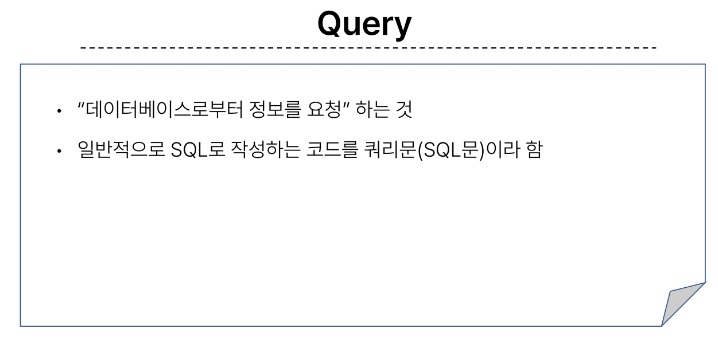
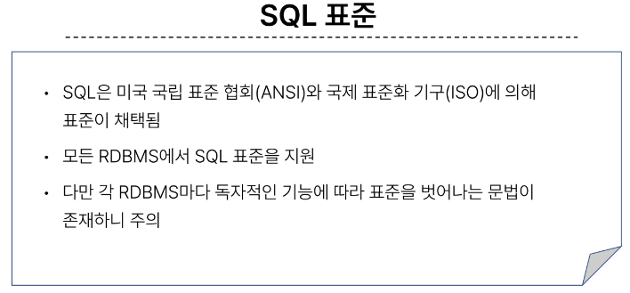

### Single Table Queries

- SQL Statements 유형
  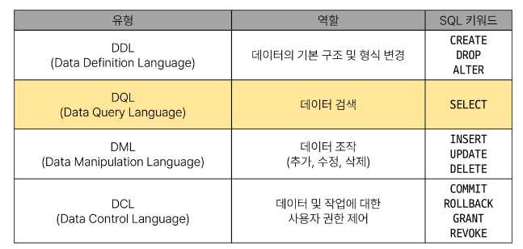

#### Querying data

##### SELETE

- SELECT syntax
  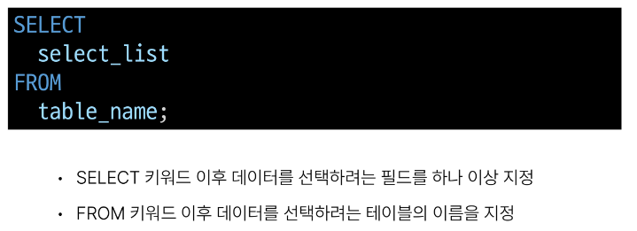줄바꿈을 무시하고 돌아간다.

- SELECT 활용 
  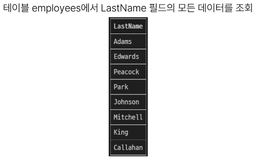
  
  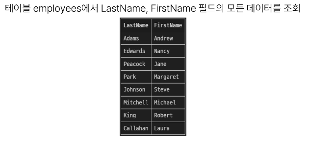
  
  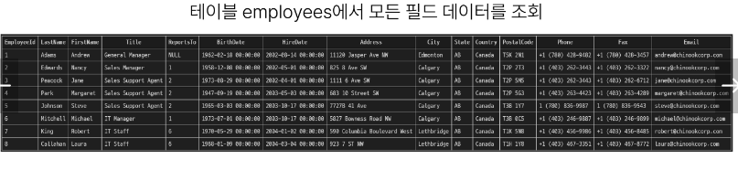
  
  
  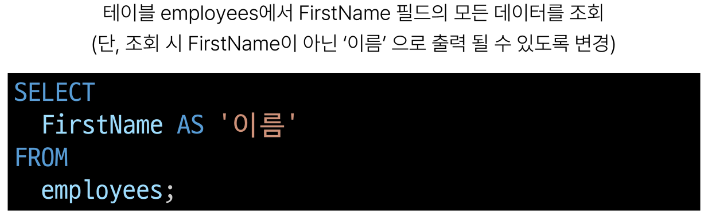
  
  

- SELECT 정리
  

#### Sorting data

##### ORDER BY

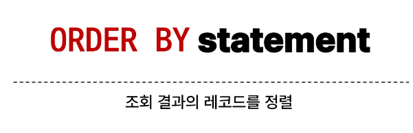

- ORDER BY syntax
  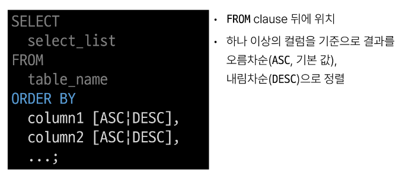

- ORDER BY 활용
  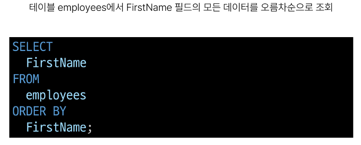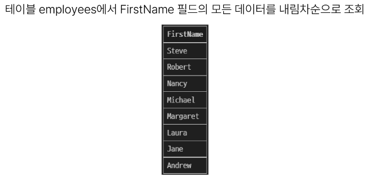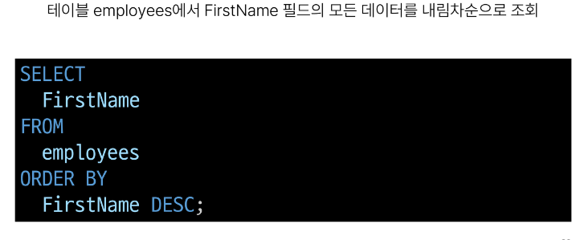
  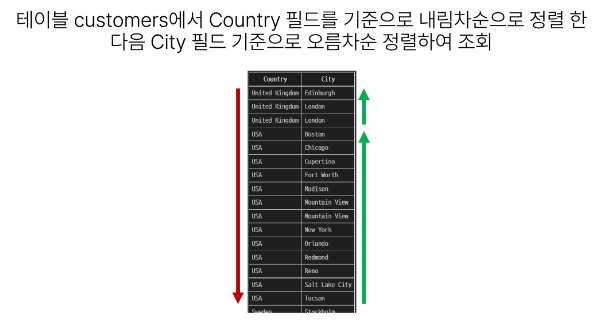
  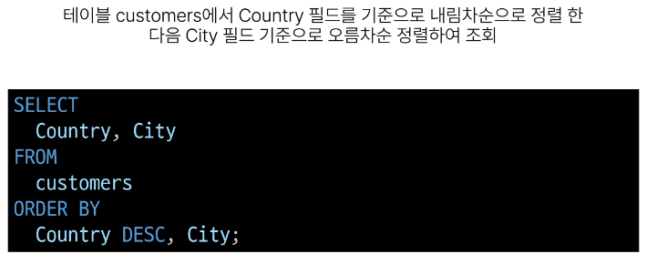
  
  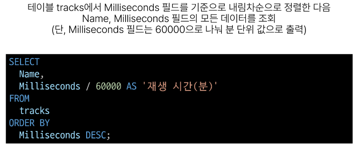

- 정렬에서의 NULL
  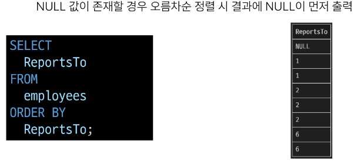

- SELECT statement 실행 순서
  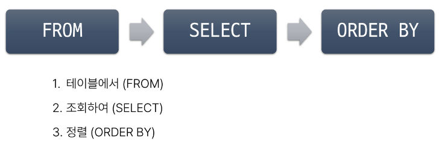

#### Filtering data

- Filtering data 관련 Keywords
  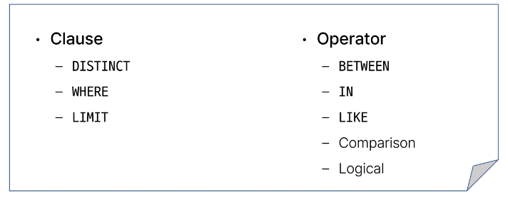

##### DISTINCT

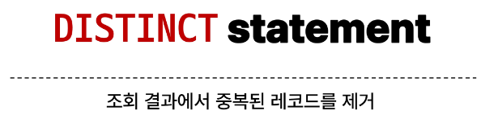

- DISTINCT syntax
  

- DISTINCT 활용 
  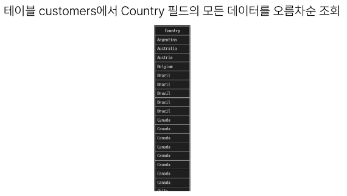
  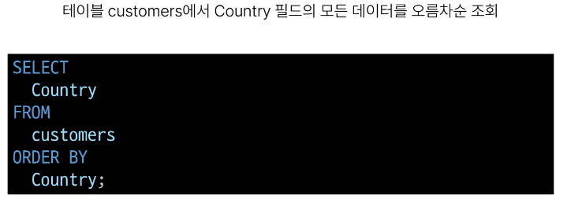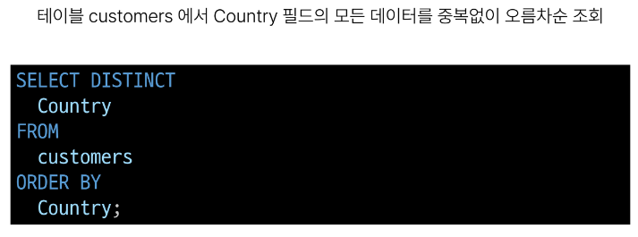

##### WHERE

- WHERE syntax
  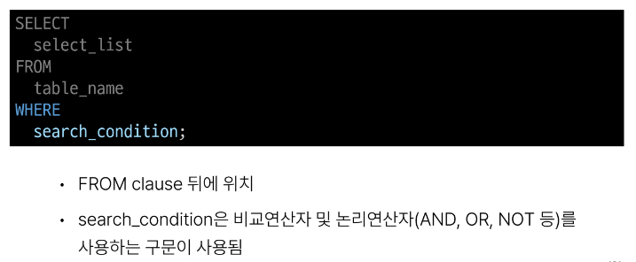

- WHERE 활용
  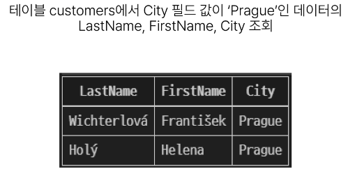
  
  
  
  
  NULL은 약간 다름..(조심)
  
  
  
  
  
  
  
  
  
  
  
  
  
  
  
  
  

#### Operators

#### LIMIT

- LIMIT syntax
  

- LIMIT & OFFSET 예시
  

- LIMIT 활용
  
  
  
  

### Grouping data

#### GROUP BY

- 기본적으로 중복제거와 오름차순 정렬이 있음
- 마치 DISTINCT 와 ORDER BY를 동시에 실행한 듯한 효과

- GROUP BY syntax
  

- GROUP BY 예시
  
  

- GROUP BY 활용
  
  
  
  
  
  

- SELECT statement 실행 순서
  

---

## SQL 2

### Managing Tables

- SQL Statements 유형
  

#### Create a table

##### CREATE TABLE

- CREATE TABLE syntax
  

- CREATE TABLE 활용
  
  

- 데이터 타입
  

- 제약 조건
  

- AUTOINCREMENT 키워드
  

- SQLite 데이터 타입
  

- Constraints(제약 조건)
  
  - 테이블의 필드에 적용되는 규칙 또는 제한 사항
    
    - 데이터의 무결성을 유지하고 데이터베이스의 일관성을 보장

- 대표적인 제약 조건
  

- AUTOINCREMENT 특징
  

#### Modifying table fields

##### ALTER TABLE

- ALTER TABLE 역할
  

- ALTER TABLE ADD COLUMN syntax
  

- ALTER TABLE ADD COLUMN 활용
  
  
  
  
  

- ALTER TABLE RENAME COLUMN syntax
  

- ALTER TABLE RENAME COLUMN 활용
  
  

- ALTER TABLE DROP COLIMN syntax
  

- ALTER TABLE DROP COLIMN 활용
  

- ALTER TABLE RENAME TO syntax
  

- ALTER TABLE RENAME TO 활용
  
  

#### Delete a table

##### DROP TABLE

- DROP TABLE syntax
  

- DROP TABLE 활용
  

#### 참고

### Modifying Data

- SQL Statements 유형
  

#### Insert data

##### INSERT

- 열 값 하나만 뿅 넣는 것 안됨, 해당 레코드 행의 전체 열 값을 다 대입해줘야 됨  

- INSERT syntax
  
  
  - 동시에 여러 레코드 가능하네.

- 실습 테이블 생성
  

- INSERT 활용
  
  
  articles() 내의 title, content, createdAt은 서로 순서가 바뀌어도 무관!
  단, VALUES의 값과 순서를 매핑해줘야 함
  
  
  
  
  

#### Update data

##### UPDATE

- UPDATE syntax
  

- UPDATE 활용
  
  
  
  

#### Delete data

##### DELETE

- DELETE syntax
  

- DELETE 활용
  
  
  
  

#### 참고

### Multi table queries

#### Join

- 관계
  
  - **여러** 테이블 간의 (논리적) 연결

- 관계의 필요성
  
  
  
  

- JOIN이 필요한 순간
  

#### Joining tables

##### JOIN

- JOIN 종류
  

- 사전 준비
  
  

##### INNER JOIN

- INNER JOIN syntax
  

- INNER JOIN 예시
  

- INNER JOIN 활용
  
  

##### LEFT JOIN

- LEFT JOIN syntax
  

- LEFT JOIN 예시
  

- LEFT JOIN 특징
  
  - 왼쪽은 테이블의 모든 레코드를 표기
  
  - 오른쪽 테이블과 매칭되는 레코드가 없으면 NULL을 표시

- LEFT JOIN 활용
  
  
