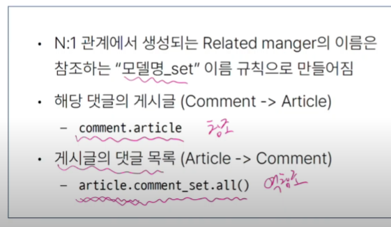
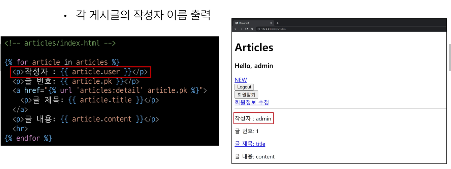

# 1011_1012 TIL

## 잡다한 것

- 장고는 User 모델에 대한 직접 참조를 싫어한다.
  
  - User 모델은 대체된 상태이고 현재 활성화 된 모델이 하나라서 문제는 없지만 이후에, 이 User모델이 커스텀 모델로 이름이 변경되거나 잠시 비활성화 되고 활성화 된다거나, 즉! User 모델에 대해서 변경사항이 생겼을 때 우리가 User를 직접 참조한 코드들을 다 찾아가서 변경해줘야 되는 문제가 생김
  
  - 그래서 User에 대한 변경사항이 생겨도 활성화된 User 모델을 자동으로 추적해서 리턴해주는 함수를 이용(get_user_model())

- 장고 코딩 스타일
  
  알아서 import 순서 정렬해줌

- ERD(개체-관계 모델)

- 공용문서 github.io로 된거를 선호(비슷하게 생겨서)

## Many to one relationships 1

### 개요

- Many to one relationships(N:1 or 1:N)
  
  - 한 테이블의 0개 이상의 레코드가 다른 테이블의 레코드 한 개와 관련된 관계

- Comment(N) - Article(1)
  
  - 0개 이상의 댓글은 1개의 게시글에 작성 될 수 있다.

- 테이블 관계
  
  
  - 댓글은 몇 번 게시글에 달린 댓글인지에 대한 정보가 반드시 데이터로써 존재해야 한다.
  
  - 외래키는 N:1에서 N 쪽이 들고 있는다.

### 댓글 모델 구현

- 댓글 모델 정의
  

- 만약에 게시글에 댓글이 작성되어있는데 게시글 작성자가 게시글을 지운다면 어떻게 처리??
  
  - 게시글은 그냥 지워지더라도 상관 x
  
  - 댓글은 본인이 가지고 있는 외래키 필드에 참고하고 있는 Article의 정보들을 가지고 있는데 이게 쓸모 x해짐(DB에서 무결성 원칙 위반)
  
  - 데이터 무결성이란?? 데이터의 정확성과 일관성을 유지하고 보증하는 것

- on_delete의 'CASCADE'
  
  참고) SET_NULL: ForeignKey 값이 지워지면 Null로 바꾸는 속성
  

- Migration
  
  
  - 보면 저절로 _id가 붙음을 알 수 있다.(문제 요구사항을 보고 article_id로 필드 만드는 실수 하지 말것!!, article_id_id가 됨)
  
  - 참고하는 있는 모델은 Article인데 만약 ssafy라고 외래키 이름을 정한다면?
    
    - 가능은 하지만 명시적이지 않다...

- 댓글 생성 연습
  
  
  
  
  
  
  

### 관계 모델 참조

- 역참조
  
  - N:1관계에서 1에서 N을 참조하거나 조회하는 것
    
    - 1 -> N
  
  - **N은 외래 키를 가지고 있어 물리적으로 참조가 가능하지만 1은 N에 대한 참조 방법이 존재하지 않아 별도의 역참조 이름이 필요**
  
  - 게시글 모델을 보면 게시글에는 댓글에 대한 정보가 물리적으로 존재 x
  
  - 따라서 게시글에서 댓글을 직접적으로 참조 불가..(역참조 필요)
  
  - 외래키가 없는 쪽에서 본인을 참조하고 있는 상대방을 참조하는 것을 역참조라고 한다.

- 역참조 사용 예시
  
  

- related manager  이름 규칙
  
  

- Related manager  연습
  
  

### 댓글 구현

- 댓글 CREATE 구현
  
  
  
  
  
  
  
  
  
  
  
  
  
  

#### 댓글 READ

- 댓글 READ 구현
  

#### 댓글 DELETE

- 댓글 DELETE 구현
  
  
  
  
  

#### 참고

---

## Many to one relationships 2

### 개요

- Article(N) - User(1)
  
  - 0개 이상의 게시글은 1명의 회원에 의해 작성 될 수 있다.

- Comment(N) - User(1)
  
  - 0개 이상의 댓글은 1명의 회원에 의해 작성 될 수 있다.

### Article & User

#### 모델 관계 설정

- Article - User 모델 관계 설정
  

- User 모델을 참조하는 2가지 방법
  
  
  
  - 왜 이렇게 나뉠까?
    
    - runserver을 할 때 많은 과정들이 있다.(점차적으로)
    
    - 그 과정 속에서 models.py구동 속도가 빠른 축에 속하는데 User 객체가 아직 장고에 존재하지 않을 수 있다.
    
    - 즉, models.py 구동 속도가 꽤 빨라서 임의로 문자열로 참조하는 것이 필요

- Migration
  
  
  
  

#### 게시글 CREATE

- 여기선 article.save()를 했지만, form.save()를 좀 더 권장
  
  
  

#### 게시글 READ

#### 게시글 UPDATE

- 여긴 왜 (commit=False) 안 해도 될까??
  
  - instance(수정)이라서 유저 정보가 이미 저장되어있다.

#### 게시글 DELETE

### Comment & User

#### 모델 관계 설정

- Comment - User 모델 관계 설정
  

- Migration
  
  

#### 댓글 CREATE

#### 댓글 READ

#### 댓글 DELETE

#### 참고

