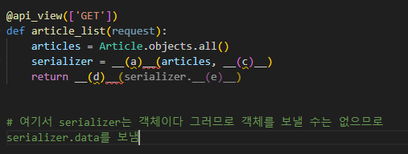
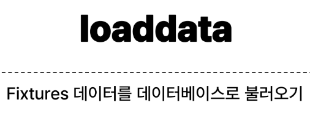
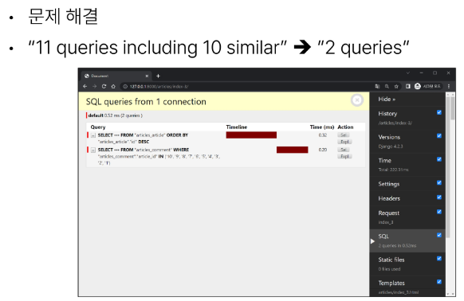
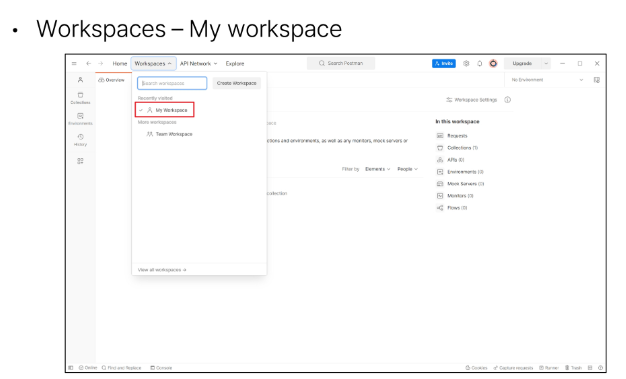
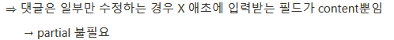
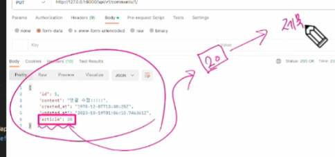
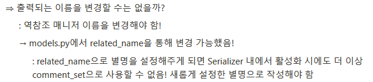
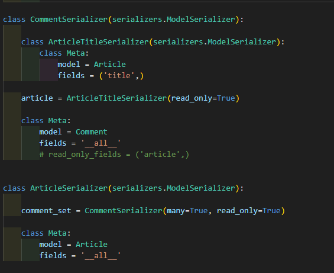
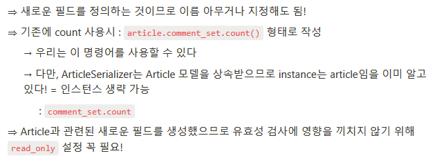

# 1016_1019 TIL

## 잡다한 것

- 역참조의 정의: 1에서 N을 참조하는 것이 역참조가 아니라, 본인을 참조하고 있는 외래키를 가진 애를 참조하는 것이 역 참조이다.

- ERD
  

- variable routing -> 디폴트 값이 str이다.

- 덤프 데이터는 자동으로 업데이트 안 해줌

- 키워드 인자는 띄어쓰기 안함을 권장.

---

- 공식 문서
  
  - https://www.django-rest-framework.org/

- 405에러: Method Not Allowed, 당신이 보낸 Method는 허용되지 않는다.

- 참고
  
  우리가 그동안 썻던 articles/create/는 사실 rest의 정신에 위반된 것, rest는 식별(위치)를 추정하는 용도로 쓰는데 create는 행위에 대한 의미가 담겨있다...(이건, Method가 하는 역할...)

- 참고
  

- 브라우저로 하는 것은 작은 따옴표도 안 되고 마지막에 `,`를 찍는 것도 안됨

- 일부 데이터 수정 원할 때 필요한 옵션
  
  

- 전체 목록을 조회하기 위해서 Comment(댓글)라고 하는 데이터를 json 데이터로 보내줘야 되는데, 우리가 이 Comment를 조회했을 때 쿼리셋으로 데이터가 올 것이다. 그런데, 이 쿼리셋을 그래로 json으로 변경 불가. 그렇게 때문에 이것을 json이건 다른 데이터 타입이건 유연하게 다른 데이터 타입으로, 혹은 서로 다른 운영체제 간에 문제 없이 잘 활용하기 위해서 serializer를 이용

- 참고
  

- 장고는 세션으로 유저 관리하는 것을 기본으로 한다.
  
  - 로그인을 한다는 것은
    
    1. 세션 데이터 생성
    
    2. DB에 저장
    
    3. 세션 ID를 쿠키에 저장(클라이언트한테 주기 위해)

## Many to many relationships 1

### Many to many relationships

- Many to many relationships(N:M or M:N)
  
  - 한 테이들의 0개 이상의 레코드가 다른 테이블의 0개 이상의 레코드와 관련된 경우
    
    - **양쪽 모두에서 N:1관계를 가짐**

- M:N 관계의 역할과 필요성 이해하기
  

#### N:1의 한계

- 의사와 환자 간 모델 관계 설정
  

- 의사와 환자 데이터 생성
  

- N:1의 한계 상황
  
  심지어 id는 pk이므로 이름이 같은 동명이인(실제론 다른 사람)을 같은 사람으로 인식하는 문제점도 발생
  
  
  
  - 지금은 예약이라는 내용을 환자 쪽의 외래키로 설정하고자 했는데, 문제가 생기므로 그냥 환자쪽에는 환자만 넣고, 의사쪽에는 의사만 넣은 뒤 예약에 대한 정보는 3번째 테이블에 넣자!

#### 중개 모델

- 예약 모델 생성
  

- 예약 데이터 생성
  

- 예약 정보 조회
  

- 추가 예약 생성
  

- 예약 정보 조회
  
  
  - 이렇게 해도 맘에 안 드는 부분이 있다!!
    
    - 예약을 만들어내는 주체가 의사도 환자도 아닌 예약이라는 클래스..
      
      - 의사쪽에서도 스스로 환자를 데이터로 가지고 예약을 만들 수 있어야 되고, 환자도 의사를 통해서 만들 수 있어야 되는데 안된다..(코드 구성상)
      
      - 우리는 객체 지향적인 코드를 작성 중이다. 의사 인스턴스와 환자 인스턴스가 조금 더 주도적으로 예약을 형성하도록 했으면 좋겠다.
      
      - 그래서 아래 방식을 기용

- **Django에서는 'ManyToManyField'로 중개모델을 자동으로 생성**

#### ManyToManyField

- Django ManyToManyField
  
  
  - 보면 N:1 관계에서는 참조대상의 소문자 단수형을 썻는데 이번엔 참조대상의 소문자 복수형을 쓰고 있음을 알 수 있다.(다른 외래키와 구분하기 위해)
    
    
    
    
    
    
  
  - **다 대 다 관계는 누구 하나가 종속된 관계가 아니다.**(왜냐하면 외래키가 Patient(여기선)에 생성된 것이 아니라서 둘 다 동등하게 조회할 수 있고, 각자가 추가 가능), 그러면 ManytoManyField는 어디에 두는 것이 맞을까? -> 둘 다 가능(다만, 참조와 역참조 관계만 바뀜)

- **만약 예약 정보에 증상, 예약일 등 추가 정보가 포함되어야 한다면?** -> 어쩔 수 없이 중개 테이블을 만들어 줘야 한다..

#### 'through' argument

- 'through' argument
  
  
  
  
  
  
  

- M:N 관계 주요 사항
  
  
  - 물리적인 변화가 없음 -> ManyToManyField를 어디에 생성하든 각각의 두 테이블에는 필드가 새로 생성 X, 대신 중개 테이블이 생김

### Django ManyToManyField

- ManyToManyField's Arguments
  

- 'related_name' arguments
  
  
  - related_name을 설정하면 변경 전의 명령어는 더 이상 사용 불가.

- 'symmentrical' arguments
  
  
  
  - 자기 스스로를 다 대 다 관계로 참조할 때 사용된다.(ex.팔로우)
  
  - 유저모델은 하나이므로 유저와 유저 간의 다 대 다 관계를 만드는 것은 스스로 다 대 다 관계를 형성하는 수 밖에 없다.

- M:N에서의 methods
  

### 좋아요

#### 모델 관계 설정

- Many to many relationships(N:M or M:N)
  
  - 한 테이블의 0개 이상의 레코드가 다른 테이블의 0개 이상의 레코드와 관련된 경우
    
    - **양쪽 모두에서 N:1 관계를 가짐**

- Article(M) - User(N)
  
  - 0개 이상의 게시글은 0명 이상의 회원과 관련
    
    - 게시글은 회원으로부터 0개 이상의 좋아요를 받을 수 있고, 회원은 0개 이상의 게시글에 좋아요를 누를 수 있음

- 모델 관계 설정(1~2)
  
  

- user.article_set 역참조 매니저 충돌
  
  
  
  - _set이면 주로 N:1에서의 역참조이구나로 판단함, 그래서 N:M에서의 역참조의 이름을 바꿔주는 것을 권장

- 모델 관계 설정(3~4)
  
  

- User-Article간 사용 가능한 전체 related manager
  

#### 좋아요 기능 구현

- 누가(user) / 어디에(article)가 필요할 텐데, 잘 생각해보면 variable routing에는 article만 있으면 된다.
  
  - 좋아요를 누른다는 것은 누군가가 로그인이 되어있다는 것이고 request(요청)객체에 이미 들어가 있다.(저번처럼 우리는 별도로 유저를 검색할 필요 없음.)
    
    
    
    

## Many to many relationships 2

### Many to many relationships 2

#### 팔로우

##### 프로필

- 프로필 페이지
  

- 프로필 구현
  
  username은 unique 해서 위와 같이 사용가능
  
  
  또한, url 요청이 왔을 때 위에서 아래로 매칭 판단을 하는데, 위와 같이 작성을 하면 이것보다 먼저 작성된 것은 문제가 없지만 아래의 것들은 인식이 안될 수 있다.
  
  
  
  참고) 내 프로필로 가는 url의 variable routing 가능한 것: `request.user.username` , `user.username`, `request.user` 게시판 작성자 프로필로 가는 url의 variable routing 가능한 것: `article.user`, `article.user.username`

##### 팔로우 기능 구현

- User(M) - User(N)
  
  - 0명 이상의 회원은 0명 이상의 회원과 관련
    
    - 회원은 0명 이상의 팔로워를 가질 수 있고, 0명 이상의 다른 회원들을 팔로잉 할 수 있음

- 팔로우 기능 구현
  
  
  
  역참조를 안해주면 명시적이지 않아서 해줌.
  
  
  
  
  
  

##### 참고

### Django Fixtures

#### Fixtures

- Fixtures
  
  - Django가 데이터베이스로 가져오는 방법을 알고 있는 데이터 모음
    
    - 데이터베이스 구조에 맞추어 작성 되어있음

- 초기 데이터 제공
  
  - Fixtures의 사용 목적

- 초기 데이터의 필요성
  

#### Fixures 활용

- 사전준비
  

- fixtures 관련 명령어
  

- dumpdata 활용
  
  
  --indent 4: 들여쓰기(4칸), 가독성을 위한 옵션
  
  

- Fixtures 파일 기본 경로
  

- loaddata 활용
  
  

- loaddata 순서 주의사항
  

#### 참고

- **Fixtures 파일을 직접 만들지 말 것**
  
  - 반드시 dumpdata 명령어를 사용하여 생성 

### Improve query

#### 쿼리 개선

##### 사전준비

- Improve query
  
  - 같은 결과를 얻기 위해 DB 측에 보내는 쿼리 개수를 점차 줄여 조회하기

- 사전 준비
  
  

##### annotate

- 문제 상황
  
  

- annotate 적용
  
  

##### select_related

- 문제 상황
  
  

- select_related  적용
  
  

##### prefetch_related

- 문제 상황
  
  

- prefetch_related 적용
  
  

##### select_related & prefetch_related

- 문제 상황
  
  

- prefetch_related 적용
  
  

- select_related & prefetch_related 적용
  
  

---

## Django REST framework 1

### REST API

- API(Application Programming Interface)
  
  - 애플리케이션과 프로그래밍으로 소통하는 방법
    
    - 클라이언트-서버처럼 서로 다른 프로그램에서 요청과 응답을 받을 수 있도록 만든 체계

- API란
  

- Web API
  

- REST(Representational State Transfer)
  
  - API Server를 개발하기 위한 일조의 소프트웨어 설계 방법론
    
    - "약속(규칙X)"
    - 여기서의 State는 데이터를 의미

- RESTful API
  

- REST API
  
  - REST라는 설계 디자인 약속을 지켜 구현한 API

- REST API 실제 예시
  

- REST에서 자원을 정의하고 주소를 지정하는 방법
  

#### 자원의 식별

- URL(Uniform Resource Identifier) (통합 자원 식별자)
  
  - 인터넷에서 리소스(자원)를 식별하는 문자열
    
    - 가장 일반적인 URI는 웹 주소로 알려진 URL

- URL(Uniform Resource Locator) (통합 자원 위치)
  
  - 웹에서 주어진 리소스의 주소
    
    - 네트워크 상에 리소스가 어디 있는지를 알려주기 위한 약속
      

- Schema(or Protocol)
  

- Domain Name
  

- Port
  

- Path
  

- Parameters
  

- Anchor
  
  보고 있는 화면part를 보내줄 수 있음(맨 앞이 아닌 스크롤이 내려가 있음), 즉 이 하나의 문서의 정확한 위치를 찍어서 공유 가능

#### 자원의 행위

- 대표 HTTP Request Methods
  
  

- HTTP response status codes
  

#### 자원의 표현

- 그동안 서버가 응답(자원을 표현)했던 것
  

- 응답 데이터 타입의 변화
  
  
  
  

#### 사전준비

- 사전준비
  
  

- python으로 json 응답 받기
  

### DRF

- Django REST framework(DRF)
  
  - Django에서 RESRful API 서버를 쉽게 구축할 수 있도록 도와주는 오픈소스 라이브러리

#### Serialization

- Serialization("직렬화")
  
  - 여러 시스템에서 활용하기 위해 데이터 구조나 객체 상태를 나중에 재구성할 수 있는   포맷으로 변환하는 과정
  
  - 어떠한 언어나 환경에서도 나중에 다시 쉽게 사용할 수 있는 포맷으로 변환하는 과정

- Serialization 예시
  
  

### DRF with Single Model

#### DRF with Single Model

- 프로젝트 준비
  

- Postman 설치 및 안내
  
  

- Postman 화면 구성
  

- URL과 HTTP requests methods 설계
  
  
  - 2개의 URL/5개의 기능
    
    - Method가 있기에 2개의 url만으로도 5개의 기능이 가능!

#### GET

- GET - List(1)
  

- GET - List(2~3)
  
  
  

- 이전 view 함수와의 비교
  
  

- 'api_view' decorator
  

- GET - Detail
  
  
  

#### POST

- POST
  
  
  
  

#### DELETE

#### PUT

#### 참고

## Django REST framework 2

### DRF with N:1 Relation

#### 사전 준비

- Comment 모델 정의
  

- URL 및 HTTP request method 구성
  

#### GET

- GET - LIST
  
  
  
  
  Response에서 .data를 붙여줘야 json 형태의 데이터를 넘겨 줄 수 있다. (안 달면 그냥 객체임..)

- GET - Detail
  
  
  

#### POST

- POST(1~4)

- 읽기 전용 필드
  

- POST(5)
  

#### DELETE & PUT

#### 응답 데이터 재구성

- 댓글을 조회하면 게시글에 대한 정보가 있기는 한데 외래키의 실제 pk값만 있다. 만약에 클라이언트가 이 데이터를 받았을 때 이 pk값을 활용하기 살짝 어려움 (20번째의 제목을 알고 싶다면, 20를 먼저 추출해서 변수에 저장, 이걸로 다시 게시글 조회해야 됨....) (큰 문제는 없긴 한데,, 복잡..) => 이를 해결하기 위해 단일 댓글을 조회 할 때 pk값이 아닌 이 게시글의 title값으로 한 방에 처리하고 싶다.
  

- 댓글 조회 시 게시글 출력 내역 변경
  
  
  
  

### 역참조 데이터 구성

- 역참조 데이터는 기본적으로 제공해주지 않아서 우리가 직접 생성해 줘야한다.

- Article -> Comment 간 역참조 관계를 활용한 JSON 데이터 재구성
  

- 단일 게시글  + 댓글 목록
  
  
  
  
  
  
  - 만약에 위와 같이 설계를 했다면??
    
    - Article의 Title도 같이 comment_set 안에 들어가서 나오게 된다.

- 단일 게시글 + 댓글 개수
  
  
  
  

- [주의] 읽기 전용 필드 지정 이슈
  

### API 문서화

- OpenAPI Specification(OAS)
  
  - RESTful API를 설명하고 시각화하는 표준화된 방법
    
    - API에 대한 세부사항을 기술할 수 있는 공식 표준

- drf - spectacular 라이브러리
  
  
  
  
  

- OAS의 핵심 이점 - "설계 우선" 접근법
  

#### 참고

- API를 만들 때 필요한 기능(전에 하던 templates에선 그닥..왜냐, 게시글이 없을 때 메인 페이지를 볼 수 x)(적합한 사용처가 있으니 막 도입 x)

- 실제 서비스에서 사용자가 없는 것을 조회할 수 있다.
  
  - 근데 사용자가 없는 것을 조회를 했는데 서버가 다운이 된다??
  
  - 그럼 다른 사용자는 어뜩함?
  
  - 찾고자 하는 것이 없을 때는 서버를 끄지 않고 올바른 응답 상태 코드를 줘야 된다.(404)

- DoesNotExist 예외 : 서버가 끝남..
  
  
  
  
  
