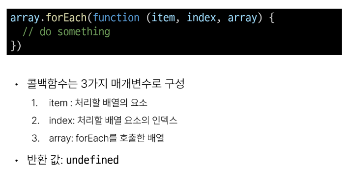
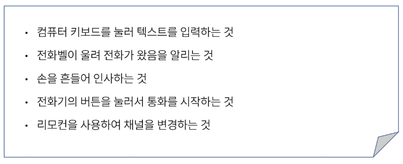
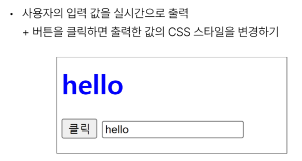

# 1023_1026 TIL

## 잡다한 것

- 자바 스크립트의 구동 순서: 순차적이 아닌 병렬적(비동기적)으로 처리

- 실행: ALT + B

- 자바, JS : camel_case
  C, Python : snake_case
  웹 : kebab_case

- CSS는 class로 JS는 id로 구분하는 것이 유리하다

- 주로 동사가 메서드, 명사가 속성

- 권장 스타일 가이드
  [JavaScript Standard Style](https://standardjs.com/rules-kokr.html)

- 게임
   https://jsisweird.com/

- 불변.메소드: 비파괴적 메소드
  가변.메소드: 파괴적 메소드

- 처음에 일단 const를 써보고 오류나면 let을 써도 됨

- 버블링 관련
  [Event bubbling, 이벤트 버블링이란? :: 박상준의 기술블로그](https://sangjuntech.tistory.com/22)

- 참고
  
  
  - 왜 왼쪽에선 똑바로 값이 나오는데 오른쪽에선 null로 나오지??
    
    - 버블링 되어 올라가는 속도 보다 출력되는 속도가 더 빨라서 그럼
    
    - 그래서 개발자 도구 타고 들어가서 속성값 찾아낼 때 참고할 것!
      
      - asd 쳤을 때 asd가 어디에 들어가 있지??
  
  - Lodash 공식문서
     [Lodash Documentation](https://lodash.com/docs/4.17.15)

- Rest framework 공식문서
    https://www.django-rest-framework.org/

- 영화 API
   [영화진흥위원회 오픈API](https://www.kobis.or.kr/kobisopenapi/homepg/main/main.do)

## Introduction of JavaScript

### History of JavaScript

#### 웹 브라우저와 JavaScript(생략)

#### ECMAScript

- ECMAScript와 JavaScript
  

- ECMAScript의 역사
  

- JavaScript의 현재
  

### JavaScript and DOM

#### DOM

##### DOM 개요

- 웹 브라우저에서의 JavaScript
  
  - 웹 페이지의 동적인 기능을 구현

- JavaScript 실행 환경 종류
  

- DOM(The Document Object Model)
  
  - 웹 페이지(Document)를 구조화된 객체로 제공하여 프로그래밍 언어가 페이지 구조에 접근할 수 있는 방법을 제공
    
    - 문서 구조, 스타일, 내용 등을 변경할 수 있도록 함
  
  - 문서를 객체로 제공해주면 조작이 가능해짐
    
    - 조작 가능하려면 선택(조회)가 필요

- DOM 특징
  

- DOM tree
  

- 브라우저가 웹 페이지를 불러오는 과정
  

- DOM 핵심
  
  - 문서의 요소들을 객체로 제공하여 다른 프로그래밍 언어에서 접근하고 조작할 수 있는 방법을 제공하는 API

##### document 객체

- 'document' 객체
  

- 'document' 객체 예시
  

#### DOM 선택

- DOM 조작 시 기억해야 할 것
  

##### 선택 메서드

- DOM 선택 실습
  
  
  - 만약 content2를 선택하고 싶다면??
    
    1. 단일 선택할 때 내용까지 넣어서 조회
    
    2. 전체 선택으로 해서 조회 후 인덱스 접근
    
    3. F12(개발자 도구)들어가서 선택자 눌러서 Copy Selector메뉴 선택해서 복사하고 그것(선택자 주소)을 이용해서 접근

#### DOM 조작

##### 속성 조작

- 속성(attribute) 조작
  

- 클래스 속성 조작
  
  

- classList 메서드
  
  
  - 이걸 어디다가 쓸까? ex. 다크모드
    
    - 다크모드 버튼을 눌렀을 때의 다크모드에 대한 스타일을 다 짜놓고 만약에 누른다면 해당 스타일들이 자바스크립트로 한번에 적용 되도록 하기

- 클래스 속성 조작 실습
  
  

- 속성 조작 메서드
  

- 속성 조작 실습
  

##### HTML 콘텐츠 조작

- HTML 콘텐츠 조작

 

- HTML 콘텐츠 조작 실습
  

##### DOM 요소 조작

- DOM 요소 조작 메서드
  

- DOM 요소 조작 실습
  

##### style 조작

- style 조작
  
  

- style 조작 실습
  
  
  - 주의 사항: css의 스타일 속성 이름과 자바스크립트의 속성 이름 형태 차이남을 기억!
    
    - 자동 완성 해주기는 함.
  
  - 실제로는 자바스크립트로 스타일을 직접 입력하기 보다는 CSS로 함
    
    - 다만, 인라인 스타일은 우선순위가 높잖아. -> 이걸 강제로 뚫을 때 이용되긴 함

##### 참고

---

## Basic syntax of JavaScript

### 변수

- JavaScript 문법 학습
  

- 식별자(변수명) 작성 규칙
  
  
  
  - Pascal Case: 첫글자 대문자.

- 변수 선언 키워드
  

- let
  

- const
  

- 블록 스코프(block scope)
  
  
  - 참고
    
    - 파이썬과 JS의 차이점:
      
      - 파이썬에서는 영역의 차이를 들여쓰기로 판단
      
      - 자바스크립트에서는 중괄호로 영역을 분류
    
    - 같은 점:
      
      - 블록 스코프를 가지는 변수는 블록 바깥에서는 접근 불가능
      
      - 하지만 만약에 안에서 찾았는데 변수가 없다?? - 그러면 전역변수로 역으로 찾아 올라가긴 함(단, 비추..) (반대는 No)

- 변수 선언 키워드 정리
  

### 데이터 타입

- 데이터 타입
  
  

- 원시 자료형 예시
  

- 참조 자료형 예시
  

#### 원시 자료형

- Number 예시
  

- 문자열은 작은 따옴표를 쓰는 것을 권장(스타일 가이드)

- String 예시
  
  
  - 연결 연산자라고 함

- Template literals (템플릿 리터럴)
  

- null 과 undefined
  
  
  
  - const는 애초에 초기값이 필수 이므로 undefined인 경우가 나오지 않는다.

- '값이 없음'에 대한 표현이 null과 undefined 2가지인 이유
  

- 주의사항: 소문자이다!!

- 자동 형변환
  

### 연산자

- 할당 연산자
  

- 증가 & 감소 연산자
  
  
  
  - '단독'은 ++이 앞에 있든 뒤에 있든 동일

- 비교 연산자
  

- 동등 연산자(==)
  
  
  - 암묵적 타입 변환 때문에 골치 아파질 수 있어서, 아래의 일치 연산자를 권장

- 일치 연산자(===)
  
  
  - null 과 undefined를 서로 비교할 때 일치 연산자는 false 반환하고, 동등 연산자에서는 true 반환 -> 그래서 값이 없음을 비교하는 특수한 경우를 제외하고는 일치 연산자를 이용

- 논리 연산자
  
  
  - 하나만 쓰면 비트연산..

### 조건문

- if 예시
  

- 조건 (삼항) 연산자
  

### 반복문

- 반복문 종류
  

- while 예시
  

- while과 똑같이 조건이 거짓으로 판별될 때까지 반복

- for 예시
  

- for 동작 원리
  

- for ... in 예시
  
  
  - 보면 기존에 알고 있던 key 값이 나온 것을 알 수 있다.
    
    - 다만, 자바스크립트에선 key를 **속성**이라고 부름!!

- 반복 가능한 객체 -> 순서 -> 인덱스

- 딕셔너리는 순서 x 하지만 파이썬에서는 반복 가능한 객체로 분류됨
  
  - 자바스크립트에서는 딕셔너리(여기선 object)를 반복 가능한 객체에 포함 시키지 x

- for ...of 예시
  

- 배열 반복과 for ...in
  
  
  - for...in은 객체의 키 값(속성)을 반환한다.
  - 배열의 키 값은 **인덱스**!!
  - **for...in은 object에서만 쓰인다.**(**특정 순서에 따라 인덱스를 반환하는 것을 보장 x하므로**), 순서가 중요한 애들한테는 for...in 사용 x
  
  

- for ...in 과 for ...of
  
  
  - for ... of는 object는 아예 실행조차 불가
  
  - for ...of는 순서를 보장하면서 출력하는 것인데, object는 애초에 순서가 x(타입에러 발생)
  
  - 즉, **for... in : object, for...of : object를 제외한 나머지**

- 반복문 사용시 const 사용 여부
  

- 반복문 종합
  
  
  - for...in과 for...of도 break와 continue를 사용가능

#### 참고

- 중괄호로 결정나는 블록 스코프와 달리 반복문의 중괄호, 조건문의 중괄호 이런 것들도 줄괄호의 영역으로 취급 안하고 모두가 같은 영역으로 취급, 단 , **함수**만 빼고

- 호이스팅 TEST(면접에도 은근 나옴)

- 자바스크립트가 실행이 되면서 어? 변수의 name이 있네 선언만 꼭대기로 끌어올림..(값은 끌어올리지 않고.)

---

## JavaScript Reference data types

### 함수

#### 개요

- 데이터 타입
  
  

#### 함수 정의

- 함수 구조
  

- 함수 정의 2가지 방법
  
  

- 함수 표현식 특징
  

- 함수 선언식과 표현식 종합
  

#### 매개변수

- 매개변수 정의 방법
  
1. 기본 함수 매개변수(Default function parameter)
   

2. 나머지 매개변수(Rest parameters)
   
   
   - 참고: 파이썬에서는 배열이 아닌 튜플로 허용했음
- 매개변수와 인자의 개수 불일치
  
  
  - 에러 발생 x , 누락된 인자는 undefined로 할당 됨
  
  
  
  - 에러 발생 x, 초과 입력한 인자는 사용 되지 x

#### Spread syntax

- 전개 구문
  

- 전개 구문 활용
  
  
  - 만약 확장하는 인자의 수가 더 많다면??
    
    - ex: numbers= [1, 2, 3, 4] 라면?? 기존과 동일하게 6이 나온다.
  
  - 만약 확장하는 인자의 수가 더 적다면??
    
    - ex: numbers= [1, 2]라면?? 이번에는 NaN이 나옴(연산이 안되네??)
    
    
  
  

#### 화살표 함수

- 화살표 함수 표현식(Arrow function expressions)
  
  - 함수 표현식의 간결한 표현법

- 화살표 함수 작성 결과
  

- 화살표 함수 작성 과정
  
  
  
  
  - 보통 1단계까지만 처리함, 2~3 단계는 함수라는 느낌이 덜하므로(그래도 알긴 해야 됨)

#### 참고

- object에는 중괄호가 필요로 하는데 중괄호를 없앤다구?? 못 없애지(그러면 return도 안돼!) (그래도 없애고 싶다고?? 그럼 소괄호로 감싸기라도 해라)

### 객체

#### 개요

#### 구조 및 속성

- 객체 구조
  
  
  - ~~보면 파이썬에서의 (oop) 속성과 메소드 느낌 있네.~~
  
  - name처럼 하나의 단어일 때는 `''` 생략 가능(알아서 문자형으로 판단 함)

- 속성 참조
  
  
  
  - 생각해보면 key 이름에 띄어쓰기 같은 구분자가 있으면 대괄호 접근만 가능한 것이 당연
    
    - `user. key with space`(이게 되겠냐??)
  
  - 인화
    
    -  속성값이 없을 때는 `.`은 불가능 하고 `[]`접근만 된다구요!

- 'in' 연산자
  
  
  - boolean 값으로 나온다.

#### 객체와 함수

- Method 사용 예시
  

#### this

- Method & this 사용 예시
  
  
  - 함수(greeting)가 포함된 객체는 person이니깐 this는 person을 가리킴
  
  - 함수(greeting)가 객체 person에 속해있으므로 this는 person을 가리킴
    
    

1. 단순 호출 시 this
   
   
   - 여기서 window는 브라우저의 최상위 객체이다.
     
     - 어? document아니었나?, 사실 그 위에 window가 있었다.
     
     - 다만, window는 생략 가능

2. 메서드 호출 시 this
   
   
   - myFunc(메서드)를 호출한 myObj(객체)
   
   - 너 누가 불렀니? 너 부른 애 데리고 와!

3. 중첩된 함수에서의 this 문제점과 해결책
   
   
   
   
   
   
   - 화살표 함수는 자신만의 this가 없어서 자기상위 함수의 this를 찾아간다.
- JavaScript 'this' 정리
  

#### 추가 객체 문법

1. 단축 속성(약간 중요)
   
   
   - 한 줄로 const user = { name, age }로 작성도 가능 = 배열과 헷갈리지 않도록 주의

2. 단축 메서드
   

3. 계산된 속성(computed property name)
   

4. 구조 분해 할당(destructing assignment) (매우 중요)
   
   
   - 한방에 쫙 할당하는 방법이 없을까 해서 나옴
   
   - 속성과 이름이 같아야지만 알아서 받아줌
   
   - 변수를 할당하는 데 특이하게 중괄호를 쓰고 있네?
   
   - 4-1. 구조 분해 할당 활용
     

5. Object with '전개 구문'
   

6. 유용한 객체 메서드
   
   
   - 보면, 결과가 배열로 나온다.

7. Optional chaining ('**?.**')
   
   
   
   - 7-1. Optional chaining 장점
     
   
   - 7-2. Optional chaining 주의사항
     
   
   - 7-3. Optional chaining 요약
     

#### JSON

- JSON
  
  
  - 파이썬에서 JSON은 문자열 형태이기 때문에 바로 활용 불가 -> 타입 변경해서 씀(리스트or 딕셔너리)
  
  - 자바스크립트에서도 JSON은 문자열 형태이기 때문에 바로 활용 불가 -> 타입 변경해서 씀(배열 or 객체)

- Object < - > JSON 변환하기
  

#### 참고

- 프레임, 도장 같은 것을 만드는 것이 어떨까??

### 배열

- **앞의 함수와 객체도 중요했지만 배열이 젤 중요**

#### 개요

- 배열 구조
  
  
  - JS에서는 음수 인덱스 지원 x
    
    - 마지막 요소는 (length -1) 로 접근 할 것

#### 배열과 메서드

- 주요 메서드
  

#### Array helper method(오늘 배운 것 중에서 젤 중요한 part)

- 주요 Array Helper Methods
  
  
  - forEach 와 map은 근본적으로 동작하는 원리는 동일
  
  - 차이점: forEach는 리턴 x, map은 리턴 o

- forEach 구조
  
  

- forEach 활용
  
  
  
  - 여기서 화살표 함수가 정말 많이 활용 된다.
  
  - 보통 콜백 함수를 쓸 때는 화살표를 많이 씀

- 함수의 매개변수에 함수가 들어가는 것임 그냥

- 콜백함수는 괄호 x

- 콜백 함수 예시
  

- map 구조
  
  
  

- map 활용
  
  
  
  - 반환이 있기 때문에 return이 들어감, 그리고 어디엔가에 결과물을 할당함(변수 필요)( ex. const result1)

- python에서의 map 함수와 비교
  

- 배열 순회 종합
  
  
  - break, continue 대신에 return 쓰지 뭐.

#### 추가 배열 문법

1. Array with '전개 구문'
   

2. 기타 Array Helper Methods
   

#### 참고

- 비동기적 처리 -> 병렬 처리를 의미
  
  

---

## Controlling event

### 이벤트

#### 개요

- 일상속의 이벤트
  

- 웹에서의 이벤트
  

#### event

- event object
  

#### event handler

- DOM에서 어떤 이벤트(type)가 발생했을 때 콜백함수(handler)를 실행할 것인가??

- 이벤트 객체가 콜백 함수의 첫번째 인자로 전달 됨

- addEventListener 써보라고 Test 나옴

- addEventListener(type, handler)
  

- addEventListener 활용
  
  
  
  - addEventLister라는 event handler는 독특하게 This를 강제로 본인이 부착된 Dom 대상을 가리키도록 되어있다.
  
  - 주의사항, addEventLister의 함수를 화살표 함수로 쓰면 안됨(왜냐? 화살표 함수는 자신만의 this를 가지지 못해서 addEventLister가 강제 시키지 못해, 여기선 window가 나와버림), event.target으로 접근하던가 할 것!
  
  - 콜백함수가 길어지는 것 같으면 별도로 따로 작성해도 됨(가독성 up)

- addEventListener의 콜백 함수 특징
  

#### 버블링

- 버블링 개요
  
  

- 버블링 (Bubbling)
  

- 버블링 예시
  
  

- 'target' & 'currentTarget' 속성
  

- 'target' & 'currentTarget' 예시
  
  
  
  
  - 버블링 덕분에 하위 요소 전부에다가 event handler를 달아주지 않아도 된다.
  
  

### event handler 활용

- event handler 활용 실습
  
1. click 이벤트 실습
   
   

2. input 이벤트 실습
   
   
- currentTarget 주의사항
  
3. click & input 이벤트 실습
   
   

4. todo 실습
   
   
   

5. 로또 번호 생성기 실습
   
   
- lodash
  

#### 이벤트 기본 동작 취소(중요)

- 이거도 써보라고 테스트 많이 나옴

- 다만, 주의사항: 버블링, 즉 전파를 취소시키는 것은 아님!!

- 이벤트 동작 취소 실습
  
  
  

#### 참고

