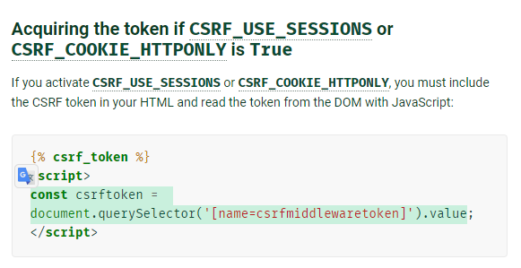
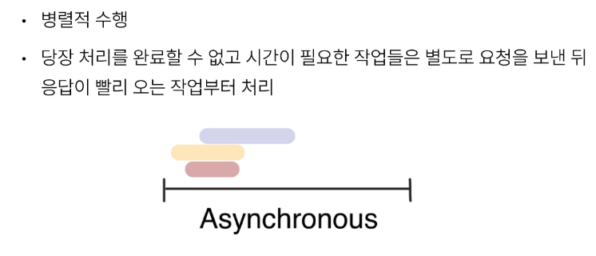
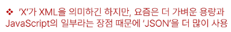

# 1030_1102 TIL

## 잡다한 것

- 자동완성 편하게 하려면 HTML로 변환하고 하기.

- HTML의 데이터를 JS로 보내고 싶다!! (data-*)
  
  - mdn html data attribute 검색하기 [데이터 속성 사용하기 - Web 개발 학습하기 | MDN](https://developer.mozilla.org/ko/docs/Learn/HTML/Howto/Use_data_attributes "https://developer.mozilla.org/ko/docs/Learn/HTML/Howto/Use_data_attributes")

- django ajax csrf
  
  - [How to use Django’s CSRF protection | Django documentation | Django](https://docs.djangoproject.com/en/4.2/howto/csrf/ "https://docs.djangoproject.com/en/4.2/howto/csrf/")
  
  
  

- innerHTML
  
  - [Element: innerHTML property - Web APIs | MDN](https://developer.mozilla.org/en-US/docs/Web/API/Element/innerHTML "https://developer.mozilla.org/en-US/docs/Web/API/Element/innerHTML")

---

## Asychronous JavaScript

### 비동기

#### 개요

- Sychronous(동기)
  
  - 프로그램의 실행 흐름이 순차적으로 진행
    
    - 하나의 작업이 완료된 후에 다음 작업이 실행되는 방식

- Sychronous 예시
  

- Asychronous(비동기)
  
  - 프로그램의 실행 흐름이 순차적이지 않으며, 작업이 완료되기를 기다리지 않고 다음 작업이 실행되는 방식
    
    - 작업의 완료 여부를 신경 쓰지 않고 **동시에 다른 작업들을 수행할 수 있음**

- Asychronous 특징
  

- Asychronous 예시
  
  
  
  
  
  - 이렇게 JS가 콜백함수를 사용하는 이유 중 하나 : 비동기적(병렬) 처리를 해서 동시에 많은 작업을 하기 위해서.
  - 이벤트 리스너도 콜백 함수를 인자로 받으므로 바로 처리가 안 되겠지?(비동기 처리)

### JavaScript와 비동기

- **Single Thread** 언어, JavaScript
  
  - Thread란?
    
    - 작업을 처리할 때 실제로 작업을 수행하는 주체로, multi-thread라면 수행할 수 있는 주체가 여러 개라는 의미

- JavaScript는 한번에 여러 일을 수행할 수 없다
  

- JavaScript Runtime
  

- 브라우저 환경에서의 JavaScript 비동기 처리 관련 요소
  

- 브라우저 환경에서의 JavaScript 비동기 처리 동작 방식
  

- 런타임의 시각적 표현
  
  - 런타임 : JS가 동작할 수 있는 환경
  - JS의 영역은 Call Stack 하나 뿐이다.
  - 나머지는 런타임의 영역(브라우저가 도와주는 영역)
  - 왜 콜백 함수라고 할까?? (참고)
    - Call Stack으로 돌아오므로
  
  
  
  
  
  
  
  
  
  
  
  
  
  
  
  
  
  
  - 스택에서 빠져나오면서 호출이 된다.
  
  - (바로 처리 불가한) 시간이 걸리는 것은 Web API로 보냄 (0초라고 해도 보냄)
  
  - 비동기로 처리되는 함수들은 따로 분류가 되어있다.
  
  - 3초 뒤에 출력을 보장 받지 못한다. 3초 뒤에 Task Queue(대기실)에 들어가기만 하고 Event Loop가 Call Stack과 Task Queue를 감시하다가 언제 대기실에 있는 것을 Call Stack에 넣을 수 있을 지 판단(넣을 수 있는 경우: Call Stack이 비었을 때.)
  
  - Call Stack이 비었을 때 Task Queue에 있는 요소들이 한꺼번에 들어가는 것이 아니라 차례차례로 들어간다.

- 비동기 처리 동작 요소
  
  

- 정리
  

### AJAX(오늘의 메인)

#### 개요

- AJAX(Asynchronous JavaScript + XML)
  
  - JavaScript의 비동기 구조와 XML 객체를 활용해 비동기적으로 서버와 통신하여 웹 페이지의 일부분만을 업데이트하는 웹 개발 기술
    

- XMLHttpRequest 객체
  
  - 서버와 상호작용할 때 사용하며 페이지의 새로고침 없이도 URL에서 데이터를 가져올 수 있음
    
    - 사용자의 작업을 방해하지 않고 페이지의 일부를 업데이트
      
      - 주로 AJAX 프로그래밍에 많이 사용됨

- 이벤트 핸들러는 비동기 프로그래밍의 한 형태
  
  
  - JS는 요청을 보내고 기다려 주지 않음(시간이 걸릴 수 있으므로)
  
  - XHR이라는 객체를 서버로 보낼 것인데 그 요청을 쉽게 도와주는 라이브러리가 있다.
    (바로 아래의 Axios)

#### Axios

- 외부 라이브러리임에도 불구하고 (비동기)요청을 보낼 때 반드시 사용되는 라이브러리

- Vue에서도 많이 이용됨

- Axios
  
  - JavaScript에서 사용되는 HTTP 클라이언트 라이브러리
    
    - 서버와의 HTTP 요청과 응답을 간편하게 처리할 수 있도록 도와주는 도구
    - ~~파이썬에서의 requests와 같은 역할~~

- Axios 설치
  

- Axios 구조
  
  
  - axios : 객체.

- 고양이 사진 가져오기 실습
  
  
  
  
  
  - 파이썬에서는 (위 그림의) 아래와 같이 쓰는 데 이 부분이 (위 그림의) 위와 같은 것이다. 구조만 다를 뿐.
    - ~~파이썬에서의 requests와 같은 역할~~
  
  
  
  - 여기서의 응답 객체는 then 콜백 함수의 인자로 들어가게 된다.
  
  

- 고양이 사진 가져오기 실습 심화
  
  
  
  
  

- 정리
  

### Callback과 Promise

#### 비동기 콜백

- 비동기 처리의 단점
  

- 비동기 콜백
  
  
  - 비동기 작업에 순서를 집어넣어서 순차적으로 동작하도록 함
    
    - 콜백이 호출하고 또 호출된 콜백이 다른 콜백을 호출하고....

- 비동기 콜백의 한계
  

- 콜백 지옥(Callback Hell)
  

- 콜백 함수 정리
  

#### 프로미스

- Promise
  
  - JavaScript에서 비동기 작업의 결과를 나타내는 객체
    
    - 비동기 작업이 완료되었을 때 결과 값을 반환하거나, 실패 시 에러를 처리할 수 있는 기능을 제공

- Promise
  

- 비동기 콜백 vs Promise
  
  
  - promise(chaining이 핵심)
    
    - 첫번째 일이 끝난 결과가 then의 콜백함수 인자로 들어오고 이게 끝나고 리턴을 하면 그 리턴 값이 다음 then의 콜백함수 인자로 들어감
    
    - 즉 then은 앞의 then이 실행이 끝났을 때 실행이 된다. (chaning)
    
    - 주의사항: 이어서 가려면은 앞쪽에 리턴 값이 필요.
      
      - 왜냐하면, 다음 이어지는 then이 그 앞 쪽의 리턴을 받으므로
      
      - ~~맨 앞은 일이 끝난 결과가 then의 콜백함수 인자로...~~

- Axios
  
  - JavaScript에서 사용되는 **Promise 기반** HTTP 클라이언트 라이브러리

- then & catch
  
  

- then 메서드 chaining의 목적
  

- then 메서드 chaining의 장점
  
  
  - 유연성(추가설명)
    
    - then을 이어갈 수 있다는 것은 잘게 쪼갤 수도 있다는 것을 의미.
    
    - 더 세부적으로 쪼개고 그 then이 하는 역할을 하나로 제한을 두면, .catch가 에러를 잡아냈을 때 더 정확한 에러를 잡아낼 수 있다.

- then 메서드 chaning 예시
  
  

- Promise가 보장하는 것(vs 비동기 콜백)
  

### 참고

## Ajax with Django

### Ajax 와 서버

#### 개요

- (지난시간) Ajax (Asynchronous JavaScript + XML)
  
  - JavaScript의 비동기 구조와 XML 객체를 활용해 비동기적으로 서버와 통신하여 웹 페이지의 일부분만을 업데이트하는 웹 개발 기술

- Ajax를 활용한 클라이언트 서버 간 동작
  
  
  - 여기서 XML이 아닌 XHR임 (오타...)

### Ajax with follow

- 사전 준비
  

- Ajax 적용
  
  
  
  
  
  
  
  
  - data-* 사용 예시
    
    
    - 주의 사항
      
      
      - HTML에서 위와 같이 작성을 했는데
      
      
      
      - 실제로 자바스크립트가 선택한 결과의 키 이름을 보면 다름을 알 수 있다.
  
  
  
  
  
  
  
  
  
  
  
  
  

### Ajax with likes

- Ajax 좋아요 적용 시 유의사항
  

- Ajax 적용
  
  
  

### 참고

