# 0712 부터 0721까지

## 0714까지(start camp)

### 잡다한 것

- 자리 이동시, 혹은 노트북이나 다른 기기를 사용하게 될 시 필요로 하는 것들
  
  - 싸피 공용문서
    
    https://abit.ly/pb-document
  
  - 마크다운 다운 받기(이미지 설정 필수)
  
  - 마크다운 가이드
    
    https://www.markdownguide.org/basic-syntax/
  
  - Visual studio code(자동저장 설정하기)
    
    - file -> Auto save
  
  - git 설정하기
  
  - Python Tutor
    
    - [Python Tutor: Learn Python, JavaScript, C, C++, and Java programming by visualizing code](https://pythontutor.com/)
  
  - Json 가독성 올리기
    
    - 크롬 확장-> JSON Viewer
  
  - mattermost
    
    - 서버이름: meetingssafy
    
    - 서버url : https://meeting.ssafy.com
    
    - 비번 S10   

- git
  
  - 자리 옮길 때 자격증명 관리자에 들어가서 내 정보 제거하고 가기!!!
  
  - commit 작성자(author)설정 (global로 설정 후 앞으로 재입력하지 않음)
    
    `git config --global user.email "메일주소"`
    `git config --global user.name "유저네임"`
    `git config --global -l`: git global 설정 정보 보기 
  
  - 로컬 저장소에 원격 저장소 주소 추가(참고)
    `git remote add origin remote_repo_url`
  
  - gitignore

- 마크다운 (이미지 저장위치 설정)
  

- Vs Code
  
  - `Ctrl+L`: 지우기
  
  - `ls` 치면 그 폴더안에 어떤 것이 있는 지 알려줌
  
  - `ls -al`: 좀 더 자세히(숨겨진 것들)
  
  - `cd ..` : 상위 디렉토리로 이동
  
  - `Ctrl+c`: 잘못 썻을 때 누르기
  
  - `cd ~`: 맨 앞 경로로 이동
  
  - `cd -`: 아까 있었던 경로로 이동
  
  - `git commit` 만 쳤을 때(실수로)
    
    -   `i(insert)` 눌러서 내용 입력하고(내용 입력하는 곳은 엔터 눌러서 ~ 있는 부분에다가 기록한다), esc 눌러서 나온 뒤에 `:wq`를 눌러서 저장하거나 `:q!` 눌러서 저장 안하고 나오기

---

## 0715부터 (파이썬 part)

### 잡다한 것

- 파이썬은 오른쪽 값에 따라 타입이 저절로 바뀜(좋은 것 같은데 안 좋을 수도...)
  
  - 의도치 않은 타입이 나올 수도 있고, 계산도 이상해질 수 있다.

- `sum`같은 것으로 변수 할당하지 말기
  
  - 이걸 쓰면 LEGB 규칙에 의해 `sum()`함수가 고장나 버림

- Docstring (`""" """`) :함수 정의에서 바디 앞부분에서 함수에 대한 설명을 할 때 주로 이용되는 주석

- 에러를 보고 분석하는 눈을 키워라

- `Alt + Shift + 화살표 키` : 복사하고 싶은 것 드래그하고 치면 복사 됨

- 소수점 둘째자리 연산(float)연산이 많다면 100을 곱해서 관련 연산을 모두 한 뒤에 나중에 100을 나누어주면 연산 속도를 조금 더 올려줄 수 있다.

- 함수는 stack에 올려야 해서 연산 속도가 떨어지게 만드므로 함수 만들 때는 최소한으로 호출되도록 만들어라

- 파이썬에는 문자는 없다! 문자열만 존재 할 뿐..

- 소수점 표현
  

- 튜플은 괄호 없어도 됨`1,2` , 튜플 표기법 중에서`(1,)`이렇게 `,`안 찍어주면 파이썬은int타입으로 생각함

- `Alt + 방향키`: 위치 변경하고 싶은 것 올리거나 내룰 수 있음

- 파이썬 documentation: 아래에서 자습서와 라이브러리 레퍼런스를 많이 사용하게 될 것
  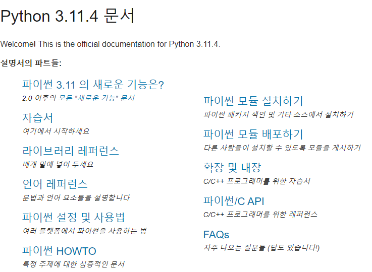

- `zip()` 함수: 전치 행렬에 GOOD

- 객체 및으로 들어가는 함수를 메소드라고 부름
  ex) `math.sqrt()`에서 `sqrt()`가 메소드

- 프로그래밍은 우리 프로그램이 어떻게 그 목적을 명확하게 전달하는 지에 대한 것

- "작은 효율성에 대해서는, 말하자면 97% 정도에 대해서는, 잊어버려라. 섣부른 최적화는 모든 악의 근원이다." - 도널드 knuth

- sum 함수를 사용하여 2차원 배열을 1차원 배열로 바꿀 수 있다.(문서 참고하기)

- `Ctrl`키 누르고 함수 위에 마우스를 대면 함수의 정의를 볼 수 있다. 

- 조코딩: 파일 읽고 쓰기 참고하기 

- `upper()`: 대문자
  `lower()`: 소문자 

- 문자열로 변환하고 싶은 것 마우스로 더블 클릭해서 블럭처리 하고 `'` 누르면 바뀜

- 함수 관련(참고 할만한 것)
  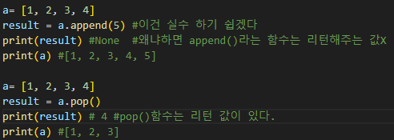

- 값이 없으면 False임을 활용한 예
  

### Fundamentals(기본적인)

- 문장 ⊃ 표현식

- 변수란?
  
  - 값을 참조하는 이름
  
  - 변수는 그 변수가 참조하는 객체의 메모리 주소를 가짐

- 객체란?
  
  - 타입을 갖는 메모리 주소 내 값
  
  - 값이 들어있는 상자

- 할당문
  
  - `variable = expression`
    
    1. 할당 연산자(=) 오른쪽에 있는 표현식을 평가해서 값(메모리 주소)을 생성
    
    2. 값의 메모리 주소를 `=` 왼쪽에 있는 변수에 저장
  
  - 존재하지 않는 변수라면
    
    - 새 변수를 생성
  
  - 기존에 존재했던 변수라면
    
    - 기존 변수를 재사용해서 변수에 들어 있는 메모리 주소를 변경

- 변수에 재할당
  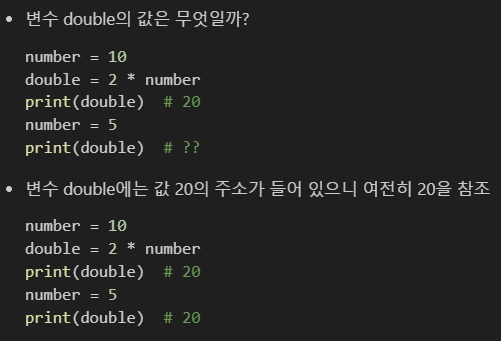

- 가독성 올리기(Style Guide)
  
  - [PEP 8 – Style Guide for Python Code | peps.python.org](https://peps.python.org/pep-0008/)
  
  - `is_` : True이냐 False이냐를 암시하는 변수
  
  - `number, numbers`: 단수, 복수도 구별해주면 좋다
  
  - `SECONDS, MINUTE, HOURS`: 당연시 되는 것, 상수로 암시
  
  - `result = 2 + 3 * (4 - 5) / 2`: 연산자도 센스있게 이렇게 한칸씩 띄어주기
  
  - 함수 정의나 클래스 정의 등의 블록 사이에는 빈 줄을 추가 

---

### Data Types

- 데이터 타입
  
  - Numeric Types
    
    - int (정수), float (실수), complex (복소수)
  
  - Sequence Types (값이 순서대로 저장, **정렬은 X**) (인덱싱O, 슬라이싱O,길이(`len`을 통해) O, 반복(반복문들 사용해 저장된 값들을 반복적으로 처리 가능))
    
    - list(변경 가능), tuple(**변경 불가**), range(**변경 불가**)
  
  - Text Sequence Type(순서는 있지만 **변경 불가**)
    
    - str (문자열)
  
  - Set Types (Non-sequence Types)(**순서와 중복이 없는** **변경 가능**한 자료형)(`|`: 합집합, `&`: 교집합, `-`: 차집합)
    
    - set
  
  - Mapping Types (Non-sequence Types)(key - value쌍으로 이루어진 **순서와 중복이 없는** 변경 가능한 자료형)(key는 **변경 불가능한 자료형**만 사용가능) (value는 모든 자료형 사용가능)
    
    - dict(없는 것이면 추가하고 있는 것이면 변경을 해줌)
  
  - 기타
    
    - None(값이 없음을 표현), Boolean, Functions

- 지수표현
  
  - `314e-2` #3.14

- 실수 연산시 주의사항
  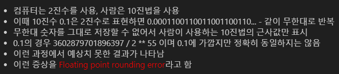
  
  - round 함수 사용시 이런 오류가 발생할 확률 높음(앞의 값이 홀수면 올려주고, 짝수면 안 올려주는 것으로 추측한다고 함)
    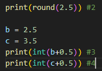
  - 해결책으로는 위와 같이 해주면 됨

- 불변과 가변의 차이
  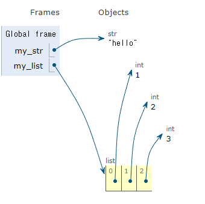
  문자열(불변)은 통째로 들어가고 리스트(가변)은 따로 따로 들어가 있는 것을 자료구조를 통해 알 수 있다.

- 불변 데이터의 주의사항
  

- 가변 데이터의 주의사항
  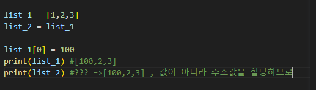

---

### Type Conversion

- 암시적 형변환: 파이썬이 자동으로 형변환을 하는 것
  
  - Boolean -> 정수 -> 실수 순으로 확장(더 큰 쪽으로 이동)
  
  - Boolean과 Numeric Type에서만 가능
  
  - 0을 제외한 모든 숫자는 True (음수도 포함)
  
  - ex
    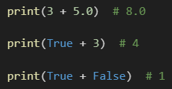

- 명시적 형변환: 개발자가 직접 형변환을 하는 것(암시적 형변환 아닌 것 모두 해당)
  
  - cf) `print(int('3.5')) # 이건 오류 뜸`, `print(float('3.5')) #3.5 (이건 가능)`
  - cf2) `int(3.5) #3 (절삭됨)`

- 컬렉션 간 형변환 정리
  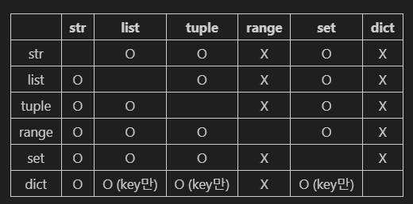

---

### Operator

- 비교 연산자
  
  - is 비교 연산자
    
    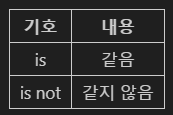
    
    - 메모리 내에서 같은 객체를 참고하는 지 확인
    
    - `==`는 동등성, `is`는 식별성
    
    - `==`은 값(데이터)을 비교하는 것이지만 `is`는 레퍼런스(주소)를 비교
    
    - ex)
      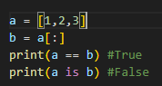
      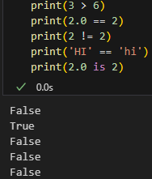

- 단축 평가
  
  - 끝까지 갈 필요가 없는 것이면 그 전에 끝냄(마지막까지 점검한 값이 답으로 나옴)
  
  - 단축 평가 동작
    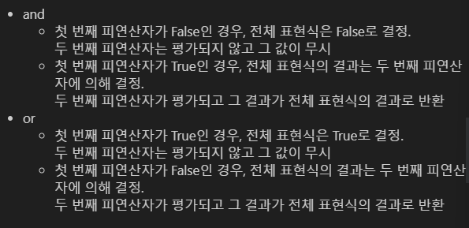
  
  - ex)
    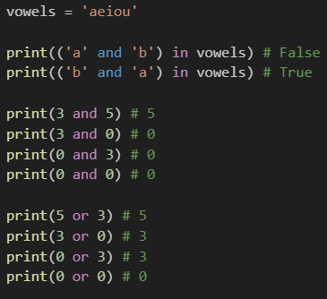
    
    위에것 2개 풀이 조금: 
    괄호 안에것 먼저 계산하면 `'a'`는 True이니깐 `True and 'b'`가 되어 `'b'`로 나와 `'b' in vowels`가 되므로 전체 답은 False

- 멤버십 연산자
  
  - 특정 값이 시퀀스나 다른 컬렉션에 속하는지 여부를 확인
  
  - `in`, `not in`

- 시퀀스형 연산자
  
  - `+`와 `*`는 시퀀스(순서 O) 간 연산에서 산술 연산자일때와 다른 역할을 가짐
  
  - ex)
    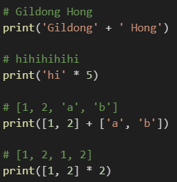

- 연산자 우선순위
  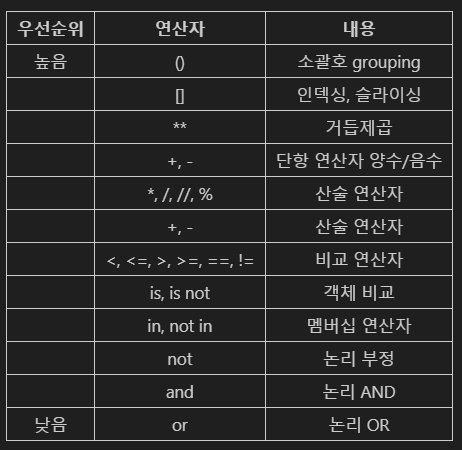
  
  `**`(지수)가 높은 위치에 있음을 인지할 것!
  ex) `-2**2 #-4`

---

### Functions

- 함수를 사용하는 이유
  
  - 재사용성이 높아지고, 코드의 가독성과 유지보수성 향상

- 내장 함수(Built - in function)
  
  - 파이썬이 기본적으로 제공하는 함수(별도의 import 불필요)

- 함수 호출이란?
  함수를 실행하기 위해 함수의 이름을 사용하여 해당 함수의 코드 블록을 실행하는 것

- `return`이 없으면 `None`이 나온다.

- `return`문을 만나는 순간 결괏값을 돌려준 다음 함수를 빠져나간다.

- `return`: break 문과 비슷한 느낌
  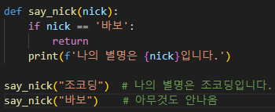

- 함수의 리턴 값은 언제나 하나이다. (리턴 값을 튜플 형태로 하고 언패킹으로 나눠서 받는 것은 가능)
  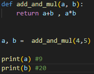

- 매개변수와 인자
  ex)
  

- 인자의 종류
  
  - 위치인자
    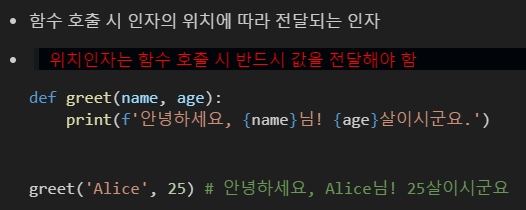
  
  - 기본 인자 값
    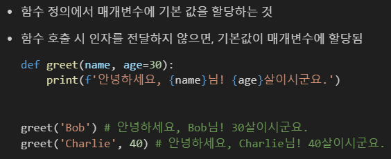
    
    초기화 하고 싶은 매개변수는 항상 뒤쪽에 놓아야한다.
  
  - 키워드 인자
    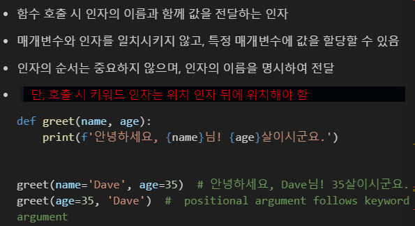
    
    cf) 키워드 인자가 위치 인자보다 먼저 써지면 오류를 발생
  
  - 임의의 인자 목록
    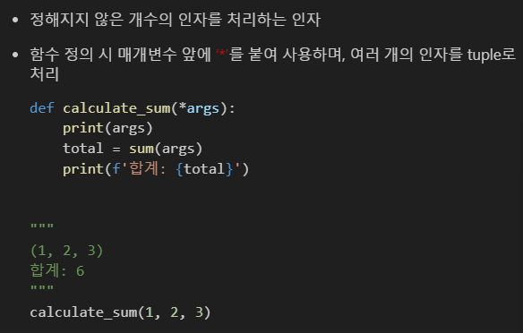
  
  - 임의의 키워드 인자 목록
    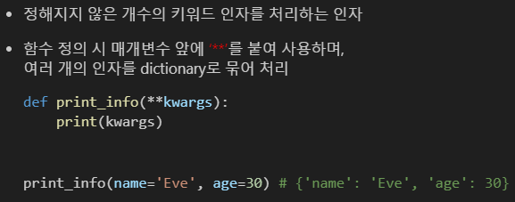
  
  - 함수 인자 권장 작성 순서
    
  
  - cf) print()함수: ​`print(*objects, sep=' ', end='\n', file=sys.stdout, flush=False)`
    -> 가변인자 , 기본인자

- 함수와 Scope
  
  - 변수 수명주기
    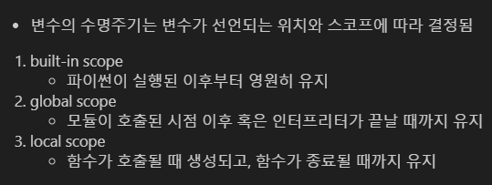
    이 중에서 **local scope** 기억해두기!
  
  - 이름 검색 규칙
    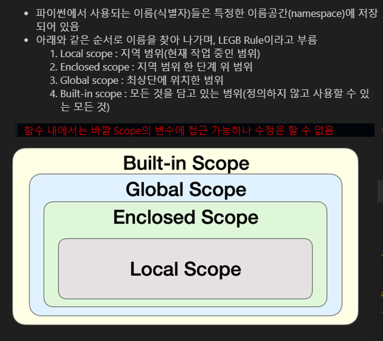
    
    - 수정 할려면은 아래에서 배울 `global`이용
    
    - 변수가 없으면 윗 단계로 올라가서 찾음, 반대는 불가
    
    - cf) 출력만 잘 되면 상관 없다고 함수 밖에다가 변수를 정의하고 쓰진 말자(좋은 코딩방식 아님)
    
    - LEGB Rule 예시
      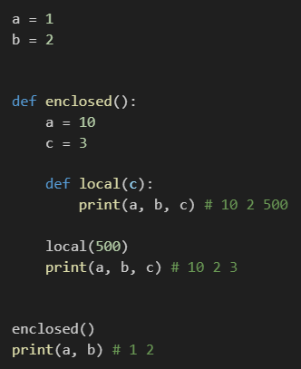
      
      **줄 라인에 따라 scope 생각하기!!!**
  
  - 'global'키워드
    
    - 변수의 스코프를 전역 범위로 지정하기 위해 사용
    
    - 일반적으로 함수 내에서 전역 변수를 수정하려는 경우에 사용
    
    - 주의사항
      
      - global 키워드 선언 전에 접근 시 오류 발생
      
      - 매개변수에 global 사용 불가
    
    - global 키워드는 가급적 사용하지 않는 것을 권장
      
      - 함수로 값을 바꾸고자 한다면 항상 인자로 넘기고 함수의 반환 값을 사용하는 것을 권장
    
    - 추가) 
      
      - 참조형(가변)은 global을 쓰지 않아도 함수 내에서 바꿀 수 있다(왜냐하면 주소로 가서 값을 바꿔버리기 때문)(그래도 헷갈림 방지를 위해 `global` 써 줘도 됨)
      
      - 값형(불변)은 값 자체를 복사하므로 함수 내에서 수정할려면 `global`사용 필요
      
      - 함수 내에서 변수 수정을 불가하더라도 읽기는 가능
        
        - **이걸 활용해서 함수 정의를 할 때 변경하고픈 변수를 return 시키면 수정된 변수를 받을 수 있다.** (일회성이 아니게 됨) 단, 여기서 또 조심해야 될 것이   return으로 변수 값을 수정하더라도 받아놓지 않고 바로 print를 하면 적용 안되어 있음
          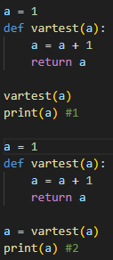

- 재귀 함수(일단 참고로)
  
  - 재귀 함수 특징
    
    - 특정 알고리즘 식을 표현할 때 변수의 사용이 줄어들며, 코드의 가독성이 높아짐
    
    - 1개 이상의 base case(종료되는 상황)가 존재하고, 수렴하도록 작성
  
  - 재귀 함수 사용시 주의사항
    
    - 종료 조건을 명확히 하고 반복되는 호출이 종료 조건을 향하도록 만들어야 한다
      
      - 이렇게 하지 않으면 무한 루프에 빠질 것임

- 유용한 함수(내장 함수 편)
  
  - map(function, iterable) 
    iterable: 반복이 가능한 객체
    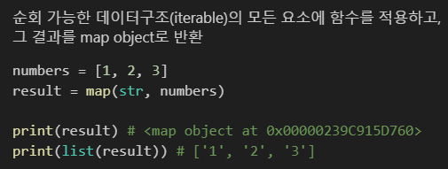
  
  - zip(*iterables)
    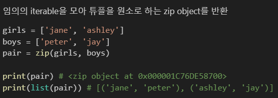\
    
    ex) 내가 볼 때 이거 잘 쓰면 개꿀일 듯
    

- lambda 함수
  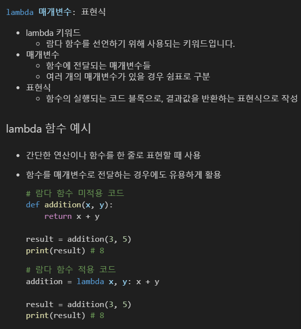
  이렇게도 만들 수 있음(아래)
  
  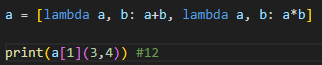
  
  일회성 느낌(한 번만 쓰고 안 쓸 함수일때 주로 이용)
  남용하진 말 것(함수 정의해서 하는 게 좀 더 눈에 잘 들어오므로)

---

### Packing & Unpacking

- packing 패킹
  
  - 여러 개의 값을 하나의 변수에 묶어서 담는 것
  
  - ex) 변수에 담긴 값들은 튜플 형태로 묶임
    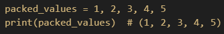
  
  - `*`을 활용한 패킹
    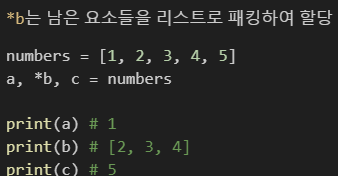

- Unpacking 언패킹
  
  - 패킹된 변수의 값을 개별적인 변수로 분리하여 할당하는 것
  
  - ex) 튜플이나 리스트 등의 객체의 요소들을 개별 변수에 할당
    
  
  - `*`을 활용한 언패킹
    `*`는 리스트의 요소를 언패킹
    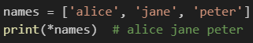
  
  - `**`을 활용한 언패킹(연구 필요)
    `**`는 딕셔너리의 키-값 쌍을 함수의 키워드 인자로 언패킹
    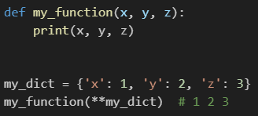
  
  - 예시(369)
    `k, n ,m = map(int, input().split())`

--- 

### Modules

- 모듈이란? 
  한 파일로 묶인 변수와 함수의 모음, 특정한 기능을 하는 코드가 작성된 파이썬 파일(.py)

- 모듈 활용
  
  - 모듈 가져오기(import)
  
  - 내장 함수 help를 사용해 모류에 무엇이 들어있는지 확인 가능
    ex) `help(math)`
  
  - 모듈을 가져오는 다른 방법
    ex) `from math import pi, sqrt`
  
  - 모듈 주의할 점
    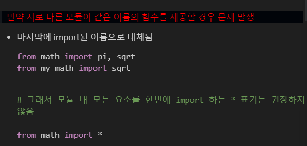

- 사용자 정의 모듈
  
  - 패키지 Package: 관련된 모듈들을 하나의 디렉토리에 모아 놓은 것 (참고)
    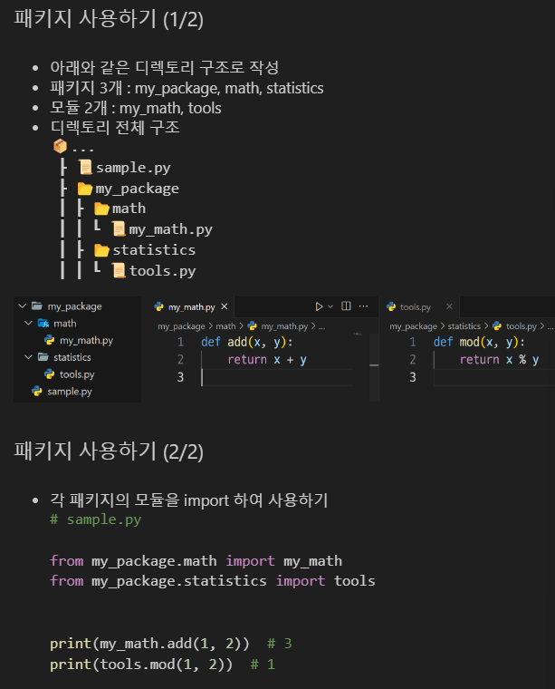
  
  - 패키지 관련(참고)
    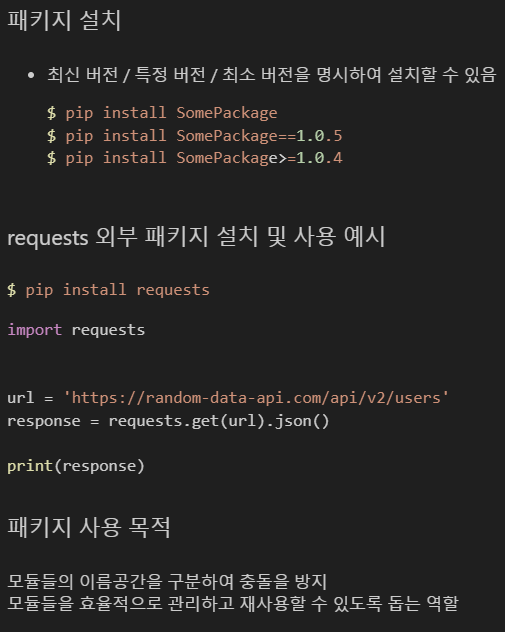

---

### Control of flow

- 복수 조건문
  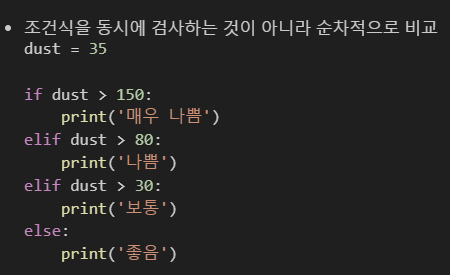
  
  - **순차적**임을 기억!
  
  - 파이썬은 dust 가 150이하인 경우만 elif에서 평가
    즉, dust <= 150 and dust > 80이랑 같음
  
  - 다른 언어는 이렇게 하지 X (조건 상세화 필요) 
  
  - 만약에 해당하는 것이 여러 개라면 그중 젤 위의 것만 실행 된다.

- 반복문
  
  - for
    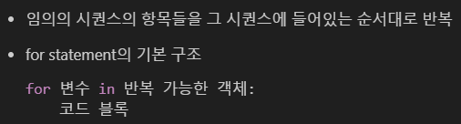
    
    - iterable: 반복 가능한 객체
      
      - **반복문에서 순회할 수 있는 객체(시퀀스 객체 뿐만 아니라 dict, set 등도 포함)**
    
    - 문자열 순회(까먹기 쉬움)
      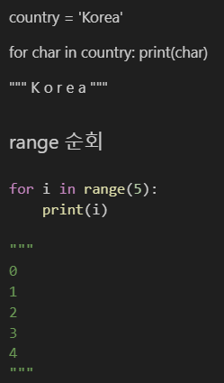
    
    - 인덱스로 리스트 순회 (참고)
      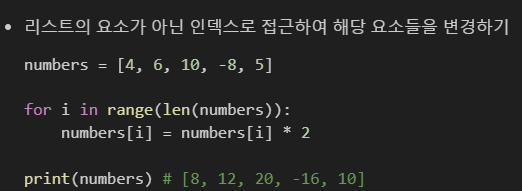
    
    - 중첩된 반복문
      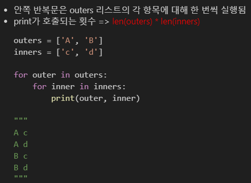
    
    - 중첩 리스트 순회
      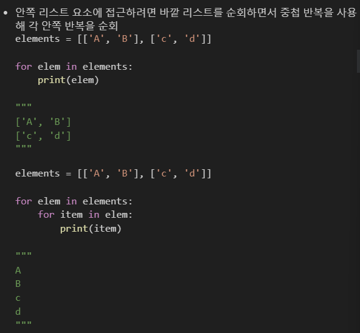
  
  - while문 : 조건식이 **거짓(False)** 가 될 때 까지 반복
    
    - 주의사항 : **종료 조건** 반드시 기입하기
  
  - 적절한 반복문 활용하기
    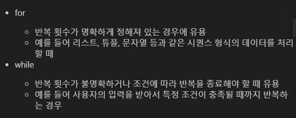
  
  - 반복 제어
    
    - `break`: 반복을 즉시 중지 , `continue`: 다음 반복으로 건너뜀(현재 반복문의 남은 코드를 건너뛰고 다음 반복으로 넘어감)
    
    - 주의사항
      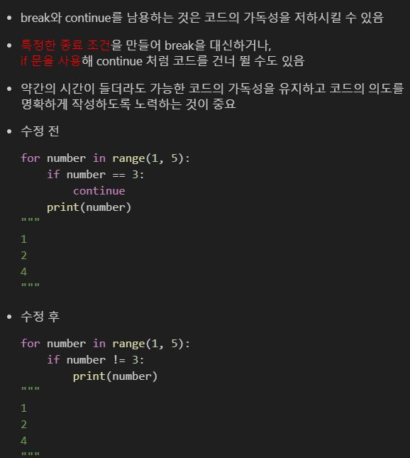

- List Comprehension
  
  - 구조
    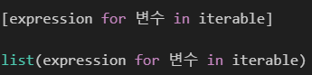
    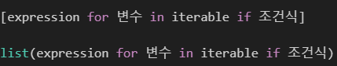
  
  - 주의사항
    
    - 가독성이 별로 좋지 않아서 남용 하지 말것 (그래도 쓰는 사람이 있어서 어떤 것인지는 알고 있도록)
  
  - cf) 
    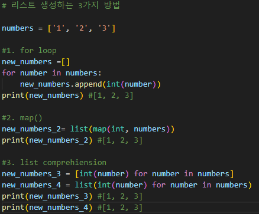

- pass
  
  - 사용처
    
    1. 코드 작성 중 미완성 부분
       - 구현해야 할 부분이 나중에 추가될 수 있고, 코드를 컴파일하는 동안 오류가 발생하지 않음
    2. 조건문에서 아무런 동작을 수행하지 않아야 할 때
    3. 무한 루프에서 조건이 충족되지 않을 때 pass를 사용하여 루프를 계속 진행하는 방법

- enumerate(iterable, start = 0) (참고)
  
  - iterable 객체의 각 요소에 대해 인덱스와 함께 반환하는 내장함수
  
  - ex) 
    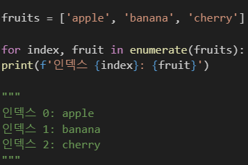

---
