# 0724 부터 0727까지

## 잡다한 것

- 파괴, 비파괴 함수 찾아보기!
  
  - 원본이 바뀌는가 바뀌지 않는가에 따라서 구분이 됨
  
  - 원본이 바뀌면 파괴, 안 바뀌면 비파괴
    
    - ex)
      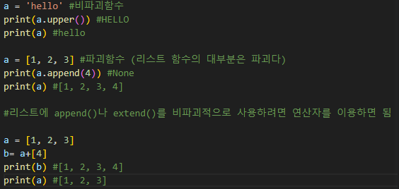
  
  - sort 메서드와 sorted 함수의 차이
    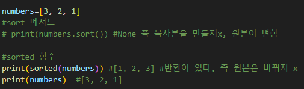
    

- 리스트 슬라이싱은 오류가 뜨면 빈 리스트가 나온다.

- 클래스는 붕어빵 틀, 객체는 붕어빵

- 1Byte: 영문 한문자를 처리하는 데 필요로 하는 양(한글은 2Byte)

- 연결 리스트에 대해 알아보기(면접 때 자주 나온다는데, 파이썬은 없음)

- 불변인 str을 리스트를 활용해서 값 바꿔주기
  

- 참고
  
  int에는 join이 없으니깐, str의 내장함수인 join을 이용하기 위해 map함수를 통하여 str로 변환한 뒤에 합쳐준 듯

- count 함수 직접 만들어 보기
  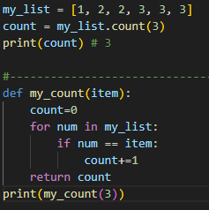

- 파이썬에서는 a와 b 값을 서로 바꾸는데 새로운 변수 불필요
  
  - `a, b = b, a` 해주면 됨

- 딕셔너리 key는 왜 value와 달리 모든 것이 사용 불가능하고 제한되어 있을까?
  해시 가능성이 없기 때문이다.

- 배열이나 리스트(가변) 같은 것들은 참조해오는 이유는(값 말고 주소값 가져옴) 값(용량)이 크기 때문에 똑깥이 값 복제하기엔 부담스러워이다.

- 클래스 변수는 한번만 초기화 됨(~~공용이므로~~)

- 오버 로딩과 오버 라이딩
  
  - 오버 로딩: 
    
    - 동일 클래스 내에서, 매개변수의 개수 또는 자료형이 다른 동명의 메서드를 정의하는 것
    
    - 즉, 클래스 내에서 같은 이름의 메서드를 여러 개 선언하는 것을 의미
    
    - 오버 로딩을 하게 되면 동일 클래스의 동일한 메서드에서 다양한 매개변수를 받아 처리할 수 있다.
  
  - 오버 라이딩:
    
    - 부모 클래스의 메서드를 , 자식 클래스에서 재정의 하여 사용하는 것을 의미
    - 언제까지 거지로 살래? 내가 보완해서 쓸꺼야!!

- 참고
  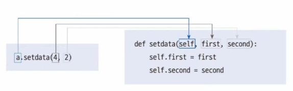

- `Ctrl + D` : 동일한 변수명 동시에 바꿀 때 유용

- 조코딩: `if __name__ == "__main__":` 이거 설명 있음(리얼 참고용으로) 

- 불러와서 쓰는데 이름 다 쓰기 귀찮다면?
  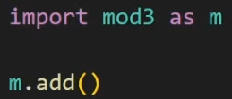

--- 

## 파이썬 part

### Data Structure

#### 메서드

- 객체에 속한 함수

- 객체의 상태를 조작하거나 동작을 수행

- 특징
  
  - 메서드는 클래스(class) 내부에 정의되는 함수
  
  - 클래스는 파이썬에서 '타입을 표현하는 방법'

- 즉, 메서드는 어딘가(클래스)에 속해 있는 함수이며, 각 데이터 타입별로 다양한 기능을 가진 메서드가 존재

- 호출 방법
  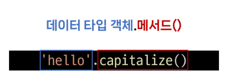

#### 시퀀스 데이터 구조

- 문자열
  
  - 문자열 조회/탐색 및 검증 메서드
    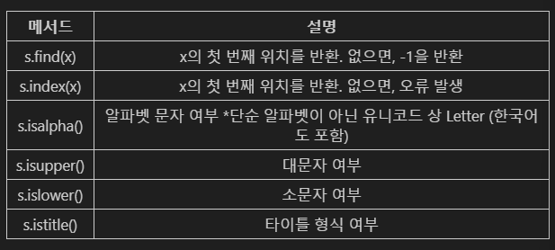
    
    - `.find(x)`
      
      - x의 **첫 번째 위치**를 반환, **없으면, -1을 반환**(왼쪽에서 부터임)(**오류 발생 x**)
      
      - 유의할 점: -1을 맨 뒤로 착각 할 수 있음
    
    - `.index(x)`
      
      - x의 **첫 번째 위치**를 반환, **없으면, 오류 발생**
    
    - `.isupper()/ .islower()`
      
      - 문자열이 **모두** 대문자/소문자로 이루어져 있는지 확인
    
    - `.isalpha()`
      
      - 문자열이 알파벳으로**만** 이루어져 있는지 확인
      
      - 한글도 가능
    
    - `.istitle()`
      
      - `.title()`: 문자열 내 띄어쓰기 기준으로 각 단어의 첫 글자는 대문자, 나머지는 소문자로 변환하는 것
      
      - 위의 방식을 만족하면 True, 불만족하면 False
  
  - 문자열 조작 메서드(새 문자열 반환)(비파괴라서 리턴 받아서 써야 함)
    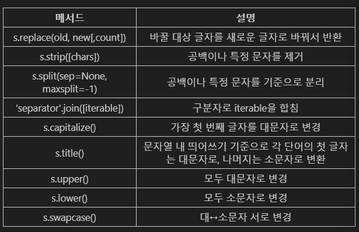
    
    - `.replace(old, new[,count])`(여기서 [  ]내에 있는 것은 필수 인자가 아닌 선택인자를 의미)
      
      - 바꿀 대상 글자를 새로운 글자로 바꿔서 반환
        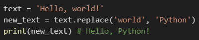
    
    - `.strip([chars])`
      
      - 문자열의 시작과 끝에 있는 공백 혹은 지정한 문자를 제거
        
        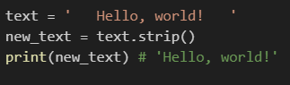
        
        공백 있다고 오류 뜨는지 테스트하는 변태들이 있다는 소문이..
    
    - `.split(sep = None, maxsplit= -1)`(중요!!!)
      
      - 지정한 문자를 구분자로 문자열을 문자열의 리스트로 반환
        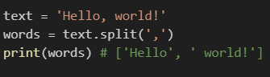
    
    - `'separator'.join([iterable])`(중요!!!)
      
      - **iterable 요소들**을 원래의 문자열을 구분자로 이용하여 **하나의 문자열로 연결**
        
        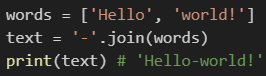
    
    - 기타
      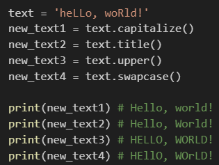
    
    - 메서드 이어서 사용가능

- 리스트
  
  - 리스트 값 추가 및 삭제 메서드
    
    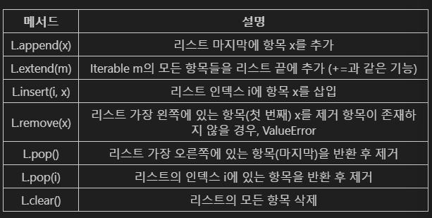
    
    - `.append(x)`(중요!!!)
      
      - 리스트 마지막에 항목 x를 추가
        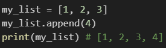
    
    - `.extend(iterable)`(중요!!!)
      
      - `+=`과 같은 기능
      
      - 리스트에 다른 **반복 가능한 객체**의 모든 항목을 추가
      
      - 반복 가능한 객체이므로 int와 같은 것은 안됨,
        그래서 리스트로 묶어주고 더하면 가능함
        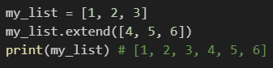
    
    - `.append(x)`와 `.extend(iterable)`의 차이점
      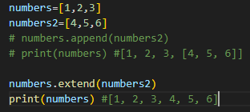
      
      extend 메소드는 리스트 속을 풀어서 넣는 느낌이다.
    
    - `.insert(i, x)`
      
      - 리스트의 지정한 인덱스 `i` 위치에 항목 `x`를 삽입
        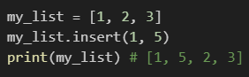
      
      - 속도 저하 있음
    
    - `.remove(x)`
      
      - 리스트에서 첫 번째로 일치하는 항목을 제거 (이것도 왼쪽부터)
        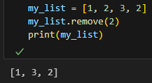
    
    - .pop(i)(중요!!!)
      
      - 리스트에서 지정한 인덱스의 항목을 제거하고 **반환**
      
      - **작성하지 않을 경우** **마지막 항목**을 제거
        
        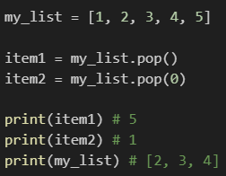
      
      - pop을 이용해서 삭제 시킨것을 반환값으로 받아서 써 먹을 수 있음
      
      - 이것도 어정쩡한 위치 것 빼면 느려짐, 맨 뒤는 빠름, 맨 앞은 느리다고 함
    
    - `.clear()`
      
      - 리스트의 모든 항목을 삭제
        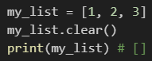
  
  - 리스트 탐색 및 정렬 메서드
    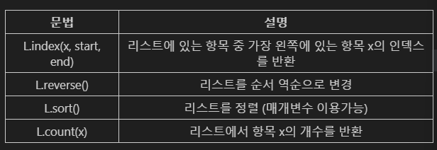
    
    - `index(x)`
      
      - 리스트에서 첫 번째로 일치하는 항목의 인덱스를 반환
      
      - 이것도 x값이 없으면 오류 발생
        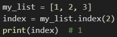
    
    - `.count(x)`(이것도 은근 쓰일지도?)
      
      - 리스트에서 항목 x가 등장하는 횟수를 반환
        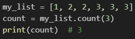
    
    - `.sort()`(기본 인자로 `reverse=Fales`로 되어있음)
      
      - 원본 리스트를 오름차순으로 정렬
        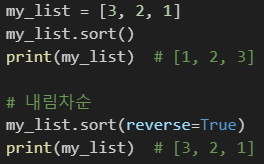
      
      - 기준점 선정해주기(중요!)
        
    
    - `.reverse()`
      
      - 리스트의 순서를 역순으로 변경(**정렬 x**)
        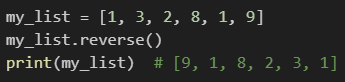

#### 비 시퀀스 데이터 구조

- 세트 set 
  
  - 세트 메서드 
    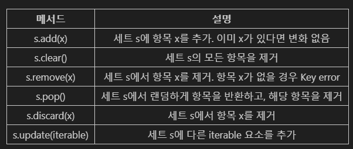
    
    - `.add(x)`
      
      - 세트에 x를 추가
        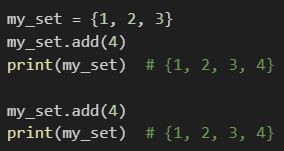
    
    - `.clear()`
      
      - 세트의 모든 항목을 제거
        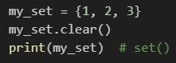
        출력 값이 `set()`으로 나오는 이유는 딕셔너리와 혼동 방지를 위해서다.
    
    - `.remove(x)`
      
      - 세트에서 항목 x를 제거 (**없으면 에러 발생**)
        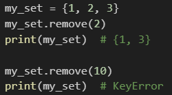
    
    - `.discard()`
      
      - 세트 s에서 항목 `x`를 제거, remove와 달리 **에러 없음**
        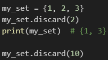
    
    - `.pop()`
      
      - 세트에서 **임의의 요소**를 제거하고 **반환**
      
      - 실행할 때마다 다른 요소를 얻는다는 의미에서의 무작위가 아니라 임의라는 의미에서의 무작위
        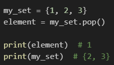
      
      - 해시 관련
        
        - 보통 탐색 시간 절약을 위해 해시 테이블 순서 순으로 나옴
        
        - 정수는 정수 값 자체가 해시값이므로 다시 `pop()`를 써도 똑같은 값을 얻을 수 있음
        
        - 문자열은 매번 실행될 때마다 다른 해시 값을 얻게 되어(왜냐하면 문자열은 가변적은 길이를 가지고 있으므로) `pop()`를 쓸 때마다 다른 값이 나옴
        
        - 정수는 해시 테이블의 어떤 위치에 들어갈 지 거의 정해지는 반면 문자열은 전혀 알 수 없음
    
    - `.update(iterable)`
      
      - ~~리스트 에서의`.extend` 와 유사~~
      
      - 세트에 다른 **iterable 요소**를 추가
        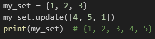
  
  - 세트의 집합 메서드
    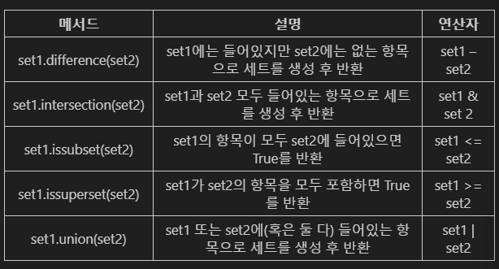

- 딕셔너리 (많이 쓰일 것임)
  
  - 딕셔너리 메서드
    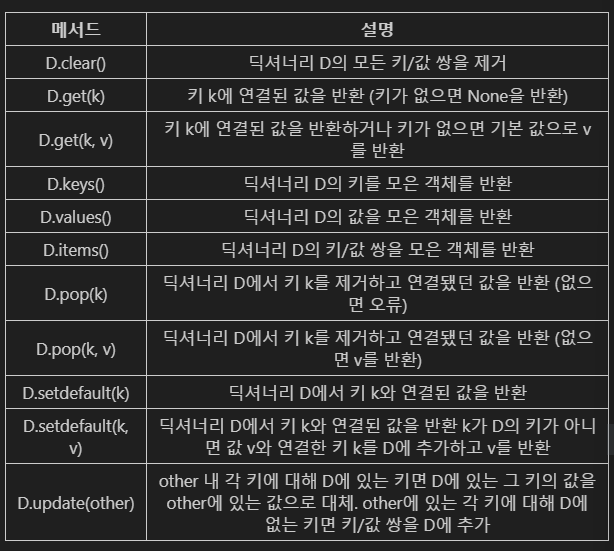
    
    - `.clear()`
      
      - 딕셔너리 D의 모든 키/값 쌍을 제거
        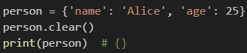
    
    - `.get(key[,default])`
      
      - 키 연결된 값을 반환하거나 **키가 없으면 None 혹은 기본 값을 반환**(오류 발생x)
        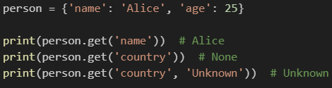
      - get을 쓰면 좋은 점(오류를 방지할 수도 있고, 오류 대신 다른 값을 넣어줄 수 있음)
        
    
    - `.keys()`
      
      - 딕셔너리 키를 모은 **객체**를 반환
        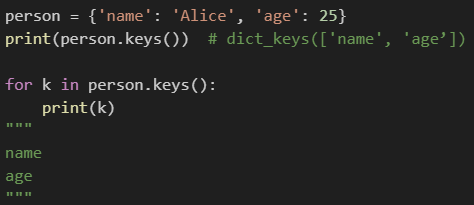
    
    - `.values()`
      
      - 딕셔너리 값을 모은 **객체** 를 반환
        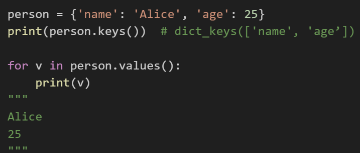
    
    - `.items()`
      
      - 딕셔너리 키/값 쌍을 모은 **객체**를 반환
        
    
    - `.pop(key[,default])`
      
      - 키를 제거하고 연결됐던 값을 반환(없으면 에러나 default를 반환)
        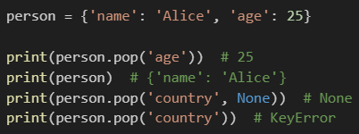
    
    - `.setdefault(key[,default])`(이거 기억해두면  좋을 듯)
      
      - ~~`.get`과 느낌 비슷~~
      
      - 키와 연결된 값을 반환
      
      - 키가 없다면 default와 연결한 키를 딕셔너리에 추가하고 default를 반환(키가 이미 있으면, 변환x 함)
        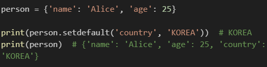
      
      - `[]`와 `.get()`과 `.setdefault()`을 활용한 혈액형 인원수 세기 예
        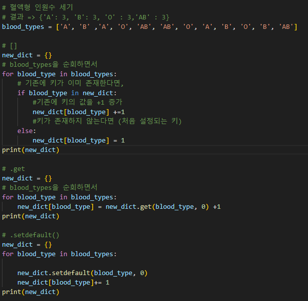
      
      - `.update([other])`
        
        - other가 제공하는 키/값 쌍으로 딕셔너리를 갱신
        
        - 없는 키도 넣을 수 있음
        
        - 기존 키는 **덮어씀**
          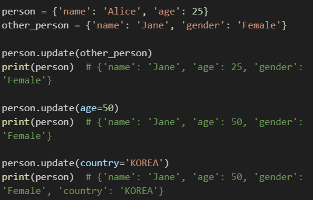

- 참고
  
  - 문자열에 포함된 문자들의 유형을 판별하는 메서드
    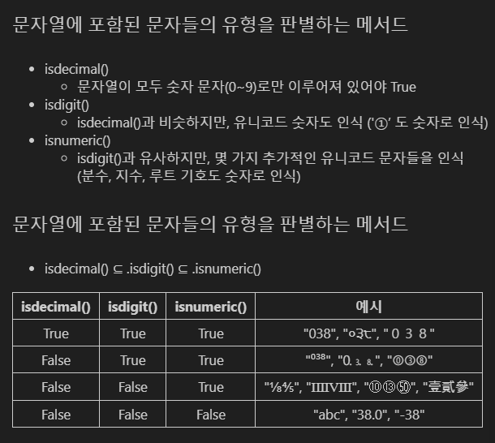
  - 복사
    

---

### Classes

#### 객체 지향 프로그래밍

- 절차 지향 프로그래밍
  
  - 프로그램을 '데이터'와 '절차'로 구성하는 방식의 프로그래밍 패러다임
  
  - 특징
    
    - "데이터"와 해당 데이터를 처리하는 "함수(절차)" 분리되어 있으며, **함수 호출의 흐름**이 중요
    
    - 코드의 순차적인 흐름과 함수 호출에 의해 프로그램이 진행
    
    - 데이터를 다시 재사용하거나 하기보다는 처음부터 끝까지 실행되는 결과물이 중요한 방식
  
  - 소프트웨어 위기
    
    - 하드웨어의 발전으로 복잡성이 크게 증가하여 절차 지향 프로그래밍으로의 한계가 생김

- 객체 지향 프로그래밍(OOP)
  
  - 데이터와 해당 데이터를 조작하는 메서드를 하나의 객체로 묶어 관리하는 방식의 프로그래밍 패러다임
  
  - 특징
    
    - 데이터와 해당 데이터를 처리하는 메서드(메시지)를 하나의 객체(클래스)로 묶음
    
    - 객체 간 상호작용과 메시지 전달이 중요

#### 객체

- 클래스(Class)
  
  - 반복되는 변수& 메서드(함수)를 미리 정해놓는 틀(설계도)
  
  - 파이썬에서 타입을 표현하는 방법
  
  - 객체를 생성하기 위한 설계도
  
  - 데이터와 기능을 함께 묶는 방법을 제공 
  
  - 구조
    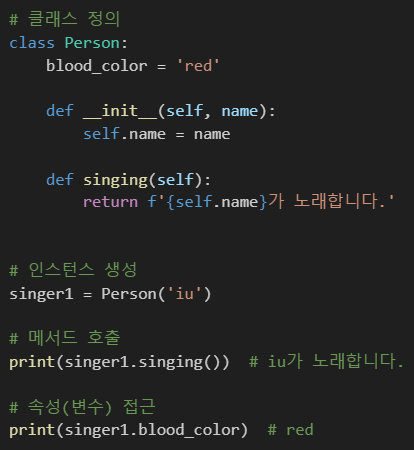
    
    
    
    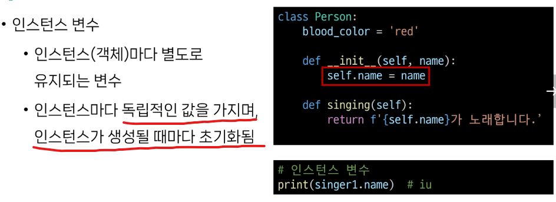
    
    
    
    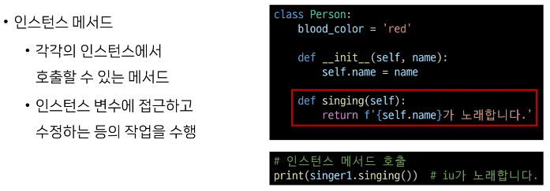

- 객체(Object)
  
  - 클래스에서 정의한 것을 토대로 메모리에 할당된 것 '속성'과 '행동'으로 구성된 모든 것
  
  - 특징
    
    - 타입: 어떤 연산자와 조작이 가능한가?
    
    - 속성: 어떤 상태(데이터)를 가지는가?
    
    - 조작법: 어떤 행위(함수)를 할 수 있는가?
  
  - 예시
    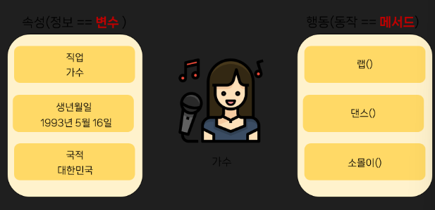

- 클래스와 객체
  
  - 클래스로 만든 객체를 **인스턴스**라고도 함
    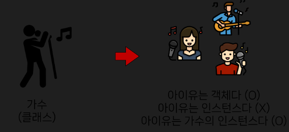
  
  - 변수 name의 타입은 str클래스이다.
  
  - 변수 name은 **str 클래스의 인스턴스**이다.
  
  - 우리가 사용해왔던 **데이터 타입은 사실 모두 클래스**였다.
  
  - 클래스를 만든다 == **타입**을 만든다
    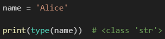
    
    

- 인스턴스와 메서드
  
  

- 인스턴스와 클래스 간의 이름 공간
  
  - 클래스를 정의하면 클래스와 해당하는 이름 공간 생성
  
  - 인스턴스를 만들면, 인스턴스 객체가 생성되고 **독립적인** 이름 공간 생성
  
  - **인스턴스에서 특정 속성에 접근하면, 인스턴스-> 클래스 순으로 탐색**
    
  
  - 예시
    
  
  - 독립적인 이름공간을 가지는 이점
    
    - 각 인스턴스는 독립적인 메모리 공간을 가지며, 클래스와 다른 인스턴스 간에는 서로의 데이터나 상태에 직접적인 접근이 불가능
    
    - 객체 지향 프로그래밍의 중요한 특성 중 하나로 클래스와 인스턴스를 모듈화하고 각각의 객체가 독립적으로 동작하도록 보장
    
    - 이를 통해 클래스와 인스턴스는 다른 객체들과의 상호작용에서 서로 충돌이나 영향을 주지 않으면서 독입적으로 동작 가능
      
      - 코드의 가독성, 유지보수성, 재사용성을 높이는데 도움을 줌
    
    - 참고
      

- 인스턴스 변수와 클래스 변수
  
  - 클래스 변수 활용(가수가 몇명일까?, 인스턴스 생성시 마다 클래스 변수 늘어나도록)
    
    cf) 위의 것을 보면, 모든 인스턴스는  name이라는 인스턴스 변수를 가지고 생성됨
  
  - 클래스 변수와 인스턴스 변수
    
    - 클래스 변수를 변경할 때는 항상 `클래스.클래스변수` 형식으로 변경
      
      - 예시
        

- 메서드
  
  - 메서드 종류
    
    - 인스턴스 메서드
    
    - 클래스 메서드
    
    - 정적 메서드
  
  - 인스턴스 메서드
    
    - 클래스로부터 생성된 각 인스턴스에서 호출할 수 있는 메서드
      
      - 인스턴스의 상태를 조작하거나 동작을 수행
    
    - 구조
      
      - 클래스 내부에 정의되는 메서드의 기본
      
      - 반드시 첫 번째 매개변수로 **인스턴스 자신**을 전달받음
        
        
        self 말고 딴 거 써도 되는데 암묵적인 약속임
    
    - self 동작원리
      
      
  
  - 생성자 메서드
    
    - 인스턴스 객체가 생성될 때 자동으로 호출되는 메서드
      
      - 인스턴스 변수들의 초기값을 설정
    
    - 구조
      
      초기값이 없더라도 써 주는 것을 권장(pass라도 두더라도)
  
  - 클래스 메서드
    
    - 클래스가 호출하는 메서드
      
      - 클래스 변수를 조작하거나 클래스 레벨의 동작을 수행
    
    - 구조
      
      - `@classmethod`데코레이터를 사용하여 정의
      
      - 호출 시, 첫번째 인자로 호출하는 클래스(cls)가 전달됨
        
    
    - 예시
      
  
  - 스태틱(정적) 메서드
    
    - 클래스와 인스턴스와 상관없이 독립적으로 동작하는 메서드
      
      - 주로 클래스와 관련이 있지만 인스턴스와 상호작용이 필요하지 않은 경우에 사용
    
    - 구조 
      
      - `@staticmethod`데코레이터를 사용하여 정의
      
      - 호출 시 필수적으로 작성해야 할 매개변수가 없음
      
      - 즉, 객체 상태나 클래스 상태를 수정할 수 없으며 단지 기능(행동)만을 위한 메서드로 사용
        
    
    - 예시 
      

- 메서드 정리
  
  - 인스턴스 메서드
    
    - 인스턴스의 상태를 변경하거나, 해당 인스턴스의 특정 동작을 수행
  
  - 클래스 메서드
    
    - 인스턴스의 상태에 의존하지 않는 기능을 정의
    
    - 클래스 변수를 조작하거나 클래스 레벨의 동작을 수행
  
  - 스태틱 메서드
    
    - 클래스 및 인스턴스와 관련이 없는 일반적인 기능을 수행

- 각자의 역할
  
  - 클래스가 사용해야 할 것
    
    - 클래스 메서드
    
    - 스태틱 메서드
  
  - 인스턴스가 사용해야 할 것
    
    - 인스턴스 메서드

- 정리 예시
  

- 참고
  
  - 매직 메서드
    
  
  - `__str__` 매직 메서드 예시
    
  
  - 데코레이터
    
    - 다른 함수의 코드를 유지한 채로 수정하거나 확장하기 위해 사용되는 함수
      

---

### 상속

- 기존 클래스의 속성과 메서드를 물려받아 새로운 하위 클래스를 생성하는 것

- 필요한 이유
  
  - 코드 재사용
    
    - **중복된 코드 줄일 수 있음**
  
  - 계층구조
    
    - 더 구체적인 클래스를 만들 수 있음
  
  - 유지 보수의 용이성
    
    - 상속을 통해 기존 클래스의 수정이 필요한 경우, 해당 클래스만 수정하면 되므로 유지보수 용이
    
    - 코드의 일관성을 유지하고, 수정이 필요한 범위를 최소화할 수 있음

- 상속을 사용한 계층구조 변경 예시(참고)
  

- super()
  
  - 부모 클래스의 메서드를 호출하기 위해 사용되는 내장 함수
  
  - 하위 클래스를 형성할 때 `()` 안에 부모 클래스의 이름을 써주면 된다.
  
  - 사용 예시
    

- 다중 상속
  
  - 두 개 이상의 클래스를 상속 받는 경우
  
  - 상속받은 모든 클래스의 요소를 활용 가능함
  
  - 중복된 속성이나 메서드가 있는 경우 **상속 순서에 의해 결정**됨
  
  - 예시
    

- 상속 관련 함수와 메소드
  
  - `mro()`
    

---

### Error & Exception(에러와 예외)

- 디버깅(별로 내용 x)

- 에러
  
  - 프로그램 실행 중에 발생하는 예외 상황 
  
  - 유형
    
    
  
  - 예시는 찾아보던지..

- 예외 처리
  
  - try와 except
  
  - try-except 구조
    
    - try 블록 안에는 예외가 발생할 수 있는 코드를 작성
    
    - except 블록 안에는 예외가 발생했을 때 처리할 코드를 작성
    
    - 예외가 발생하면 프로그램 흐름은 try블록을 빠져나와 해당 예외에 대응하는 except 블록으로 이동
      
  
  - 복수 예외 처리
    
    - 먼저, 발생 가능한 에러가 무엇인지 예상하는 것 필요
      
      - 왜냐하면 내장 예외 클래스는 상속 계층구조를 가지기 때문에 하위 블록에 도달 못할 수 있음 

---

### EAFP & LBYL

- 예외처리와 값 검사에 대한 2가지 접근 방식
  
  1. EAFP: 예외처리를 중심으로 코드를 작성하는 접근 방식(try-except)
     
     - 일단 지르고 나중에 용서를 구하겠다는 느낌
  
  2. LBYL: 값 검사를 중심으로 코드를 작성하는 접근 방식(if-else)

- 접근 방식 비교
  
  

- 참고
  
  - as 키워드
    
