# 0731_0803 TIL

## 잡다한 것

- `range(N, 0, -1)` : N이하 0초과 (N부터 1까지 나옴)

- `continue` 이용 예(위의 if문의 조건이 맞을 때는 아래의 것이 실행이 안되게 하고 싶다)
  
  

- 정사각형일 때 가능한 것(`arr[i][j]`를 `arr[j][i]`로 바꿔주기만 하면 됨)
  

- 이렇게 하면 안된다!!!(arr2 방식으로 하면 안되는 이유)
  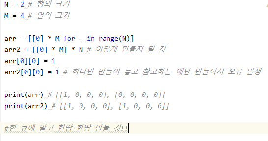

- 델타 탐색 시 참고사항
  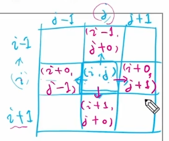

- 동등한 if 라인이면 변수 선언 같은 것 써도 된다. (나중에 알파벳 부족해짐을 고려)

- 꿀팁(리스트 앞에 숫자 추가하기)
  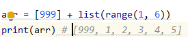

- 그냥 내가 비트 연산 가지고 논 것
  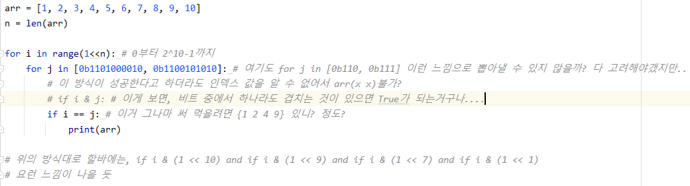
  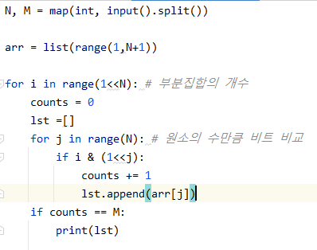

- 파이참 편하게 쓰기
  
  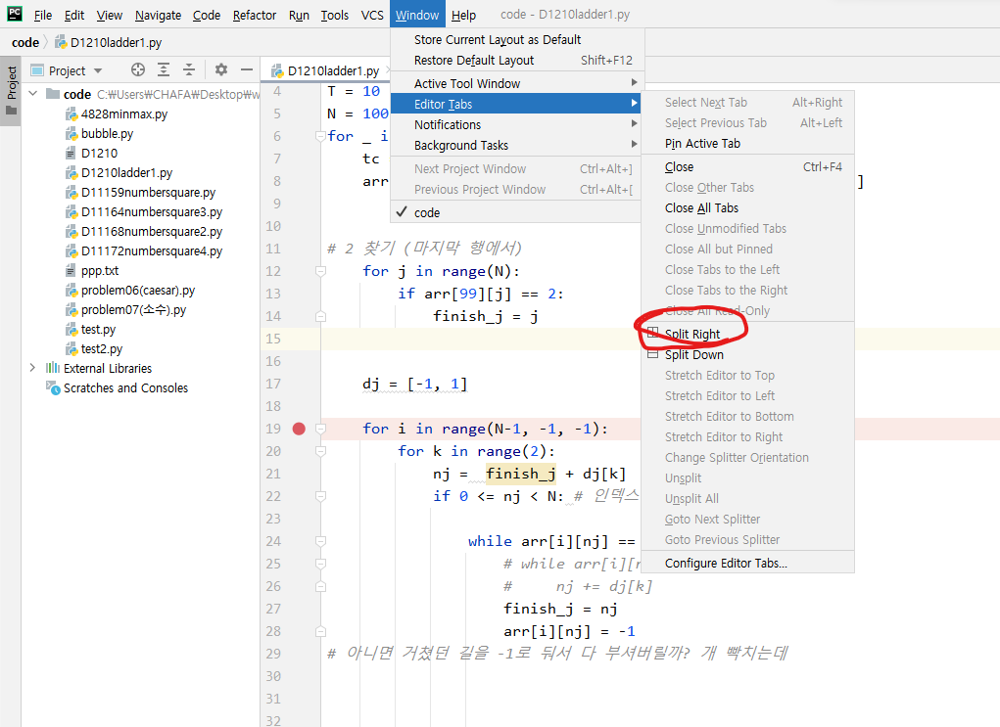
  
  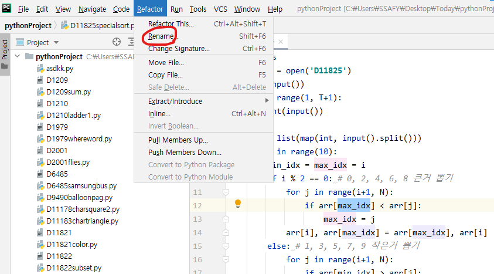

- 시험 때 주의사항
  
  - 디버깅을 `print`를 활용해서 할 때, 제출 시 해당 `print` 지우기
  
  - 테스트 케이스가 한개라면 하나 더 복제해서 테스트가 여러개일 때도 내가 원하는 방식으로 구현되는지 test하기!!(`end =' '`이런거 쓰다보면 꼬일 수 있음)
  
  - `#tc 값`에서 값 뒤에 공백은 상관없다고 함

---

## 배열 1(Array 1)

### 알고리즘

- 알고리즘 성능 측정
  
  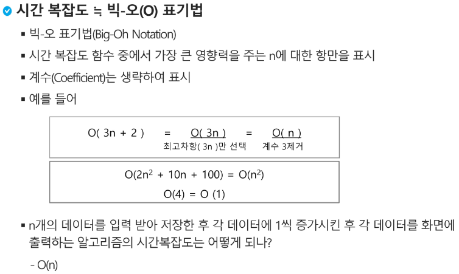

### 배열

- 배열이란?
  
  - **일정한 자료형의 변수들**을 하나의 이름으로 열거하여 사용하는 자료구조

- 배열의 필요성(참고)
  
  - 프로그램 내에서 여러 개의 변수가 필요할 때, 일일이 다른 변수명을 이용하여 자료에 접근하는 것은 매우 비효율적일 수 있다.
  
  - 배열을 사용하면 하나의 선언을 통해서 둘 이상의 변수를 선언할 수 있다.
  
  - 단순히 다수의 변수 선언을 의미하는 것이 아니라, 다수의 변수로는 하기 힘든 작업을 배열을 활용해 쉽게 할 수 있다.

- 1차원 배열
  
  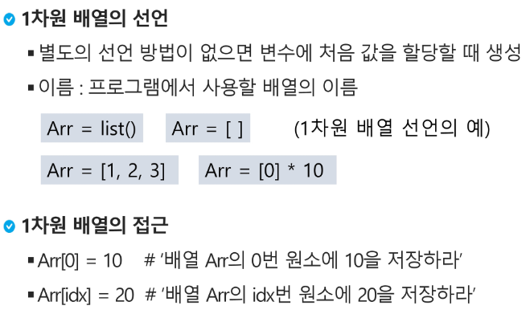
  
  여기서 숫자는 `[0]`으로 해서 할당해주면 되고, **문자열은 `['']`이렇게 해줘야 함**

### 정렬

- 정렬이란?
  
  - 2개 이상의 자료를 특정 기준에 의해 작은 값부터 큰 값(오름차순), 혹은 그 반대의 순서대로(내림차순) 재배열하는 것

- 키
  
  - 자료를 정렬하는 기준이 되는 특정 값

- 정렬의 종류
  
  - 버블 정렬
  
  - 카운팅 정렬
  
  - 선택 정렬
  
  - 퀵 정렬
  
  - 삽입 정렬
  
  - 병합 정렬

- 버블 정렬
  
  - **인접한 두 개의 원소를 비교**하며 자리를 계속 교환하는 방식
  
  - 시간 복잡도
    
    - O(n^2)
  
  - 과정
    
    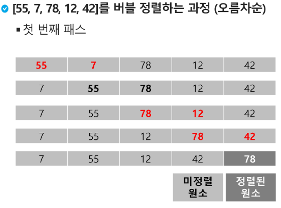
    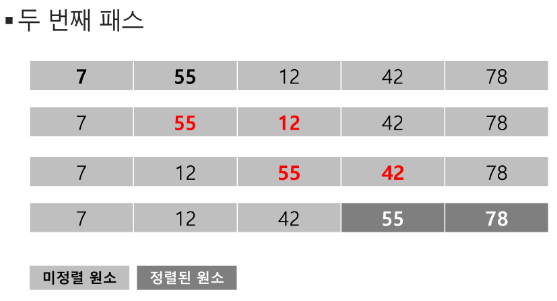
    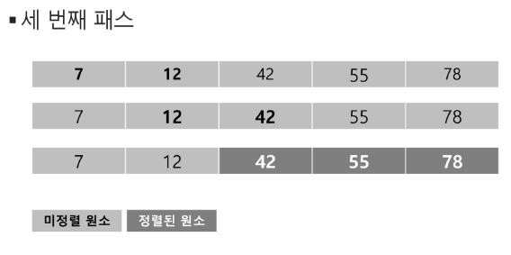
    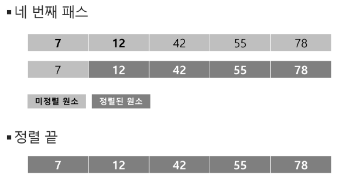
  
  - 코드 구현(오름차순)
    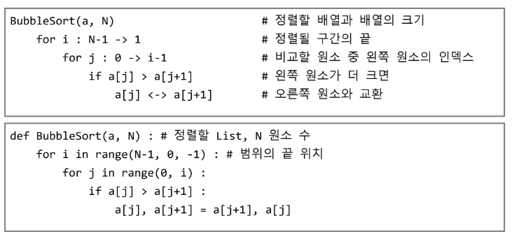

- 카운팅 정렬
  
  - 항목들의 순서를 결정하기 위해 집합에 각 항목이 몇 개씩 있는지 세는 작업을 하여, 선형 시간에 정렬하는 효율적인 알고리즘
  
  - 제한 사항
    
    - 정수나 정수로 표현할 수 있는 자료에 대해서만 적용 가능: 각 항목의 발생 회수를 기록하기 위해, 정수 항목으로 인뎃그 되는 카운트들의 배열을 사용하기 때문이다.
    
    - 카운트들을 위한 충분한 공간을 할당하려면 **집합 내의 가장 큰 정수**를 알아야 한다. (주어진 자료의 갯수로 `counts` 할당하는 실수 하지 말 것!!)(`counts = [0] * (max_v+1)`)
  
  - 장점
    
    - 원본 그 자체를 정렬 가능하도록 함(똑같은 1이라도 쬐매 틀리잖아..)
      
      - 안전 정렬을 위해서 뒤에서 부터 check하는 것임
  
  - 시간 복잡도
    
    - O(n+k) : n은 리스트 길이, k는 정수의 최대값
  
  - 과정
    
    누적 느낌임..
    
    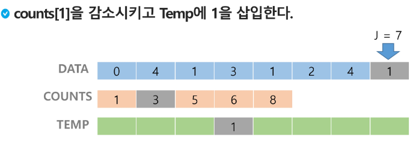
    
    데이터랑 같은 크기로 `temp`를 하나 만들고 뒤에서 부터 분석 시작
    추가 설명 : `Data`에서 1을 보고 `counts`의 인덱스 1번으로 가서 4번째까진 1이 있겠네를 파악한 뒤, `counts`의 인덱스 1번 값을 1 감소 시켜주고 `temp`의 인덱스 3번에 값 1을 삽입
    
    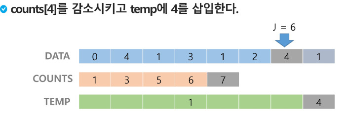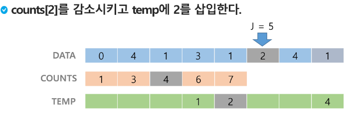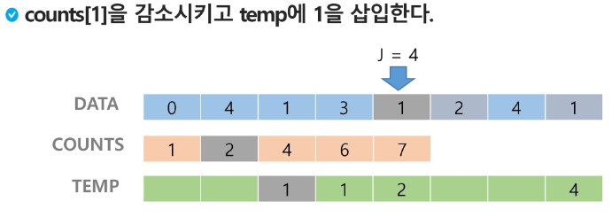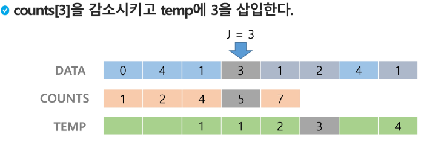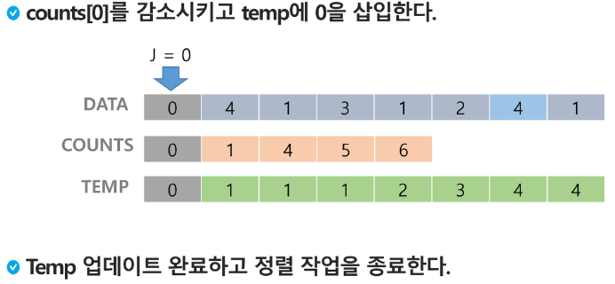

- 코드 구현
  
  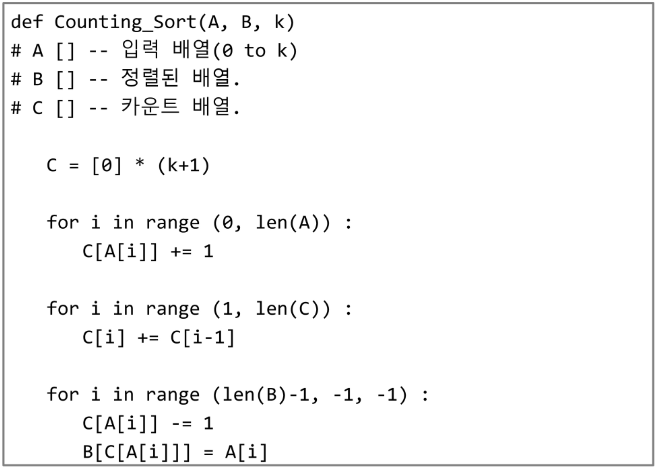
  
  
  
  위의 방식,  자리 배치에서 카운트 함수의 값을 먼저 1 빼주고 생각하는게 더 쉬울 것 같은데 왜 이렇게 한거지?
  
  여기서 C 만들 때 **k+1**로 곱해주는 것 실수하지 말 것!!!!

### 완전 검색

- 완전 검색이란? 
  
  - 문제의 해법으로 생각할 수 있는 모든 경우의 수를 나열해보고 확인하는 기법

- 일반적으로 경우의 수가 상대적으로 작을 때 유용

- 모든 경우의 수를 생성하고 테스트하기 때문에 수행 속도는 느리지만, 해답을 찾아내지 못할 확률이 작다.

- 주어진 문제를 풀 때 우선 완전 검색으로 접근하고 해답을 도출한 후, 성능 개선을 위해 다른 알고리즘을 사용하고 해답을 확인하는 것이 바람직

- 순열
  
  - 순열이란?
    
    - 서로 다른 것들 중 몇 개를 뽑아서 한 줄로 나열하는 것
  
  - 추가
    
    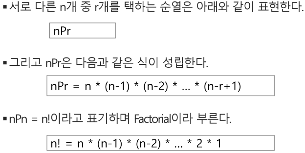

### 탐욕 알고리즘(그리디) Greedy

- 탐욕 알고리즘이란?
  
  - 최적해를 구하는 데 사용되는 근시안적인 방법

- 여러 경우 중 하나를 결정해야 할 때마다 그 순간에 최적이라고 생각되는 것을 선택해 나가는 방식으로 진행하여 최종적인 해답에 도달한다.

- 각 선택의 시점에서 이루어지는 결정은 지역적으로는 최적이지만, 그 선택들을 계속 수집하여 최종적인 해답을 만들었다고 하여, 그것이 최적이라는 보장은 없다.

- 일반적으로, 머릿속에서 떠오르는 생각을 검증 없이 바로 구현하면 그리디 접근이 된다.

---

## 배열 2 (Array 2)

### 2차원 배열

- 2차원 배열의 선언
  
  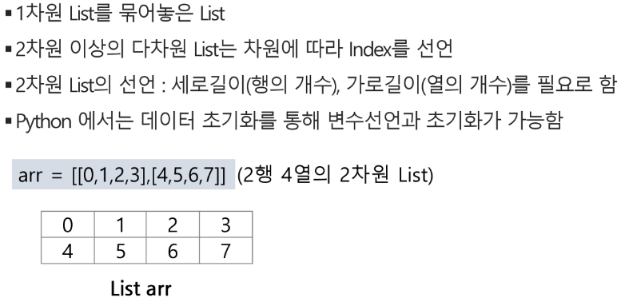
  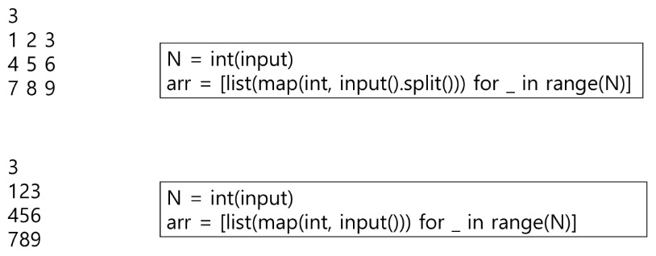

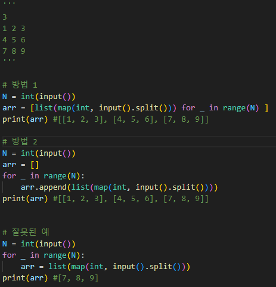

### 2차원 배열의 접근

- 배열 순회
  
  - n * m 배열의 n*m 개의 **모든 원소를 빠짐없이** 조사하는 방법
  
  - 행 우선 순회
    
    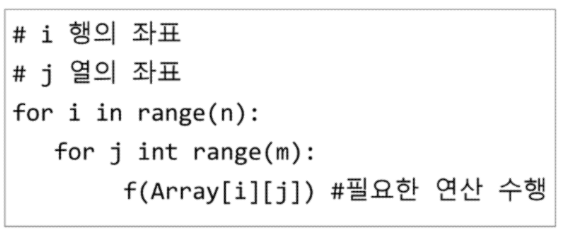
  
  - 행의 합 중에서 가장 큰 것 뽑아내기(초기값 위치 파악)
    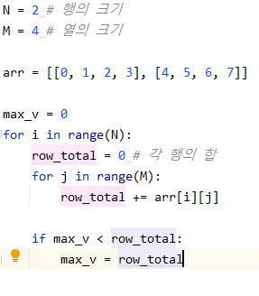
    각 행의 합 비교하는 위치도 잘 볼 것!!!
  
  - 행의 합과 열의 합(초기값 위치 파악하기!)
    
  
  - 열 우선 순회
    
    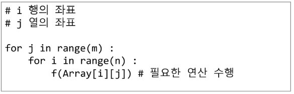
  
  - 지그재그 순회
    
    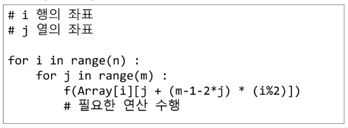
    
    i가 짝수일 때는 `Array[i][j]`, 홀수일 때는 `Array[i][-j + m-1]`이 되도록
    
    이거 생각안나면 if, else문으로 구현해도 됨
    
    내 생각: `-1`의 제곱형을 활용해서도 뭔가를 만들 수 있지 않을까?
  
  - 대각선 배열 더하기
    
  
  - 델타를 이용한 2차 배열 탐색(IM 필수!)
    
    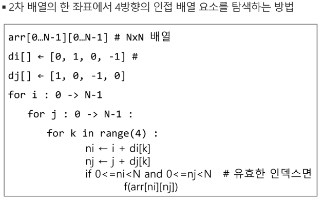
    
    뭔가를 하기전에 반드시 **인덱스 체크** 먼저 해주기!!!
  
  - 방식 여러가지
    
    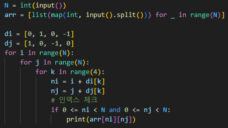
    
    
    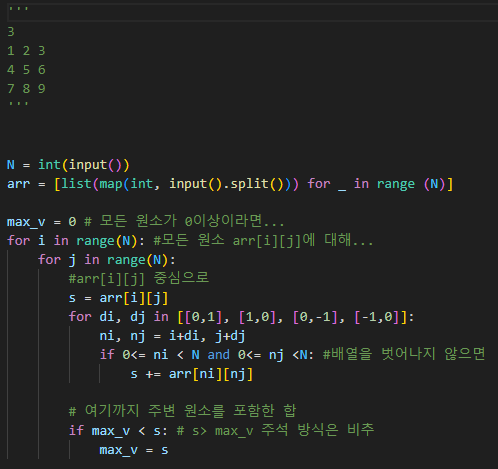
    
    심화과정(늘어나기!, 할 줄 알아야 됨)
    
    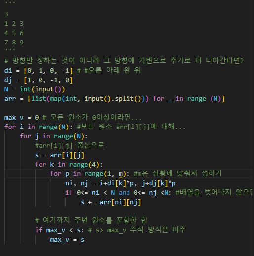
    
    

- 2차원 배열의 활용
  
  - 전치 행렬
    
    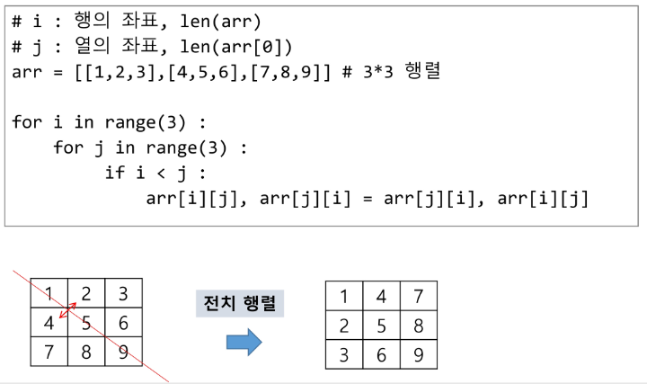
    
    `if i < j`이게 없다면 기껏 바꿔 놓은 것을 원상복구 함
  
  - 여러 방식들
    

### 부분집합 생성하기

- 부분집합의 수
  
  - 집합의 원소가 n개일 대, 공집합을 포함한 부분집합의 수는 2^n개이다.
  
  - 이는 각 원소를 부분집합에 포함시키거나 포함시키지 않는 2가지 경우를 모든 원소에 적용한 경우의 수와 같다.
    
    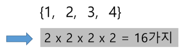
    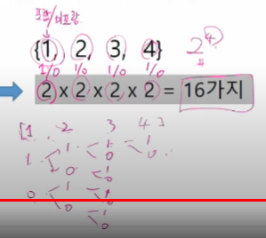

- 비트 연산자
  
  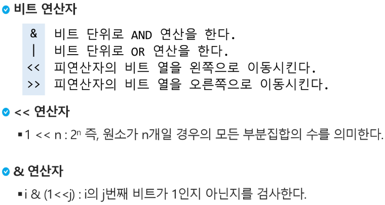
  
  - 이를 활용하여 부분집합 생성하는 방법
    
    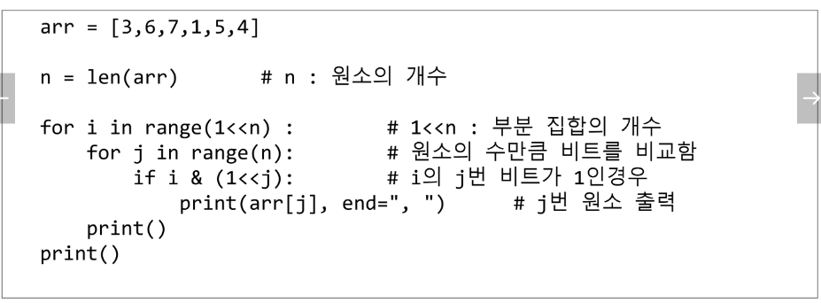

### 검색

- 검색이란
  
  - 저장되어 있는 자료 중에서 원하는 항목을 찾는 작업

- 목적하는 탐색 키를 가진 항목을 찾는 것
  
  - 탐색 키: 자료를 구별하여 인식할 수 있는 키

- 검색의 종류
  
  - 순차 검색
  
  - 이진 검색
  
  - 해쉬

- 순차 검색(별로 안 중요)
  
  - 구현 easy, 비효율적
  
  - 2가지의 경우
    
    - 정렬되어 있지 않은 경우
      
      - 찾고자 하는 원소의 순서에 따라 비교회수가 결정됨 (앞에서 찾으면 빨리 break나 return으로 나올 것임)
      
      - 시간 복잡도: O(n)
      
      - 구현
        
        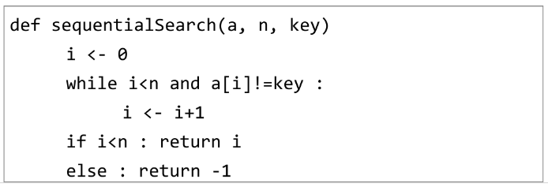
    
    - 정렬되어 있는 경우
      
      - 정렬이 되어있으므로, 검색 실패를 반환하는 경우 평균 비교 회수가 반으로 줄어든다. (예를 들어 10을 찾고 있는데 11을 만나면 나와서 검색량 줄어듬)
      
      - 시간 복잡도: O(n)
      
      - 구현
        
        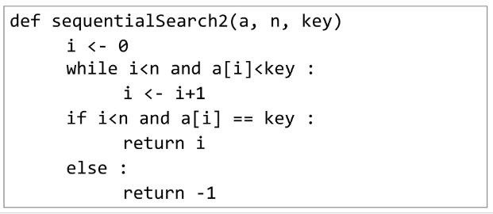

- 이진 검색(중요!!) (업 다운 게임 느낌)
  
  - 이진 검색이란?
    
    - 자료의 가운데에 있는 항목의 키 값과 비교하여 다음 검색의 위치를 결정하고 검색을 계속 진행하는 방법
      
      - 목적 키를 찾을 때까지 이진 검색을 순환적으로 반복 수행함으로써 검색 범위를 반으로 줄여가면서 보다 빠르게 검색을 수행함
  
  - 이진 검색을 하기 위해서는 자료가 **정렬**된 상태여야 한다.
  
  - 검색 과정
    
    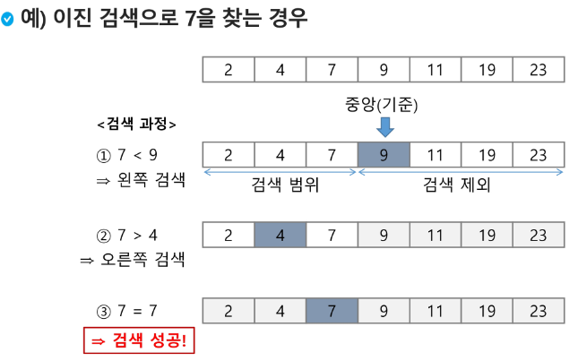
    
  
  - 구현
    
    - 검색 범위의 시작점과 종료점을 이용하여 검색을 반복 수행
    
    - 이진 검색의 경우, 자료에 삽입이나 삭제가 발생했을 때 배열의 상태를 항상 정렬 상태로 유지하는 추가 작업이 필요
      
      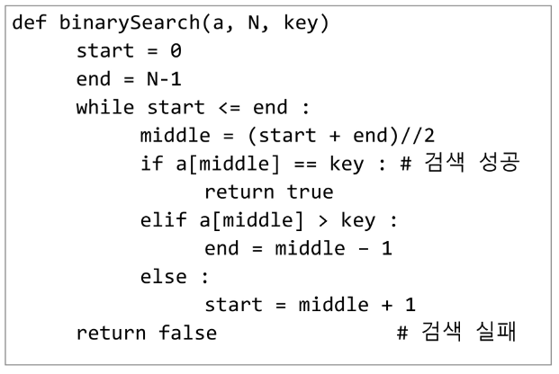
      
      여기서 `while` 조건에 `start`와 `end`가 같을 경우도 속해있어야 한다.
      
      (한 칸 차이로 빗나갔을 때를 생각해볼 것!)
    
    - 재귀 함수 이용 (이후 차차 더 자세히 배울 듯)
      
      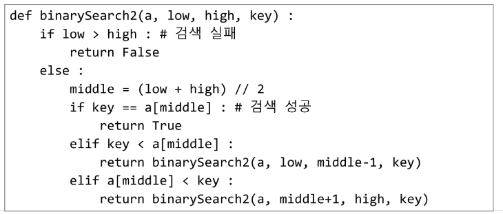

### 선택 정렬

- 선택 정렬이란?
  
  - 주어진 자료들 중 가장 작은 값의 원소부터 차례대로 선택하여 위치를 교환하는 방식

- 시간 복잡도
  
  - O(n^2)

- 정렬 과정(인덱스만 사용하여서 min, max 구하는 연습을 한 이유, 덜 복잡)
  
  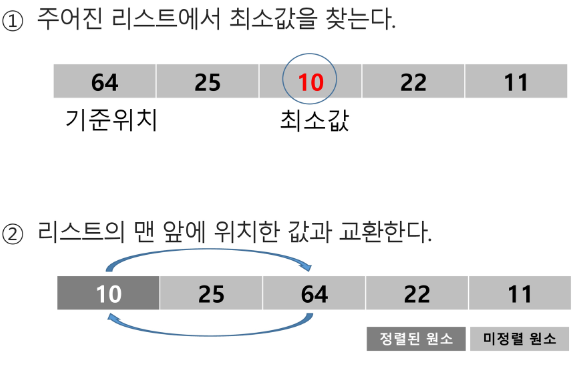
  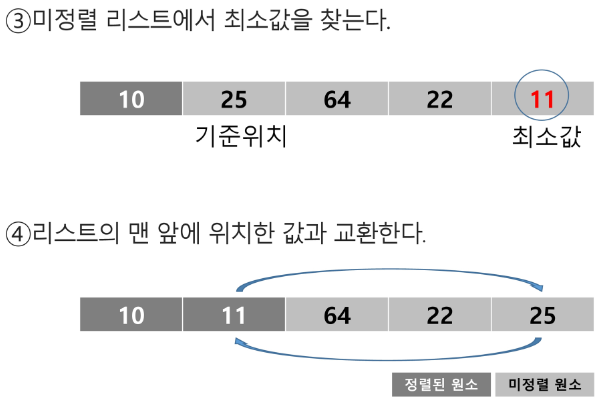
  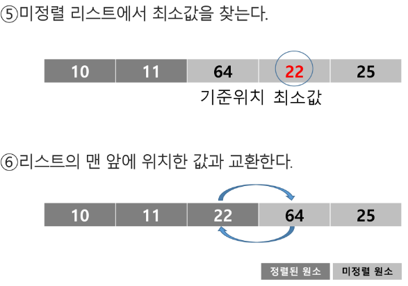
  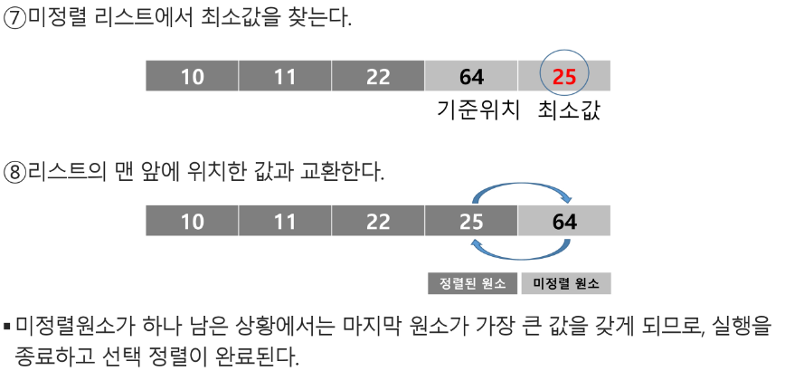

- 구현
  
  정렬한 것의 초과부터 다음으로 최소값 되는 것 찾기
  
  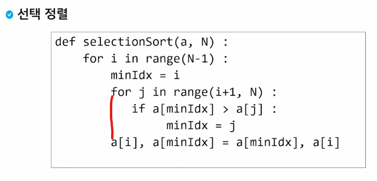
  
  바깥 for은 N-1번만 돌면 된다.

### 셀렉션 알고리즘

- 셀렉션 알고리즘이란?
  
  - 저장되어 있는 자료로부터 k번째로 큰 혹은 작은 원소를 찾는 방법
    
    - 최소값, 최대값 혹은 중간값을 찾는 알고리즘을 의미하기도 한다.

- 선택 정렬과의 차이점 : k번째라는 것을 찾으면 끝남 

- 선택 과정
  
  - 정렬 알고리즘을 이용하여 자료 정렬하기
  
  - 원하는 순서에 있는 원소 가져오기

- 구현 예
  
  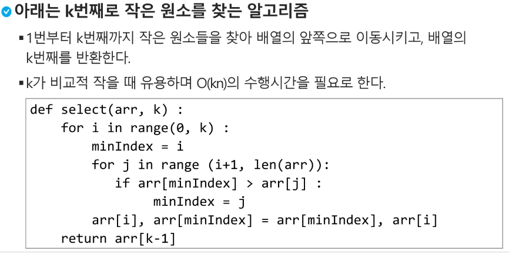
