# 0807_0810 TIL

## 잡다한 것

- 큰 출력 받을 시 꿀팁
  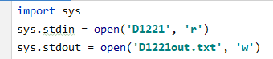

- 참고(숫자형 리스트 문자열로 만들기)
  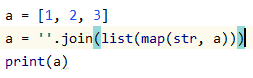

- `for - else 문`: for문이 다 돌아간 후에 else문 check, 써도 된다는데 파이썬만 있음
  
  - cf) ~~이걸로 안하면 while문으로 해야하는 경우 있음~~

- 파이썬 시간 복잡도
  
  - https://www.ics.uci.edu/~pattis/ICS-33/lectures/complexitypython.txt
  
  - [TimeComplexity - Python Wiki](https://wiki.python.org/moin/TimeComplexity)

- 메모리 구조
  
  - code(프로그램) - data(전역) - heap(동적) - stack(지역)

- 참고) for문이 재귀보다 빠르다, 단 가지치기를 한다면 재귀가 더 빠를 수 있다.

- 시험문제(주관식으로 나올만 한 것)
  
  - stack 개념 : 선형, LIFO
  
  - stack 응용: 괄호검사
  
  - DFS 개념 (문제 풀이로는 이번엔 안 나옴)

- 트리 ⊂ 그래프, (트리는 방향이 x)
  
  - 그래프나 트리 문제는 표현방법을 알아야 한다. (인접 행렬, 인접 리스트)
  
  - cf ) 그래프는 시작정점을 어디로 하든 상관 x
  
  - 인접 행렬의 단점: 0이 많아서 낭비 many (연결 리스트로 해결 가능하답니다...)

- cf) 재귀는 디버깅 거의 불가(빡셈)

- 파이참 새 프로젝트 새로운 위치에서 하는 법
  

- 재귀는 리턴이 빡세다. 차례대로 리턴해서 나오므로 리턴 값 잘 짜줘야 한다.
  
  그래서 global써서 원하는 값 쉽게 빼오도록 함(그래프 경로 문제 전인구 형꺼 참고)
  
  - 이게 뭔?
    
    - 완전 검색으로 할 수 있기도 하지만, 원하는 부분까지 도달한다면 빠져나오도록 할려고 할 때 리턴값을 열심히 고려하는 것 보단, global를 통해서 빼오는 것이 낫다는 이야기(flag, 가지치기 느낌)

- 참고(종이 붙이기)
  [[swea] 4869. 종이붙이기 / python 파이썬](https://jennnn.tistory.com/15)
  
  notice의 고급 타일 참고

---

## 문자열

### 문자열

- 파이썬에서의 문자열 처리
  cf) 문자는 없고 문자열만 있음
  
  
  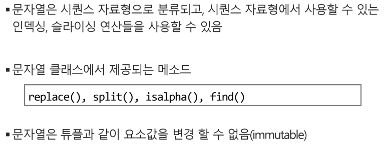

- 문자열 뒤집기
  
  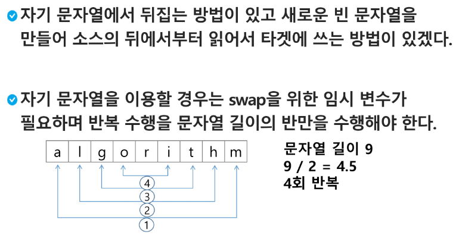
  
  for i: 0 -> N // 2 -1, arr[i] <-> arr[N-1-i]
  
  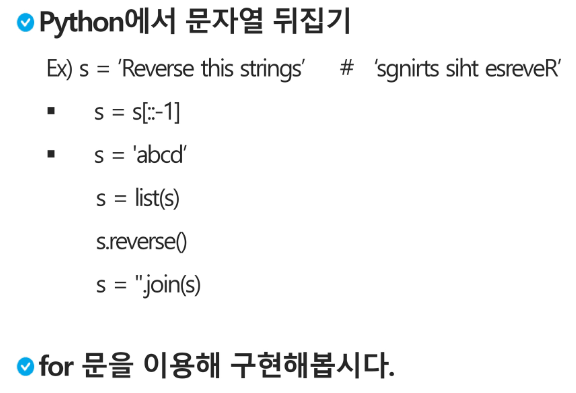
  
  

- 문자열 비교
  
  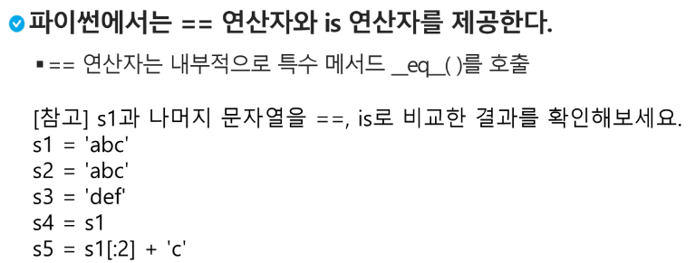
  
  
  문자열 사전순 비교 예시
  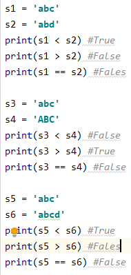

- 문자열 숫자를 정수로 변환하기
  
  
  
  
  0+1 => 10+2 => 120+3
  아래의 것은 기억하기!!
  
  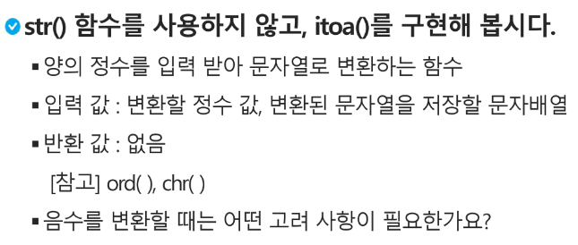
  
  
  
  - atoi 와 itoa 예시
  
  

### 패턴 매칭

- 패턴 매칭에 사용되는 알고리즘들
  
  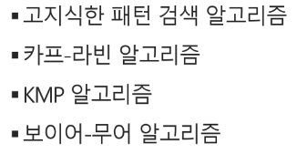

- 고지식한 알고리즘(Brute Force) (할 줄 알아야 합니다!!!)
  
  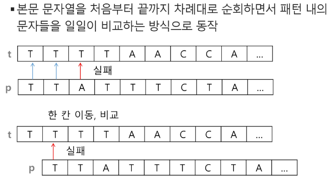
  
  - 알고리즘 설명
    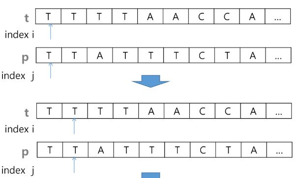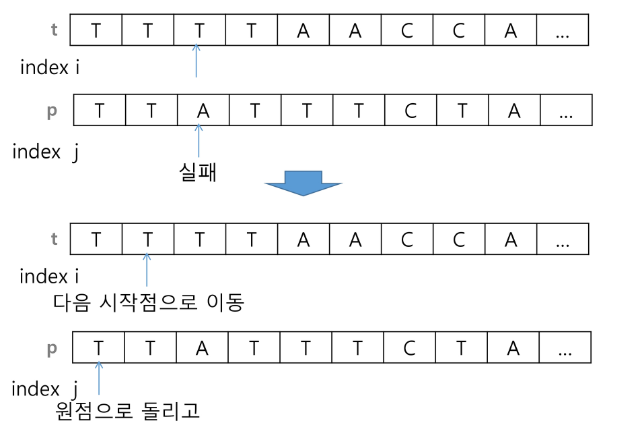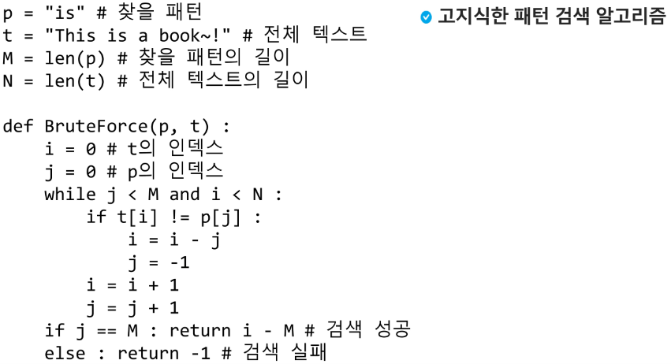
    
    위의 방식은 하나라도 찾으면 while문 밖으로 나옴, 코드 변환해서 counts 되도록 만들어 보기!!!
    
    i는 간 만큼 되돌아오도록 하고, j는 처음으로 돌아가도록 만듬
    
    **text만 움직이고 pattern은 고정인 느낌**
    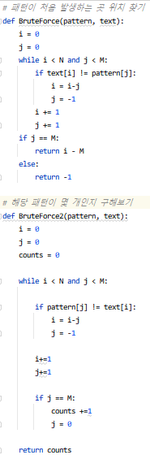
    여기서 `M`은 `len(pattern)`, `N`은 `len(text)`이다.

- 고지식한 패턴 검색 알고리즘의 시간 복잡도
  
  - 최악의 경우: O(MN)
  
  - 비교횟수를 줄일 수 있는 방법은 없는가?

- KMP 알고리즘
  
  - 불일치가 발생한 텍스트 스트링의 앞 부분에 어떤 문자가 있는지를 미리 알고 있으므로, 불일치가 발생한 앞 부분에 대하여 다시 비교하지 않고 매칭을 수행
  
  - 패턴을 전처리하여 배열 next[M]을 구해서 잘못된 시작을 최소화함
    
    - next[M] : 불일치가 발생했을 경우 이동할 다음 위치
  
  - 시간 복잡도: O(M+N)
  
  - 아이디어 설명
    
    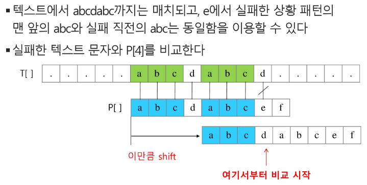
    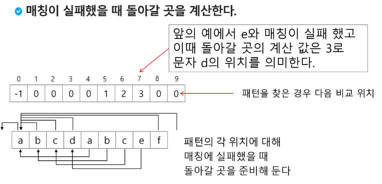
    
    참고) i++ 때문에 인텍스 0일때의 값을 -1로 둠
    찾으려는 문자에 반복되는 패턴이 많다면 유용할 듯

- 보이어- 무어 알고리즘
  
  - 오른쪽에서 왼쪽으로 비교
  
  - 대부분의 상용 소프트웨어에서 채택하고 있는 알고리즘
  
  - 보이어-무어 알고리즘은 패턴에 오른쪽 끝에 있는 문자가 불일치 하고 이 문자가 패턴 내에 존재하지 않는 경우, 이동 거리는 무려 패턴의 길이 만큼이 된다.
    
    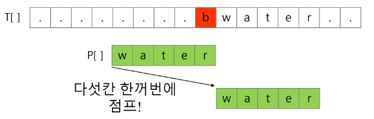
    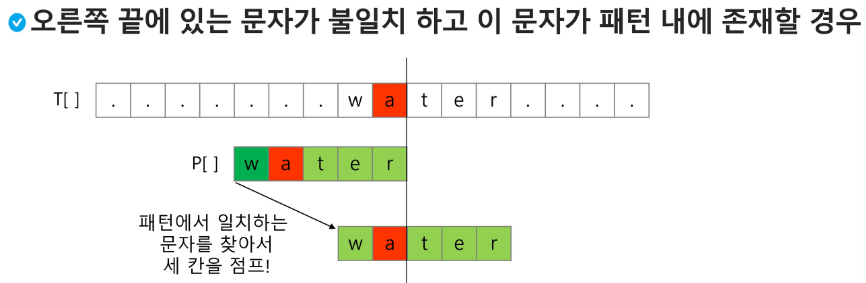
    
    비교하는 단어에 같은 문자가 있다면 확 패턴의 길이 만큼 뛸 수 없다.
  
  - 예시
    
    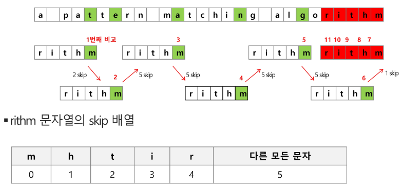

- 보이어- 무어 알고리즘 요약
  
  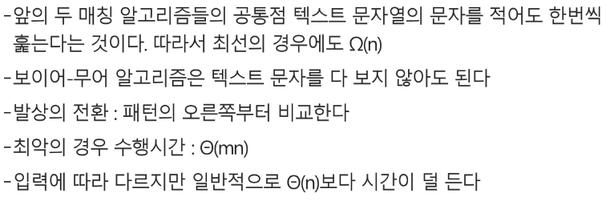

### 문자열 암호화, 문자열 압축(참고)

---

## STACK 1(스택 1)

### 스택

- 스택의 특성
  
  - 물건을 쌓아 올리듯 자료를 쌓아 올린 형태의 자료구조
  
  - 스택에 저장된 자료는 **선형 구조**를 갖는다.
  
  - 스택에 자료를 삽입하거나 스택에서 자료를 꺼낼 수 있다.
  
  - **마지막에 삽입한 자료를 가장 먼저 꺼낸다. 후입선출(LIFO, Last- In-First-Out)이라고 부른다.**

- 스택의 구현
  
  - 스택을 프로그램에서 구현하기 위해서 필요한 자료구조와 연산
    
    - 자료구조: 자료를 선형으로 저장할 저장소
      
      - 배열을 사용할 수 있다.
      
      - 저장소 자체를 스택이라 부르기도 함
      
      - 스택에서 마지막 삽입된 원소의 위치를 **top**이라 부른다.
    
    - 연산
      
      - 삽입: 저장소에 자료를 저장한다. 보통 **push**라고 부른다.
      
      - 삭제: 저장소에 자료를 꺼낸다. 꺼낸 자료는 삽입한 자료의 역순으로 꺼낸다. 보통 **pop**이라고 부른다.
      
      - 스택이 공백인지 아닌지를 확인하는 연산: **isEmpty**
      
      - 스택의 top에 있는 item(원소)을 반환하는 연산. **peek**
  
  - 스택의 삽입/ 삭제 과정
    
    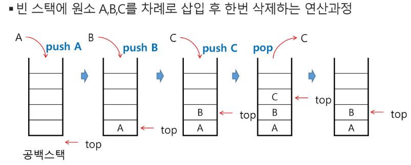
    
    top이 가장 마지막으로 push된 원소의 인덱스를 가짐
  
  - 스택의 push 알고리즘
    
    
    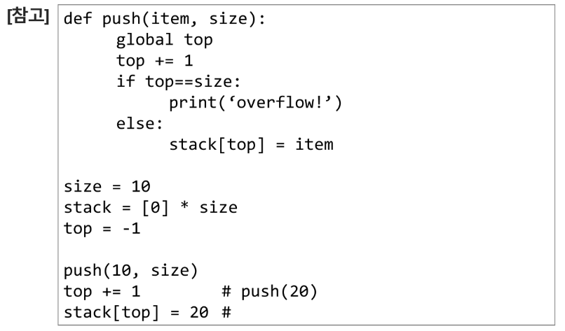
    
    여기서 overflow이건 없어도 되긴함 , ~~위의 내용은 함수, 아래의 내용은 그냥 바로 구현한 것~~
  
  - 스택의 pop 알고리즘(**비어있을 때 고려 필수!!!**)
    
    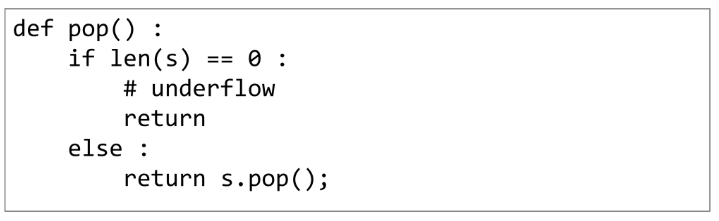
    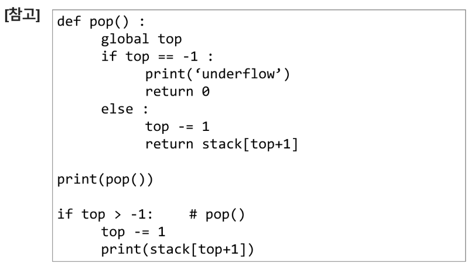
    
    
    
    
    
    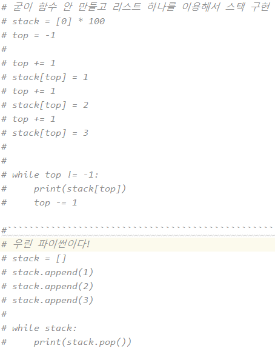
  
  - 스택 구현 고려 사항
    
    - 1차원 배열을 사용하여 구현할 경우 구현이 용이하다는 장점이 있지만 스택의 크기를 변경하기가 어렵다는 단점이 있다.
    
    - 참고) 이를 해결하기 위한 방법으로 저장소를 동적으로 할당하여 스택을 구현하는 방법이 있다. 동적 연결리스트를 이용하여 구현하는 방법을 의미한다. 구현이 복잡하다는 단점이 있지만 메모리를 효율적으로 사용한다는 장점을 가짐. 구현 생략..

- 스택의 응용1 : 괄호검사
  
  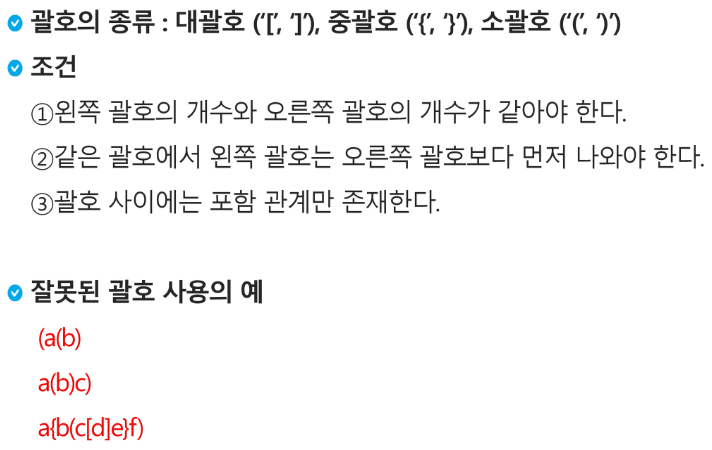
  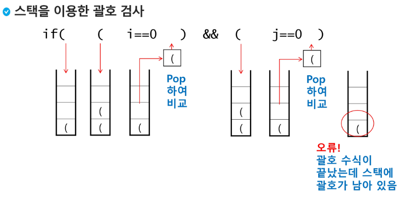
  
  여는 괄호일 때는 Push, 닫는 괄호는 pop을 해준다.
  
  오류 예)
  
  1. 수식 끝, 괄호 남음(여는 괄호가 더 many)
  
  2. 닫는 괄호를 만났는데 스택이 비어있는 경우(닫는 괄호가 더 많거나 먼저 나온 case)
  
  3. pop()한 결과가 닫는 괄호의 짝와 다른 경우
  
  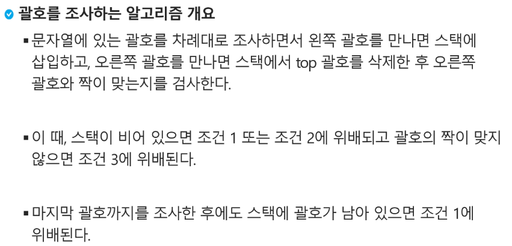
  
  여기서 top 괄호를 삭제한다는 것은 pop()하겠다를 의미

- 스택의 응용2: function call
  
  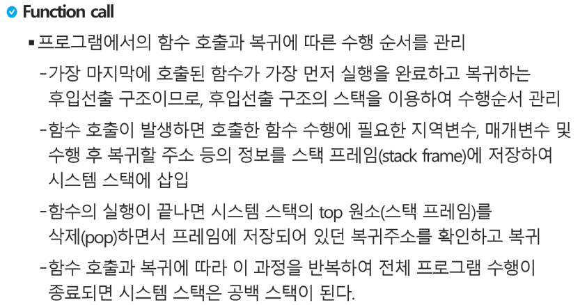
  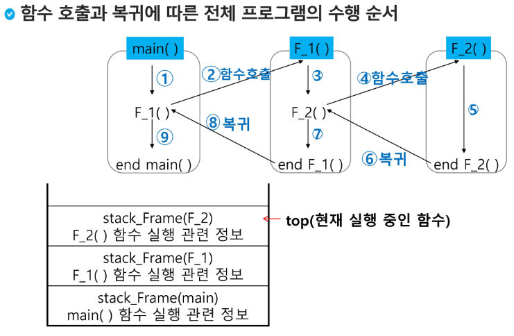
  
  동작하는 시점에서만 그 해당 스택을 차지하고 사용(나중에 덮어써짐) 

### 재귀호출

- 재귀호출이란?
  
  - 자기 자신을 호출하여 순환 수행되는 것
  
  - 함수에서 실행해야 하는 작업의 특성에 따라 일반적인 호출방식보다 재귀호출방식을 사용하여 함수를 만들면 프로그램의 크기를 줄이고 간단하게 작성
  
  - 예) factorial
    
    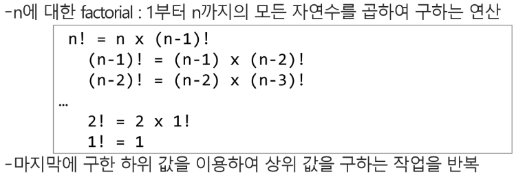
    
    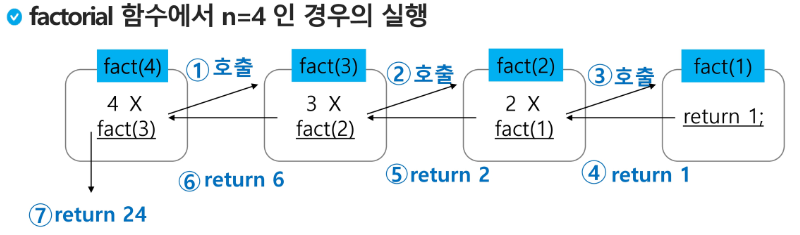
    
    재귀함수든 서로 다른 함수든 간에 호출 될 때마다 메모리 영역이 나눠지고 거기에 각각의 상황에 따라서 값이 저장됨
    
    스택 느낌(자기 할 것 다하면 펑하고 날라감)
  
  - 예 2: 피보나치 수
    
    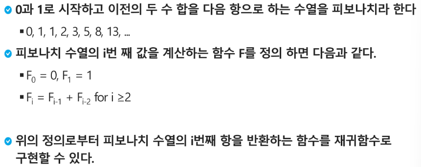
    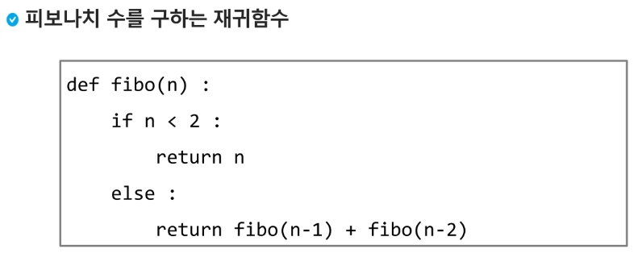

### Memoization

- 앞의 예에서 피보나치 수를 구하는 함수를 재귀함수로 구현한 알고리즘은 ''**엄청난 중복 호출이 존재한다**''는 문제점이 있다.

- memoization이란?
  
  - 컴퓨터 프로그램을 실행할 때 이전에 계산한 값을 메모리에 저장해서 매번 다시 계산하지 않도록 하여 전체적인 실행속도를 빠르게 하는 기술
  
  - 동적 계획법의 핵심이 되는 기술

- 예시 : 피보나치 수
  
  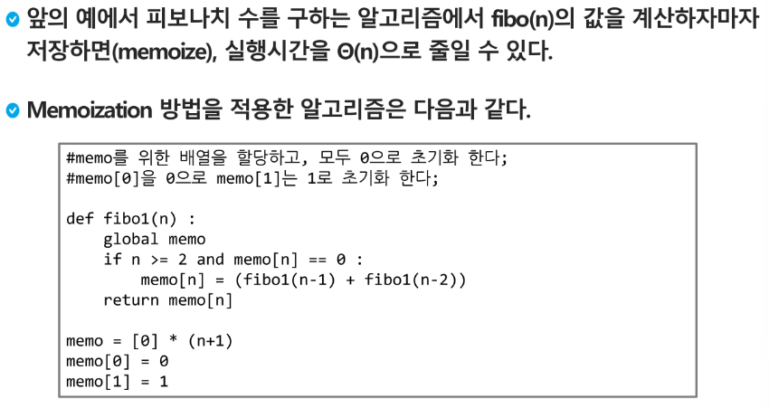
  
  ~~리스트인데 꼭 글보벌이 필요할까?~~
  
  `memo`라는 변수를 만들어놔서 그 값을 저장해둠, 그러면 만들어진 것을 바로 사용해서 바로 리턴 가능하게 가능(더 이상 아래로 내려가지 않고)
  
  할 때마다 계산하는 것이 아니라 많이 쓰일 것 같으면 미리 계산해서 넣어둠(한번만 계산)

### DP(Dynamic Programming)

- 독적 계획(DP) 알고리즘이란? 
  
  - 그리디 알고리즘과 같이 **최적화 문제**를 해결하는 알고리즘이다.
  
  - 먼저 입력 크기가 작은 부분 문제들을 모두 해결한 후에 그 해들을 이용하여 보다 큰 크기의 부분 문제들을 해결하여, 최종적으로 원래 주어진 입력의 문제를 해결하는 알고리즘이다.

- 예시 : 피보나치 수
  
  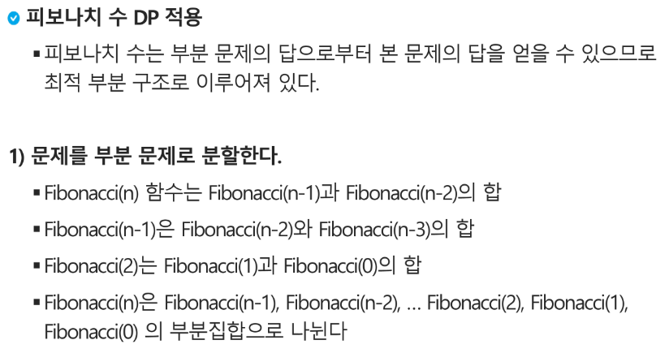
  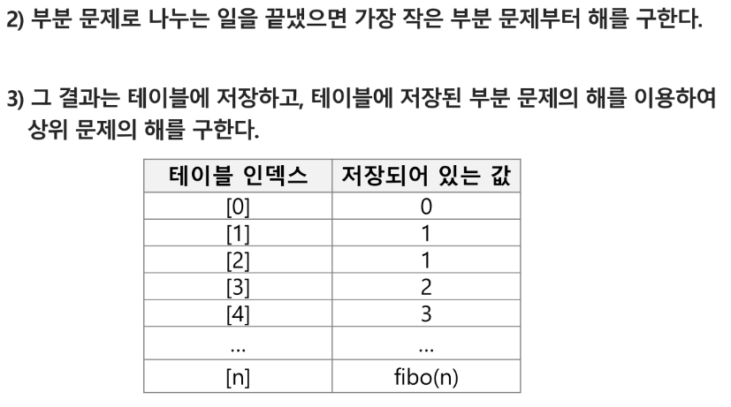
  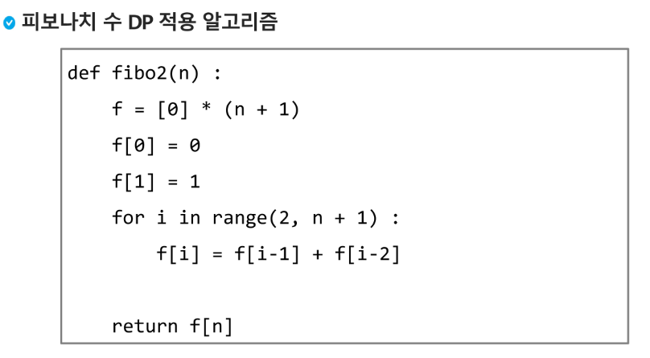
  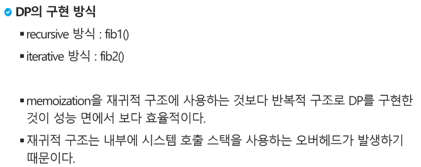

### DFS(깊이 우선 탐색)

- 비선형 구조인 그래프 구조는 그래프로 표현된 모든 자료를 빠짐없이 검색하는 것이 중요함.

- 두 가지 방법
  
  - 깊이 우선 탐색(Depth First Search, DFS) <- 얘는 stack에서 다루고
  
  - 너비 우선 탐색(Breadth First Search, BFS) <- 얘는 que에서 다룸

- DFS 란?(중요!!!)
  
  - 시작 정점의 한 방향으로 갈 수 있는 경로가 있는 곳까지 깊이 탐색해 가다가 더 이상 갈 곳이 없게 되면, 가장 마지막에 만났던 갈림길 간선이 있는 정점으로 되돌아와서 다른 방향의 정점으로 탐색을 계속 반복하여 결국 모든 정점을 방문하는 순회방법
  
  - 가장 마지막에 만났던 갈림길의 정점으로 되돌아가서 다시 깊이 우선 탐색을 반복해야 하므로 후입선출 구조의 스택 사용

- DFS 알고리즘
  
  ~~1차 목표: 빠짐없이, 중복없게 만들기~~
  
  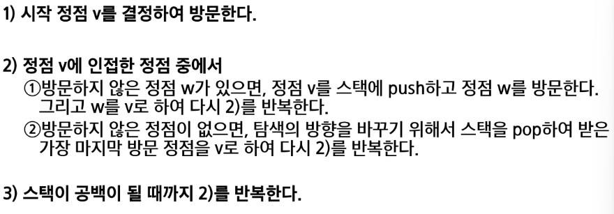
  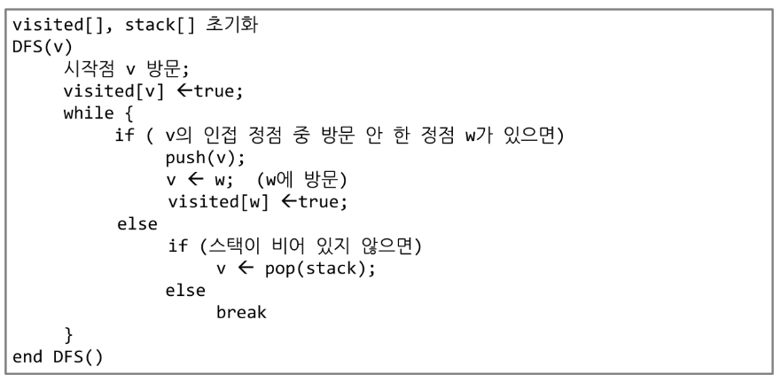

- DFS 예
  
  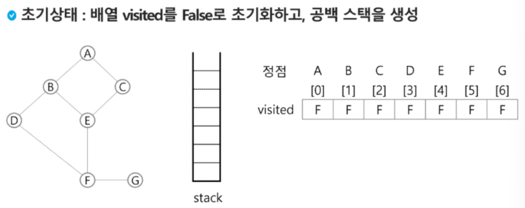
  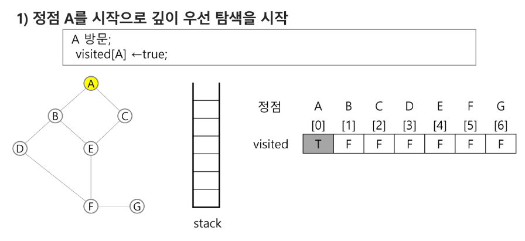
  
  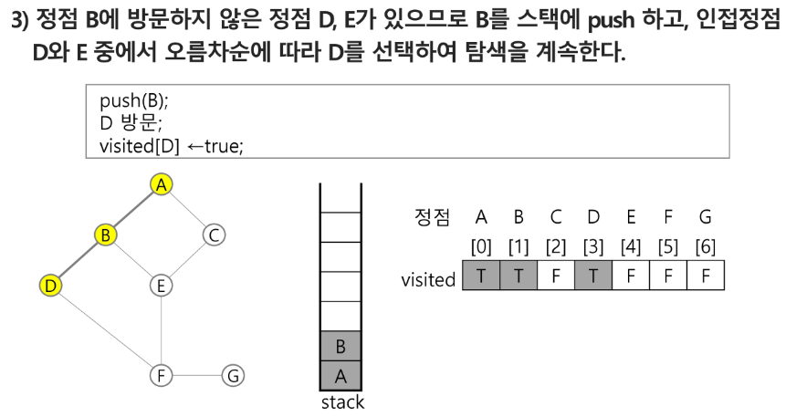
  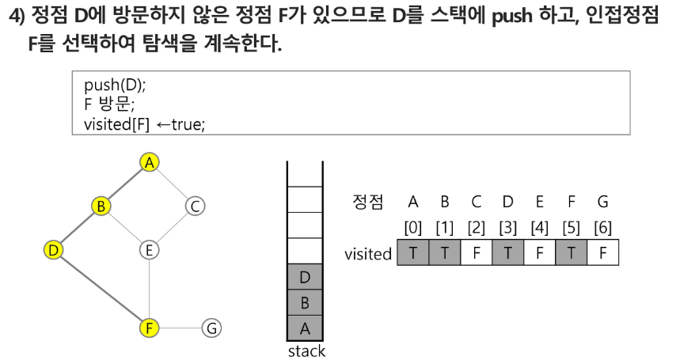
  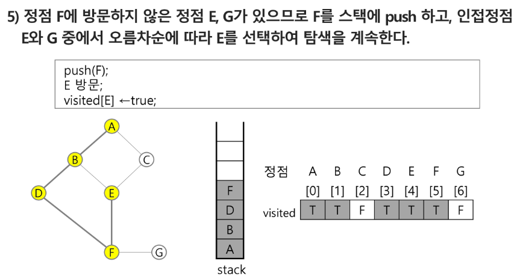
  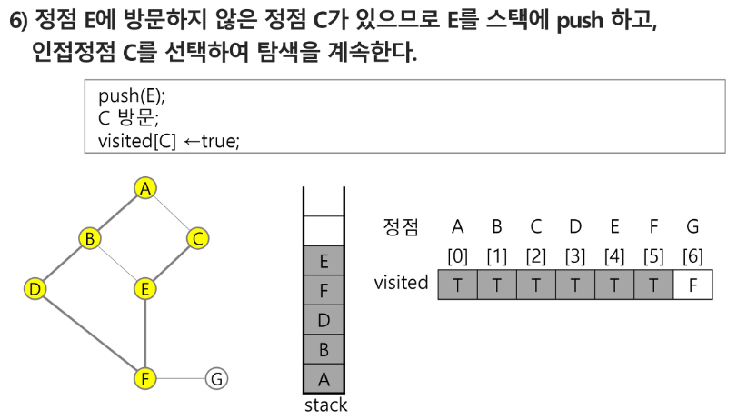
  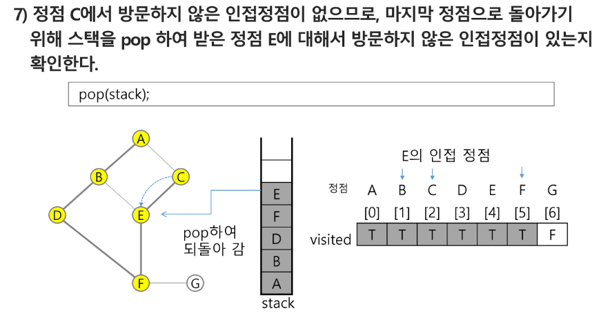
  
  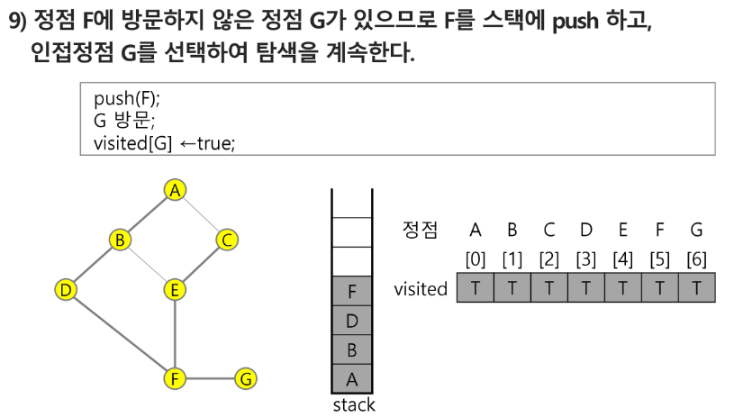
  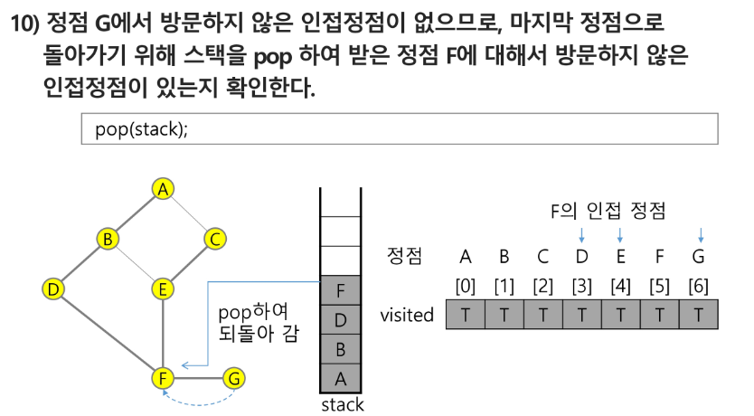
  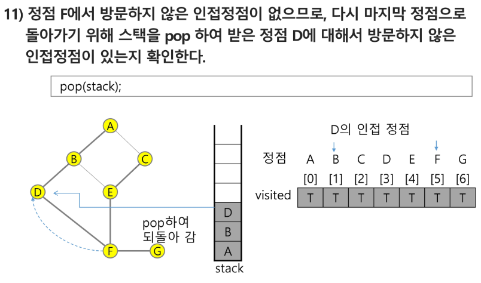
  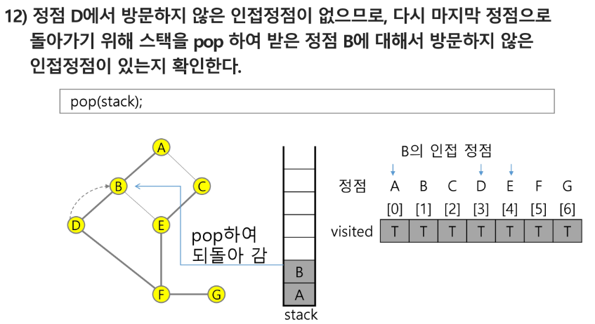
  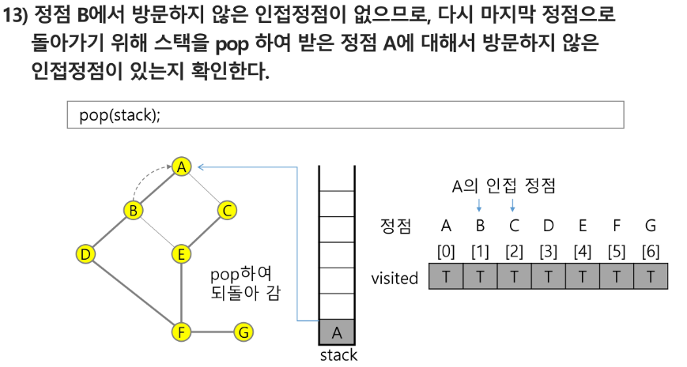
  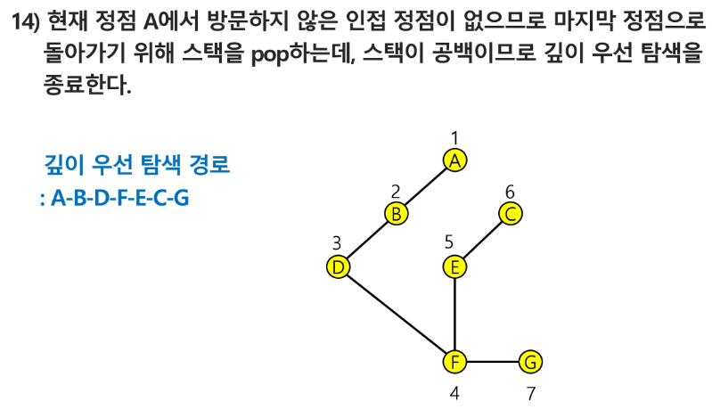
  
  - 방식 1
    
  
  - 방식 2
    
    
    cf) 되돌아가다 => 뒷걸음 치다
