# 0814_0818 TIL

## 잡다한 것

- 재귀랑 스택이랑 느낌 매우 유사

## 스택 2 (Stack 2)

### 계산기

- 문자열로 된 계산식이 주어질 때, 스택을 이용하여 이 계산식의 값을 계산할 수 있다.

- 문자열 수식 계산의 일반적 방법
  
  1. 중위 표기법의 수식을 후위 표기법으로 변경한다. (스택 이용)
  
  2. 후위 표기법의 수식을 스택을 이용하여 계산한다.
     
     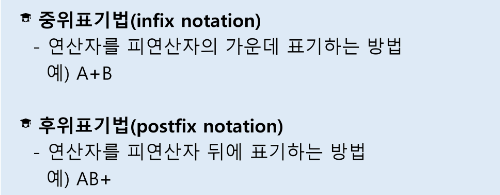

- step1. 중위표기식의 후위표기식 변환 방법 1(직접) (참고)
  
  - 수식의 각 연산자에 대해서 우선 순위에 따라 괄호를 사용하여 다시 표현한다.
  
  - 각 연산자를 그에 대응하는 오른쪽 괄호의 뒤로 이동시킨다.
  
  - 괄호를 제거한다.
    

- step1. 중위 표기법에서 후위 표기법으로의 변환 알고리즘(스택 이용) 2
  
  1. 입력 받은 중위 표기식에서 토큰을 읽는다.
  
  2. 토큰이 피연산자이면 토큰을 출력한다.
  
  3. 토큰이 연산자(괄호포함)일 때, 이 토큰이 스택의 top에 저장되어 있는 연산자보다 **우선순위가 높으면** 스택에 push하고, **그렇지 않다면 스택 top의 연산자의 우선순위가 토큰의 우선순위보다 작을 때까지 스택에서 pop한 후 토큰의 연산자를 push한다.** 만약 top에 연산자가 없으면 push한다.
  
  4. 토큰이 오른쪽 괄호 `')'`이면 스택 top에 왼쪽 괄호 `'('`가 올 때까지 스택에 pop 연산을 수행하고 pop한 연산자를 출력한다. 왼쪽 괄호를 만나면 pop만 하고 출력하지는 않는다.
  
  5. 중위 표기식에 더 읽을 것이 없다면 중지하고, 더 읽을 것이 있다면 1부터 다시 반복한다.
  
  6. **스택에 남아 있는 연산자를 모두 pop하여 출력한다.** 
     
     - **스택 밖의 왼쪽 괄호는 우선 순위가 가장 높으며, 스택 안의 왼쪽 괄호는 우선 순위가 가장 낮다.**

- step2. 후위 표기법의 수식을 스택을 이용하여 계산
  
  1. 피연산자를 만나면 스택에 push한다.
  
  2. 연산자를 만나면 필요한 만큼의 피연산자를 스택에서 pop하여 연산하고,
     연산결과를 다시 스택에 push한다.
     
     - 주의사항: 뺄셈이나 나눗셈은 순서 중요!!!
       (**먼저 뺀 애가 오른쪽으로 가도록!!!**)
  
  3. 수식이 끝나면, 마지막으로 스택을 pop하여 출력한다.

- 코드(계산기, 정상적인 수식만 들어온다는 전제로)
  
  
  
  pop(), append(x) 이용
  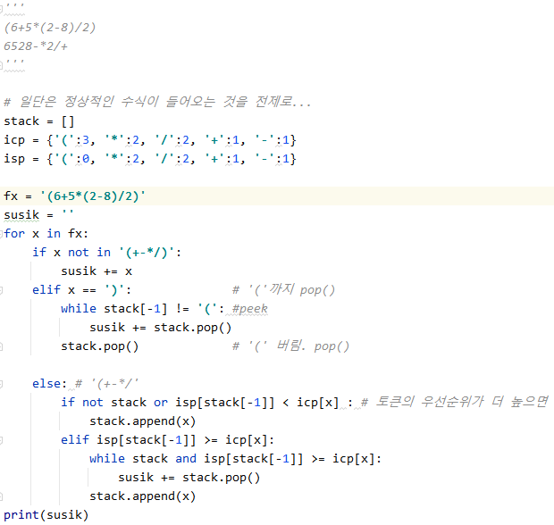
  추가(교수님이 알려준 위의 방식들 좀 더 단축 시키는 법)(중위에서 후위로 변환과정)
  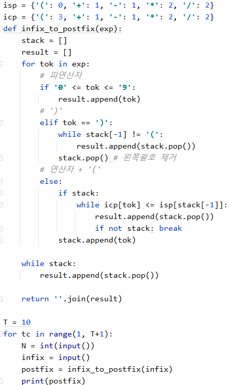

### 백트래킹

- 백트래킹이란? 
  
  - 해를 찾는 도중에 '막히면' (즉, 해가 아니면) 되돌아가서 다시 해를 찾아 가는 기법
  
  - 백트래킹 기법은 최적화(optimization) 문제와 결정(decision) 문제를 해결할 수 있다.
    
    - 결정 문제 : 문제의 조건을 만족하는 해가 존재하는지의 여부를 'yes' 또는 'no'가 답하는 문제
      
      - ex: 미로 찾기, n - Queen 문제, Map coloring, 부분 집합의 합(Subset Sum)문제 
  
  - 후보를 골라내는 작업이 보이면 백트래킹이다. (어떤 조건들을 동원하면 다 가보지 않고도 미리 거를 수 있어서 작업량 단축 가능)

- 백트래킹: 미로 찾기
  
  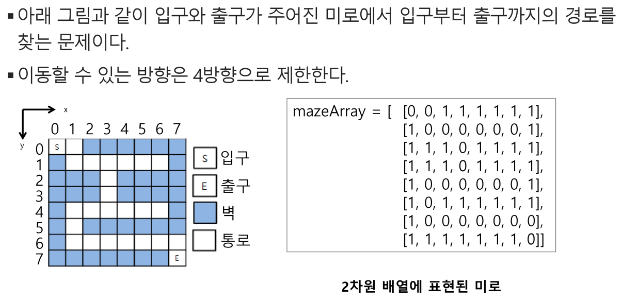
  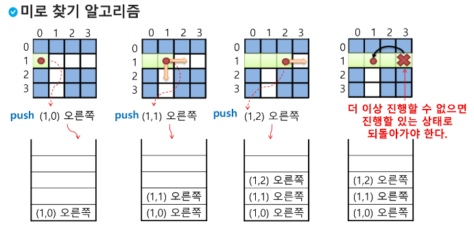
  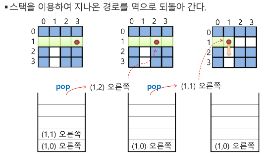
  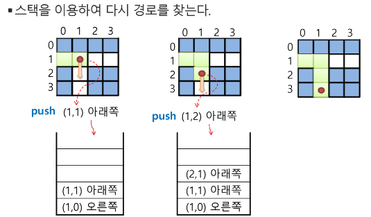

- 백트래킹과 깊이 우선 탐색과의 차이
  
  - 어떤 노드에서 출발하는 경로가 해결책으로 이어질 것 같지 않으면 더 이상 그 경로를 따라가지 않음으로써 시도의 횟수를 줄임.(가지치기)
  
  - 깊이 우선탐색이 모든 경로를 추적하는 데 비해 백트래킹은 불필요한 경로를 조기에 차단.
  
  - 깊이우선탐색을 가하기에는 경우의 수가 너무나 많음. 즉 N! 가지의 경우의 수를 가진 문제에 대해 깊이우선탐색을 가하면 당면히 처리 불가능한 문제.
  
  - 백트래킹 알고리즘을 적용하면 일반적으로 경우의 수가 줄어들지만 이 역시 최악의 경우에는 여전히 지수함수 시간을 요하므로 처리 불가능

- 모든 후보를 검사?
  
  - No!

- 백트래킹 기법
  
  - 어떤 노드의 유망성을 점검한 후에 유망하지 않다고 결정되면 그 노드의 부모로 되돌아가(backtracking) 다음 자식 노드로 감
  
  - 어떤 노드를 방문하였을 때 그 노드를 포함한 경로가 해답이 될 수 없으면 그 노드는 유망하지 않다고 하며, 반대로 가능성이 있으면 유망하다고 한다.
  
  - 가지치기(pruning): 유망하지 않는 노드가 포함되는 경로는 더 이상 고려하지 않는다.

- 백트래킹 알고리즘(절차)
  
  1. 상태 공간 트리의 깊이 우선 검색을 실시
  
  2. 각 노드가 유망한지를 점검
  
  3. 만일 그 노드가 유망하지 않으면, 그 노드의 부모 노드로 돌아가서 검색을 계속한다.
     
     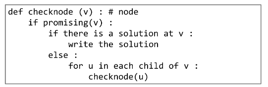

- 부분집합 구하기
  
  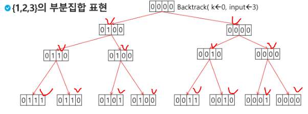

- 순열 구하기
  
  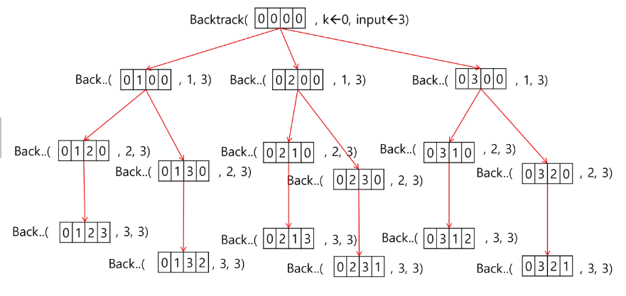
  
  부분집합과 순열 둘 다 깊이에 따라서 결정되는 위치 파악하기!!!!

### [참고] 부분집합, 순열 (참고라며... 왜 중요한데...)

- 들어가기 전에 재귀 연습
  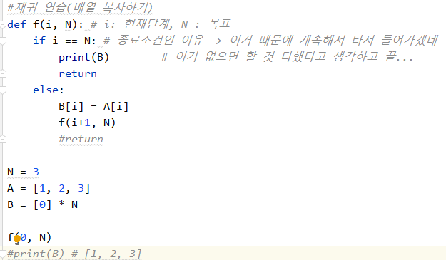

- 부분 집합의 합
  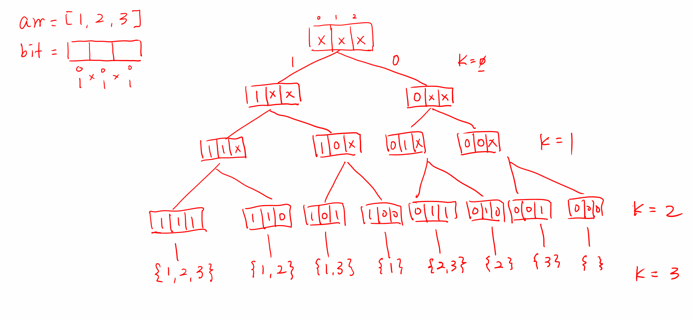
  
  
  
  
  - A[i] 원소를 부분 집합의 원소로 고려하는 재귀 함수 (A는 서로 다른 자연수의 집합)
    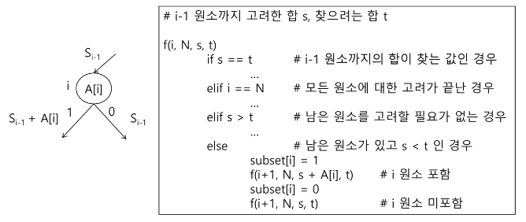
  
  - 추가 고려 사항
    
    
    참고) 주로 0 1 보단 1 0으로 함(그게 더 유리하단다...)
  
  - 코드
    
    - 부분 집합 재귀
      
    
    - 부분 집합의 합 재귀
      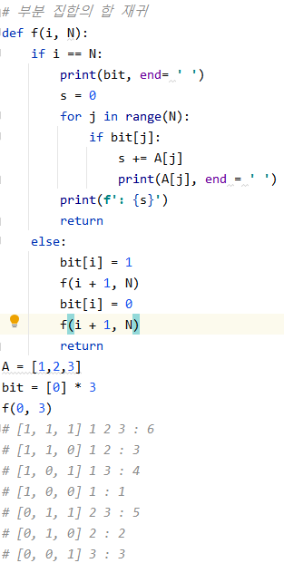
      
      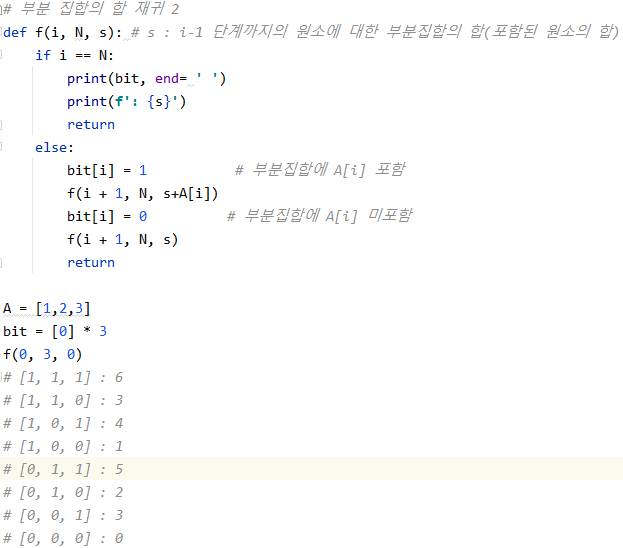
    
    - 부분 집합의 합(가지치기)
      
      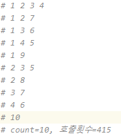

- 순열
  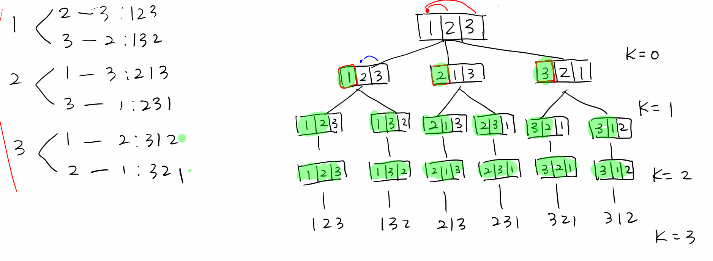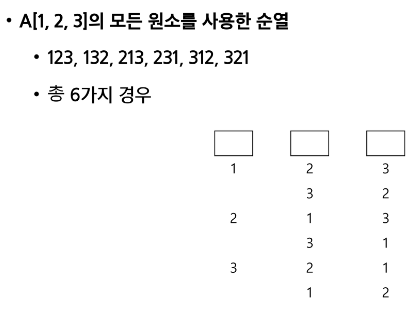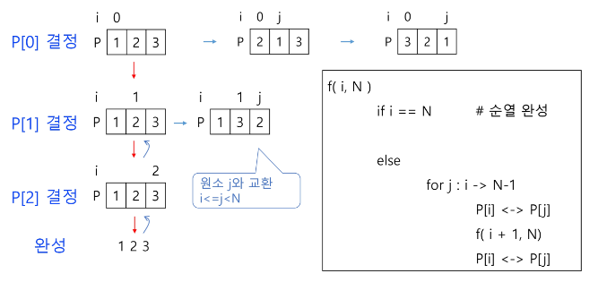
  
  - 코드
    
    
    
    
    - 가지치기 포함
    
    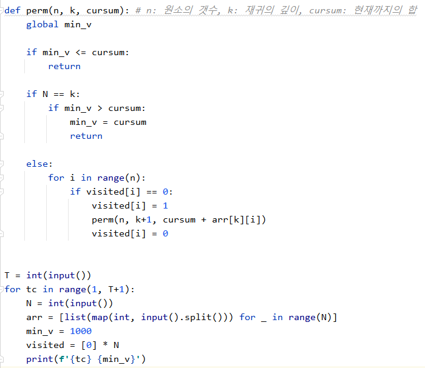

### 분할 정복 알고리즘

- 참고) 주로 분할 정복은 범위가 주어진단다...

- 설계 전략
  
  - 분할: 해결할 문제를 여러 개의 작은 부분으로 나눈다.
  
  - 정복: 나눈 작은 문제를 각각 해결한다.
  
  - 통합: (필요하다면) 해결된 해답을 모은다.

- 예제(거듭제곱)
  
  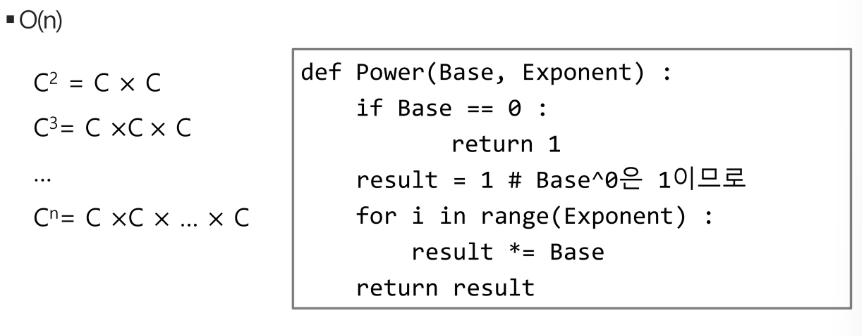
  
  - 이걸 분할 정복 지반의 알고리즘으로
    
    
    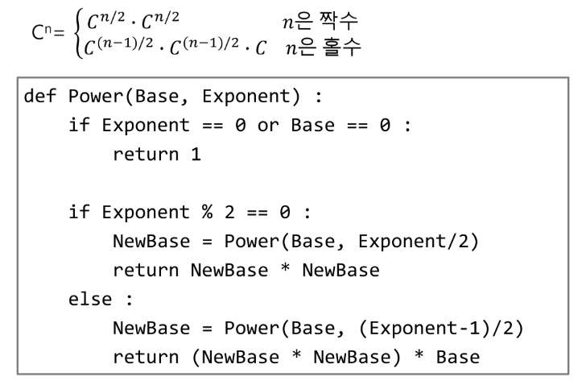

    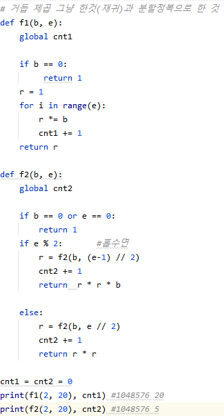

- 퀵 정렬(이후에 더 자세히 하겠지 뭐..)

---

## 큐(Queue)

- 큐의 특성
  
  - 스택과 마찬가지로 삽입과 삭제의 위치가 제한적인 자료구조
    
    - 큐의 뒤에서는 삽입만 하고, 큐의 앞에서는 삭제만 이루어지는 구조
  
  - 선입선출구조(FIFO: First In First Out)
    
    - 큐에 삽입한 순서대로 원소가 저장되어, 가장 먼저 삽입된 원소는 가장 먼저 삭제 된다.

- 큐의 구조 및 기본연산
  
  - 큐의 선입선출 구조
    
    
  
  - 큐의 기본 연산
    
    - 삽입 : enQueue
    
    - 삭제 : deQueue

- 큐의 주요 연산
  
  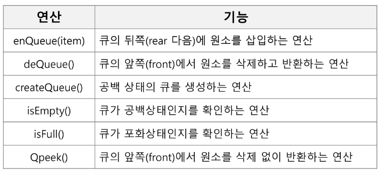

### 선형큐

- 큐의 연산 과정
  
  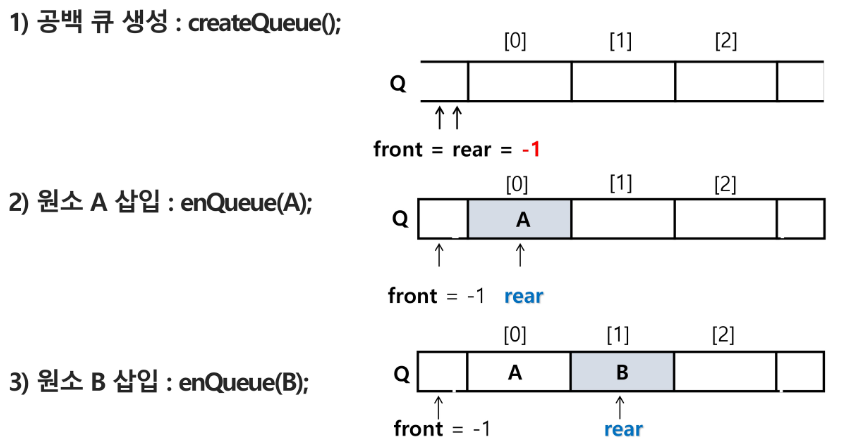
  
  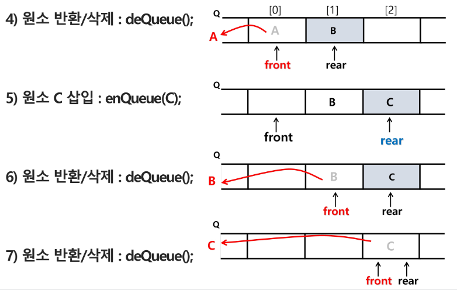

- 큐의 구현
  
  - 선형큐
    
    - 1차원 배열을 이용한 큐
      
      - 큐의 크기 = 배열의 크기
      
      - front : 저장된 첫 번째 원소의 인덱스(마지막 삭제 위치)
      
      - rear: 저장된 마지막 원소의 인덱스(마지막 저장 위치)
    
    - 상태 표현
      
      - 초기 상태 : front = rear = -1
      
      - 공백 상태 : front == rear
      
      - 포화 상태 : rear == n-1 (n: 배열의 크기, n-1: 배열의 마지막 인덱스)
  
  - 초기 공백 큐 생성
    
    - 크기 n인 1차원 배열 생성
    
    - front 와 rear를 -1로 초기화
  
  - 삽입 : enQuene(item)
    
    - 마지막 원소 뒤에 새로운 원소를 삽입하기 위해
      
      1. rear 값을 하나 증가시켜 새로운 원소를 삽입할 자리를 마련
      
      2. 그 인덱스에 해당하는 배열원소 Q[rear]에 item을 저장
         
         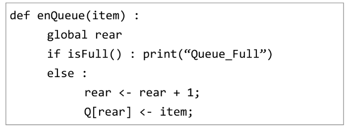
         여기서 isFull은 그냥 디버깅 용도(생략 가능, 애초에 크게 사이즈 잡을 것이므로)
  
  - 삭제: deQueue()
    
    - 가장 앞에 있는 원소를 삭제하기 위해
      
      1. front 값을 하나 증가시켜 큐에 남아있게 될 첫 번째 원소 이동
      
      2. 새로운 첫 번째 원소를 리턴 함으로써 삭제와 동일한 기능함
         
         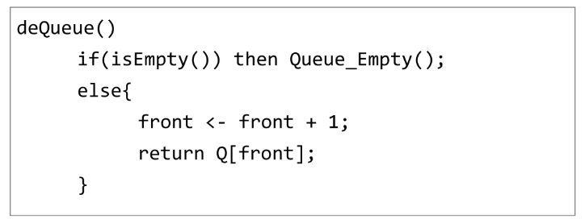
  
  - 공백 상태 및 포화상태 검사 : isEmpty(), isFull()
    
    - 공백 상태 : front == rear
    
    - 포화 상태 : rear == n-1 (n: 배열의 크기, n-1: 배열의 마지막 인덱스)
      
      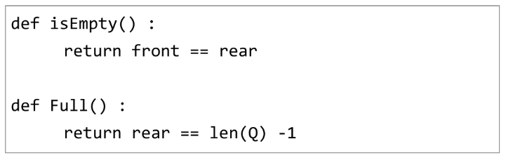
  
  - 검색: Qpeek()
    
    - 가장 앞에 있는 원소를 검핵하여 반환하는 연산
    
    - 현재  front의 한자리 뒤(front + 1)에 있는 원소, 즉 큐의 첫 번째에 있는 원소를 반환
      
      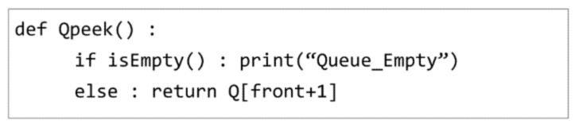

- 코드
  
  - front, rear 사용
    

- 메소드 사용
  
    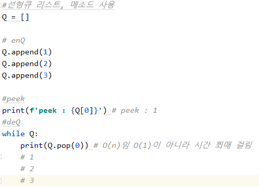

- deque 사용
  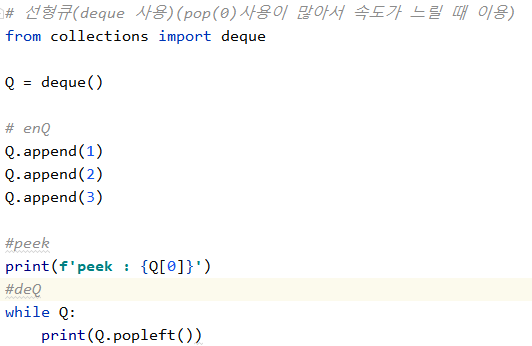

- 함수 이용
  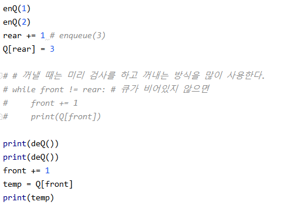

### 원형큐

- 선형 큐 이용시의 문제점
  
  - 잘못된 포화상태 인식
    
    - 선형 큐를 이용하여 원소의 삽입과 삭제를 계속할 경우, 배열의 앞부분에 활용할 수 있는 공간이 있음에도 불구하고, rear = n-1인 상태 즉, 포화상태로 인식하여 더 이상의 삽입을 수행하지 않게 됨
      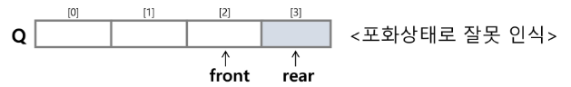

- 해결 방법 1
  
  - 매 연산이 이루어질 때마다 저장된 원소들을 배열의 앞부분으로 모두 이동시킴
    
    - 잠깐!!, 이거 구현 할 줄 아니?(cf) 앞에 놈 먼저 당겨줘야 안 덮어짐)
  
  - 원소 이동에 많은 시간이 소요되어 큐의 효율성이 급격히 떨어짐
    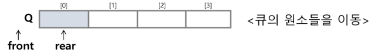

- 해결 방법 2
  
  - 1차원 배열을 사용하되, 논리적으로는 배열의 처음과 끝이 연결되어 원형 형태의 큐를 이룬다고 가정하고 사용
  
  - 원형 큐의 논리적 구조
    
    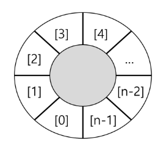

- 원형 큐의 구조
  
  - 초기 공백 상태
    
    - front = rear = 0
  
  - index의 순환
    
    - front와 rear의 위치가 배열의 마지막 인덱스인 n-1를 가리킨 후, 그 다음에는 논리적 순환을 이루어 배열의 처음 인덱스인 0으로 이동해야 함
    
    - 이를 위해 나머지 연산자 mod를 사용함
  
  - front 변수
    
    - 공백 상태와 포화 상태 구분을 쉽게 하기 위해 front가 있는 자리는 사용하지 않고 항상 빈자리로 둠 ~~(이렇게 하지 않으면 공백과 포화 상태 구분 불가)~~
  
  - 삽입 위치 및 삭제 위치
    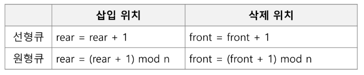

- 원형 큐의 연산 과정
  
  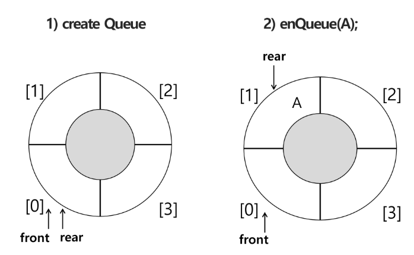
  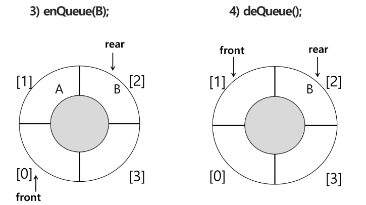
  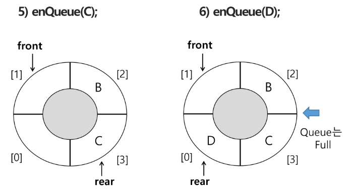
  ~~여기서 6번이 꽉 찬 상태이다.(front 자리는 비어있어야 하므로)~~

- 원형 큐의 구현
  
  - 초기 공백 큐 생성
    
    - 크기 n인 1차원 배열 생성
    
    - **front와 rear를 0으로 초기화**
  
  - 공백상태 및 포화상태 검사 : isEmpty(), isFull()
    
    - 공백상태: front == rear
    
    - 포화상태: 삽입할 rear의 다음 위치 == 현재 front
      
      - (rear+1) mod n == front
        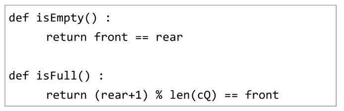
  
  - 삽입: enQuene(item)
    
    - 마지막 원소 뒤에 새로운 원소를 삽입하기 위해
      
      1. rear 값을 조정하여 새로운 원소를 삽입할 자리를 마련함:
         
         rear < - (rear+1)mod N;
      
      2. 그 인덱스에 해당하는 배열원소 cQ[rear]에 item을 저장
         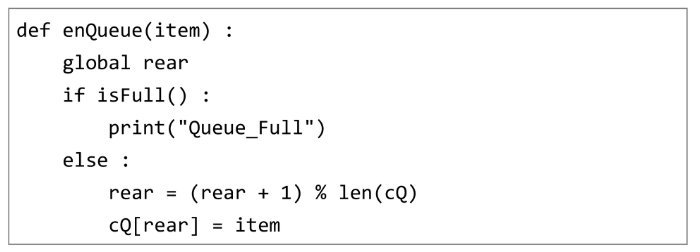
  
  - 삭제: deQuene(), delete()
    
    - 가장 앞에 있는 원소를 삭제하기 위해
      
      1. front 값을 조정하여 삭제할 자리를 준비함
      
      2. 새로운 front 원소를 리턴 함으로써 삭제와 동일한 기능함
         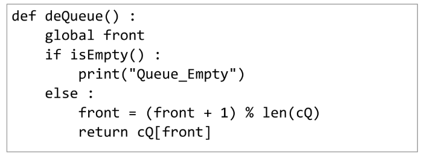
  
  - 추가
    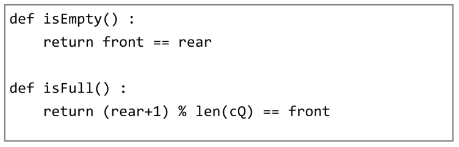

- 코드
  

### 우선순위 큐(참고)

- 우선순위 큐의 특성
  
  - 우선순위를 가진 항목들을 저장하는 큐
  
  - FIFO 순서가 아니라 우선순위가 높은 순서대로 먼저 나가게 된다.

- 우선순위 큐의 적용 분야
  
  - 시뮬레이션 시스템
  
  - 네트워크 트래픽 제어
  
  - 운영체제의 테스크 스케줄링

- 우선순위 큐의 구현
  
  - 배열을 이용한 우선순위 큐
  
  - 리스트를 이용한 우선순위 큐

- 우선순위 큐의 기본 연산
  
  - 삽입: enQuene
  
  - 삭제: deQuene
    
    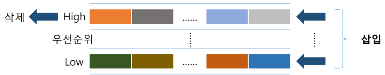

- 배열을 이용하여 우선순위 큐 구현
  
  - 배열을 이용하여 자료 저장
  
  - 원소를 삽입하는 과정에서 우선순위를 비교하여 적절한 위치에 삽입하는 구조
  
  - 가장 앞에 최고 우선순위의 원소가 위치하게 됨

- 문제점
  
  - 배열을 사용하므로, 삽입이나 삭제 연산이 일어날 때 원소의 재배치가 발생함
  
  - 이제 소요되는 시간이나 메모리 낭비가 큼

### 큐의 활용: 버퍼(참고)

- 버퍼
  
  - 데이터를 한 곳에서 다른 한 곳으로 전송하는 동안 일시적으로 그 데이터를 보관하는 메모리의 영역
  
  - 버퍼링: 버퍼를 활용하는 방식 또는 버퍼를 채우는 동작을 의미한다.

- 버퍼의 자료 구조
  
  - 버퍼는 일반적으로 입풀력 및 네트워크와 관련된 기능에서 이용된다.
  
  - 순서대로 입력/출력/전달되어야 하므로 FIFO 방식의 자료구조인 큐가 활용된다.

### BFS

- 그래프를 탐색하는 방법에는 크게 2가지가 있음
  
  - 깊이 우선 탐색(Depth First Search, DFS)
  
  - 너비 우선 탐색(Breadth First Search, BFS)

- 너비 우선 탐색이란?
  
  - 탐색 시작점의 인접한 정점들을 먼저 모두 차례로 방문한 후에, 방문했던 정점을 시작점으로 하여 다시 인접한 정점들을 차례로 방문하는 방식
  
  - 인접한 정점들에 대해 탐색을 한 후, 차례로 다시 너비우선탐색을 진행해야 하므로, 선입선출 형태의 자료구조인 큐를 활용함

- 참고
  
  - 거리 순 탐색을 할 때 유리
  
  - 거리별로, 가까운 놈은...(문제 힌트)

- 탐색 순서
  
  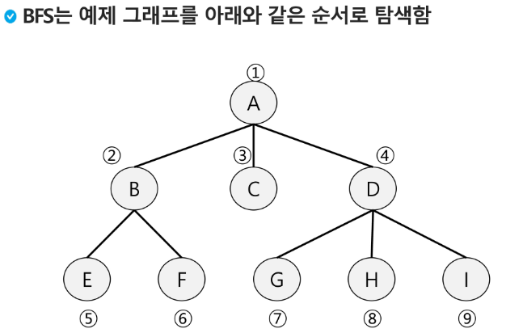

- BFS 알고리즘(enQ할 때 방문체크)
  
  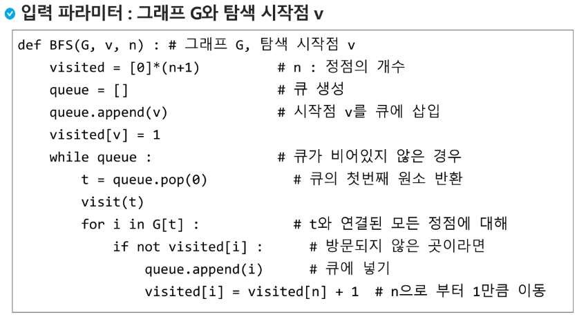

- visited 위치를 보면 이미 처리했어요 느낌(이미 줄 서 있으니 또 세우지 마!!)

- **여러 경로로 이어져 있으면 더 빠른 순으로 탐색된다는 특징이 있다.**

- visited[i] = visited[t] + 1 : 거리 세어주는 느낌(위의 사진 오타임)

- 가장 많이 걸리는 시간이나 거리 물어봤을 때 1 빼는 이유: 자기 자신의 땅에서 자기 자신으로 가는 것 고려

- 연습문제
  
  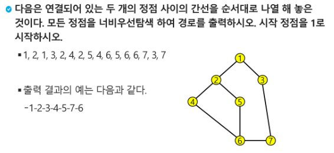
  
  - 1부터 시작할 때
    
    
  
  - 2부터 시작할 때
    
    

- 코드
  
  - 인접 행렬로
    
  
  - 인접 리스트로
    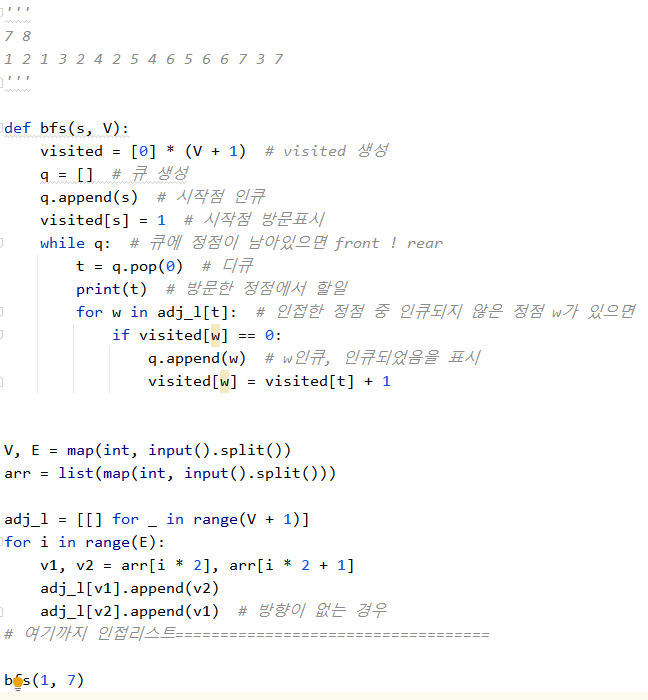
