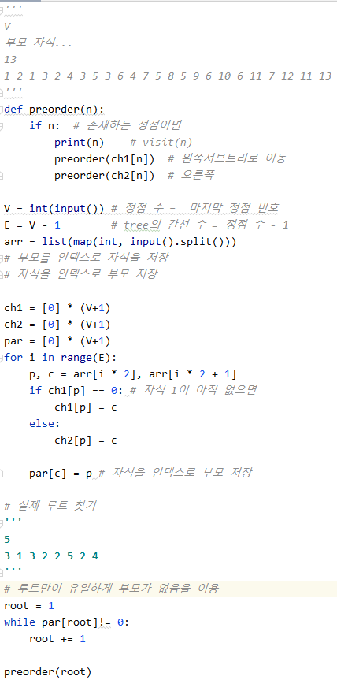
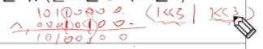

# 0821_0824 TIL

## 잡다한 것

- 변수명 만들 때: a, e, i, o, u 모음만 지워서 만들기

- 클린 코드

- xx까지만 해도 점수를 어느 정도 받을 수 있습니다. -> 일단 그 구현이 먼저 필요하겠구나

- 뒤에서부터 생각해서 문제를 풀 수 있을까?(생각의 전환 필요)

- 문제에서 주어진 정보 활용하기-> 기껏 배열의 길이(N)줬는데 len(arr)쓰지 말 것!

- 꿀팁 (입력의 앞 뒤에 0 달아서 풀기)
  

- 이런 식으로 왔다 갔다 하구나
  

- 이런 방식도 기억하면 좋을 듯
  

- 함수로 변환해야 될 것 같을 때
  

---

## Tree(트리)

### 트리

- 트리의 개념
  
  - 비선형 구조
  
  - 원소들 간의 1:n 관계를 가지는 자료구조
  
  - 원소들 간에 계층관계를 가지는 계층형 자료구조
  
  - 상위 원소에서 하위 원소로 내려가면서 확장되는 트리(나무)모양의 구조

- 트리 - 정의
  
  

- 트리 - 용어정리
  
  
  
  
  

### 이진 트리

- 이진 트리란?
  
  - 모든 노드들이 2개의 서브트리를 갖는 특별한 형태의 트리
  
  - 각 노드가 자식 노드를 최대한 2개 까지만 가질 수 있는 트리
    
    - 왼쪽 자식 노드
    
    - 오른쪽 자식 노드
  
  - 자식 노드가 2개 이내 이기만 하면 된다.
  
  - 예
    
    

- 이진 트리 - 특성
  
  - 레벨 i에서의 노드의 최대 개수는 2^i개
  
  - 높이는 h인 이진 트리가 가질 수 있는 노드의 최소 개수는 (h+1)개가 되며, 최대 개수는 (2^(h+1)-1)개가 된다.
  
  - 외울 필요는 없고 넣어보고 유추하든가 하면 됨.
    
    

- 이진 트리 -  종류
  
  - 포화 이진 트리(Full Binary Tree)(살짝 중요)
    
    - 모든 레벨에 노드가 포화상태로 차 있는 이진 트리
    
    - 높이가 h일 때,  최대의 노드 개수인 (2^(h+1)-1)의 노드를 가진 이진 트리
    
    - 루트를 1번으로 하여 2^(h+1)-1까지 정해진 위치에 대한 노드 번호를 가짐
      
      
  
  - 완전 이진 트리(Complete Binary Tree)(중요!!)
    
    - 높이가 h이고 노드 수가 n개 일 때 (단, 2^h <= n <= 2^(h+1)-1), 포화 이진 트리의 노드 번호 1번부터 n번 까지 빈 자리가 없는 이진 트리
    
    - 예) 노드가 10개인 완전 이진 트리
      
      
      
      
      
      **완전 이진 트리이면 1차원 배열로 풀고, 아니면 인접 리스트로 풀어라!!**
  
  - 편향 이진 트리(Skewed Binary Tree)
    
    - 높이 h에 대한 최소 개수의 노드를 가지면서 한쪽 방향의 자식 노드만을 가진 이진 트리
    
    - ~~이진 탐색이나 이런 거 할 때 안 좋겠지??~~
      
      - 왼쪽 편향 이진 트리
      
      - 오른쪽 편향 이진 트리
        
        

- 이진트리 - 순회(traversal)(중요)
  
  - 순회란?
    
    - 트리의 각 노드를 중복되지 않게 전부 방문(visit)하는 것을 말하는 데 트리는 비 선형 구조이기 때문에 선형구조에서와 같이 선후 연결 관계를 알 수 x
      
      - 따라서 특별한 방법 필요
    
    
    
    - 어떤 순회를 하든지 간에 자식 내부에서의 우선 순위는 무조건 왼쪽 자식 먼저이다.
  
  - 전위 순회(preorder traversal)
    
    
    - 예
      
    - 서브 트리의 루트 부터 탐색 시작한 경우에는 서브 트리 내에서만 순회한다.(만약 B부터 순회했다면 A와 B사이의 간선이 끊어져 있다고 생각해도 됨)
    - 트리는 내려가려고 만든? 구조이므로 만약 B부터 시작한다면 A 위로 올라가지 않는다!!
    - 즉, 서브 트리의 순회는 서브트리 내에서만 순회하고 끝
    - 다른 순회도 위의 내용 동일함

- 중위 순회(inorder traversal)
  
  
  - 예
    
    
    
  
  - 중위 순회 코드
    

- 후위 순회(postorder traversal)
  
  
  - 예
    

### 이진 트리의 표현

- 배열을 이용한 이진 트리의 표현
  
  - 이진 트리에 각 노드 번호를 다음과 같이 부여
  
  - 루트의 번호를 1로 함
  
  - 레벨 n에 있는 노드에 대하여 왼쪽부터 오른쪽으로 2^n 부터 2^(n+1) -1까지 번호를 차례로 부여
    
  
  - 노드 번호의 성질(매우 중요!!!)
    
    
    참고) i가 음수 일때를 생각하면 버림이라고 생각하면 안됨을 알 수 있다.
    단, 인덱스가 음수 일리가 없으므로  여기서는 버림이라고 생각해도 됨
    
    
    
    - 참고
      
      보면, 완전이진 트리가 아니라서 저장 hard 함을 알 수 있다.
      (완전 이진일 때만 1차원 배열로 저장하자!!! )

### [참고] 이진 트리의 저장 (이것도 참고라 아니라 중요!!)

- **정점의 수 =  간선의 수 + 1**

- 부모 번호를 인덱스로 자식 번호를 저장
  

- 자식 번호를 인덱스로 부모 번호를 저장
  

- 인접 리스트로도 구현 가능(**이거 기억하기!!!**)
  
  

- 루트 찾기, 조상 찾기
  
  
  - 루트만이 유일하게 부모가 없음을 이용!

- 배열을 이용한 이진 트리의 표현의 단점(참고)
  
  - 편향 이진 트리의 경우에 사용하지 않는 배열 원소에 대한 메모리 공간 낭비 발생
  
  - 트리의 중간에 새로운 노드를 삽입하거나 기존의 노드를 삭제할 경우 배열의 크기 변경 어려워 비효율적

- 트리의 표현 - 연결리스트(참고)
  
  - 배열을 이용한 이진 트리의 표현의 단점을 보완하기 위해 연결리스트를 이용하여 트리를 표현할 수 있다.
  
  - 연결 자료 구조를 이용한 이진트리의 표현
    
    - 이진 트리의 모든 노드는 최대 2개의 자식 노드를 가지므로 일정한 구조의 단순 연결 리스트 노드를 사용하여 구현
      

### 연습문제 , 수식 트리(참고)

- 연습문제 코드
  
  
  - 인접 리스트 방식으로 해보기
    

- 수식 트리(참고)
  
  

- 수식 트리의 순회(참고)
  
  

### 이진탐색 트리

- 탐색연산
  

- 예(13탐색)
  
  

- 삽입 연산
  

- 삭제 연산(연결 리스트 이용해야 됨..)
  
  

- 이진 탐색 트리 - 성능(참고)
  
  - 한 쪽으로 치우치면 성능 떨어지므로 그렇지 않도록 하는 알고리즘 이용(hard해서 다음에 알아보자.)

### 힙(중요!) (완전 이진 트리 구조이다!)

- **이진 탐색 트리는 왼쪽보다 오른쪽 서브트리가 크다는 특징이 있었지만 heap은 부모 자식 간의 관계만 만족하면 끝이다!!!**

- 힙 연산 - 삽입
  
  
  

- 힙 연산 - 삭제
  
  
  
  - 과정
    
    - 루트 따로 빼놓기(임시저장) (왜냐하면 내부적으로 정리 필요하므로)(루트 위치에 마지막 요소 올릴 것이므로)
    
    - 마지막 노드 삭제하고 루트 위체에 올려주기(하나 삭제한 것이므로 last도 하나 줄임)
    
    - 자식 둘 중에 큰 자식 찾고 그거랑 부모랑 비교하고 바꾸기
    
    - 자식이 없거나 부모가 크면 비교 중지 (최대힙 일 때)
  
  - 힙 삭제 코드
    
  
  - import 이용한 코드
    

- 힙을 이용한 우선 순위 큐
  

### 문제 풀이(참고)

---

## Start

### SW 문제 해결(pass)

### 복잡도 분석

### 표준 입출력 방법(pass)

### 비트 연산

- 비트 연산자
  
  
  주로 xor는 특정 비트를 반전, ~은 모든 비트를 반전 시킬 때 쓰인다.
  
  

- 비트 연산
  
  
  
  특정 비트가 1인 값 만들기 -> `(1 << 5 | 1 << 3)` : 5번 비트랑 3번 비트가 1인 값 만들기, 즉, 2비트 이상을 1로 만들고 싶을 때는 각각 만들고 |를 해주면 된다.
  
  
  
  

- 비트 관련 코드
  

- 예제
  

- 엔디안(Endianness)(참고)
  
  
  

### 진수

1의 보수 안 쓰는 이유: 0과 -0이 동시에 존재하는 경우가 생기므로

2의 보수는 계산도 용이 [6 - 2 = 6 + (-2)]
3 bits 범위 => (-2^2) ~ (2^2 -1)

### 실수(실수 저장 시 오차 발생)

그나마 줄일려고 if a == b(오차 생겨도 맞다고 할 수 있음)=> if abs(c-d) < 10^-6, 이렇게 하면 좀 더 정확하게 할 수 있을 것이다.

~~소수점 위의 자리수가 높다면 소수점 아래의 숫자가 저장될 수 있는 공각이 줄어들어서 소수점까지의 값 보장이 안 될 수 있다.~~
