# 0918_0921 TIL

## 잡다한 것

- 지금까지 해온것들 정리
  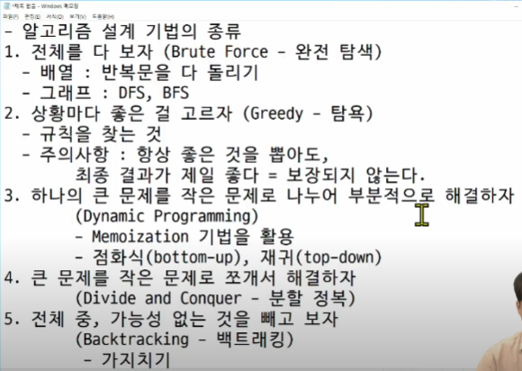

- 병합 정렬과 퀵 정렬을 sort()랑 sorted()가 있는데 왜 배워야 할까?
  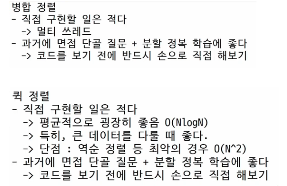

- Parametric Search (참고) (B형)
  
  - lower bound
  
  - upper bound
    
    - 여러 개의 데이터 중 2가 처음 나온 시점
    
    - 2~9 사이의 데이터는 몇 개인가?

- 반복하는데 구조가 변하지 않는다?? -> 재귀로 구현

- 백트래킹을 할 때는 어떤 구조로 내려갈 지를 구상한 뒤 작성(그래야 기본 틀을 암)

- 배열은 원소의 타입과 이름이 모두 같아야 한다.

- disjoint-sets와 union find는 완전히 같진 않다. 
  
  - disjoint-sets를 구할려고 union find를 쓰는 것이다.
  
  - disjoint-sets는 자료구조 이름, union find는 알고리즘 이름이다.

- B형에 대한 정보: 박트리

- 최단 경로 pdf 찾아보기(MM에 있음)

- Knapsack 문제는 부분집합으로도 가능

- 문제 접근 TIP
  
  

- 문제 풀이 정리(요약)
  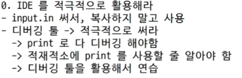
  

- Prim, KRUSKAL, Dijkstra 알고리즘 정도는 대기업 코테에 나올만 함

- 재귀 TIP: 중복 미포함?은 트리 방식(뽑고, 안 뽑고로 구별)이 좋다!(for 보단.)

- Prim, Dijkstra
  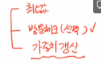

- heapq에 대해

---

## 분할 정복 & 백트래킹

### 분할정복

- 분할 정복 기법
  
  - 설계 전략
    
    - 분할: 해결할 문제를 여러 개의 작은 부분으로 나눈다. (나눌 수 없을 때까지 == 문제를 쉽게 해결할 수 있을 때까지)
    
    - 정복: 나눈 작은 문제를 각각 해결한다.
    
    - 통합: (**필요하다면**) 해결된 해답을 모은다.
  
  - 사용 예: 병합 정렬, 퀵 정렬, 이진 탐색

- 분할 정복의 활용
  
  - 병합 정렬은 외부 정렬의 기본이 되는 정렬 알고리즘이다. 또한 멀티코어(Multi-Core) CPU 나 다수의 프로세서에서 정렬 알고리즘을 병렬화하기 위해 병합 정렬 알고리즘이 활용된다.
  
  - 퀵 정렬은 매우 큰 입력 데이터에 대해서 좋은 성능을 보이는 알고리즘이다.

### 병합 정렬 & 퀵 정렬

- 병합 정렬
  
  - 배열 이용 x (유사한 배열에 대해 계속해서 복사를 반복하면 느려짐)
    
    - 그래서 Linked list 이용(그냥 잘라서 붙이면 된다.)
  
  - 여러 개의 정렬된 자료의 집합을 병합하여 한 개의 정렬된 집합으로 만드는 방식
  
  - 분할 정복 알고리즘 활용
    
    - 자료를 최소 단위의 문제까지 나눈 후에 차례대로 정렬하여 최종 결과를 얻어냄
    
    - top-down 방식
  
  - 과정
    
    - 분할 단계와 병합 단계로 나뉜다.
      
      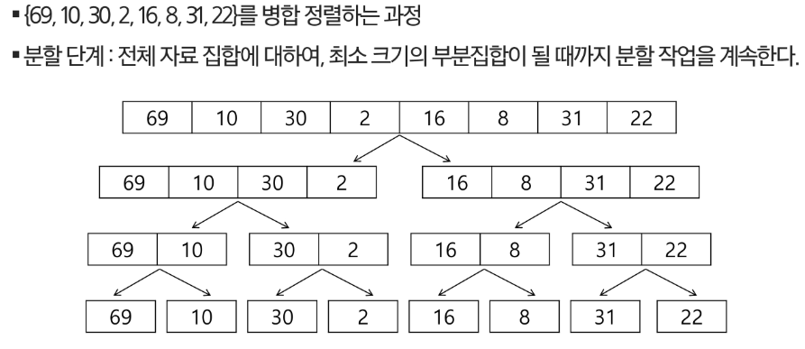
      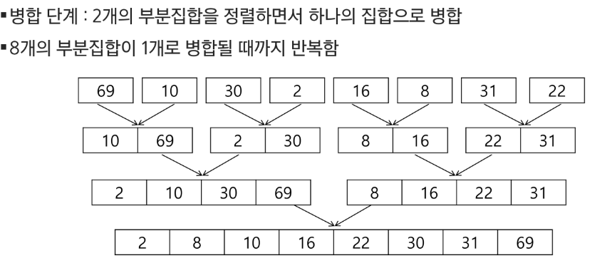
  
  - 알고리즘: 분할 과정
    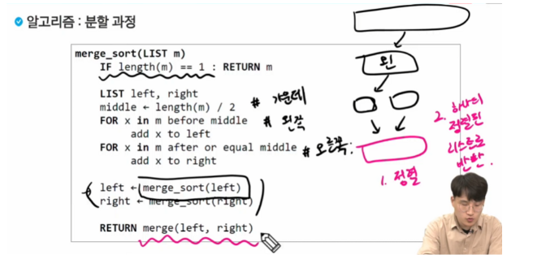
  
  - 알고리즘: 병합 과정
    
  
  - 병합 과정 추가 설명:
    
    - i 랑 j 랑 비교하고 움직임
    
    - 더 작은 놈을 result에다가 pop(0)을 하고 붙어준다.
    
    - 한쪽이 먼저 다 돌아갔다? 그러면 덜 돌아간 쪽의 나머지는 다 돌아간 쪽의 것보다 전부 크다는 것을 알 수 있다.
    
    - 그러므로 result의 뒤에다가 바로 나머지를 다 달아주면 된다.(~~해당 나머지는 이미 정렬이 되면서 올라온 상태~~) (~~이때 연산이 많이 줄어들 듯~~)

- 퀵 정렬
  
  - 주어진 배열을 두 개로 분할하고, 각각을 정렬한다.
    
    - 병합 정렬과 동일?
  
  - 다른 점1: 병합 정렬은 그냥 두 부분으로 나누는 반면에, 퀵 정렬은 분할할 때, 기준 아이템(pivot item)중심으로, 이보다 작은 것은 왼편, 큰 것은 오른편에 위치시킨다.
  
  - 다른 점2: 각 부분 정렬이 끝난 후, 병합정렬은 "병합"이란 후처리 작업이 필요하나, 퀵 정렬은 필요로 하지 않는다.
  
  - 알고리즘
    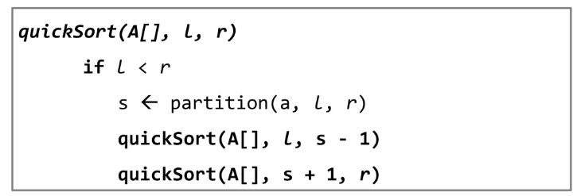
    
    - Hoare-Partition 알고리즘
      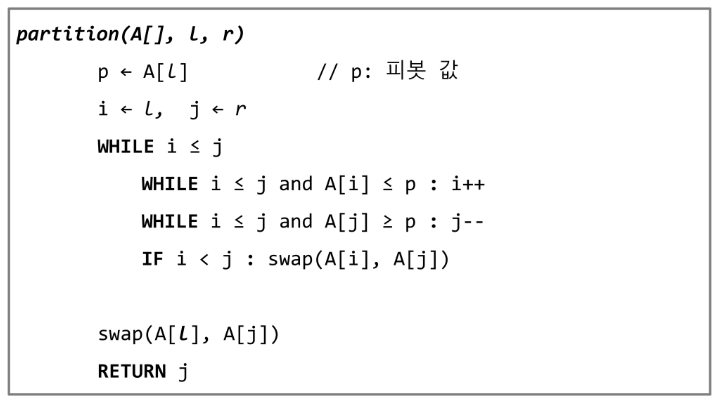
    
    - 아이디어
      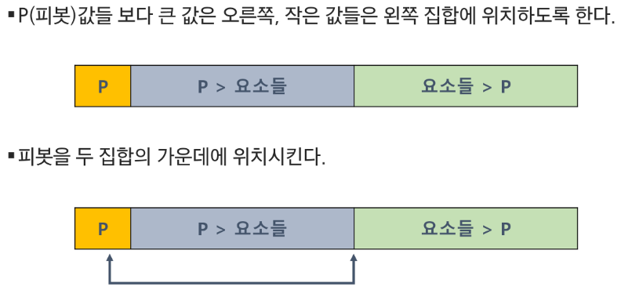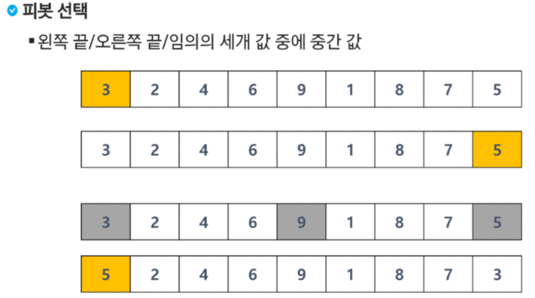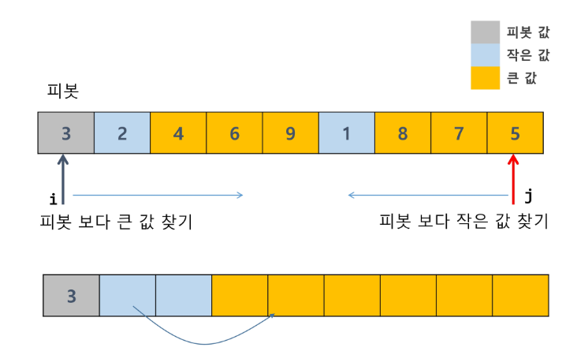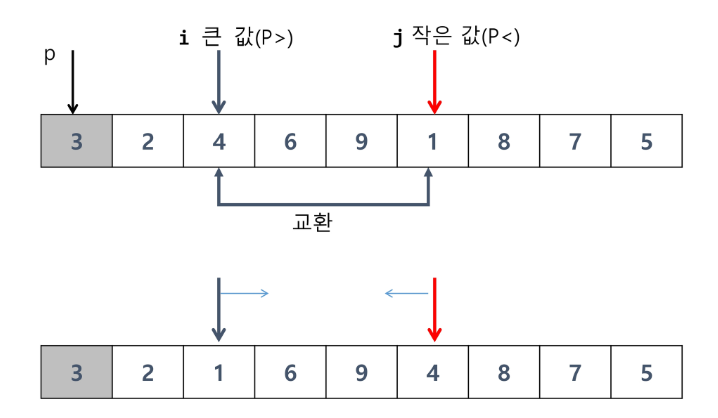
      
      언제 까지?? i와 j가 교차되는 시점까지 진행(1 사이클)
      
      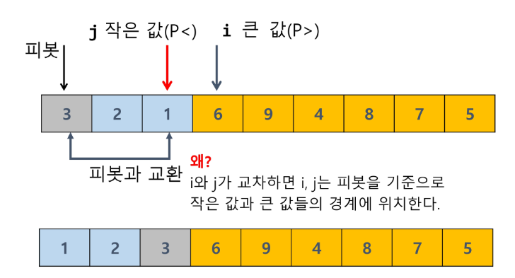
      
      Lomuto partition 알고리즘(위의 것보다 안 좋음, 같은 숫자가 많으면 쓸데없는 스왑이 많아진다.)(왜 =이 필요할 까??)
      
      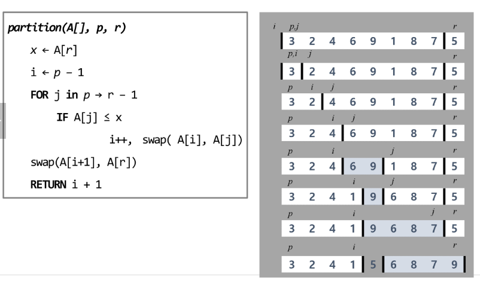
      
      - hoare 방식과 달리 i와 j가 같이 이동
      
      - r(기준)은 맨 뒤로
      
      - r(기준)보다 작으면 i와 j 모두 ++
      
      - r(기준)보다 크면 j만 ++ (언제까지? 기준보다 작은 것을 만날 때까지)
      
      - j만 늘려가다가 만약에 r(기준)보다 작은 것을 만나면?
        
        - i 바로 뒤의 것과 방금 찾은 j끼리 swap
      
      - j가 기준보다 작거나 같은 것을 만나지 못하면 i 바로 뒤에 기준(r)이 온다.
        (~~이때 단축이 될 듯~~) 
    
    - 핵심은 피봇의 위치가 어디인지를 찾는 것이다!!(두 방식 다!)
  
  - 퀵 정렬 추가 내용
    

### 이진 검색(중요!!, 코테 단골 문제)

- 원하는 데이터를 빠르게 찾는 방법 중 하나(시간 복잡도 logN)

- 이진 검색이란?
  
  - 자료의 가운데에 있는 항목의 키 값과 비교하여 다음 검색의 위치를 결정하고 검색을 계속 진행하는 방법
    
    - 목적 키를 찾을 때까지 이진 검색을 순환적으로 반복 수행함으로써 검색 범위를 반으로 줄여가면서 보다 빠르게 검색을 수행함
  
  - 이진 검색을 하기 위해서는 자료가 **정렬**된 상태여야 한다.

- 검색 과정
  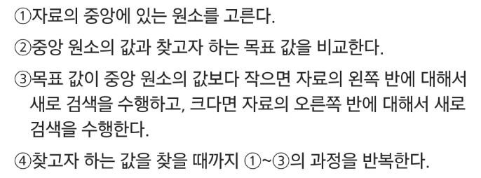

- 알고리즘: 반복 구조
  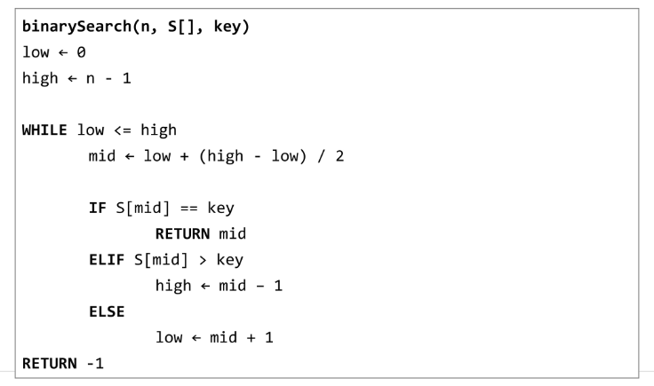

- 알고리즘: 재귀구조
  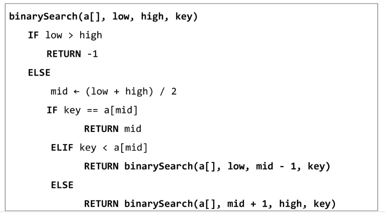

### 백트래킹

- 백트래킹 기본 구조
  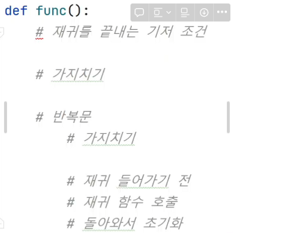

- 백트래킹 Tip:
  
  - 전체 경우의 수를 고려하고 그 중에서 가능성이 없는 경우의 수를 제거해라

- 백트래킹 개념
  
  - 여러 가지 선택지(옵션)들이 존재하는 상황에서 한가지를 선택
  
  - 선택이 이루어지면 새로운 선택지들의 집합이 생성된다.
  
  - 이런 선택을 반복하면서 최종 상태에 도달한다.
    
    - 올바른 선택을 계속하면 목표 상태에 도달한다.
  
  - 모든 후보를 검사?
    
    - No!!

- 백트래킹 기법
  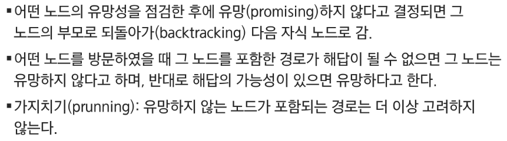

- 예(당첨 리프 노드 찾기)
  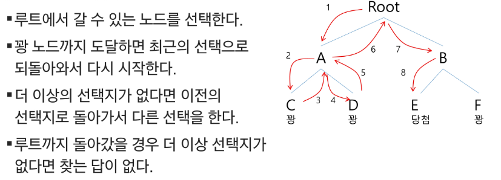

- 백트래킹과 깊이 우선 탐색과의 차이
  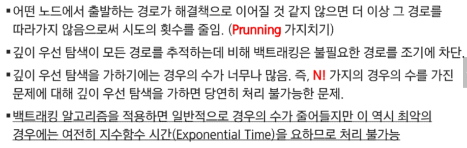

- 백트래킹을 이용한 알고리즘 절차
  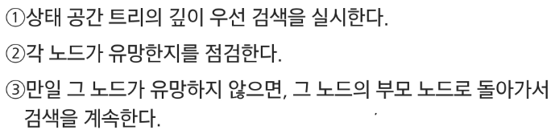

### 트리

#### 정리

- 트리란?
  
  - 사이클이 없는 무향 연결 그래프
    
    - 사이클: 한 지점부터 출발해서 다시 본인 지점으로 돌아오는 것
      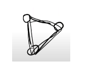
    
    - 연결 그래프: 모든 꼭지점이 서로 갈 수 있다.
      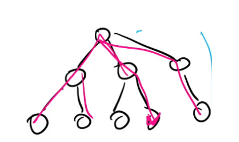
      
      - 중간에 끊어져서 갈 수 없다 ? 
        
        - 그러면 다른 트리이다.
  
  - 비선형 구조

- 이진 트리
  
  - 자녀 노드가 둘 이하인 트리
  1. 이진 트리 종류
     
     - 완전 이진 트리
       
       - 마지막 레벨을 제외한 모든 레벨은 꽉 차 있어야 한다.
       
       - 마지막 레벨 노드는 왼쪽부터 채워져야 한다.
     
     - 포화 이진 트리
       
       - 모든 레벨이 꽉 차있는 것
  
  2. 순회 방법
     
     - 전위(부모->좌->우)
     
     - 중위(좌->부모->우)
     
     - 후위(좌->우->부모)
       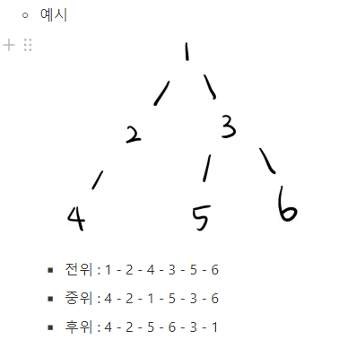
  
  3. 트리 저장 방법
     
     1. 일차원 배열 저장(이진 트리일 때 가능 )
        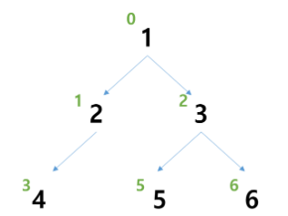
        
        - 시작 인덱스가 0일 때
          
          - 2n + 1 : 왼쪽 자식
          
          - 2n + 2: 오른쪽
        
        - 시작 인덱스가 1일 때
          
          - 2n : 왼쪽
          
          - 2n + 1: 오른쪽
     
     2. 인접 리스트로 저장
     
     3. 연결 리스트로 저장

- 교수님 정리
  

- 이진 탐색 트리
  
  
  - 찾으려는 값이 루트보다 크면 오른쪽만 보면 되고, 작으면 왼쪽만 보면 된다.
    (이진 검색 + 트리 느낌) 

- 이진 탐색 트리의 연산
  
  - 삽입 연산
    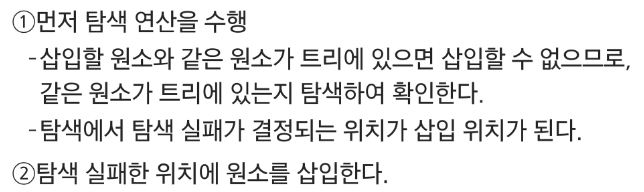
    
    - 예
      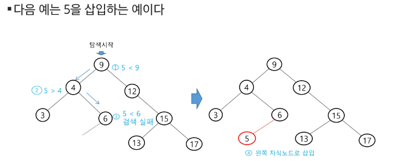
  
  - 삭제 연산(조금 어려움)
    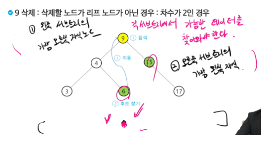
    
    - 각 서브트리에서 가능한 데이터를 찾아와야 된다.
      
      - 이거랑 바꾸면 나머지 트리는 문제가 없다가 보장 되어야 한다.
        
        - 왼쪽 서브트리의 가장 오른쪽 자식 노드와 오른쪽 서브트리의 가장 왼쪽 자식 노드 랑 바꾸기!! (1차원 배열로 봤을 때, 가운데를 지운다고 가정을 하면 이 가운데와 가장 가까운 데이터 임을 알 수 있다.) (그래서 얘네 2개랑 바꾸면 지장 x)

- 힙(heap)
  
  
  - 예
    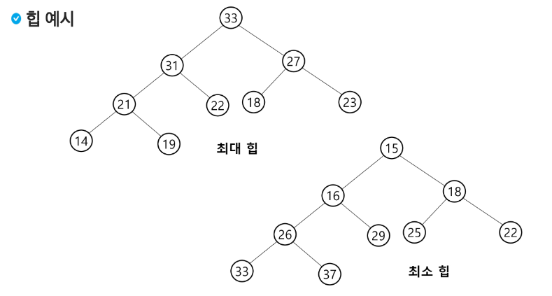
  
  - 힙 연산 - 삽입
    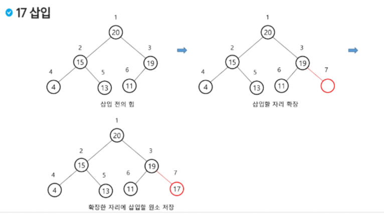
    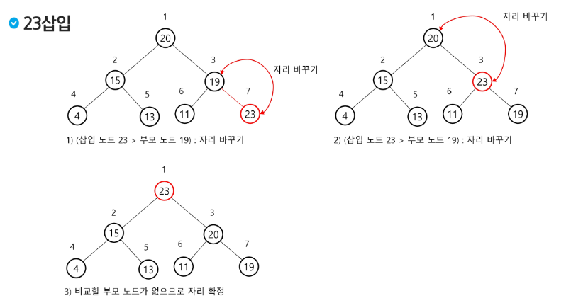
  
  - 힙 연산 - 삭제
    
    - 힙에서는 루트 노드의 원소만을 삭제 할 수 있다.
    
    - 루트 노드의 원소를 삭제하여 반환한다.
    
    - 힙의 종류에 따라 최대값 또는 최소값을 구할 수 있다.
      
      - 우선순위 큐와 비교
    
    - 예
      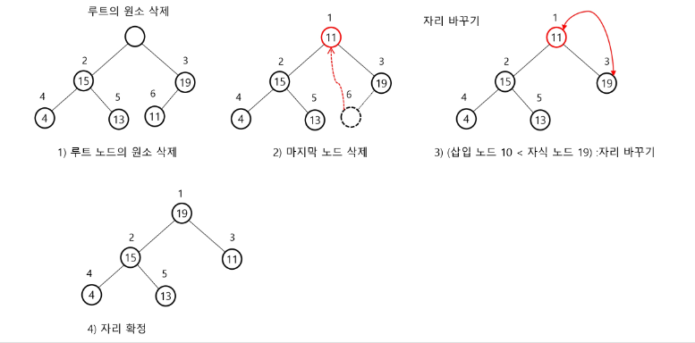

### 실습문제 풀이

---

## 그래프

### 그래프 기본

- 그래프
  
  - **데이터 간 관계**를 표현한 자료구조
    
    - 관계: 데이터 사이의 연관성
  
  - 그래프는 아이템(사물 또는 추상적 개념)들과 이들 사이의 연결 관계를 표현한다.
  
  - 그래프는 정점들의 집합과 이들을 연결하는 간선들의 집합으로 구성된 자료구조
    
    - V개의 정점을 가지는 그래프는 최대 V(V-1)/2 간선이 가능
  
  - 선형 자료구조나 트리 자료구조로 표현하기 어려운 N:N 관계를 가지는 원소들을 표현하기에 용이하다.

- 그래프 유형
  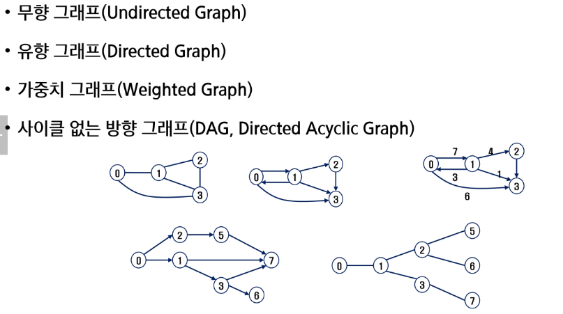

- 인접행렬(참고)
  
  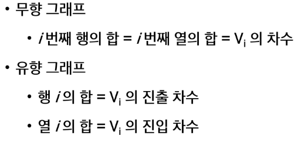
  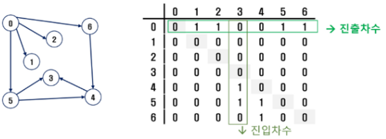
  
  - 단점: 메모리와 연산속도 BAD(그렇게 크진 않음)
  - 내가 갈 수 없는 곳도 0으로 표시하기 때문에 메모리 낭비 발생

- 인접 리스트
  
  - 내가 갈 수 있는 지점만 저장
  
  - 파이썬은 딕셔너리로도 구현 가능

### 그래프 순회(탐색)

- 그래프 순회란?
  
  - 비선형구조인 그래프로 표현된 모든 자료(정점)을 빠짐없이 탐색하는 것을 의미

#### DFS

- 스택과 재귀구현과의 차이점(참고)
  
  - 재귀는 처음으로 되돌아 온다.

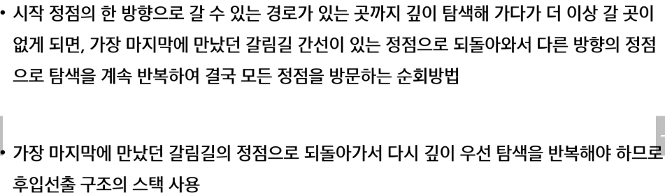

- 스택
  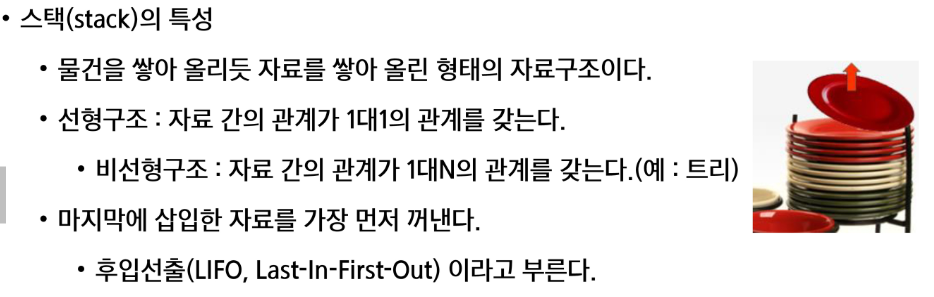

#### BFS

- 하고싶은 일은 enq때나 deq때 하면 되는데 주로 deq때 함
  
  - enq위치는 (처음 포함) 2군데라서

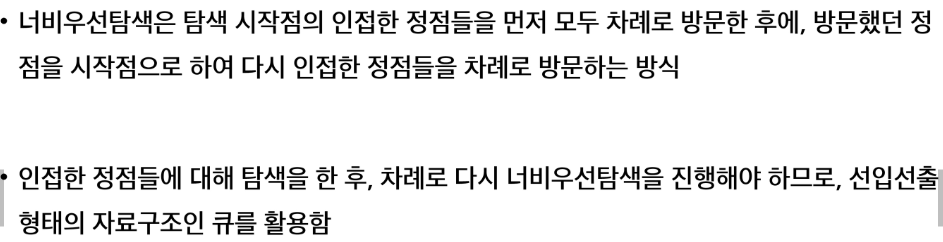

- 큐
  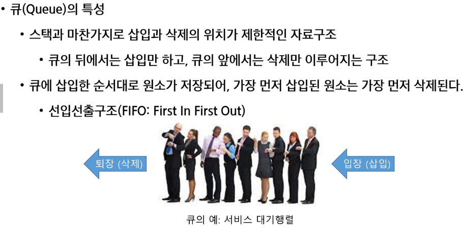

### 서로소 집합들

- 서로소 집합(Disjoint-sets)
  
  - 서로소 또는 상호배타 집합들은 서로 중복 포함된 원소가 없는 집합들이다. 다시 말해 **교집합이 없다.**
  
  - **집합에 속한 하나의 특정 멤버를 통해 각 집합들을 구분한다.** 이를 **대표자**라 한다.
  
  - **대표가 같으면 같은 그룹이야!!!**
  
  - 상호배타 집합을 표현하는 방법
    
    - 연결 리스트
    
    - 트리
  
  - 상호배타 집합 연산
    
    - Make-Set(x)
      
      - 그냥 전체 집합에다가 데이터를 추가하는 것
    
    - Find-Set(x)
      
      - 각 요소가 내가 속한 그룹의 대표자를 어떻게 찾을 지??
    
    - Union(x, y)
      
      - 대표자 저장(같은 그룹으로 묶기)

- 상호 배타 집합 표현- 연결리스트
  
  - 연결 리스트는 다만, 데이터가 추가 되거나, 연결이 끊기거나, 새로운 연결이 생길 때 복잡해짐(연산 불리) -> ~~그래서 코테때 트리를 이용 많이 한다.~~
    

- 상호 배타 집합 표현- 트리
  
  - 하나의 집합(a disjoint set)을 하나의 트리로 표현
  
  - 자식 노드가 부모 노드를 가리키며 루트 노드가 대표자가 된다.
    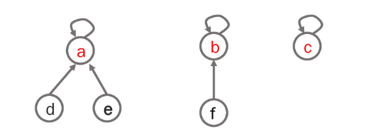
  
  - 연산 예
    
    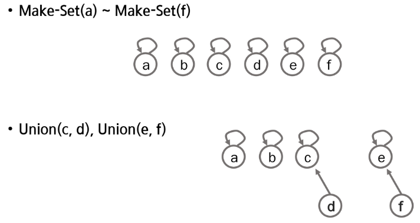
    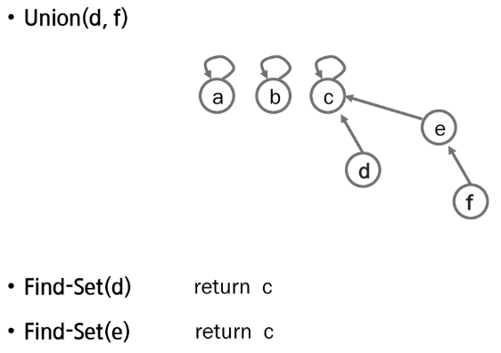
    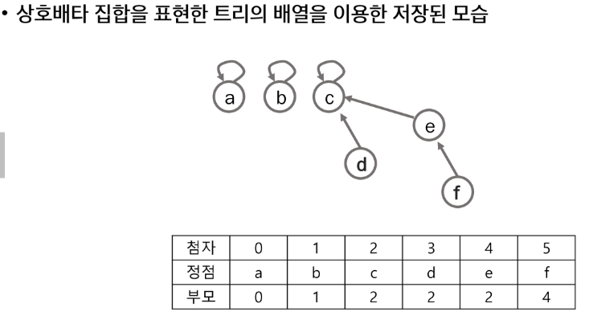

    대표가 있니? 대표가 있니? 하면서 계속 찾아 올라간다.
    (젤 위쪽으로 갔을 때 무엇??)(부모가 자기 자신을 가리키고 있으면 끝)
    (해당 부분에서 재귀를 쓰게 될 것임을 알 수 있다, 반복도 가능)

- 상호배타 집합에 대한 연산
  
  
  - 참고(Find_set(x))는 while(반복)으로도 구현 가능
    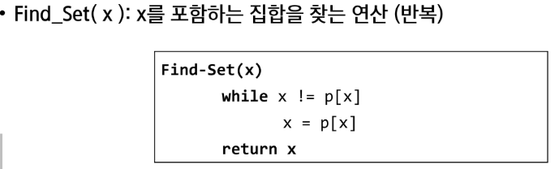
  
  - 문제점
    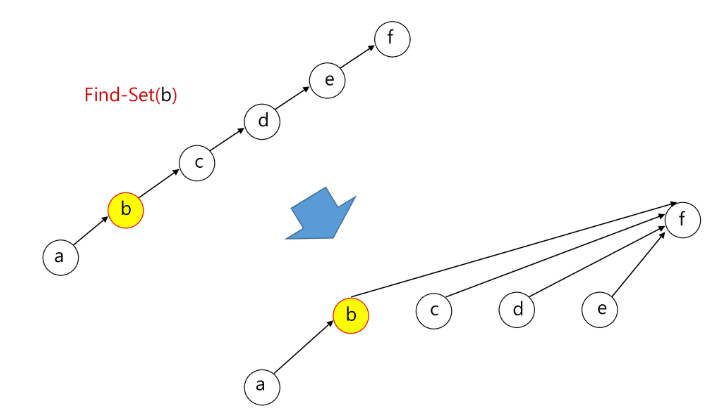
  
  - 연산의 효율을 높이는 방법
    
    
    다른 트리를 합칠 때 어떤 것을 대표로 해서 합치는 것이 효율적일까도 구현
    (더 적은 쪽을 큰 쪽으로 합쳐주는 것이 나을 것이다.) (Rank를 이용한 Union)
    
    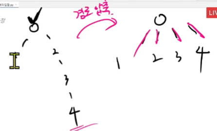
    비효율적으로 한 칸 씩 찾아올라감을 해결(경로 압축)

### 최소 비용 신장 트리(MST)

- 신장 트리란?
  
  1. 모든 정점을 연결
  
  2. 사이클이 존재하지 않는 부분 그래프
     
     - 간선의 개수: **N-1개**(정점의 개수 n)
  
  3. 한 그래프에서 여러 개의 신장 트리가 나올 수 있다.
     
     - 코드 짤 때 주의 - 신장트리 하나 구하고 나서 끝내지 말 것
     
     - 그래서 다익스트라 쓸 때 최소 비용은 구할 수 있어도 경로는 못 구한다는 것임
     
     - 예(한 그래프에서 4개의 신장트리가 나옴)
       
       
       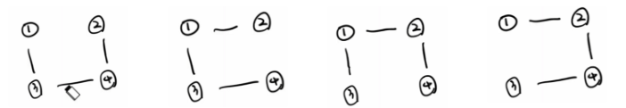

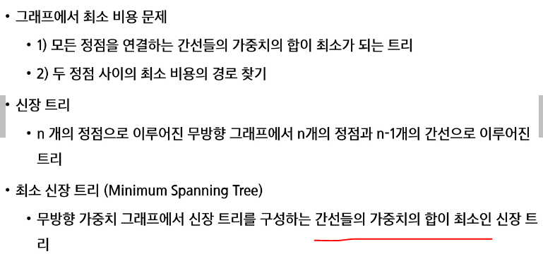

- 알고리즘 2가지
  
  1. 갈 수 있는 곳들 중 제일 짧은 곳으로 가자 (모든 정점을 방문할 때까지)(정점 위주)
     
     - BFS랑 비슷, 가중치를 활용
  
  2. 전체 간선들 중에서 제일 가중치가 적은 곳부터 선택하자
     
     - 간선 정보 정렬
       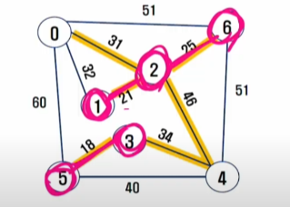

- Prim 알고리즘
  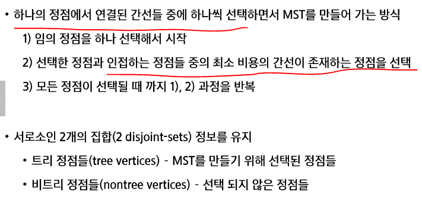
  
  - 어디서 출발하든 결과는 같으므로 임의 정점을 하나 선택해도 된다.
  
  - ~~Union-find 알고리즘은 안 써도 되지만 방문여부 정보는 가지고 있어야 한다.~~
  
  - 최소값, 방문체크(선택), 가중치 갱신 이 3가지만 기억!!(diljkstra도 동일, 가중치 갱신에서 누적만 더해주면 같음)
  
  - 하나의 정점에 하나의 간선만 있어야 되는 것은 아님
    
    - 거쳐서 오는 것이 더 짮으면 여러개의 간선이 남아있을 수 있음(단, 사이클은 No)

- 예(그림 N자 방향으로 볼 것)
  
  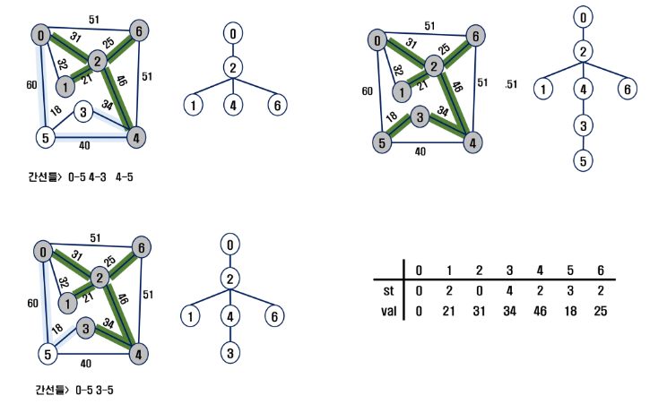

- 알고리즘 
  
  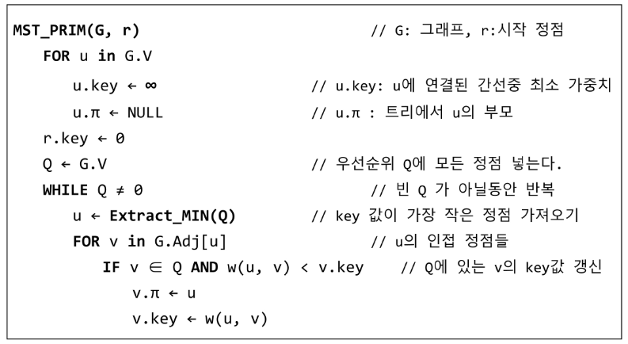

- KRUSKAL 알고리즘
  
  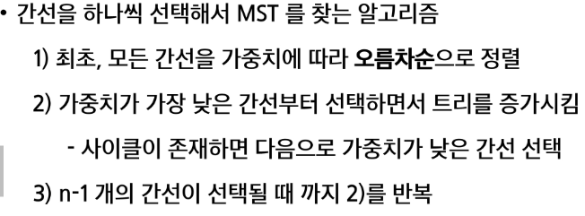
  
  - 예
    
    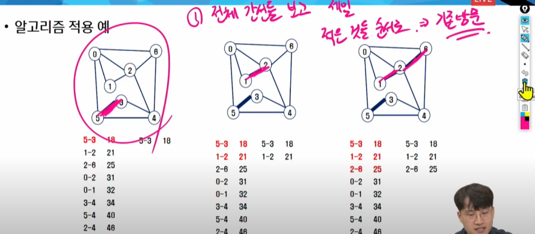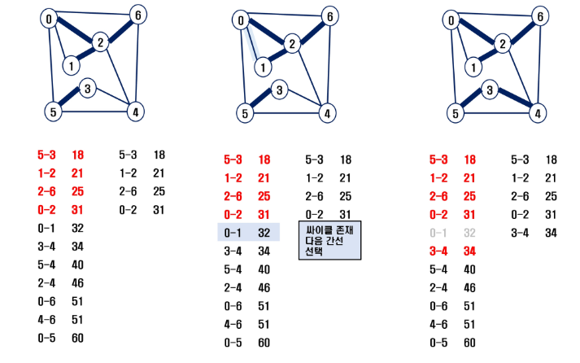
    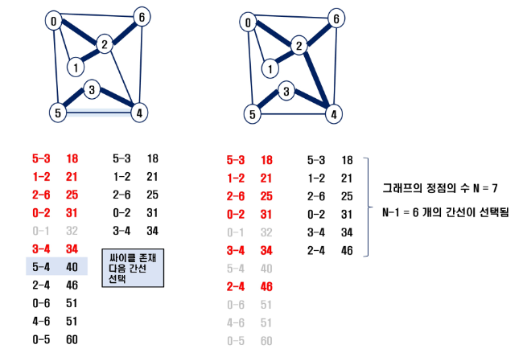
    ~~간선은 (정점의 수-1) 개임을 알 수가 있고, 그렇다고 각 정점마다 한 개의 간선만 가지는 것은 아님을 알 수 있다.~~
  
  - 알고리즘
    

### 최단 경로

- Dijkstra 알고리즘
  
  - 위의 알고리즘들과는 다르게 **모든 정점을 거치는 것**이 아님!!
    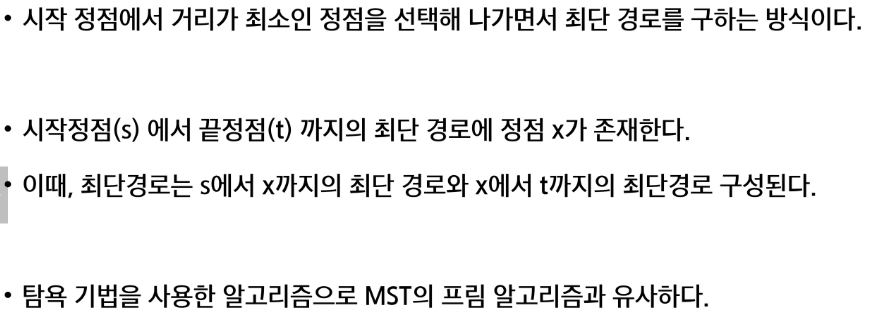
  
  - Prim과의 차이점: 거리가 누적거리라는 점이 다름(가중치가 누적)
  
  - Prim과 똑같이 아래와 같이 작업하는데 차이점은 업데이트만 다르다.
    
    - 최소값 찾기
    
    - 방문체크(선택)
    
    - 인접정점 갱신(가중치 갱신)
  
  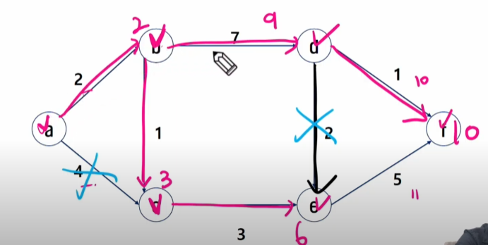
  방문한 지점을 더 짧은 거리로 갈 수 있으니깐 visited는 굳이 필요가 없다. 
  대신 따로 저장해둔 누적 거리에서 걸러질 것이다.(현재 누적거리랑 따로 저장해둔 누적거리랑 비교)
  
  즉, 누적 거리 배열 저장과 각 지점에 도달하는 누적 거리 기반의 우선순위 큐를 구현해야 한다.

- 알고리즘
  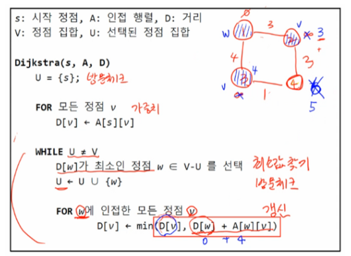

### 정리

### 문제풀이

- 순열
  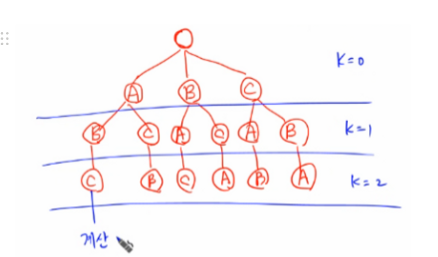
  맞네, 용수 말대로 리턴 연속 2번하네.
  
  그리고 **index로 이용할 시에는 배열 따로 만들 필요 없음**

- Prim
  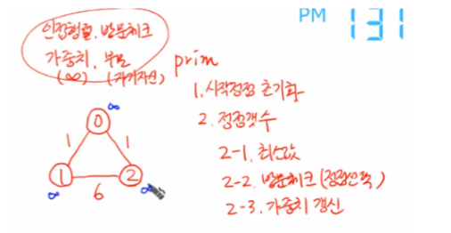

- Kruskal

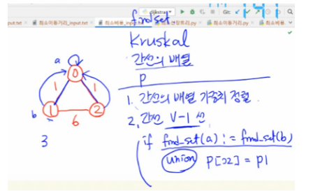

- dijkstra

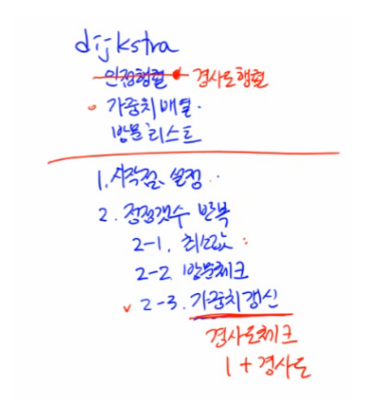

### 정리(부분집합, 순열, 조합)

- 부분집합
  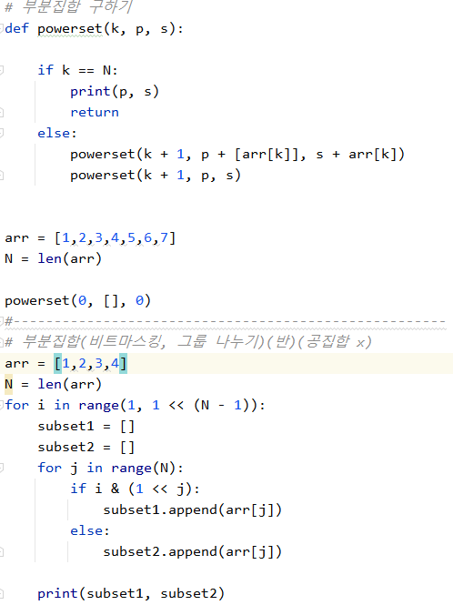

- 순열
  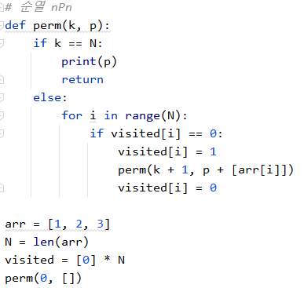
  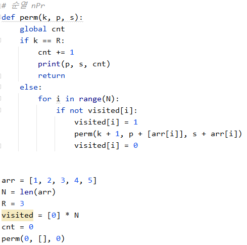
  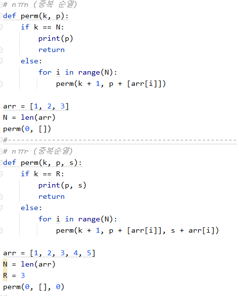

- 조합
  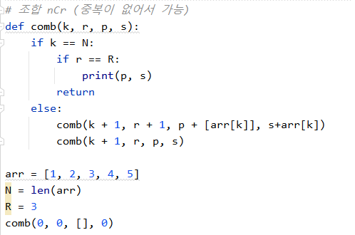
  
  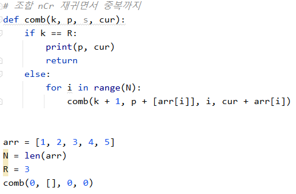
