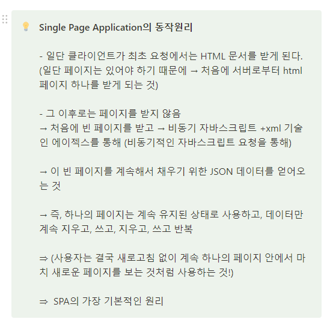
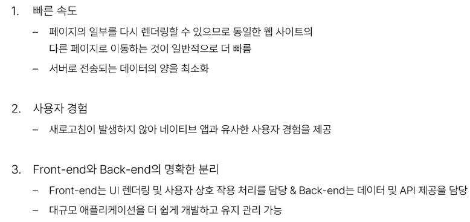
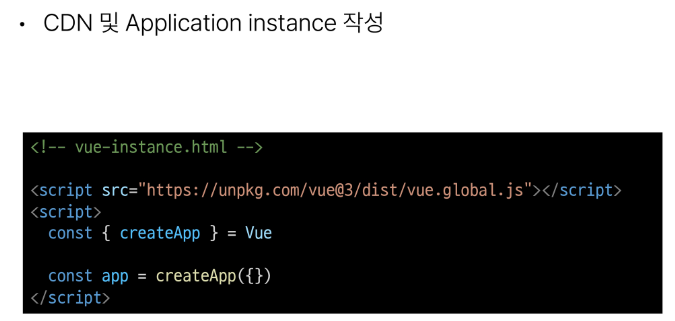
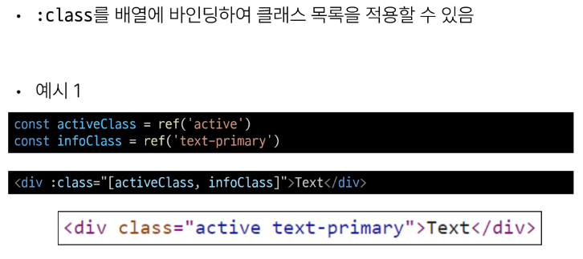

# 1101_1102 TIL

## 잡다한 것

- 래퍼 클래스란?
  
  - [[Java] 래퍼 클래스(Wrapper Class)란 무엇인가? (박싱, 언박싱)](https://coding-factory.tistory.com/547 "https://coding-factory.tistory.com/547")

- 객체 : 참조형이다!!

- Binding : 결합하다, **연결하다** 의 의미

- 공식문서
  

---

## Introduction of Vue

### Front - end Development

#### Client-side frameworks

- Front - end Development
  
  - 웹사이트와 웹 애플리케이션의 사용자 인터페이스(UI)와 사용자 경험(UX)을 만들고 디자인하는 것
    
    - HTML, CSS, JavaScript 등을 활용하여 사용자가 직접 상호작용하는 부분을 개발

- Client - side frameworks
  
  - 클라이언트 측에서 UI와 상호작용을 개발하기 위해 사용되는 JavaScript 기반 프레임워크
    
    

- Client - side frameworks가 필요한 이유 - 1
  
  - "웹에서 하는 일이 많아졌다."
    
    - 단순히 무언가를 읽는 곳 -> 무언가를 하는 곳
    
    

- Client - side frameworks가 필요한 이유 - 2
  
  - "웹에서 하는 일이 많아졌다."
    
    - "다루는 데이터가 많아졌다."
    
    

- Vanilla Js만으로 모든 데이터를 조작한다면..
  

#### SPA

- Single Page Application(SPA)
  
  - 페이지 한 개로 구성된 웹 애츨리케이션
  
  
  

- Single Page Application(SPA)
  
  - 웹 애플리케이션의 초기 로딩 후 새로운 페이지 요청 없이 동적으로 화면을 갱신하며 사용자와 상호작용하는 웹 애플리케이션
    
    - CSR 방식

- Client - side Rendering(CSR)
  
  - 클라이언트에서 화면을 렌더링 하는 방식
  - 이제부터 장고(서버)는 페이지를 처음에만 하나 주고 이후엔 주지 않을 것, 그 이후부터는 클라이언트가 그릴 것
  - 반대되는 개념으로 SSR(S:서버를 의미)

- Client - side Rendering 방식
  
  
  
  - 이벤트 발생 → HTML이 아닌 Axios를 통해 비동기 요청 받기 → JSON 형태로 응답 받기 → 해당 부분만 업데이트

- Client - side Rendering 장점
  

- Client - side Rendering 단점
  
  
  - SSR은 처음에 받을 때 이미 완성한 페이지를 줌
  
  - 검색엔진 관련-> 검색 엔진이 웹 페이지를 조사하려고 봤더니 덜 그려져 있거나 안 그려져 있거나 할 수 있다. (ㅜ)

### Vue

#### What is Vue

- What is Vue?
  

- Vue를 학습하는 이유
  

- SSAFY에서의 Vue
  

- Vue의 2가지 핵심 기능
  
  
  - CDN을 통해 Vue라는 객체를 바로 사용 가능
  - `const { createApp } = Vue` : JS 객체에 대한 구조 분해 할당
  - Vue라는 객체에서 creatApp이라는 속성 값을 createApp이라는 변수에 할당한 것
  - import 느낌(Vue 객체 내에 있는 것)
  
  
  

#### Vue Tutorial

- Vue를 사용하는 방법
  

- 첫번째 Vue 작성하기
  
  
  
  
  
  - 어플리케이션(=app)을 특정 DOM에 탑재(연결)

- 일반 데이터가 아닌 반응형 데이터가 되도록 만들어주는 함수이다.

- 객체로 변환한다는 것은 참조형으로 바뀜을 의미

- ref 함수
  
  
  - 뒤에 .value를 하는 것은 언래핑하는 것과 비슷한 느낌
  
  

- 재할당 관련
  

- Vue 기본 구조
  
  
  - 규칙
    
    - app 생성시 사용하는 함수는 createApp이다.
    
    - createApp의 인자로는 객체가 들어간다.
    
    - createApp에는 setup 메서드를 작성해야 한다.
      
      - setup 메서드는 “객체”를 return한다.

- 템플릿 렌더링
  
  

- Event Listeners in Vue
  

- 참고(반응형 변수 vs 일반 변수)
  
  - 일반 변수는 동기화 적용 X
    
    - 그럼 실제로 변수 값에도 변화 없는가?
    
    - No!!! `console.log` 찍어보면 실제 값은 변화중 (동기화만 X)

### 참고

#### Ref Unwrap 주의사항

- CSR의 단점 : 화면에 나중에 그려서 검색 엔진에 노출이 잘 안됨.
  - 이걸 해결하기 위해 추가적인 프레임워크 기술들이 존재.

## Basic Syntax - 01

### Template Syntax

#### 개요

- Template Syntax
  

- Template Syntax 종류
  
1. Text Interpolation
   

2. Raw HTML
   

3. Attribute Bindings
   

4. JavaScript Expressions
   
- Expressions 주의사항
  

#### Directive

- Directive 특징
  

- Directive 전체 구문
  
  
  - ~~Value 자리에 콜백함수??(Case by Case긴 하지만..)~~
  
  

- Directive - Arguments
  

- Directive - Modeifiers
  

- Built - in Directives
  

### Dynamically data binding

- V - bind 사용처
  
  - 속성은 주로 하나인데 Class랑 Style은 주로 여러개 사용되어서 이렇게 떨어트려놓음.

#### Attribute Bindings

- Attribute Bindings
  
  
  
  - HTML의 속성은 전부 소문자로 되어있으므로....

- Attribute Bindings 예시
  
  

#### Class and Style Bindings

- Class and Style Bindings
  
  

- Class and Style Bindings가 가능한 경우
  

- 1.1 Binding HTML Classes - Binding to Objects
  
  
  

- 1.2 Binding HTML Classes - Binding to Arrays
  
  

- 2.1 Binding Inline Styles - Binding to Objects
  
  
  
  

- 2.2 Binding Inline Styles - Binding to Arrays
  

- v - bind 종합
  

### Event Handling

- v - on 구성
  
1. Inline handlers
   

2. Method Handlers
   
   
- Inline Handlers에서의 메서드 호출
  

- Inline Handlers에서의 event 인자에 접근하기
  

- Event Modifiers
  

- Key Modifiers
  
  
  - keyboard 이벤트에 대한 수식어를 Vue 공식문서에서 보여주지 않아서 Mdn에서 keyboardEvent 문서를 봐야됨

- v - on 종합
  

### Form Input Bindings

- Form Input Bindings
  
1. v - bind 와 v - on을 함께 사용
   
   

2. v - model 사용
   
   

#### v - model 활용

- v - model과 다양한 입력(input) 양식
  

- Checkbox 활용
  
  
  

- Select 활용
  
  

- v - model 종합
  

### 참고

