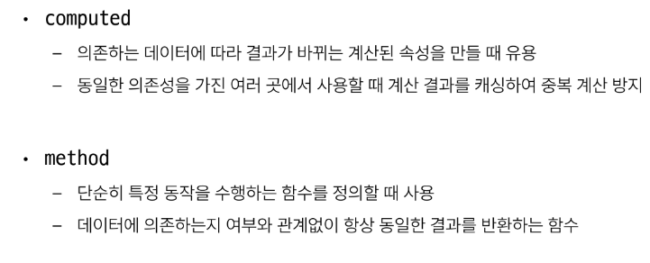
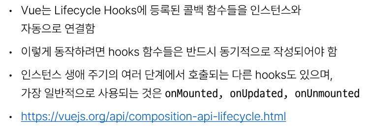
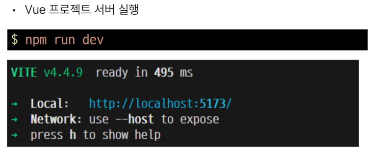
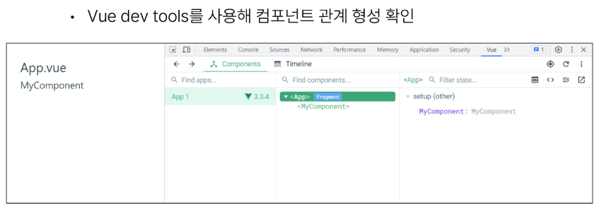
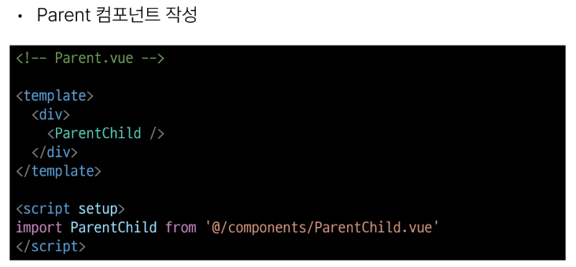
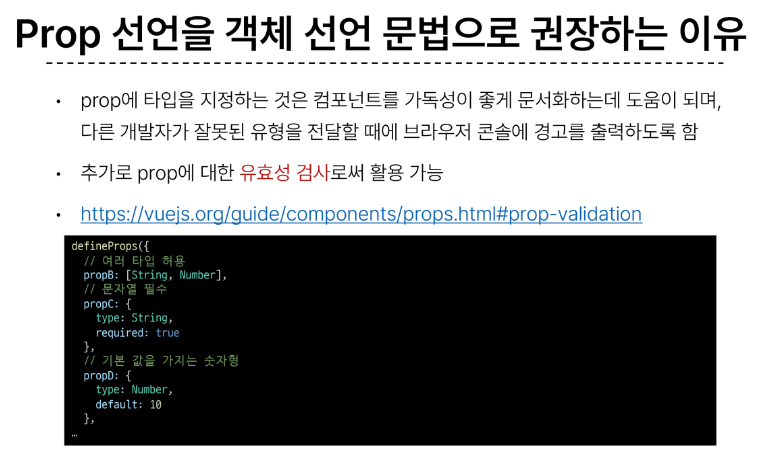
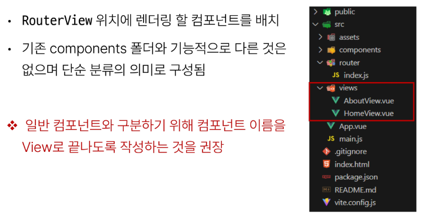

# 1106_1109 TIL

## 잡다한 것

- 렌더링이란 서버로부터 HTML 파일을 받아 브라우저에 뿌려주는 과정이다.
  
  - 개발자 도구를 키면 렌더링 유무 확인 가능.

- 파일 하나가 component 하나다!

- 실행하기
  
  

- Vue3 스타일 가이드 [우선순위 B 규칙: 강력히 권장 | Vue.js](https://ko.vuejs.org/style-guide/rules-strongly-recommended.html "https://ko.vuejs.org/style-guide/rules-strongly-recommended.html")

- inline -block에 관하여
  
  

- Props, emit(주의사항) : 버블링 같은 것이 없어서 2칸 이상 건너서 전달하는 것 부모에서 자식이나 자식에서 부모나 둘 다 불가

- 공식문서
  
  
  
  [Props | Vue.js](https://vuejs.org/guide/components/props.html "https://vuejs.org/guide/components/props.html") 
  
  [Component Events | Vue.js](https://vuejs.org/guide/components/events.html "https://vuejs.org/guide/components/events.html")

- Vue Composition API 에서 props를 watch하기 (블로그참조) ,실습 5-5
  
  - [Vue Composition API 에서 props를 watch하기](https://heewon26.tistory.com/322 "https://heewon26.tistory.com/322")

- 매개변수 보내기( 내 정리 )
  
  
  
  
  - 다만 2번 방식을 받을 때는 내 생각으론 route.params.username으로만 받아주면 똑같이 잘 받아질 듯!

- 내 생각:
  
  - route는 객체고 router는 전달하는 네비게이션 느낌.

- 스토리지
  

- vue - bootstrap
  [Modal | Components | BootstrapVue](https://bootstrap-vue.org/docs/components/modal)

---

## Basic Syntax - 02

### Computed Property

#### Computed

- Computed 기본 예시
  
  
  

- computed 특징
  

#### Computed vs. Methods

- computed와 동일한 로직을 처리할 수 있는 method
  

- computed와 method 차이
  

- Cache (캐시)
  
  
  - 처음 이후로, 2번째 부터 웹 페이지에 들어갈 때 웹 페이지의 모든 것을 렌더링 하지 않음
  
  - 처음에 웹 페이지를 렌더링 할 때, cache의 용량이 큰 것들을 미리 좀 저장해둠.

- Cache 예시
  

- computed와 method의 적절한 사용처
  

- method와 computed 정리
  

### Conditional Rendering

#### v-if

- 렌더링이 항상 되어있는 것이 아님!!(T/F에 따라)

- v-if 예시
  
  
  

- 여러 요소에 대한 v-if 적용
  

- HTML `<template>` element
  

#### v-if vs. v-show

- v-show 예시
  

- v-if vs. v-show
  
  
  - v-if에서 토글 비용이 비싼 이유 : 렌더링을 만들고 지우고를 반복하므로.
  
  - v-show의 초기 비용이 비싼 이유: 일단 무조건 만듬
  
  - if가 가지는 장점 : else랑 else if가 있다. (show는 없음)

### List Rendering

#### v-for

- v-for 구조
  
  
  - 갯수에 따라서 순서가 정해져 있다.

- v-for 예시
  
  

- 여러 요소에 대한 v-for 적용
  

- 중첩된 v-for
  

#### v-for with key

- Vue의 내부적으로 list를 렌더링하는 동작과 관련이 있다.

- Vue가 어떠한 요소를 반복을 할 때 그 데이터가 정확히 어떤 요소이고 이것이 어떻게 행동을 할지를 예측 가능한 데이터 범주 안에서 유지 시키기 위함.

- key가 없다면, 반복을 돌고있는 대상을 선택을 하고, 그 대상을 수정하거나 삭제를 할 때, 내부 컴포넌트가 깨질 수 있다.(번호 꼬임 발생..)

- v-for와 key
  

#### v-for with v-if

- v-for와 v-if 문제 상황 - 1
  

- v-for와 v-if 해결법 -1
  

- v-for 와 v-if 문제 상황 - 2 
  

- v-for 와 v-if 해결법 - 2
  

### Watchers(감시자.)

- computed랑 유사한데 다름.

- watch는 무언가 계산된 결과값을 원하고자 하진 않음.

- watch 구조
  
  
  - 콜백함수?!!?

- watch 예시
  
  
  - 꼭 newValue랑 oldValue 다 쓸 필요는 없음
  
  
  
  

- Computed와 Watchers
  
  
  - 감시하는 대상이 바뀌었을 때 동작하는 데 또 감시하는 대상을 변경한다??(무한의 굴레...)

### Lifecycle Hooks

- Lifecycle Hooks 예시
  
  
  

- Lifecycle Hooks 특징
  

- Lifecycle Hooks Diagram
  

### Vue Style Guide

- Vue Style Guide
  

- 우선순위 별 특징
  

- 우선순위 A였던 금일 학습 내용
  

### 참고

- 2차원이라서 computed를 못 쓰는 경우.

- 템플릿에서 호출을 했어서 얘는 뒤에 value가 없네??

---

## Single - File Components

### Single - File Components

#### Compoment

- Component 특징
  

- Component 예시
  

#### SFC

- Single-File Components(SFC)
  
  - 컴포넌트의 템플릿, 로직 및 스타일을 하나의 파일로 묶어낸 특수한 파일 형식(*.vue 파일)
  - 템플릿 : HTML, 로직 : JS, 스타일 : CSS

- SFC 파일 예시
  

#### SFC 문법

- SFC 문법 개요
  
  
  - 간혹 Vue의 공식문서에는 script - > template -> style로 되어있는 경우가 있다.
    
    - 왜냐하면, Vue 문서를 보는 이유는 template 보단 script 때문이므로.

- 언어 블록- `<template>`
  

- 언어 블록-`<script setup>`
  
  
  
  - 이제 setup 함수를 기입하지 않고 setup 함수의 몸통에 있는 내용을 바로 작성 가능.

- 언어 블록-`<style scope>`
  
  
  
  - 빼면 모든 컴포넌트에 다 적용 됨...

- 컴포넌트 사용하기
  

### SFC build tool(Vite)

#### Vite

- 주의사항 : git bash에서 하지 말고, vs터미널에서 할 것.

- Vite 튜토리얼
  
  
  
  
  

#### NPM

- Node Package Manager(NPM)
  
  - Node.js의 기본 패키지 관리자

- JS는 기본적으로 브라우저에서만 실행이 가능했었는데, 이 엔진을 기반으로 브라우저 밖으로도 실행가능하도록 함. (server-side)

- Node.js의 영향
  

#### Vite 프로젝트 구조

- node_modules
  
  
  - 공유를 하지 않겠구나(gitignore, 파일이 너무 커!). 그러면 requirements.txt 같은 것이 있겠네?
    
    - 아래의 package - lock.json, package.json 가 해당 역할을 해줌.

- package-lock.json
  

- package.json
  
  
  - 전반적으로 큰 요약본 정도.

- public 디렉토리
  

- src 디렉토리
  

- src/assets
  

- src/compoments
  

- src/App.vue
  

- src/main.js
  

- index.html
  
  
  - 이게 바로 최종적으로 우리가 만드는 페이지 하나.

#### 모듈과 번들러

- Module
  
  - 프로그램을 구성하는 독립적인 코드 블록(*.js 파일)
    
    

- node_modules의 의존성 깊이
  

- Bundler
  
  - 여러 모듈과 파일을 하나(혹은 여러 개)의 번들로 묶어 최적화하여 애플리케이션에서 사용할 수 있게 만들어주는 도구

- Bundler의 역할
  

### Vue Component

#### Component 활용

- 컴포넌트 사용 2단계
  

- 사전 준비
  
1. 컴포넌트 파일 생성
   

2. 컴포넌트 등록
   
   
- 결과 확인
  

- MyCompoenentItem 컴포넌트 등록 후 활용
  
  

- Componenet  이름 관련 스타일 가이드
  

### 추가 주제

#### Virtual DOM

- Virtual DOM
  

- 내부 렌더링 과정
  

- Virtual DOM 패턴의 장점
  

- Virtual DOM 주의사항
  

- 직접 DOM 엘리먼트에 접근해야 하는 경우
  

#### Composition API & Option API

- 2가지 API 스타일
  

- Composition API
  

- Option API
  

- API 별 권장 사항
  

### 참고

---

## Component  StateFlow

- 여기서의 State는 Vue에서 데이터를 의미.

### Passing Props

#### 개요

- 같은 데이터 하지만 다른 컴포넌트
  
  
  - 이러면(개별 관리..) Vue에서 반응형 데이터를 사용하는 이유가 없어짐...
    
    - 공통된 부모 컴포넌트에서 관리하자!

- One - Way Data Flow
  
  - 모든 props는 자식 속성과 부모 속성 사이에 **하향식 단반향 바인딩**을 형성
    (one - way down binding)

- Props 특징
  

- 단방향인 이유
  
  
  - 양방향이라면, 해당 데이터에 접근 가능한 모든 컴포넌트를 다 뒤져봐야 됨
    
    - 하지만 단방향이라면? 해당 데이터를 관리하고 있는 컴포넌트 하나만 찾으면 됨

#### 사전 준비

- 사전 준비
  

- App > Parent > ParentChild 컴포넌트 관계 작성
  
  
  

#### Props 선언

- Props 선언을 하지 않으면 이용 불가!!!(까먹지 말자!!)

- 메세지에 대한 갱신/수정 권한은 부모에게 있다.
  
  - Props는 읽기 전용 속성으로 읽기만 함.

- Props 작성
  

- Props 선언 2가지 방식
  
1. 문자열 배열을 사용한 선언
   

2. 객체를 사용한 선언
   
- prop 데이터 사용
  
  
  
  
  - 내려준다고 바로 사용 불가, defineProps를 사용하여서 선언을 한 뒤부터 사용가능.

- 한 단계 더  prop 내려 보내기
  
  
  
  - 받는 것을 보낼때는 문자열이 아닌 변수값을 보내는 이유:
    
    - Parent(부모, 보내주는 대상)의 값이 바뀌었을 때 이것을 받는 친구들을 전부 갱신 시켜줘야 되므로.
    
    - 이렇게 바인딩을 해야 문자열이 아닌 변수값을 보냄
  
  

#### Props 세부사항

- Props 세부사항
  
  
  - Static Props는 값 변동 x(값 자체를 보냄), Dynamic Props는 값 변동 o(반응형 변수 값을 내려보냄.)
1. Props Name Casing
   

2. Static props & Dynamic props
   
   
   
   

### Component Events

#### 개요

- 예시
  
  - cnt = 0이 있다고 가정(부모가 주인)
  
  - 자식 컴포넌트에게 버튼을 누르면 cnt가 1씩 증가하도록 하는 버튼이 있다고 하자
  
  - 하지만 , 이 버튼을 눌러서 직접 cnt 수정 불가
    
    - 왜냐하면 cnt의 주인은 부모이므로. 직접 접근 불가
    
    - 그래서, 내가 cnt를 1 올릴거야라는, 즉 이 버튼을 눌렀어라는 것(이벤트 발생)을 부모에게 알려줘야 함.
  
  - 부모가 계속 대기를 하다가 어떠한 이벤트가 발생했는 것을 듣고 처리.
    
    - 결국 부모가 처리하는 느낌...

- 함수이기 때문에 인자를 넣을 수 있다.
  
  - 만약에 부모에게 필요한 데이터가 있다면 자식 컴포넌트가 인자로 데이터를 전달 가능.

- $를 붙인 이유 : 우리가 쓰는 다른 메서드랑 이름이 겹치는 것을 방지.

- emit 메서드 구조
  
  
  - 그냥 소리만 치면 안된다. 어떤 이벤트가 발생했는지 알려줘야 됨, 그래야 부모가 캐치함
  
  - 아무 이벤트나 들을 수 없잖아, 정확한 이벤트가 뭔지를 알고 들어줘야 겠지.

#### Event 발신 및 수신

- Event 발신 및 수신(Emitting and Listening to Events)
  

- 이벤트 발신 및 수신하기
  
  
  

#### 'emit' Event 선언

- emit Event 선언
  

- 이벤트 선언하기
  

#### Event  인자

- Event 인자(Event Arguments)
  

- 이벤트 인자 전달하기
  
  
  

#### Event 세부사항

- Event Name Casing
  

#### emit Event 실습

- emit 이벤트 실습
  

- emit 이벤트 실습 구현
  
  
  
  

### 참고

---

## Router

### Router

#### 개요

- 페이지가 한 개이기 때문에 사용자에게 페이지가 이동하는 것과 같은 사용자 경험을 제공하기 위해 위의 기술이 필요!!

- SSR에서의 Routing
  

- CSR/SPA에서의 Routing
  

- 만약  routing이 없다면
  
  
  - 뒤로가기 기능은 변경된 URL이 브라우저의 히스토리에 남게 되는 것인데, URL에 변화가 없기 때문에 당연히 히스토리에도 남지 않으므로 뒤로 가기 기능 사용 불가.

### Vue Router

#### 개요

- 페이지 이동(새로고침 발생 x)없이 url만 변동이 생김.
  
  - 하지만 사용자는 페이지 이동이 된 것처럼 느낌.

- Vue Router 추가
  
  

- Vue 프로젝트 구조 변화
  

- RouterLink
  
  
  - a태그랑 유사한데 기본 동작은 막은 것 같은 느낌.
    
    - a태그 특징: 서버로 요청해서 새로운 페이지 받기. (이게 막힌 느낌.)

- RouterView
  
  
  - ~~views에 있는 component가 왔다리 갔다리 보이는 느낌?~~

- router/index.js
  
  
  - urls.py와 비슷

- views
  

#### Basic Routing

- 라우팅 기본
  

#### Named Routes

- Named Routes 예시
  

- Named Routes 장점
  
  
  - 나중에 url을 변경하더라도 영향을 받지 x

#### Dynamic Route Matching with Params

- 매개 변수를 사용한 동적 경로 매칭
  

- 매개 변수를 사용한 동적 경로 매칭 활용
  
  
  
  - 빠진 페이지(체크 표시된 id와 위의 :id가 서로 같아야 함!!)
  
  
  
  
  

#### Programmatic Navigation

- 프로그래밍 방식 네비게이션
  

- router.push()
  

- router.push 활용
  
  

- router.push 인자 활용 참고
  

- router.replace()
  
  
  - 이걸 어따 써??
    
    - 만약에 로그인이 성공을 하고 메인페이지로 이동하는 로직이 있다면
    
    - 이미 로그인이 성공을 했는데 이전 페이지로 갈 필요가 없잖아.(회원가입 과정이라든지.)

### Navigation Guard

#### 개요

- Navigation Guard 종류
  

#### Globally Guard

- router.beforeEach 구조
  
  
  
  
  - 반드시 to로 보낼 필요 x 한 경우 (return을 써서 우회 가능)

- router.beforeEach  예시
  
  

- router.beforeEach 활용
  
  
  

#### Per-route Guard

- ex) (user/1 에서 user/2로 이동하는 경우) user router가 유지되고 있기 때문에 이때는 실행 x

- router.beforeEnter 구조
  

- router.beforeEnter 예시
  
  

- router.beforeEnter 활용
  
  
  

#### In-component Guard

- 컴포넌트 가드 종류
  

- onBeforRouteLeave 활용
  
  

- onBeforeRouteUpdate 활용
  
  

- 만약 onBeforeRouteUpdate를 사용하지 않았다면
  
  
  
  - 1번은 정상적으로 알아서 수정되고(얘는 라우트 객체를 직접 참조해서 갱신이 된 것임!!)
  
  - 2번은 되지 않음. (컴포넌트를 갈아끼우지 않았어서, 안에서 사용하는 변수들도 그대로 가져감...)
  
  - 기억하자!!

### 참고

- 초기 로딩에 해당 컴포넌트가 포함이 된다면, 로딩 속도에 영향이 갈 만큼 컴포넌트의 크기가 크다면 빼 놓고 싶다. (이럴 때 쓰임.)
