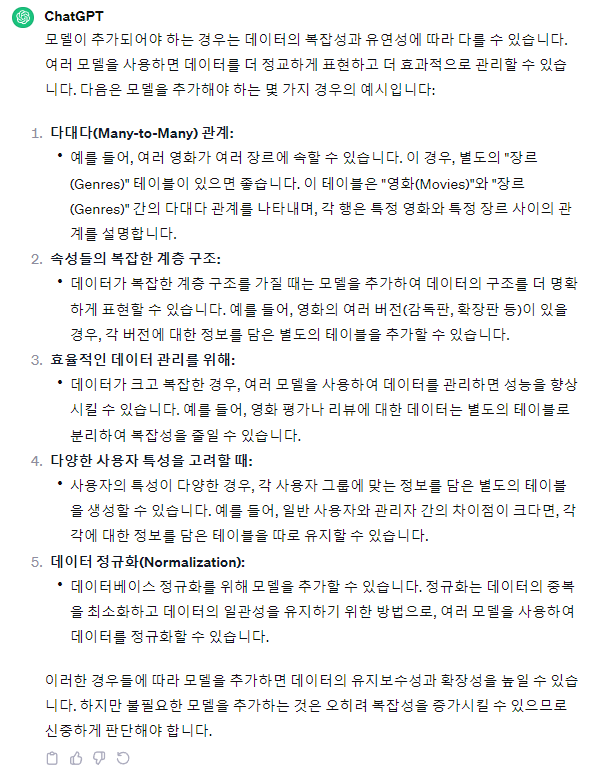
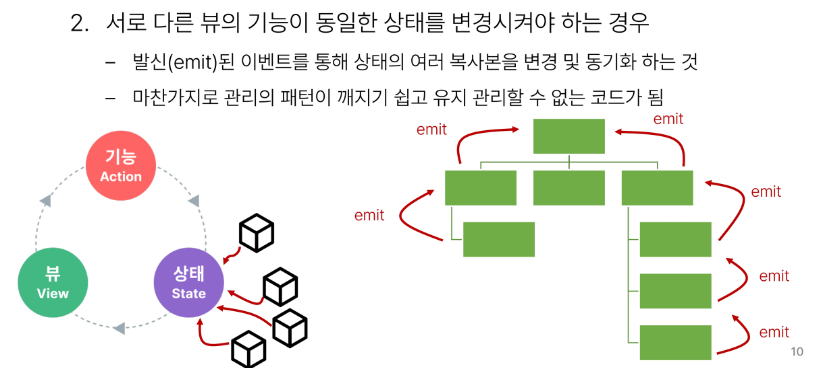
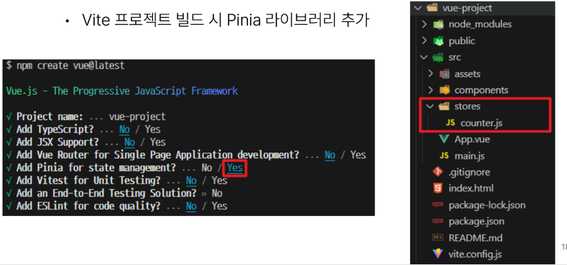
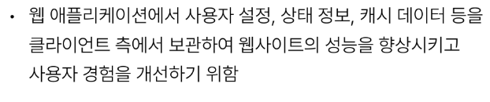
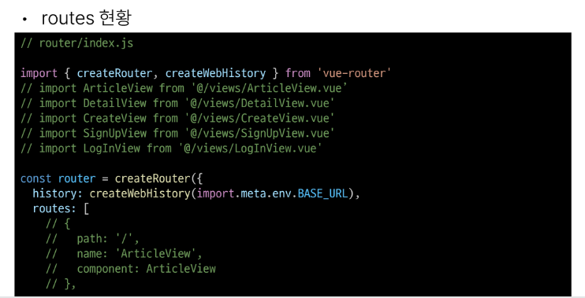
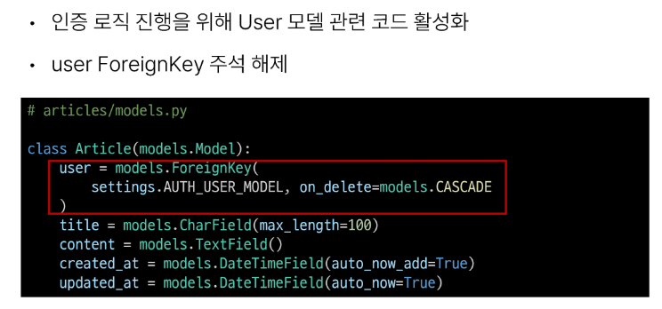
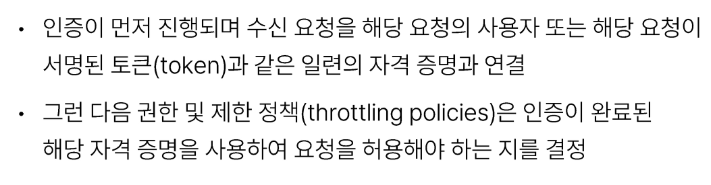
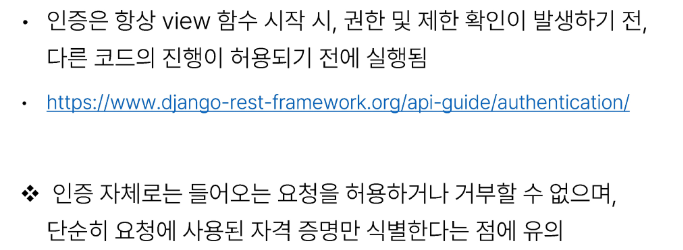
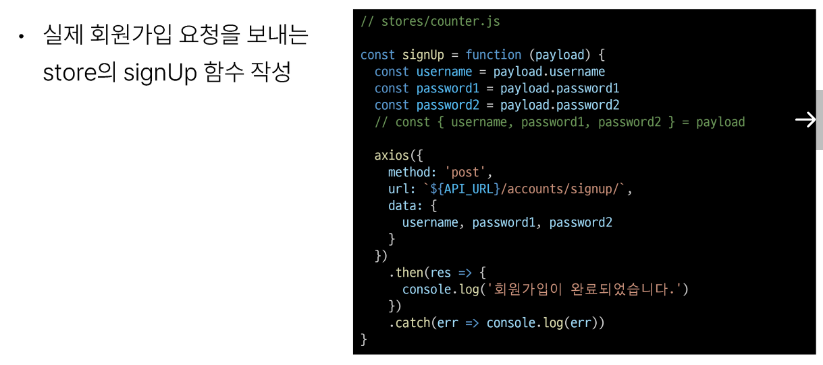

# 1113_1115 TIL

## 잡다한 것

- [Array.prototype.splice() - JavaScript | MDN](https://developer.mozilla.org/ko/docs/Web/JavaScript/Reference/Global_Objects/Array/splice "https://developer.mozilla.org/ko/docs/Web/JavaScript/Reference/Global_Objects/Array/splice")
  
  - 다른 곳에 할당하지 않고 원본 배열을 변경.

- Pinia는 전역변수 느낌, 그 전에 배운 Props는 지역변수 느낌

- [Home | pinia-plugin-persistedstate](https://prazdevs.github.io/pinia-plugin-persistedstate/ "https://prazdevs.github.io/pinia-plugin-persistedstate/")

- 참조(꽤 중요할지도?)
  

- 참고
  
  

- 만약에 서버를 하나 더 연다면 1씩 올라감을 주의.

- [django-cors-headers · PyPI](https://pypi.org/project/django-cors-headers/ "https://pypi.org/project/django-cors-headers/")

- [Welcome to dj-rest-auth’s documentation! — dj-rest-auth 5.0.1 documentation](https://dj-rest-auth.readthedocs.io/en/latest/ "https://dj-rest-auth.readthedocs.io/en/latest/")

- CSRF Token이 빠진 이유: 신청서를 vue에서 보내서?

- [요청 Config | Axios Docs](https://axios-http.com/kr/docs/req_config "https://axios-http.com/kr/docs/req_config")
  

- 참고(중앙 저장소 관련.)
  

- 참고
  

- 404로 이용 시 문제점..
  
  - get이나 all로 가져올 때는 오류가 나지 않는 것이 404로 할 시에는 에러가 났다고 판단할 수 있다.
  
  - 404는 없으면 무조건 에러를 뱉음

## State Management

### State Management

#### 개요

- 컴포넌트 구조의 단순화
  
  

- 상태 관리의 단순성이 무너지는 시점
  
  
  

- 해결책
  
  
  
  

### State management library (Pinia)

#### Pinia

- Pinia 설치
  

#### Pinia 구조

- Pinia 구성 요소
  

- Pinia 구성 요소 - 'store'
  

- Pinia 구성 요소 - 'state'
  

- Pinia 구성 요소 - 'getters'
  

- Pinia 구성 요소 - 'actions'
  
  

- Pinia 구성 요소  - 'plugin'
  

- Pinia 구성 요소 종합
  

#### Pinia 구성 요소 활용

- State
  

- Getters
  

- Actions
  

- Vue devtools로 Pinia 구성 요소 확인하기
  

### Pinia 실습

#### 개요

- Pinia를 활용한 Todo 프로젝트 구현
  

- 컴포넌트 구성
  

#### 사전 준비

- 사전 준비
  
  
  
  
  
  

#### Read Todo

- Todo 조회
  
  
  

#### Create Todo

- Todo 생성
  
  
  
  
  

#### Delete Todo

- Todo 삭제
  
  
  
  

#### Update Todo

- Todo 수정
  
  
  
  
  

#### Computed Todo

- 완료된 todo 개수 계산
  
- (여기에) 리턴 값에 .length 달아줘야 됨!!(빠진 부분.) 
    

#### Local Storage

- Local Storage 특징
  

- Local Storage 사용 목적
  

- pinia - plugin - persistedstate
  

- pinia - plugin - persistedstate 설정
  
  
  
  

#### 참고

---

## Vue with DRF 1

### 프로젝트 개요

#### DRF 프로젝트 안내

- DRF 프로젝트 안내
  

- Skeleton code 살펴보기
  
  
  
  
  
  
  
  
  
  
  

#### Vue 프로젝트 안내

- Vue 프로젝트 안내
  
  
  

- Skeleton code 살펴보기
  
  
  
  
  
  
  
  

### 메인 페이지 구현

- 시작하기 전에..
  

#### State 참조 및 출력

- 개요
  

- state 참조 및 출력
  
  
  
  
  
  
  

#### state with DRF

- 개요
  

- state  with DRF
  
  
  
  
  
  

### CORS Policy

#### CORS

- SOP (동일 출처 정책)
  

- Origin(출처)
  
  

- CORS policy의 등장
  

- CORS (교차 출처 리소스 공유)
  

- CORS policy (교차 출처 리소스 공유 정책)
  

- CORS 적용 방법
  

#### CORS Headers 설정

- CORS Headers 설정하기
  

- django-cors-headers 사용하기
  
  
  

- CORS 처리 결과
  
  
  

### Article CR 구현

#### 전체 게시글 조회

- 전체 게시글 목록 저장 및 출력
  
  
  

#### 단일 게시글 조회

- 단일 게시글 데이터 출력
  
  
  
  
  
  

#### 게시글 작성

- 게시글 작성
  
  
  
  
  
  
  
  

---

## Vue with DRF 2

### DRF Authentication

#### 개요

- 시작하기 전에
  
  
  
  

#### Authentication

- 인증과 권한
  

- DRF에서의 인증
  

- 승인되지 않은 응답 및 금지된 응답
  

#### 인증 체계 설정

- 인증 체계 설정 방법
  
1. 전역 설정
   

2. View 함수 별 설정
   
- DRF가 제공하는 인증 체계
  

- TokenAuthentication
  

#### TokenAuthentication 설정

- TokenAuthentication 적용 과정
  
1. 인증 클래스 설정
   

2. INSTALLED_APPS 추가
   

3. Migrate 진행
   

4. 토큰 생성 코드 작성
   

#### Dj-Rest-Auth 라이브러리

- Dj-Rest-Auth
  

- Dj-Rest-Auth 설치 및 적용
  
  
  

- Dj-Rest-Auth의 Registration(등록) 기능 추가 설정
  

- Registration 기능 추가
  
  
  
  

#### Token 발급 및 활용

- Token 발급
  
  
  
  
  
  
  - 너, 회원가입 잘 된 사용자고 비밀번호도 제대로 쳤네? -> 인증된 사용자구나, 너 토큰 줄게, 이거 줄테니까 다음 요청부터 이거 계속 가져와, 이거 보내지 않으면 로그아웃 상태로 변환된다.(비인증 사용자이기 때문에.)

- Token 활용
  
  

- 클라이언트가 Token으로 인증 받는 방법
  

#### 권한 정책 설정

- 권한 설정 방법(인증 이후에 , 너가 어떤 권한을 가진 사용자인지 분류해보자구.)
  
1. 전역 설정
   

2. View 함수 별 설정
   
- DRF가 제공하는 권한 정책
  

- IsAuthenticated 권한
  

#### IsAuthenticated 권한 설정

- 권한 설정
  
  

- 권한 활용
  
  
  
  - 만약에 이거보다 먼저 체크하는 토큰이 없다면 401이 뜸.
  
  

### Authentication with Vue

- 시작하기 전에
  
  
  - POSTMAN에서 요청을 보냈던 이 방식을 이제는 vue에서 보낼 것.
  
  - 지금 현재 서버 측에서 인증 됐냐고 물어보도록 만들어 놔서 401이 뜸..

#### 회원가입

- 회원가입 로직 구현
  
  
  
  
  
  
  
  
  
  

#### 로그인

- 로그인 로직 구현
  
  
  
  
  
  
  
  
  

#### 요청과 토큰

- 토큰 저장 로직 구현
  
  

- 토큰이 필요한 요청
  

- 게시글 전체 목록 조회 with token 
  
  

- 게시글 작성 with token
  
  

#### 인증 여부 확인

- 사용자의 인증(로그인) 여부에 따른 추가 기능 구현
  

- 인증 상태 여부를 나타낼 속성 값 지정
  
1. 인증 되지 않은 사용자는 메인 페이지 접근 제한
   
   

2. 인증 된 사용자는 회원가입과 로그인 페이지에 접근 제한
   
   

#### 기타 기능 구현

- 자연스러운 애플리케이션을 위한 기타 기능 구현
  
1. 로그인 성공 후 자동으로 메인 페이지로 이동하기
   

2. 회원가입 성공 후 자동으로 로그인까지 진행하기
   

### 참고

