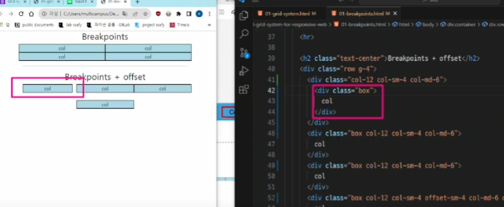
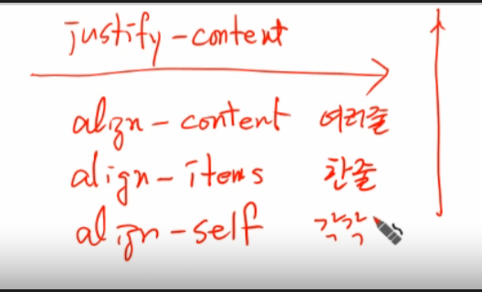
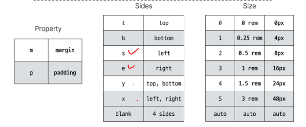
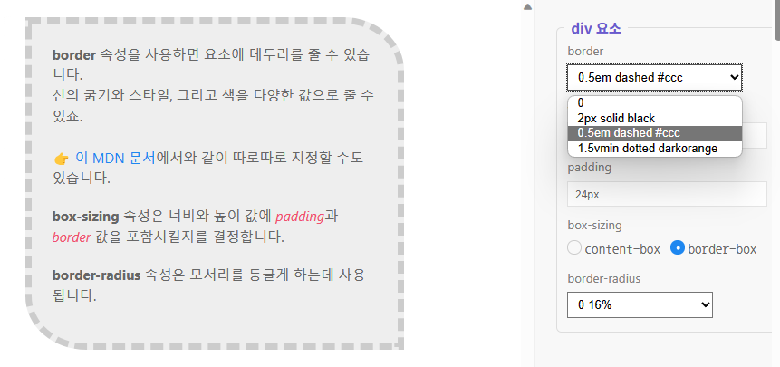

# 0904_0907 TIL

## HTML_CSS part)

## 잡다한 것

- 편한 사이트
  

- 집어넣기 편하게 하기
  
  - alt + shift로 영역 빠르게 정하고 복사 붙어넣기

- div보단 시멘틱 태그를 이용해라

- 지디웹(참고 사이트)

- F12: DevTools

- !하고 Tab: 기본틀 생성

- Alt + B: 실행

- Alt + Shift + 아래키: 복사

- li * 3: li 3개 생성

- 찾아주기 기능
  
  

- mdn: 공식 문서

- 참고(결합자 추가)
  
  

- float
  
  
  신문처럼 요소(이미지)를 감싸는 레이아웃을 만들고 싶었다.
  그래서 탄생한 기술: 이 요소를 마치 부동체처럼 띄우자, 그러면 인라인 요소들이 감쌀 것이다.

- p(paragraphs): 단락

- CSS 게임(개구리 등)
  
  
  
  
  
  
  

- 바로 바꾸기 가능
  
  먼저 여기서 테스트를 해보고 옮기는 것도 하나의 방법(단, 여기선 새로고침하면 초기화 됨)

- 인라인 정렬하는 법: 주로 박스를 감싸고 있는 부모한테 정렬 어떻게 할지 값을 줌

- img는 인라인인데도 width와 height 적용 됨 

- **상우하좌!!**(시계방향)

- 책임과 역할
  

- Grid cards, form control, forms, pagination 많이 쓰임

- 링크 태그: href, 이미지 태그: src

- 오해하지 말 것: bootstrap을 쓴다고 100% bootstrap을 쓸 필요는 없다.

- bootstrap 연습법: 코드를 그대로 복사해나가면서 출력화면을 보고 클래스를 다른 것으로 바꿔보면서 따라가기

- CSS Layout 정리: Grid System, Flexbox, position, float
  
  - 각각의 기술은 용도와 장단점이 있음
  
  - 각 기술은 독집적인 용도를 가지지 않으며, 어떤 기술이 적합한 도구가 될지는 특정 상황에 따라 다름

- 처음 클론코딩을 할 때는 인스타그램만한 것 없다.

- gitter part
  
  
  원래 기본 상태는 위아래로는 붙어있고, 좌우로는 살짝 떨어진 상태이다.
  ~~전에는 안 떨어져 있었던 이유는 box에다가 할당해줬으므로...~~

- Emmet Cheat sheet 찾아보기
  

- 꿀팁
  

---

## Fundamentals of HTML and CSS

### 웹 소개

- Web page 구성 요소
  `

### 웹 구조화

#### HTML

- HTML이란?
  
  - HyperText Markup Language
  
  - 웹 페이지의 의미와 **구조**를 정의하는 언어
  
  - Hypertext: 
    
    - 웹 페이지를 다른 페이지로 연결하는 링크
    
    - 참조를 통해 사용자가 한 문서에서 다른 문서로 즉시 접근할 수 있는 텍스트
  
  - Markup Language:
    
    - 태그 등을 이용하여 문서나 데이터의 구조를 명시하는 언어
      
      - ex) HTML, Markdown

#### HTML의 구조(Structure of HTML)

- HTML Element(요소)
  

- HTML Attributes(속성)
  

#### 텍스트 구조(Text Structure)

- HTML의 주요 목적 중 하나는 **텍스트 구조와 의미**를 제공하는 것

- HTML:
  
  - 웹 페이지의 **의미**와 구조를 정의하는 언어
  
  - 예
    
    

- 대표적인 HTML Text structure
  
  
  `ol`: 순서 있는, `ul`: 순서 없는

### 웹 스타일링

#### CSS

- CSS란?
  
  - Cascading Style Sheet
  
  - 웹 페이지의 **디자인과 레이아웃**을 구성하는 언어
  
  - Cascade(계단식):
    
    - 동일한 우선순위를 같는 규칙이 적용될 때 CSS에서 마지막에 나오는 규칙이 사용됨

- CSS 구문(기억할 것!)
  
  
  
  `;`(선언) 필수!, ~~서로 영향을 주는 것이라면 속성의 순서도 중요~~

- CSS 적용 방법
  
  1. 인라인(Inline) 스타일(비추)
     
     - HTML 요소안에 style 속성 값으로 작성
     
     - 예
       
     
     - 비추인 이유: 우선순위 높음, 문서 지저분해짐(HTML을 보기 hard)(HTML: 문서의 구조와 의미)
  
  2. 내부(Internal) 스타일 시트(SSAFY에서 아마 가장 많이 이용될 듯)
     
     - head 태그 안에 style 태그에 작성
     
     - 예
  
  3. 외부(Extenal) 스타일 시트(밖에선 이걸 젤 많이 이용)
     
     - 별도의 CSS 파일 생성 후 HTML link 태그를 사용해 불러오기
     
     - 예
       

#### CSS 선택자(CSS Selectors)

- HTML 요소를 선택하여 스타일을 적용할 수 있도록 하는 선택자

- CSS Selectors 종류
  

- CSS Selectors 특징
  
  거의 이용 x (위)
  
  
  id는 유일한 것에 이용, javascript 때 좀 쓰일 듯
  
  

#### 우선순위(Specificity)

- 동일한 요소에 적용 가능한 같은 스타일을 두 가지 이상 작성 했을 때 어떤 규칙이 적용 되는지 결정하는 것

- 우선순위가 높은 순
  
  
  class 선택자만 거의 이용해서 그것만 신경쓰면 된다.
  
  - 예
    

- ! important
  
  - 다른 우선순위 규칙보다 우선하여 적용하는 키워드
  
  - Cascade(계단식)의 구조를 무시하고 강제로 스타일을 적용하는 방식으로 사용을 권장하지 않음

### 상속

#### CSS 상속

- 기본적으로 CSS는 상속을 통해 부모 요소의 속성을 자식에게 상속해 재사용성을 높임

- 상속 여부
  
  
  - 예
    

- CSS 상속 여부는 MDN 문서에서 확인하기
  
  - MDN 각 속성별 문서 하단에서 상속 여부를 확인할 수 있음

### 참고

- HTML 관련 사항
  

- CSS 인라인(inline) 스타일은 사용하지 말 것
  

- 속성은 되도록 'class'만 사용할 것
  

---

## CSS Layout

### CSS Box Model

- 모든 HTML 요소를 사각형 박스로 표현하는 개념

#### 구성 요소

- 내용(content), 안쪽 여백(padding), 테두리(border), 외부 간격(margin)으로 구성되는 개념
  

- Box 구성의 방향 별 명칭
  

- width & height 속성
  
  - 요소의 너비와 높이를 지정
  
  - 이때 지정되는 요소의 너비와 높이는 **콘텐츠 영역**을 대상으로 함
    

- CSS가 width 값을 계산하는 기준
  
  

- box - sizing 속성
  
  

#### 박스 타입

inline은 욕심이 없어서 자기영역만큼만 차지한다. 그래서 다음요소가 오른쪽에 올수 있다.
반면, block은 다 차지하므로 오른쪽에 올 자리가 없어서 다음요소가 아래로 내려간다.

- Normal flow
  
  - CSS를 적용하지 않았을 경우 웹페이지 요소가 기본적으로 배치되는 방향
    

- block 타입 특징
  

- inline 타입 특징
  
  컨텐츠 크기에 따라 결정되므로 w, h 사용 불가

- 속성에 따른 수평 정렬
  
  블럭은 margin으로, 인라인은 text-align으로(달라질 수도??)

#### 기타 display 속성

1. inline - block
   

2. none
   

### CSS Layout Position

- 각 요소의 **위치**와 **크기를 조정**하여 웹 페이지의 디자인을 결정하는 것
  
  - Display, Position, Float, Flexbox 등

#### CSS Position

- 요소를 Normal Flow에서 제거하여 다른 위치로 배치하는 것
  
  - 다른 요소 위에 올리기, 화면의 특정 위치에 고정시키기 등

- Position 이동 방향
  

- Position 유형별 특징
  
  - static
    
    - 기본값
    
    - 요소를 Normal Flow에 따라 배치
  
  - relative
    
    - 요소를 Normal Flow에 따라 배치
    
    - **자기 자신을 기준으로 이동**
    
    - **요소가 차지하는 공간은 static일 때와 같음**
  
  - absulute
    
    - **요소를 Normal에서 제거**
    
    - **가장 가까운 relative 부모 요소를 기준으로 이동**
    
    - **문서에서 요소가 차지하는 공간이 없어짐**(다른 요소에게 영향을 끼침)
  
  - fixed
    
    - **요소를 Normal Flow에서 제거**
    
    - 현재 화면영역(viewport)을 기준으로 이동
    
    - **문서에서 요소가 차지하는 공간이 없어짐**
  
  - sticky
    
    - 요소를 Normal Flow에 따라 배치
    
    - 요소가 일반적인 문서 흐름에 따라 배치되다가 스크롤이 특정 임계점에 도달하면 그 위치에서 고정됨(fixed)
    
    - 만약 다음 sticky 요소가 나오면 다음 sticky 요소가 이전 sticky 요소의 자리를 대체
      
      - 이전 sticky 요소가 고정되어 있던 위치와 다음 sticky 요소가 고정되어야 할 위치가 겹치게 되기 때문

- z - index
  
  - 요소가 겹쳤을 때 어떤 요소 순으로 위에 나타낼 지 결정

- z - index 특징
  
  주로 아예 큰 값을 주거나 아예 작은 값을 줘서 예외 상황을 없애는 데 이용이 됨(애초에  겹치도록 잘 안 만듬)

### CSS Layout Flexbox

- CSS Flexbox
  
  - 요소를 행과 열 형태로 배치하는 **1차원 레이아웃 방식**
    
    - '공간 배열' & '정렬'

#### 구성 요소

- Flexbox 기본 사항
  
  
  
  Flex의 주체는 부모!(Flex Container), 그리고 움직이는 자식요소는 Flex item
  아무런 방향을 결정해주지 않으면 main axis는 수평축이 된다.
  
  
  
  
  
  **1차 자식까지만 영향을 끼침!!!**, flex 안에 flex가 올 수도 있다.
  

#### 레이아웃 구성

- Flexbox 속성
  

- 목적에 따른 분류
  

- 속성명 Tip
  

위에것 Test나올지도?

### flex-wrap 응용(참고)

#### 반응형 레이아웃(참고)

- 다양한 디바이스와 화면 크기에 자동으로 적응하여 콘텐츠를 최적으로 표시하는 웹 레이아웃 방식

### 정리

### 참고

**상우하좌!!!**

---

## Fundanmentals of Bootstrap

### Bootstrap

- CSS 프론트엔드 프레임워크(Toolkit)
  
  - 미리 만들어진 다양한 디자인 요소들을 제공하여 웹 사이트를 빠르고 쉽게 개발할 수 있도록 함
  
  - 사용해보면 오히려 스타일이 줄어든 것 처럼 보인다.(추가보단 덜어낸 느낌)
  
  - 브라우저마다 기본적으로 스타일이 적용되는 것이 달라서 따로 다 개발해줘야되는 것을 방지(시작점 동일화 시켜줌)
  
  - 참고
    
    - bootstrap.css:통합본, bootstrap-reboot.css(초기화해주는 파일)

- Bootstrap  기본 사용법
  
  

- Bootstrap에서 클래스 이름으로 Spacing을 표현하는 방법
  
  

- 브라우저의 기본 폰트 사이즈: 16px

- Bootstrap에는 특정한 규칙이 있는 클래스 이름으로 이미 스타일 및 레이아웃이 작성되어 있음

#### Typography

- **제목, 본문 텍스트, 목록 등**

- Display headings
  
  - 기존 Heading보다 더 눈에 띄는 제목이 필요한 경우(더 크고 약간 다른 스타일)
    

- Inline text elements
  
  - HTML inline 요소에 대한 스타일
    

- Lists
  
  - HTML list 요소에 대한 스타일
    

#### Colors

- Bootstrap이 지정하고 제공하는 색상 시스템

- **Text, Border, Background 및 다양한 요소에 사용하는  Bootstrap의 색상 키워드**
  

- Text colors
  

- Background colors
  

#### Component(이거 때문에 쓴다고 해도 과언이 아님)

- Bootstrap에서 제공하는 **UI 관련 요소**
  
  - **버튼, 네비게이션 바, 카드, 폼, 드롭다운 등**
  
  - 대표 Component
    
    - Alerts
    
    - Badges
    
    - Buttons
    
    - Cards
    
    - Navbar

- Component 이점
  
  - 일관된 디자인을 제공하여 웹 사이트의 구성 요소를 구축하는 데 유용하게 활용

### Semantic Web

- 웹 데이터를 의미론적으로 구조화된 형태로 표현하는 방식
  

#### Semantic in HTML

- 예
  

- HTML Semantic Element
  
  - 기본적인 모양과 기능 이외에 의미를 가지는 HTML 요소
    
    - **검색엔진** 및 개발자가 웹 페이지 콘텐츠를 이해하기 쉽도록
    
    - 검색엔진이 검색할 때 빠르게 쫙 읽고 구조화 시킴(div로만 만들면 파악 힘들겠지?)
    
    - 검색 엔진 최적화라고 해서 검색 엔진 점수가 높아져서 상위페이지에 뜰 확률 up

- semantic element
  
  의미는 div와 똑같지만 이해하기 쉽도록 이름 설정 

#### Semantic in CSS

- OOCSS(Object Oriented CSS)
  
  - 객체 지향적 접근법을 적용하여 CSS를 구성하는 방법론

- CSS 방법론
  
  - CSS를 효율적이고 유지 보수가 용이하게 작성하기 위한 일련의 가이드라인

- OOCSS 기본 원칙
  
  1. 구조와 스킨을 분리(재사용 가능성 높아짐)
     
     - 예
       
  
  2. 컨테이너와 콘텐츠를 분리
     
     - 객체에 직접 적용하는 대신 객체를 둘러싸는 컨테이너에 스타일을 적용
     
     - 스타일을 정의할 때 위치에 의존적인 스타일을 사용하지 않도록 함
     
     - 콘덴츠를 다른 컨테이너로 이동시키거나 재배치할 때 스타일이 깨지는 것을 방지

- OOCSS 기본 원칙
  
  

- 의미론적인 마크업의 이점
  

- 추가내용(시멘틱 태그)
  
  - 개념: 의미를 부여
    
    - 누굴 위한 의미?
      
      - 개발자 + 검색 엔진(색인화(목차처럼 만듬))
      
      - SEO
        
        - 참고: SEO checker(절대적인 점수는 아님..)
  
  - 자주 사용되는 시맨틱 태그
    

---

## Bootstrap Grid system

### Bootstrap Grid system

- 웹 페이지의 레이아웃을 조정하는 데 사용되는 **12개의 컬럼**으로 구성된 시스템

- 왜 하필 12일까? 약수가 많아서..

- Grid system 목적
  
  - 반응형 디자인을 지원해 웹 페이지를 모바일, 태블릿, 데스크탑 등 다양한 기기에서 적절하게 표시할 수 있도록 도움

#### Grid system 클래스와 기본 구조

- Grid system 기본 요소
  
  
  Grid 안에 Grid도 가능하다.
  
  한 행당 12Column 고정(12칸 다 차지하면 다음 행으로 넘어감)

- 중첩(Nesting) 예
  

- 상쇄(offset) 예
  
  

- Gutters
  
  - Gutter를 적용 안했을 때의 기본 형태: 좌우로는 패딩이 들어가 있어서 여백이 조금 있고, 상하로는 딱 붙어있음
  
  - x축으로 gutter을 주면 column간의 영역이 조금씩 줄어듬..(패딩이라서)
  
  - 그럼에도 padding을 이용하는 이유는? 마진으로 둔다면 부모 행의 자체가 row 밖으로 나가거나 전체 레이아웃의 너비를 깨트릴 수 있으므로
  
  - Grid system에서 column 사이에 여백 영역
  
  - x축은 padding, y축은 margin으로 여백 생성
    

### Grid system for responsive web

- Responsive Web Design
  
  - 디바이스 종류나 화면 크기에 상관없이 어디서든 일관된 레이아웃 및 사용자 경험을 제공하는 디자인 기술
    

#### Grid system Breakpoints

- 웹 페이지를 다양한 화면 크기에서 적절하게 배치하기 위한 분기점
  
  - 화면 너비에 따라 6개의 분기점 제공(xs, sm, md, lg, xl, xxl)
    
    
  
  - 각 breakpoints 마다 설정된 최대 너비 값 '**이상으로**' 화면이 커지면 grid system 동작이 변경됨
  
  - Grid System은 화면 크기에 따라 12개의 칸을 각 요소에 나누어 주는 것

- 참고
  

- Grid System은 화면 크기에 따라 12개의 칸을 각 요소에 나누어 주는 것

### 참고

- The Grid System
  

- Grid cards
  
  - row-cols 클래스를 사용하여 행당 표시할 열(카드) 수를 손쉽게 제어 가능
  
  - 칸 수를 나눠주는 개념이 아니라 주도권이 row에게 있다.
    
    

---

## 반응형 웹사이트 구현(참고)

---

## 추가학습

- 줄바꿈, 띄어쓰기
  
  
  - 예
    
    
  
  - 다만 너무 남말하지 마라!!
    
    - 이렇게 줄 사이를 끼는 것은 CSS로도 가능하고, p를 사용하지 않고 br로만 줄을 바꿔서 해버리면 전체 구조가 어떤 문단으로 어떤 덩어리로 온건지 아닌지 코드적으로 표현이 된 것이 아니므로
    
    - 따라서 어떻게 보일지 보단, 이런 태그들로 어떻게 해당 정보의 구조나 특성들을 나타낼 수 있는지에 집중! 

- 강조하기 위한 태그들
  
  

- Entity name
  

- 목록을 표현하는 태그들
  
  
  - **ul, ol의 1촌 자식은 오직 li만 가능!!**

- width와 height에 대하여(이미지 편)
  
  - width만 할당하거나 height만 할당하면 이미지 비율에 맞춰서 설정 됨
  
  - 동시에 할당하면 이미지의 비율이 깨지면서 할당해준 값으로 할당됨(비율 무시)

- 표 사용하기
  
  
  바로 위의 것은 더 체계적인 정보들을 구역별로 명시하고 싶을 때 이용

- 참고(병합)
  
  
  

- 다른 곳으로의 링크
  

- `id`값을 사용한 요소로의 이동
  
  - `href` 값에 `#(id값)`을 넣음

- 사용자로부터 입력(input) 받기
  
  
  
  
  
  
  radio: 최대 하나만 선택 가능
  
  표시한 것 이름 다르게 하면 하나만 선택하는 것 안 됨(같은 이름으로 그룹화 해줘야 한다.)
  
  
  여기서 히든을 쓰는 이유: 사용자에게 보여줄 필요는 없지만, 함께 보내질 것이 필요로 할 때
  
  
  
  
  
  

- div 와 span 태그
  

- 선택자 추가 내용
  

- 결합자와 가상 클래스
  

여기서 채소는 마우스오버 가상 클래스 때문에..

- font size
  
  
  
  부모에 따라 점차 커짐을 알 수 있다.(120% + 120% + 120%) (중첩)
  
  이렇게 중첩 되는 것이 싫다면(1.2rem 쓰면 된다.)

- text - decoration과 text - transform 
  
  

- 문단과 목록 스타일
  
  
  
  
  이런식으로 하면 ol이랑 ul이 같은 것이 아니냐? 실제로는 ul은 순서가 있는 ol은 순서가 없는 이라는 정보를 지니고 있음

- 색상
  

- 인라인과 블록
  
  보면, 블록의 너비를 200px로 줘서 옆에 공간이 생겼는데도 독점하고 있는 것을 알 수 있다.
  
  그리고 div라고 블록, span이라고 반드시 인라인인 것은 아님, CSS로 바꿔줄 수 있다.(display이용)

- 박스 모델
  
  
  블록요소일 경우 위 아래 어떤 요소들이 둘 다 마진을 가지고 있을 때 마진이 더 긴 쪽으로 적용이 된다.
  
  
  추가(아래)
  
  인라인 블록은 margin auto가 먹지 않으므로 부모 요소를 만들어서 text-align을 center로 주면 가운데로 간다.
  
  border - radius는 상단 왼쪽부터 시계방향으로 
  추가(아래) - (마지막은 아래 테두리를 안 주겠다!)
  

- 이미지를 배경에 사용하기
  
  
  참고(아래)
  
  여기서 overflow의 역할: 배경을 깎아서 삐져나오는 부분이 있을텐데 그걸 숨겨줌
  

- cursor 속성(참고)
  

- 요소를 숨기는 세가지 방법
  

- flex(그림의 차이점 보기!)
  
  
